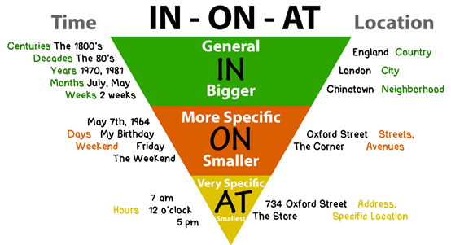

---
date: "2019-06-23"
---  
      
# 15｜同位语的两个重要作用
你好，我是陈亦峰，欢迎你和我一起学英语。

今天我们继续阅读[Successful Remote Working](https://www.infoq.com/news/2020/03/successful-remote-working/) 这篇文章。我带你深入分析句子、讲解词汇。

## 课前朗读

> The first starting point for remote employees is to have clear separation between home and work. This can be done through physical separation, by having a dedicated home office, or even working at a shared-work facility, such as Regus or WeWork. It is also helpful to have a transition point, something to replace a commute, that delineates the shift from being at home to being at work. Some people have found taking their dog for a walk, or simply going out the front door and coming in the back door of their house is enough to make the mental shift and start focusing on work.  
> 员工在家远程工作，首先要把家和工作分开。要实现这一点，可以通过物理隔断，在家专设办公区或者干脆去共享工作空间（例如雷格斯或者WeWork等共创空间）。有时也可以人为设定一个取代通勤的转换点，作为从在家状态到工作状态的切换标志。有人发现，带狗出去散步，或者只是从前门出后门回，就足以使他们在心理上实现这种切换，并开始专注工作。

<!-- [[[read_end]]] -->

> Successful remote work is not just up to the employees. Companies and managers must make extra effort to exhibit transparency and establish trust, because you don’t have benefits of casual conversation and body language like you would working in the same location. Psychological safety is needed for remote working, and this means managers must be prepared to be vulnerable. Once a manager shows they are comfortable sharing something difficult, then employees will be more comfortable reciprocating. Humble said, “You have to fundamentally trust people because you can’t see what they do. They have to tell you.”  
> 远程工作的成功不仅仅取决于员工。公司和管理者们必须做出额外的努力来展示透明度和建立信任，因为不在同一屋檐下共事，就无法享受轻松面谈和肢体语言的便利。远程工作需要心理安全感，这意味着经理们必须做好准备展现自己的脆弱一面。如果管理者乐于分享自己的难处，那么员工也就会乐于敞开心扉。亨堡说：“你必须完全信任他人，因为你看不到他们在做什么，必须由他们告诉你才行。”

## 知识讲解

### 1.介词for、between、through、by、at

我们先来看两个句式结构很简单的句子。

> The first starting point **for** remote employees is to have clear separation **between** home and work.

第一句是系表结构，不定式to have做表语，按字面意思翻译的话，就是“员工远程工作的起点是把家和工作清楚地分开”，但汉语重意合，没有表语，也不用这么别扭地说话，直接说“远程工作首先要分清楚家和工作”就好了。

> This can be done **through** physical separation, **by** having a dedicated home office, or even working **at** a shared-work facility, such as Regus or WeWork.

第二句话的主句就更简单，主语this，谓语动词can be done，this指代上一句话说的“家和工作分离”这件事，主句的意思是说这件事情能成，形式上看主句的意思已经完整了，但后面还有一大串状语，用介词短语through加上名词和介词短语by加上动名词，表示方式，通过什么方式，“家和工作”这事才能做成，具体包括物理隔断、在家专设办公区，或者去雷格斯、WeWork这些共享空间工作。

上回我们重点谈了介词的问题，因为我们太熟悉大部分的介词了，以至于对它们视而不见，但英语学习深入到一定阶段，它们又会重新进入我们的视野。

在这两句很普通的句子里，我划出了5个常用介词。by我上次已经重点讲过，余下的4个也非常常用，留给你自己在课后通过查阅字典或搜索网络的方式进行自学，看看能不能发现它们新的用法。在自学介词的过程中，你可以按照我们之前讲的“空间关系-时间关系-抽象关系”引申方法来进行思考。

除此之外，我们上次讲了介词的相关内容，有些内容还是要提醒你特别注意下。

**第一，既然是空间关系，必然有很多相近的含义。我们要特别注意空间关系相似的介词，比较它们在含义和用法上的差别。有些词典会提醒这些近义词，千万不要放过举一反三的机会。**

例如上面提到的between，在空间关系上是夹在A和B两个物体中间的位置，而意思和between近似的among，在空间关系上是混在两个以上的多个物体中间的位置。这个很容易理解，但我们的思考不能止步于此。你可以比较下列例句：

例句1：Our house is between the woods, the river and the village.  
翻译：我们的房子在树林、小河和村庄之间。

例句2：His house is hidden among the trees.  
翻译：他的房子隐藏在树林中。

在例句1中，虽然空间里有超过两个的多个物体，我们用A、B、C来表示，只要我们仍然可以清楚地分辨出房子和A、B、C两两对应的关系，也就是说我们房子在树林和小河之间，又在小河和村庄之间，也在树林和村庄之间，这样的空间关系就需要用between。在例句2中，空间里有多个物体且分不出个数，房子混在一堆物体中无法明确和其他物体的两两对应关系，我们才用介词among。

从空间关系引申到抽象关系（比如国家之间的关系），用法也是类似的。

例句1：The trade negotiations between Brazil, Argentina, and Chile are going well.  
翻译：巴西、阿根廷和智利之间的贸易谈判进展顺利。（有明确的两两关系）

例句2：The trade negotiations among the countries of South America are going well.  
翻译：南美洲国家之间的贸易谈判进展顺利。（不存在明确的两两关系）

当然，between和among用法的差别不仅仅是这一点，希望从这个例子，我们能得到一些启发，逐步养成爱钻研、会钻研的好习惯，发现并不断积累介词的更多用法。

**第二，空间的概念是相对的，所以介词的用法也灵活多变。**

我们平时生活的是三维世界。我们可以把零维空间想象成一个什么都没有的点。一维空间就是把两个零维空间没有时空的点连起来，形成一条没有宽度没有高度的线。两个一维空间可以形成一个有长度和宽度的面，但是没有高度，这样的一个平面就是二维空间。

这些概念其实非常有助于我们理解常用介词的用法。

例如，我们经常会比较at、on、in这三个常用的介词。如果用维度来解释的话，in是立体的有长宽高的三维世界；on是在一个平面上，是二维世界的概念；at则是具体到某一点，是一个降维的过程。由空间可以引申到时间，也是一样从长到短的过程。

[图片来源](http://loveenglishsomuch.blogspot.com/2014/)

这些都不难理解，但我们要注意空间概念的相对性。这话听着比较抽象，我们通过例句来说明：

例句：Shelly lives **in a flat** **on the third floor** of an apartment building **at 756 Albert Street**.  
翻译：雪莉住在阿尔伯特街756号一栋旧楼三层的一套公寓里。

按照上图in-on-at倒金字塔从大到小的顺序，搭配到上面这句话里却是“公寓-楼层-整栋楼的地址”这样从小到大的顺序。句子里的介词是不是都用错了呢？

如果我们从空间相对性的概念来理解，就比较容易理解这三个介词的正确用法了。“雪莉住在一套公寓里。”从她的角度看，这套公寓无疑是一个三维立体的空间，所以要用in。而某栋楼里面的楼层，是一个又一个的平面，是一个二维的概念，所以用on；而一个地址，某条街几号，从地图上看就是一个点，要用at。

我们再来看两组例句：

例句1：The plane stops for an hour **at Frankfurt**. \(a point on a journey\)  
例句2：She lives **in Frankfurt**. \(somebody’s home\)  
例句3：Let’s meet **at the club**. \(a meeting point\)  
例句4：It was warm and comfortable **in the club**. \(a place to spend time\)

我们来比较一下例句1和例句2，介词后面都是法兰克福，德国乃至欧洲的金融中心，但如果把法兰克福看成我们旅途中的一个点，就需要用at，如果把法兰克福还原成大城市，就妥妥的要用in；例句3和例句4也是一样的道理，如果俱乐部只是我们碰头的一个点，要用at，如果我们在俱乐部里面坐着，喝酒听音乐，那就是一个三维空间，要用in。

最后，我们之前讲过，大部分的介词都是有空间关系的本义，但也有一部分介词空间关系本义并不明显，例如我们上次讲的despite，这次出现的for。还是以前讲过的那句老话，所有的语法规则、规律、方法、诀窍，都是帮助我们理解语言含义的工具。我们要学会使用这些工具，但有时候碰到“规律”解释不通的地方，也不要被它们束缚，更不要去钻牛角尖。

### 2.同位语

> It is also helpful to have a transition point, **something to replace a commute**, that delineates the shift from being at home to being at work.

这句话是由it 做形式主语的句子，逻辑主语是后面的不定式to have a transition point。当主语过长，为避免句子头重脚轻，通常会用it做形式主语，占个位置，而把较长的主语放在句末，其实应该是to have a transition point is also helpful。

这句话还有一个值得一讲的语言现象，就是跟在逻辑主语后面、两个逗号中间的同位语something to replace a commute，用来对a transition point进行解释或补充说明，用来强调“转换点”是 “用来取代上下班通勤”的。

所以，同位语可以是名词、名词短语或者从句，对前面的另一个名词进行解释说明。同位语有两个很重要的作用。我们一起来看一下。

**首先，在不改变句式结构的情况下，它可以非常灵活地增加丰富的补充说明信息。**

例句：In his 1835 paper published in the Magazine of Natural History, Edward Blyth, **an acquaintance of Charles Darwin’s**, had documented all the leading thoughts of Darwin’s work 24 years ahead of Darwin’s 1859 paper **On the Origin of Species**.

翻译：爱德华·布莱斯和查尔斯·达尔文不过是泛泛之交，在他1835年发表在《自然历史杂志》上的论文中，就已经记录了达尔文著作的所有核心原则，这比达尔文1859年发表的论文《物种起源》整整早了24年。

上面的例句中，加黑部分是同位语，插入到句子中不影响原句的结构，即使删除句子也是完整的。此外，和定语从句一样，同位语也可以分成非限定性同位语和限定性同位语。非限定性同位语只是起到补充说明、增加信息的作用，需要用逗号隔开。

例句中第一处加黑部分就是非限定性同位语，对爱德华·布莱斯这个人进行补充说明，强调一下他只是和达尔文认识而已。限定性同位语起到缩小范围的限定作用，不用逗号，直接跟着前面的名词。例如例句中第二处下划线，达尔文在1859年可能发表过多篇论文，但通过同位语缩小范围，特指《物种起源》那一篇。

**其次，通过对前面名词的解释甚至重复，同位语还可以起到强调的作用。**

例句：This tale, **this tragic tale**, was full of cruel wars, savage devastation, unnecessary deaths and the inevitable search for bloody vengeance.  
翻译：这个故事，这个悲惨的故事，充满了残酷的战争、野蛮的破坏、无辜的的死亡和不可避免的血腥寻仇。

上面这个例句中的同位语，增加的信息并不多，但通过重复起到了强调的修辞效果。

同位语也可以以从句形式出现，同位语从句的形式和定语从句有些相似，需要注意区分。比较下面两个例句：

例句1：The rumor that he was married turned out to be true.  
翻译：关于他已婚的谣言竟是真的。

例句2：The rumor that you told me yesterday turned out to be true.  
翻译：你昨天和我讲的谣言竟是真的。

例句1是同位语从句，名词和后面的同位语从句有着“同位关系”。that只是起到引导从句的作用，在从句中不充当任何成分，和从句没有逻辑关系，且一般不能省略。换言之，同位语从句引导词that后面是一个完整的句子，从句“他结婚了”就是“谣言”的内容。

例句2是定语从句，修饰的先行词rumor和定语从句没有“同位关系”，定语从句的引导词that在从句中充当句子成分。此句中that作宾语，所以可以省略。

### 3.宾语从句

> Some people have found **taking their dog for a walk, or simply going out the front door and coming in the back door of their house is enough to make the mental shift and start focusing on work**.

最后一句话主语和谓语动词都很短，主语是some people，谓语动词是have found，有人+发现，发现了啥？后面跟了一个长长的宾语从句，从句的主语比较长，taking their dog for a walk, or simply going out the front door and coming in the back door of their house，其实是名词化了的两个动作，出去遛狗或者前门出后门回，后面是系表结构is enough，“就足够了”，但句子的意思还不完整，足够干什么？这就需要表语补足语来进一步说明，不定式to make the mental shift and start focusing on work做补足语，足以“在心理上实现切换”并“开始专注工作”。

## 小结

好了，今天就讲到这里。第二段话的内容不难，我把它留作课后作业，留给你自己去分析。

今天我们继续上节的话题，进一步探讨了介词的学习方法，主要目的还是让你对介词产生足够的重视，逐渐培养对文章中介词用法的敏感度，慢慢养成独立研究介词含义和用法的学习习惯。

同时，同位语也是我们需要掌握的重要语言技能。熟练使用同位语，可以帮助我们增添写作的多样性，在不改变句子结构的情况下，能够灵活添加补充信息，使文章内容更加丰富详实，同时还能起到很好的“强调”修辞效果。

当然，和任何其他语法结构一样，懂得语法原理只是了解“知识”，只是掌握技能的第一步，课后我们还需要读写更多的例句，做更多的练习，来逐步达到熟练的程度。

## 课后作业

1.通过下列链接了解相关介词的用法，特别是近义介词用法的差异，并以这些链接为线索，逐步建立起查询介词用法的资料库。我这里提供的链接比较多，你可以根据自己的情况选择来看。

* [关于介词for的用法](https://dictionary.cambridge.org/us/grammar/british-grammar/for)
* 关于介词[between](https://dictionary.cambridge.org/us/grammar/british-grammar/between-or-among?q=between)和[among](https://writingexplained.org/between-vs-among-difference)的用法
* [关于介词through以及across、over的用法](https://dictionary.cambridge.org/us/grammar/british-grammar/across-over-or-through?q=through)

2.我这里给你提供了三篇文章，都是关于同位语的介绍。你可以根据自己的情况，选择一篇进行阅读。特别注意一下里面的例句，你可以选择几句进行模仿和背诵。

* 文章一：<https://www.grammarly.com/blog/appositive/>

* 文章二：<https://www.grammar-monster.com/glossary/appositive_apposition.htm>

* 文章三：<https://literaryterms.net/appositive/>

如果在学习中有什么问题，你可以在留言区提问，同时欢迎你把学习心得分享出来，我们一起每天进步一点。