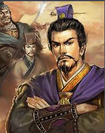
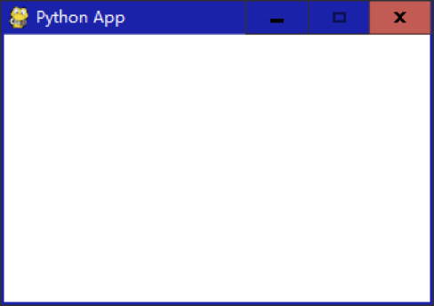
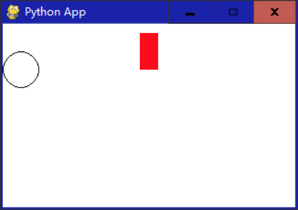
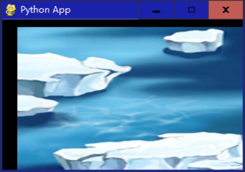

---
date: "2019-06-23"
---  
      
# 第8讲 | 如何区分图形和图像？
据我所知，很多人可能都分不清图形和图像这两个概念：一种情况是你可能会觉得区分图形和图像这两个概念并没有什么实质的用途，于是就没关心过；另一种情况是，你可能朦胧中对图形和图像的区别有一些了解，但是不够深入或者不够透彻，也说不出一个所以然。没关系，今天我就来深入浅出地给你讲一下，图形和图像背后的那些事儿。

既然我们是做游戏开发，那首先我们得知道，从专业地角度讲，区分图形和图像对我们的开发工作有什么帮助。简单地说，**搞清楚了游戏开发中绘制、载入、保存的究竟是图形还是图像，你会对接口函数的使用有一个更深入的认识。**

比如，如果是图形接口，可能它的接口函数是：

```
    Surface* DrawSomething(int start_x, int start_y, int finish_x, int finish_y);
    

```

如果是图像接口，它的接口函数函数看起来可能是这个样子：

```
    Surface* LoadFromFile(const string& filename);
    

```

## 如何区分图形和图像？

从广义上说，所有我们人肉眼能看到的对象，都是图形。从狭义上说，图形是我们所看到的一种点、线、面的描述对象。

**图像，是由数据组成的任意像素点的描述对象。**比如我们所看到的照片。在电脑中，图形的显示过程是有一定顺序（比如从左往右）的，而图像则是按照像素点进行显示的。电脑对于图形的编辑、修改更为简单方便，因为单一的图形具有特殊的属性（比如圆圈的直径、颜色等等，因为这些在这个图形建立的时候就固定了下来）。

对于图像进行编辑则非常困难，软件需要用一些特殊的算法来计算图像的色块、区域、描边等等，来安排图像该如何进行编辑，有一些甚至还需要用到深度学习的方法来辨别图像的显示区域、显示的内容等等，所以图像的修改比之图形的修改要困难。

那么你可能就会问了，既然前面说，任何眼睛看到的对象，都是图形，那么我觉得图形也是一种图像，这么说对不对呢？如果按照载体来说，图形也是一种图像，这种说法是对的。因为一张JPG图片可能存储的是一幅照片，也可能存储一幅三角形的图形。虽然本质不一样，但是由于存储的形式是以图像的形式存储的，在电脑看来，这个三角形就是一幅图像。但是如果你在游戏中使用函数画出了一个三角形，那就是图形了。

所以，严格来说，**图形其实是图像的一种抽象表现形式**。一般来讲，图形的轮廓并不复杂，比如一个圆圈、一个方块、一个三角形、一条线、某些几何图形、工程上面使用的图纸和CAD等，这些都属于图形。图形的色彩也并不是很丰富。而图像一般都有复杂的轮廓、非常多的细节和颜色（当然也有纯单一的颜色，比如黑白照片）。




所以，准确地说，图形和图像有不同的模式。当然，从计算机最底层的程序（显卡处理）来看，绘制图形和图像所经过的硬件处理几乎是一样的。一般显卡会经过这些流程进行图形、图像计算（2D）、显存，用来存取图形图像内容，GPU计算图像图像内容并渲染，最后输出到显示器。

从**图像的呈现方式**讲，只有通过图像的方式去呈现“图形”这个对象，才能看到图形，而在开发游戏的过程中，图形和图像的编程方式是截然不同的。比如我们要画线，那么可能会使用到一个叫DrawLine的函数。该函数里面需要输入线条的起始坐标，这就是图形的绘制方式。而在接下来的过程中，我将教你如何绘制图形和图像，并呈现出来。

## 跟我一起绘制图形和图形

现在，我们先用Pygame游戏库来建立一个窗体，然后开始绘制图形、载入图像。

在第五节的时候，我们已经讲过Pygame的安装和配置。在第六节的时候，我们讲过如何建立一个Windows窗体。现在从上到下，我们一起看一下这段代码。

<!-- [[[read_end]]] -->

```
    import pygame
    pygame.init()
    caption=pygame.display.set_caption('Python App')
    screen=pygame.display.set_mode([320,200]) #窗口大小为320*200
    while True:
        for event in pygame.event.get():
            if event.type == pygame.QUIT:
                pygame.quit()
        pygame.display.update()
        screen.fill([255,255,255]) #用白色填充窗体
    sys.exit()
    

```

在这段代码中，首先，我们需要告诉Python我们要引入Pygame。然后Pygame进行初始化（init）。在这个初始化的函数里，Pygame会初始化屏幕、声音、事件、按钮等一系列需要初始化的东西。随后，我们利用Pygame的display对象的set\_caption函数来设置窗体的文字，将这个设置后的对象返回给caption变量。随后，再使用set\_mode函数设置窗口大小，将窗口大小设置为320x200分辨率，将返回对象赋值给screen变量，最后screen拿到窗口句柄后，使用fill函数设置填充窗体的颜色，在这里填充的颜色是白色。

我们可以看到，使用Pygame游戏库来建立一个Windows窗体比前面我们提到的任何一种方式都快。那是因为**Pygame封装了建立窗体的代码和图形显示模块**。

我们在前面提到，**一个游戏是在一个大循环下形成的**，所以这里我们要补上一个大循环以确保这个程序不会立刻退出。

```
    while True:
        for event in pygame.event.get():
            if event.type == pygame.QUIT:
                pygame.quit()
        pygame.display.update()
        screen.fill([255,255,255]) #用白色填充窗体
    sys.exit()
    

```

这段代码的意思是，当条件为真（True）的时候（条件总是为真），进行一个循环。事实上这是个死循环，如果没有下面的退出代码的话。那么在这个循环里，从Pygame的event事件列表中取出event事件，然后进行判断，如果event的类型是退出类型（点击右上角的X关闭按钮），那么Pygame就退出，这个quit 函数就直接退出while大循环了。最终系统也退出sys.exit。



现在我们要在窗体上放上一个矩形和圆。我们先使用rect函数来画一个矩形：

```
      pygame.draw.rect(screen,[255,0,0],[150,10,0,40],0)
    

```

其中，draw中rect的定义为：rect\(目标画布,颜色,位置,宽度\)。

我们也可以用类似的方法来画一个圆：

```
      pygame.draw.circle(screen,[0,0,0],[top,left],20,1)
    

```

然后我们使用pygame.draw.circle\(\)用来画圆形。circle函数具有5个参数：

* 目标画布，在这里是screen

* 颜色

* 由左侧点和顶部点组成的圆形初始位置

* 直径

* 宽度

现在我们将所有的代码合并起来看一下：

```
    import pygame
    pygame.init()
    caption=pygame.display.set_caption('Python App')
    screen=pygame.display.set_mode([320,200]) #窗口大小为640*480
    while True:
        for event in pygame.event.get():
            if event.type==pygame.QUIT:
                pygame.quit()
    pygame.draw.rect(screen,[255,0,0],[150,10,20,40],0)
    pygame.draw.circle(screen,[0,0,0],[20,50],20,1)
    pygame.display.update()
    screen.fill([255,255,255])#用白色填充窗口
    sys.exit()
    

```



所以我们很容易就能看出来，**在Pygame游戏开发库里面，画一个图形是很容易的事情，你不需要知道太多的细节，只要将位置和颜色或者内容填充进去就可以了。**

我们可以在Pygame中使用Pygame.image.load来加载图像文件，这个函数支持各种图片格式。我们使用这个方法来加载一副PNG图片：

```
    obj = pygame.image.load("test.png").convert_alpha()
    

```

使用convert\_alpha函数是因为这个函数会使用透明方法来绘制，所以我们在加载一个拥有alpha通道的图片的时候（比如TGA、PNG）的时候，可以使用这个方式。

然后使用blit方法将图像绘制出来：

```
    screen.blit(obj, (20,10))
    

```

或许你会问，blit是什么函数，我在这里简单介绍一下，blit这个函数会以各种函数形式出现在图形引擎的函数里面，比如FastBlit等等。这个函数具体负责将图像从某一个平面复制到另一个平面，或者将图像从内存复制到屏幕。简而言之，这个函数的功能就是将图像“绘制”在游戏窗体的屏幕上。

现在继续来看看blit函数。blit函数的第一个参数是加载完成的返回对象，第二个参数是绘制的坐标位置。最后我们需要update（更新）整个游戏窗体的绘制内容。

我们把载入图像的代码整合到刚才的代码中一块儿看一下。

```
    import pygame
    pygame.init()
    caption=pygame.display.set_caption('Python App')
    screen=pygame.display.set_mode([320,200]) #窗口大小为640*480
    
    obj = pygame.image.load("test.png").convert_alpha()  
    
    while True:  
    
        for event in pygame.event.get():
            if event.type==pygame.QUIT:
                pygame.quit()
                sys.exit()
        screen.blit(obj, (20,10))
        pygame.display.update()
    screen.fill([255,255,255])#用白色填充窗口
    

```

最后呈现的效果是这样的：



## 小结

这一节，我带你学习了图形和图像的区别，使用Pygame绘制了最基础的图形，最后我们通过代码载入一副PNG图像并在屏幕上绘制出来。

给你留一个小练习吧。

请你结合上述代码，在游戏执行的大循环内，在游戏的窗体里面，绘制出一个从左到右移动的矩形、圆形或者图像。

之后，针对一些实操性强的内容，我都会适时给你留一些必要的练习。希望你每次都能动手去练习一下。同时，也欢迎你留言，说出你在练习中的疑惑和成果。温故而知新，相信你会有更多的收获！

我在下一节的挑战中等你！