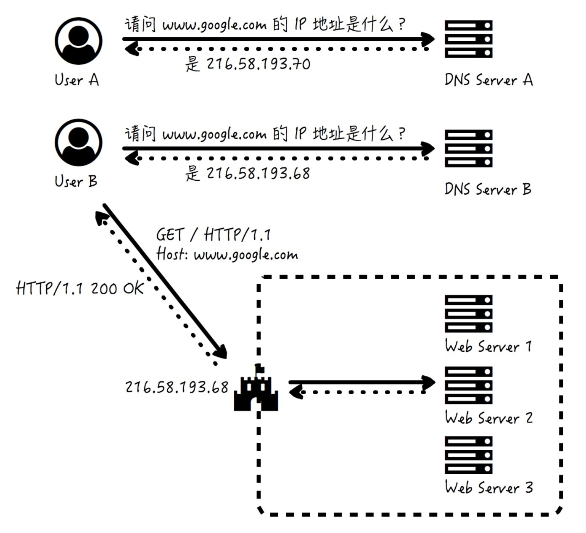
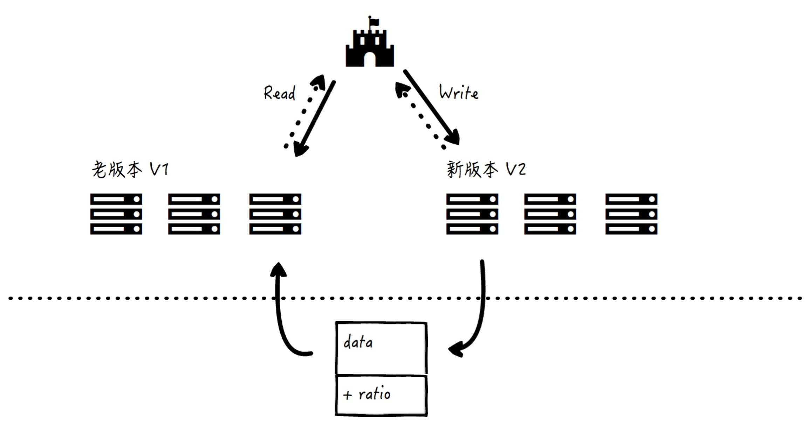
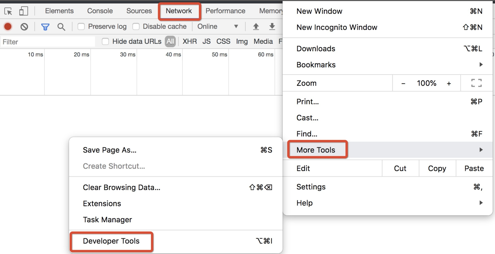
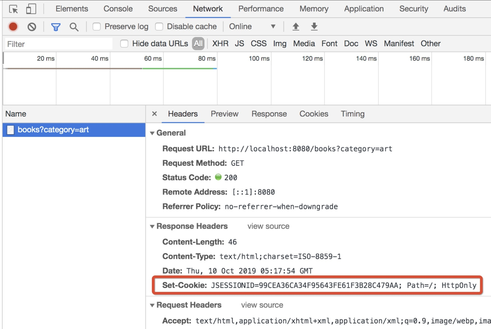
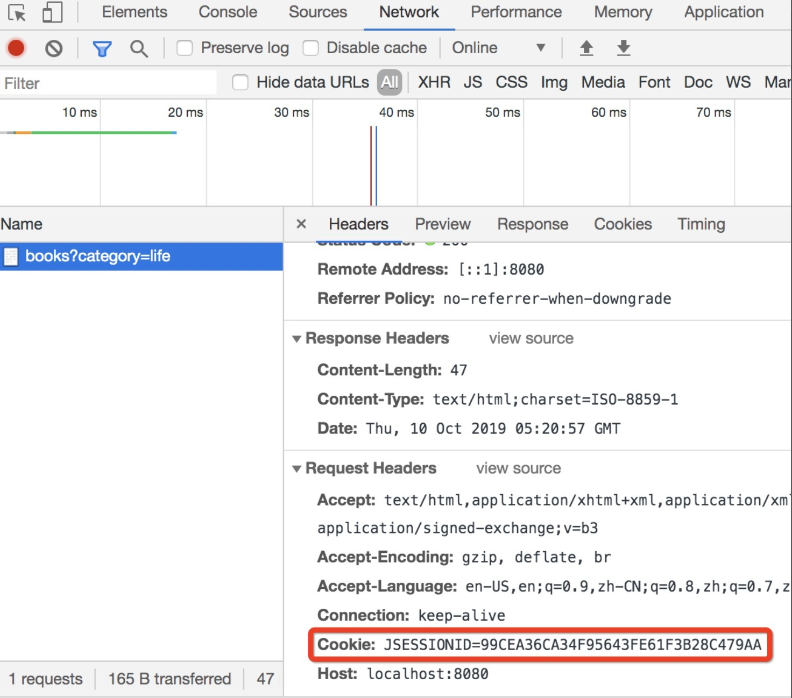
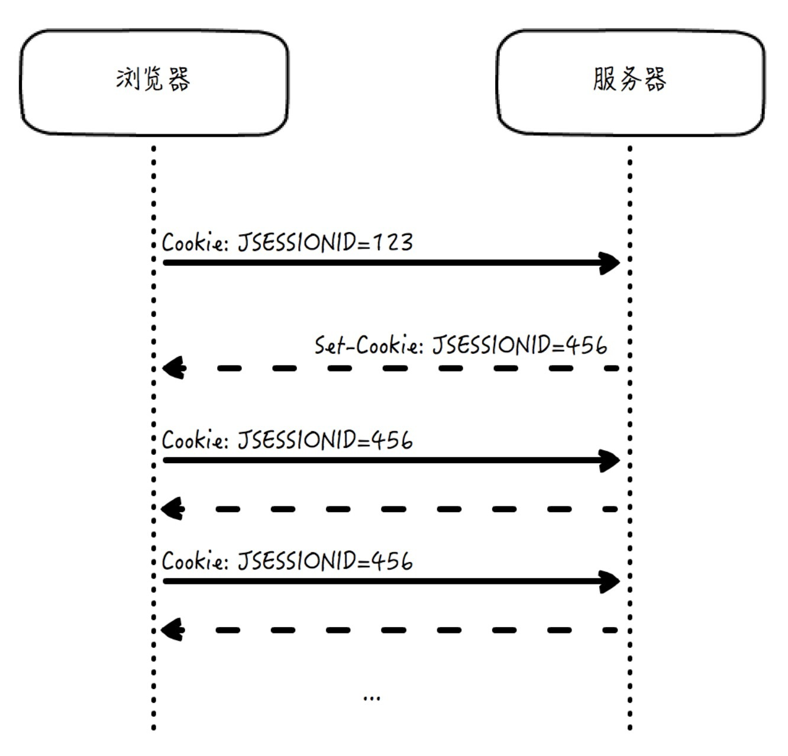

---
date: "2019-06-23"
---  
      
# 29 | Ops三部曲之二：集群部署
你好，我是四火。

今天我们来谈谈 Ops 的三部曲之二，集群部署。毕竟一台物理机能够承载的请求数是十分有限的，同时，一台物理机还存在着单点故障（Single Point Failure）问题，因此我们通常需要把多台 Web 服务器组成集群，来提供服务。

## 负载分担

还记得我们在 [\[第 28 讲\]](https://time.geekbang.org/column/article/165225) 中介绍的反向代理吗？负载分担，又叫负载均衡，也就是 Load Balancer，就是反向代理设备中非常常见的一种，它可以高效地将访问请求按某种策略发送到内网相应的后端服务器上，但是对外却只暴露单一的一个地址。

除了作为名词特指设备，负载分担还可以作为动词指用来分配请求负载的行为，它可大可小，小可以到使用 F5 等负载均衡的专用设备来将请求映射到几台服务器上，但也可以大到用 DNS 来实现广域网的路由。例如同样访问 [www.google.com](http://www.google.xn--com-o16s)，DNS 会对于不同地区的人解析为不同且就近的 IP 地址，而每个 IP 地址，实际又是一个更小的负载分担的子网和服务器集群。



上图演示了这样一个过程：

* 用户 A 和用户 B 都去 DNS 服务器查询 Google 的 IP 地址，但是他们在不同地区，不同的 DNS 服务器返回了不同的 IP 地址；
* 以用户 B 为例，根据返回的地址发送了一个 HTTP GET 请求，这个请求被负载均衡器转发给了服务器集群中的其中一台服务器 Web Server 2 处理并返回。这个城堡一样的结构图示就是负载均衡器，负责转发请求到实际的服务器。它可以由硬件实现，例如 F5；也可以由软件实现，例如 Nginx。

<!-- [[[read_end]]] -->

对于 DNS 的记录查询，我们曾在 [\[第 21 讲\]](https://time.geekbang.org/column/article/156886) 动手实践过，如果你忘记了可以回看。

### 策略算法

负载分担需要把请求发送到相应的服务器上，但是怎么选择那一台服务器，这里就涉及到策略算法了，这个算法可以很简单，也可以非常复杂。常见的包括这样几种：

* 随机选择：从服务器的池中随机选择一台，这是一种实现上最简单的方式。
* 轮询（Round Robin）：按顺序一台一台地将请求转发，本质上它和随机选择一样，缺乏对任务较为合理的分配。
* 最小连接：这种方式检测当前和负载均衡器连接的所有后端服务器中，连接数最小的一个。这是一种近似寻找“最小资源占用”的机器的方法。
* 其它寻找“最小资源占用的方法”，例如根据服务器报告上来的 CPU 使用率等等来分配，但是对于统计信息的收集，会显著增加系统的复杂度。
* 指定的哈希算法：例如我们曾在 [\[第 23 讲\]](https://time.geekbang.org/column/article/159453) 中介绍的一致性哈希，这种方式也非常常用，这种方式就不只是从访问压力分散的角度来考虑了，还起到了寻找数据的“路由”的作用，如果你忘记了，可以回看。

## 服务端 Session 和浏览器 Cookie

从上面负载分担的策略算法可以看出，大部分的策略算法是适合服务器“无状态”的场景，换言之，来自于同一个浏览器的请求，很可能这一个被转发给了服务器 1，紧接着的下一个就被转给服务器 2 了。在没有状态的情况下，这第二个请求被转给哪台服务器都无所谓。

### 服务端 Session

对于很多 Web 业务来说，我们恰恰希望服务器是“有状态”的。比如说，登陆是一个消耗资源较为明显的行为，在登陆的过程中，服务器要进行鉴权，去数据库查询用户的权限，获取用户的信息等操作。那么用户在登陆以后，一定时间内活跃的访问，我们希望可以直接完成，而不需要再次进行重复的鉴权、权限查询和用户信息获取等操作。

这就需要服务端存储的“会话”（Session）对象来实现了。Web 服务器在内存中存放一个临时对象，这个对象就可以存放针对特定用户的具体信息，比如上面提到的用户信息和用户权限信息等等。这样，当用户再一次的请求访问到来的时候，就可以优先去会话对象中查看，如果用户已经登录，已经具备了这些信息，那么就不需要再执行这些重复的鉴权、信息获取等操作了，从而省下大量的资源。

当然，我们也不知道用户什么时候就停止了对网站的使用，他可能会主动“登出”，这就要求我们**主动**将会话过期或销毁；他也可能默默地离开，这就需要一个会话管理的超时机制，在一定时间以后也要“**被动**”销毁这个会话，以避免会话信息无效的资源占用或潜在的安全隐患，这个时间就叫做会话超时时间。

### 浏览器 Cookie

说完了服务端 Session，我再来说说浏览器 Cookie。

浏览器可以以文本的形式在本地存放少量的信息。比如，在最近一次访问服务器、创建会话之后，服务器会生成一个标记用户身份的随机串，这样在这个用户下次访问同一个服务器的时候，就可以带上这个随机串，那么服务器就能够根据这个随机串得知，哦，是老用户到访，欢迎欢迎。

这个随机串，以文本的形式在浏览器端的存储，就被称为 Cookie。这个存储可以仅仅是在内存中的，因而浏览器退出就失效了；也可以存储在硬盘上，那么浏览器重新启动以后，请求发送依然可以携带这个信息。

从这套机制中，你可能已经发现了，它们在努力做的其实就是一件事——给 HTTP 通信填坑。

回想一下，我们已经介绍过 HTTP 版本的天生缺陷。在 [\[第 02 讲\]](https://time.geekbang.org/column/article/135864) 我们介绍了，**缺乏数据加密传输的安全性大坑**，被 HTTPS 给填了；在 [\[第 03 讲\]](https://time.geekbang.org/column/article/136587) 我们学习了，**只能由客户端主动发起消息传递的交互模式上的坑**，被服务端推送等多种技术给填了。

现在，我们来填第三个坑——HTTP **协议本身无法保持状态的坑**。既然协议本身无法保持状态，那么协议的两头只好多做一点工作了，而客户端 Cookie 和服务端 Session 都能够保存一定的状态信息，这就让客户端和服务端连续的多次交互，可以建立在一定状态的基础上进行。

## 集群部署

集群带来了无单点故障的好处，因为无单点故障，是保证业务不中断的前提。但是，每当有 bug 修复，或是新版本发布，我们就需要将新代码部署到线上环境中，在这种情况下，我们该怎样保证不间断地提供服务呢？

在软件产品上线的实践活动中，有多种新版本的部署策略，它们包括：

* 重建（Recreate）部署：旧版本停止，新版本启动。
* 滚动（Ramped）部署：旧版本缓慢地释出，并逐渐被新版本替代。这是最常见的内部服务的部署方式，我在下面会详述。
* 蓝绿（Blue/Green）部署：在旧版本不停机的情况下，新版本先完成部署，再将流量从旧版本导过来。这也是非常常见的，这种部署的好处是，可以有充分的时间，对部署了但未上线的新版本做全量的测试，在线下确保没有问题了之后再切换线上流量。
* 金丝雀（Canary）部署：先导入少量的用户访问新版本，在验证正常后再逐步扩展到所有机器。这种部署也较为常见，最大的优点是它非常“谨慎”，可以逐步地扩展影响用户的范围，对于一些用户量非常大的业务，这种方式相对比较稳妥，可以不断观察使用情况和流量数据，在部署环节的任意时间做出适当调整。
* A/B 测试（A/B Testing）部署：导入特定用户到新版本代码。
* 影子（Shadow）部署：新版本接收实际的发往老版本的源请求的拷贝，但是并不干预源请求的处理和响应本身。

既然使用集群，一大目的就是保证可用性，避免停机时间，而上面这六种中的第一种——重建部署，显然是存在停机时间的，因此很少采用。

### 滚动部署

在互联网大厂（包括我所经历的 Amazon 和 Oracle），对于一般的服务来说，绝大多数服务的部署，采用的都是滚动部署。为什么？我们来看一下其它几项的缺点，你就清楚了。

* 重建部署存在停机时间，不讨论。
* 蓝绿部署需要两倍的服务器资源，这个是一个局限性，而即便资源申请不是问题，这部署期间多出一倍的资源，机器需要进行初始化等各种准备，会有一定的时间和资源开销；再有一个是老版本代码的机器上可能有一些配置，而这个配置在完成部署后切换的时候会丢失。
* 剩下的三种部署相对更为“谨慎”，自然效率较低，即部署速度较慢，对于绝大多数服务的部署来说，有些得不偿失。当然，事物都有两面性，它们对于许多面向互联网用户等至关重要的业务来说，有时就可能是更佳的选择。

那对于一般的系统，部署会按照 50\% \- 50\% 进行，即将部署分为两个阶段。第一个阶段，50\% 的服务器保持不动，另 50\% 的服务器部署新版本；完成后，在第二个阶段，将这 50\% 的老版本给更新了，从而达成所有节点的新版本。对于流量比较大的服务，也有采取 33\% \- 33\% \- 34\% 这样三阶段进行的。

下图来自[这篇](https://thenewstack.io/deployment-strategies/)文章，很好地展示了这个滚动部署渐进的过程：


### 数据和版本的兼容

在应用部署的实践过程中，程序员一般不会忽略对于程序异常引发服务中断的处理。比如说，新版本部署怎样进行 Sanity Test（对于部署后的新版本代码，进行快速而基本的测试），确保其没有大的问题，在测试通过以后再让负载分担把流量引导过来；再比如说，如果新版本出现了较为严重的问题，服务无法支撑，就要“回滚”（Rollback），退回到原有的版本。

但是，我们**除了要考虑程序，还要考虑数据，特别是数据和版本的兼容问题。数据造成的问题更大，单纯因为程序有问题还可能回滚，但若数据有问题却是连回滚的机会都没有的。**我来举个真实的例子。

某 Web 服务提供了数据的读写功能，现在在新版本的数据 schema 中增加了新的属性“ratio”。于是，相应的，新版本代码也进行了修改，于是无论老数据还是新数据，无论数据的 schema 中有没有这个 ratio，都可以被正确处理。

但是，老代码是无法顺利处理这个新数据加入的 ratio 属性的。在采用滚动部署的过程中，新、老版本的代码同时运行的时候，如果新代码写入了这个带有 ratio 的数据，之后又被老版本代码读取到，就会引发错误。我用一张图来说明这个问题：



读到这里，你可能会说，那采用蓝绿部署等方式，一口气将旧代码切换到新代码不就行了吗？

没错，但是这是在没有异常发生的情况下。事实上，所有的部署都需要考虑异常情况，如果有异常情况，需要回滚代码，这突然变得不可能了——因为新数据已经写到了数据库中，一旦回滚到老代码，这些新数据就会导致程序错误。这依然会让负责部署任务的程序员陷入两难的境地。

因此，从设计开始，我们要就考虑数据和版本的兼容问题：

* **既要考虑新代码版本 + 老数据，这个是属于大多数情况，程序员一般不会忘记；**
* **还要考虑老代码版本 + 新数据，这个很容易遗漏 ，出问题的往往是这个。**

那如果真是这样，有什么解决办法吗？

有的，虽然这会有一些麻烦。办法就是引入一个新版本 V2 和老版本 V1 之间的中间版本 V1.5，先部署 V1.5，而这个 V1.5 的代码更新就做一件事，去兼容这个新的数据属性 ratio——代码 V1.5 可以同时兼容数据有 ratio 和无 ratio 两种情况，请注意这时候实际的数据还没有 ratio，因此这时候如果出了异常需要回滚代码也是没有任何问题的。

之后再来部署 V2，这样，如果有了异常，可以回滚到 V1.5，这就不会使我们陷入“两难”的境地了。但是，在这完成之后，项目组应该回过头来想一想，为什么 V1 的设计如此僵硬，增加一个新的 ratio 属性就引起了如此之大的数据不兼容问题，后续是否有改进的空间。

## 总结思考

今天我详细介绍了负载分担下的集群和新代码部署的方式，也介绍了服务端 Session 和客户端 Cookie 的原理，希望你能有所启发，有效避坑。

现在我来提两个问题：

* 在你参与过的项目中，代码部署环节，采用的是上面介绍的六种策略中的哪一种呢，或者是第七种？
* 文中我介绍了 Session 和 Cookie 都可以存放一定的信息，现在试想一下，如果你来实现极客时间这个网站（包括注册、登陆和课程订阅功能），你觉得哪些信息应当存放在浏览器的 Cookie 内，哪些信息应当存放在服务端 Session 中呢？

最后，对于 Session 和 Cookie 的部分，今天还有选修课堂，可以帮助你通过具体实践，理解原理，加深印象，希望你可以继续阅读。如果有体会，或者有问题，欢迎你在留言区留言，我们一起讨论。

## 选修课堂：动手实践并理解 Session 和 Cookie 的原理

还记得 [\[第 10 讲\]](https://time.geekbang.org/column/article/143834) 的选修课堂吗？我们来对当时创建的 \$\{CATALINA\_HOME\}/webapps/ROOT/WEB-INF/BookServlet.java 稍作修改，在文件开头的地方引入 java.util.logging.Logger 这个日志类，再在 BookServlet 中创建日志对象，最后在我们曾经实现的 doGet 方法中添加打印 Session 中我们存放的上一次访问的 categoryName 信息，完整代码如下：

```
    import java.util.logging.Logger;
    import java.io.IOException;
    import javax.servlet.ServletException;
    import javax.servlet.http.HttpServlet;
    import javax.servlet.http.HttpServletRequest;
    import javax.servlet.http.HttpServletResponse;
    
    public class BookServlet extends HttpServlet {
        private Logger logger = Logger.getLogger(BookServlet.class.getName());
        protected void doGet(HttpServletRequest request, HttpServletResponse response) throws ServletException, IOException {
            String category = request.getParameter("category");
    
            String lastCategoryName = (String) request.getSession().getAttribute("lastCategoryName");
            this.logger.info("Last category name: " + lastCategoryName);
            request.getSession().setAttribute("lastCategoryName", category);
    
            request.setAttribute("categoryName", category);
            request.getRequestDispatcher("/book.jsp").forward(request, response);
        }
    }
    

```

你看，这里新添加的逻辑主要是，尝试从 Session 中获取 lastCategoryName 并打印，同时把这次请求携带的 category 存放到 Session 中去，以便下次获取。

老规矩，编译一下：

```
    javac BookServlet.java -classpath ${CATALINA_HOME}/lib/servlet-api.jar
    

```

现在启动 Tomcat：

```
    catalina run
    

```

打开 Chrome，点击菜单栏的“文件”“打开新的隐身窗口”，用这种方式以避免过去访问产生的 Cookies 引发的干扰：


然后，打开开发者工具，并切换到 Network 标签：



接着，访问 <http://localhost:8080/books?category=art>，你应该可以看到命令行打印了类似这样的日志：

```
    09-Oct-2019 22:03:07.161 INFO [http-nio-8080-exec-1] BookServlet.doGet Last category name: null
    

```

这就是说，这次访问 Session 里面的 lastCategoryName 是空。

再来看看 Chrome 开发者工具上的 Network 标签，请求被捕获，并可以看到这个请求的响应中，一个 Set-Cookie 的头，这说明服务器没有发现这个 Session，因此给这个浏览器用户创建了一个 Session 对象，并且生成了一个标记用户身份的随机串（名为 JSESSIONID）传回：



现在再访问 <http://localhost:8080/books?category=life>，注意这时 URL 中的 category 参数变了。命令行打印：

```
    09-Oct-2019 22:04:25.977 INFO [http-nio-8080-exec-4] BookServlet.doGet Last category name: art
    

```

果然，我们把前一次存放的 lastCategoryName 准确打印出来了。

我们还是回到开发者工具的 Network 标签，这次可以看到，请求以 Cookie 头的形式，带上了这个服务器上次传回的 JSESSIONID，也就是因为它，服务器认出了这个“老用户”：



当然，我们可以再访问几次这个 URL，在 Session 超时时间内，只有第一次的访问服务端会在响应的 Set-Cookie 头部放置新生成的 JSESSIONID，而后续来自浏览器的所有请求，都会在 Cookie 头上带上这个 JSESSIONID 以证明自己的身份。

用一张图来揭示这个过程吧：



上图中，浏览器一开始携带的 JSESSIONID=123 已经在服务端过期，因此是一个无效的 JSESSIONID，于是服务端通过 Set-Cookie 返回了一个新的 456。

再联想到我们今天讲到负载分担，负载分担常常支持的一个重要特性被称为“Session Stickiness”，这指的就是，能够根据这个会话的随机串，将请求转发到相应的服务器上。这样，我们就能够保证在集群部署的环境下，来自于同一客户的的请求，可以落到同一服务器上，这实际上是许多业务能够正常进行的前提要求。

**Session Stickiness 其实是属于前面介绍的负载分担策略算法中的一部分，它是整个策略算法中的优先策略**，即在匹配 Cookie 能够匹配上的情况下，就使用这个策略来选择服务器；但是如果匹配不上，就意味着是一个新的用户，会按照前面介绍的一般策略算法来决定路由。另外，在一些特殊的项目中，我们可能会选择一些其它的优先策略，例如 IP Stickiness，这就是说，使用源 IP 地址来作为优先策略选择服务器。

好，希望你已经完全理解了这套机制。

## 扩展阅读

* 【基础】如果你对于 Cookie 还不太了解的话，建议你阅读 MDN [HTTP cookies](https://developer.mozilla.org/zh-CN/docs/Web/HTTP/Cookies) 这篇简短的教程。
* 对于文中介绍的六种部署策略，欢迎阅读 [Six Strategies for Application Deployment](https://thenewstack.io/deployment-strategies/) 这篇文章，它对于每一种策略都有详细解读，且带有动画图示。如果需要中文译文，你可以看一下[这篇](https://itw01.com/22ULE7O.html)。