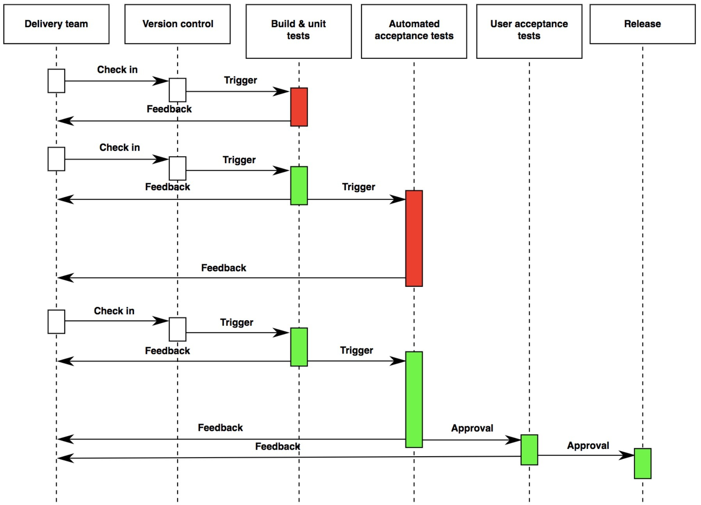
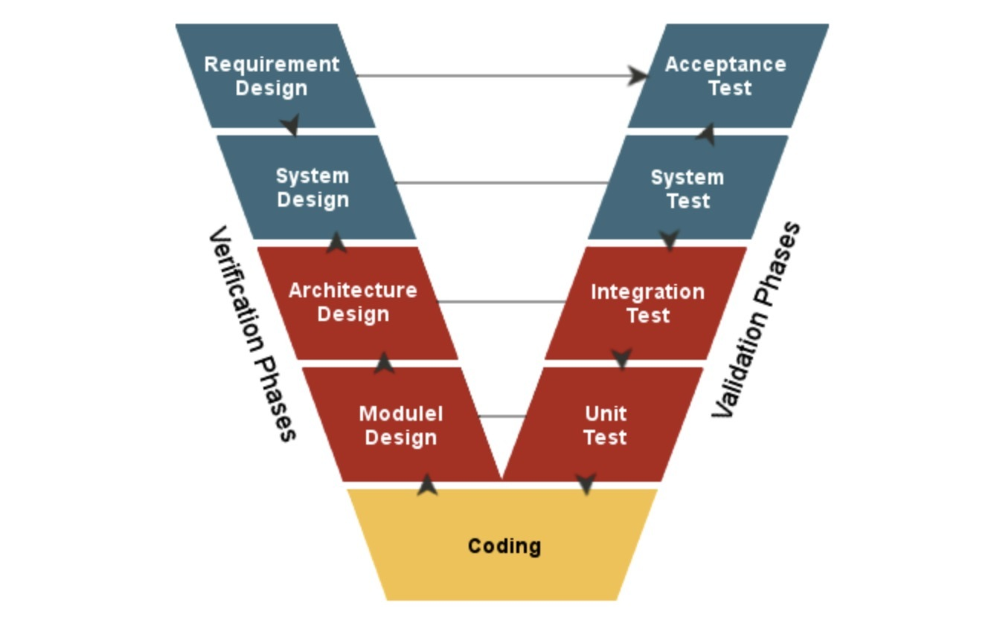

---
date: "2019-06-23"
---  
      
# 30 | Ops三部曲之三：测试和发布
你好，我是四火。

今天，我们继续 Ops 三部曲。今天我要讲一讲持续集成和持续发布，以及 Web 全栈项目中一些常见的测试维度。

## CI/CD 和 Pipeline

CI 指的是 Continuous Integration，持续集成，而 CD 指的是 Continuous Delivery，持续交付。它们二者结合起来，通过将工程师的代码变更反复、多次、快速地集成到代码主线，执行多种自动化的测试和验证，从而给出快速反馈，并最终达到将变更持续、迅速发布到线上的目的。

为了达到持续集成和持续交付，我们几乎一定会使用一个叫做 pipeline 的工具来将流程自动化。Ops 中我们总在谈论的 Pipeline，指的就是它。**Pipeline 是一个将代码开发、编译、构建、测试、部署等等 Ops 活动集成起来并自动化的基础设施。**把 Pipeline 放在最先讲，是因为它是集成 Ops 各种自动化工具的核心，而这一系列工具，往往从编译过程就开始，到部署后的验证执行结束。

Pipeline 确定和统一了从开发、测试到部署的主要流程，但最大的作用是对劳动力的解放。程序来控制代码从版本库到线上的行进流程，而非人。因此，如果一个 pipeline 上面设置太多个需要人工审批的暂停点，这样的自动化就会失去一大部分意义。

<!-- [[[read_end]]] -->



上图来自维基百科的[持续交付](https://zh.wikipedia.org/wiki/%E6%8C%81%E7%BA%8C%E4%BA%A4%E4%BB%98)词条，从中你也可以看到，整个流程中，版本管理是触发构建和测试的核心工具，而**多层次、不同阶段的测试则是保证整个持续集成和持续交付的关键**。接下去，我们就来结合实例理解这一点。

## 不同测试的集成

记得上个月和一位硕士毕业以后做过一年网络工程师的朋友聊天，他正在慢慢转向通用软件工程师的角色。他在学校里修的是计算机相关的专业，因为毕业没有多久，他对于学校里做项目的情况还历历在目。

我问道：“你觉得工业界和学校里做项目有什么不同呢？”他说：“最大的不同在于，学校里更多的是‘实现功能’，而工作以后，更多的是‘实现工程’。”

我觉得这个概括非常贴切，事实上，实现的“功能”，只是“工程”范畴内太小的一部分了（关于这方面，你也许会想起 [\[第 28 讲\]](https://time.geekbang.org/column/article/165225) 的选修课堂，关于程序员“独立性”的介绍），一个程序员的工程能力，远远不只有实现功能那么简单。而测试，就是从学校迈向职场，以及在职场上成熟精进的角度之一。

在读书的时候，我们可能已经学过测试的 V 模型（下图来自[这篇](http://www.professionalqa.com/v-model)文章）：



这是一个基本的给不同测试分层的方式，当然，还有从其它维度进行的测试分类方法。在有了 pipeline 以后，这些测试可以集成到上面去。每一层测试分别对应到设计阶段的特定环节。在实际项目中，不同维度测试的实现可谓参差不齐。我来挑几个，说说我的理解，并讲讲我所见到的来自 Web 全栈项目中的一些典型问题。

### 1\. 单元测试

单元测试（Unit Test），这一步还属于代码层面的行为活动，因此单元测试一定要是开发写的，因为单元测试重要的一个因素就是要保证它能够做到白盒覆盖。

单元测试要求易于执行、快速反馈，且必须要做到完全的执行幂等性。对于整个持续集成活动来说，单元测试和其它测试不同，它是和源代码的编译构建放在一起的，也就是说，单元测试执行的失败，往往意味着编译构建的失败，而非一个单独测试过程的失败。据我观察，在 Web 全栈项目中，团队普遍都能够意识到单元测试的重要性，但是存在这样几个典型的问题。

**问题一：执行缓慢，缺乏快速反馈。**

由于需要反复执行和根据结果修改代码，快速的反馈是非常重要的，从几秒内到几十秒内必须得到结果。我见过有一些团队的单元测试跑一遍要十分钟以上，那么这种情况首先要考虑的是，单元测试是不是该优化了？代码包是不是太大，该拆分了？其次才去见招拆招，比如要求能够跑增量的测试，换言之，改动了什么内容，能够重跑改动的那一部分，而不是所有的测试集合，否则就失去了单元测试的意义。

特别说一个例子。有一些项目中，为了模拟一些代码的行为，会使用 sleep\(\) 方法来让某些代码的执行“等一下”，这是一个典型的不良实践，这一类显式地拖慢单元测试执行的方法应当被限制或禁止。我们可以定义 TimeKeeper 之类用来返回“当前时间”的对象，这样在测试的时候，我们就可以替换其逻辑来模拟时间的流逝。

**问题二：无法消除依赖。**

单元测试关注的是方法、函数这些很小的“单元”，因此，为了能够专注在有限的代码层面并保持快速，所有的远程接口、其它组件的调用等等，全部都要用桩方法替换掉。但我依然看到很多项目中单元测试会调用数据库，会加载复杂的配置文件集合等等，我认为这些都是不妥的。我们希望单元测试放在开发机器上能跑，放到构建机器上也能跑，能做到这一点的前提，就是要把这些依赖组件全部拿掉。

**问题三：对达到“单元测试覆盖率”机械而生硬地执行。**

我是坚决反对那些在软件开发中不讲实际情况而制定生硬指标的做法的。单元测试和其它测试一样，书写和维护也都是有成本的，并非覆盖率越高越好，要优先覆盖那些核心逻辑和复杂逻辑的源代码（这个代码无论是在前端还是后端，我们都有很成熟的单元测试框架和技术了），因此我们单纯地讲一个覆盖率是缺乏意义的。

一个单元测试覆盖率 85\% 的代码也许会比 15\% 的代码好，但是，一个单元测试覆盖率 95\% 的代码可未必比 90\% 的更好，我反而会担心里面是不是有很多为了单纯达标覆盖率而被迫写的无意义覆盖测试的代码。

### 2\. 集成测试

集成测试（Integration Test）泛指系统组件之间集成起来的功能性测试，但在 Web 项目中，经常特指的是针对暴露的 Web 接口进行的端到端的测试。它一般被放在持续集成的 pipeline 中，编译构建阶段结束以后执行。

集成测试的成熟程度，往往是一个项目质量的一个非常好的体现。在某些团队中，集成测试通过几个不同的环境来完成，比如α环境、β环境、γ环境等等，依次递进，越来越接近生产环境。比如α环境是部署在开发机上的，β环境是部署在专门机器上的测试环境，而γ环境又叫做“pre-prod”环境，是线上环境的拷贝，连数据库的数据都是从线上定期同步而来的。

**集成测试的过程中，一个很容易出现的问题，就是测试无法具备独立性或幂等性。**集成测试的执行，往往比单个的单元测试执行要复杂得多，有独立性要求测试的执行不会出现冲突，即要么保证某测试环境在任何时间只有单独的测试在执行，要么允许多个测试执行，但它们之间互不影响。幂等性则要求测试如果执行了一半，中止了（这种情况很常见），那么测试执行的残留数据，不会影响到下一次测试的顺利执行。

### 3\. 冒烟测试

冒烟测试（Smoke Testing）在 Web 项目中非常实用。冒烟测试最关心的不是功能的覆盖，而是对重要功能或者核心功能的保障。到了这一步，通常在线上部署完成后，为了进一步确保它是一次成功的部署，需要有快速而易于执行的测试来覆盖核心测试用例。

这就像每年的常规体检，你不可能事无巨细地做各种各样侵入性强的检查，而是通过快速的几项，比如血常规、心跳、血压等等来执行核心的几项检查。在某些公司，冒烟测试还被称作“Sanity Test”，从字面意思也可以得知，测试的目的仅仅是保证系统“没有发疯”。通常不会有测试放到生产线的机器上执行，但冒烟测试是一个例外，它在新代码部署到线上以后，会快速地执行一下，然后再进行流量的切换。

除了功能上的快速冒烟覆盖，在某些系统中，性能是一个尤其重要的关注点，那么还会划分出 Soak Testing（浸泡测试）这样的针对性能的测试来。当然，它对系统的影响可能较大，有时候不会部署在生产环境，而是在前面提到的 pre-prod 的生产环境的镜像环境中。

**冒烟测试最容易出现的问题，是用例简洁程度和核心功能覆盖的不平衡。**冒烟测试要求用例尽可能简单，这样也能保证执行迅速，不拖慢整个部署的过程；但是，另一方面我们也希望核心功能都被覆盖到，许多团队容易犯的错误，就是在产品一开始的时候可以将冒烟测试的用例管理得非常好，但是随着时间进展，冒烟测试变得越来越笨重而庞大，最终失去了平衡。

## 总结思考

今天我们学习了持续集成和持续发布，以及 Web 全栈项目中常见的测试维度，并讲到了各自容易出现的问题，依然希望你可以有效避坑。

下面是提问时间：

* 在你经历的项目中，你们是否实现或部分实现了持续集成和持续发布，能说说吗？
* 除去文中介绍的，你觉得还有哪些测试的维度是 Web 项目特有或经常关注的（比如浏览器兼容性测试）？

好，今天的正文就到这里，欢迎你继续学习下面的选修课堂，同时，也欢迎你在留言区就今天的内容与我讨论。

## 选修课堂：持续集成和持续发布的更多挑战

今天我们介绍的测试技术，还有上一讲介绍的部署技术，只是持续集成和持续发布的其中一部分核心内容，还有更多的挑战需要我们面对，也许对于它们中的不少内容，你已经在工作中接触过。

### 1\. 代码静态分析

对于软件工程而言，我们知道问题能够发现得越早，修复问题的代价就越小。比如，对于 Java 来说，FindBugs、PMD 可以用于在编译期发现代码中常见的问题，CheckStyle 可以提示代码不符合规范的地方，等等。

这些工具确实能带来好处，但是在应用它们的时候，我们需要时刻记住一点：**工具永远是为程序员服务的，而不是反过来**。我强调这一点的原因是，在我的工作中，曾经经历过这样的事情——程序员为了通过这些静态工具的检查，对代码做了许多毫无意义的修改。比如这样的例子：

```
    /**
     * 返回名字。
     * @return 名字
     */
    public String getName() { ... }
    

```

本来是一个特别简单而直接的 get 方法，命名也是符合常见 getter/setter 的规约的。但是，为了通过 CheckStyle 这样的静态工具检查，添加了这样本无必要、读起来也显然毫无意义的注释。你可以想象，代码中有许许多多的 get/set 方法，那这样的注释会有多少。我认为，和文中提到的测试覆盖率的那一条一样，这也是工具起到了反面作用的例子。

### 2\. 依赖管理

对于 Java 程序员来说，有个略带戏谑的说法是：“没有痛不欲生地处理过 Jar 包冲突的 Java 程序员不是真正的 Java 程序员。”这在一定程度上说明了依赖管理的重要性。

注意这里说的依赖，即便对于 Java 来说，也不一定是 Jar 包，可以是任何文件夹和文件。尤其是对于茁壮发展的 Java 社区来说，版本多如牛毛，质量良莠不齐，包和类的命名冲突简直是家常便饭。我在项目中用过好几个依赖管理的工具，比如 Python 的 pip，Java 的 Ant 和 Maven，还有一些公司内部未开源的工具。我认为，一个好的依赖管理的工具，有这么几点核心特性需要具备：

* **一个抽象合理、配置简约的 DSL。**本质上说，依赖管理需要某种领域特定语言的配置方式来达到完整支持的目的，这可以是稍复杂的 XML，可以是简单键值对列表，也可以是 YAML 格式等等（关于这些格式，我会在下一章“专题”部分做出介绍）。
* **支持将单独的包组织成集合来简化配置。**即若干个关联功能的 Jar 包可以组成一个集合，来简化依赖配置，比如 SpringBoot 几个相关包的集合。当然，这种方式也会带来一些副作用，一个是可能引入了一些原本不需要的 Jar 包；另一个是，如果存在局部版本不匹配，处理起来就会比较麻烦，而且打破了基于集合整体配置的简化优势。
* **支持基于版本的递归依赖。**比如 A 依赖于 B，B 依赖于 C，那么只需要在 A 的依赖文件中配置 B，C 就会被自动引入。B 是 A 的直接依赖，而 C 是 A 的间接依赖。
* **支持版本冲突的选择。**比如 A 依赖于 B 和 C，B 依赖于 D 1.0，C 依赖于 D 2.0，那么通过配置可以选择在最终引入依赖的时候引入 D 1.0 还是 2.0。
* **支持不同环境的不同依赖配置。**比如编译期的依赖，测试期的依赖和运行期的依赖都可能不一样。

### 3\. 环境监控

既然要持续集成和持续发布，自动化可以将人力和重复劳动省下来，但是并不代表把对系统的关注和了解省下来。环境监控，指的是通过一定的工具，来对集成和发布的不同环境做出不同维度的监控，它包括如下特性：

* **多维度、分级别、可视化的数据统计和监控。**核心性能的统计信息既包括应用的统计信息，也包括存储，比如数据库的统计信息，还包括容器（比如 Docker）或者是机器本身的统计信息。监控信息的分级在数据量巨大的时候显得至关重要，信息量大而缺乏组织就是没有信息。通常，有一个核心 KPI 页面，可以快速获知核心组件的健康信息，这个要求在一屏以内，以便可以一眼就看得到，其它信息可以在不同的子页面中展开。
* **基于监控信息的自动化操作。**最常见的例子就是告警。CPU 过高了要告警，I/O 过高了要告警，失败次数超过阈值要告警。使用监控工具根据这些信息可以很容易地配置合理的告警规则，要做一个完备的告警系统，规则可以非常复杂。告警和上面说的监控一样，也要分级。小问题自动创建低优先级的问题单（ticket），大问题创建高优先级的问题单，紧急问题电话、短信自动联系 oncall。其它操作，还包括自动熔断、自动限流、自动扩容和自动降级（参见 [\[第 17 讲\]](https://time.geekbang.org/column/article/151464) 优雅降级）等等。
* **上述模块的规则自定义和重用能力。**在上面说到这些复杂的需求的时候，如果一切都从头开始做无疑是非常耗时费力的。因而和软件代码需要组织和重构一样，告警的配置和规则也是。一般说来，在大厂内部，都有这方面支持比较好的工具，对于缺乏这样强大的自研能力的中小公司来说，业界也有比较成熟的解决方案可以直接购买。

## 扩展阅读

* 文中提到了测试的 V 模型，感兴趣的话欢迎继续阅读这篇 [V Model](http://www.professionalqa.com/v-model)，特别是它对其优劣的比较分析。
* 我们在做 Web 项目的时候，在单元测试的层面，去测试多线程代码的正确，是比较困难的，有一些开源库对此做了一些尝试，比如 [thread-weaver](https://code.google.com/archive/p/thread-weaver/)，感兴趣的话可以了解。
* 文中提到了 [Maven](https://maven.apache.org/) 这种管理依赖并进行项目构建打包的工具，如果你使用 Java 语言的话，你应该了解一下，如果你需要中文教程来系统学习，那么你可以看看[这篇](https://www.runoob.com/maven/maven-tutorial.html)。