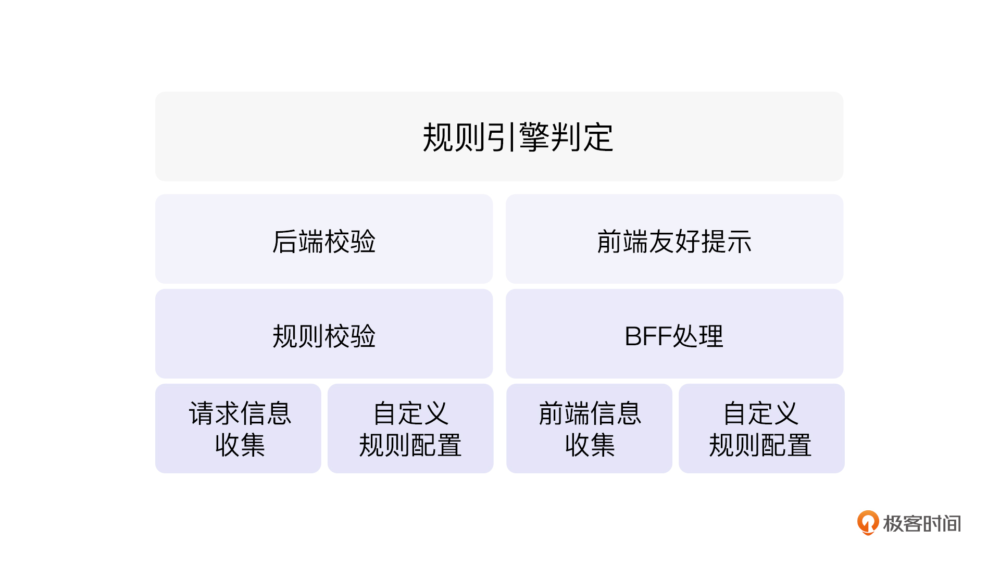
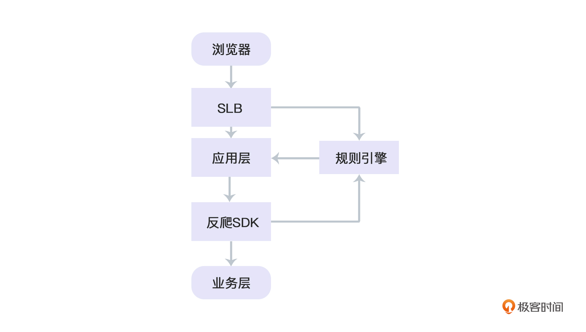

---
date: "2019-06-23"
---  
      
# 15 | 规则引擎：如何快速响应突发的爬虫需求？
你好，我是DS Hunter，反爬虫专家，又见面了。

我们前面很多地方都提到了规则引擎。这里再重申一下规则的定义：

> 规则（rule）：使用任何技术手段，对线上请求特征按照指定的条件（condition）或方法（callback）进行检测验证，并执行指定操作的过程。在部分系统里，这个也被称为过滤器（filter）。

如果说低耦合是为了保护你不死，那么规则引擎就是你的战斗利器，相当于将军的兵器，来鉴别爬虫。严格来说，整个反爬系统所有的操作，最终都是各种形态的规则引擎。

这里我们把规则引擎分为后端和前端两部分来讨论。为了使论述更佳清晰易懂，这里我们将BFF的规则引擎认为是前端的部分。

此外，做好规则引擎之后，还是需要用上一章的低耦合的办法去接入的，你也可以根据上一讲的内容自行组合。

那么，我们就直接进入规则引擎的讲解，关注它本身的架构。

## 规则引擎：架构分析

从结构上来说，前后端是各有一套规则引擎的。其中，前端的和BFF紧密结合，我们可以放一起讨论。



你可以从图里看到，无论是前端还是后端，大致流程都是收集信息，配置规则，对应的模块进行处理，然后根据规则进行指定的操作。这个过程我们可以认为是数据驱动，也可以认为是规则驱动。当然，正是因为规则驱动，所以才有了规则引擎这样的名字。

<!-- [[[read_end]]] -->

在发现了前后端的相似性之后，你可能会有一个疑问：既然前后端都需要规则配置，那么这个是否可以抽象出一个配置模块，同时对前后端进行配置呢？

答案是可以的，但是要看你的业务权限到什么范围。理论上说，一个配置系统同时配置前后端，能减少配置压力。但是，如果对应的系统不在你权限范围内，就意味着你可以随意变更别人模块的权限，通常推行压力会大很多。而且这不是什么技术问题，而是一个办公室政治问题。不同的团队可能会有不同的难度。这个没有标准答案。

## 规则引擎：后端

实际上，很多公司都有做反爬虫的系统，但是它们看起来很高大上，实际效果却一般。原因就是他们只做了这个规则引擎，并没有深入下去。这样的现象，恰恰也说明了规则引擎的基础性以及重要性。

按照我们前面的介绍，后端通常是做请求校验的，也就是对HTTP请求进行规则校验。我们再来复习一下前一张的流程图：



可以看到，规则引擎是独立于应用层而存在的。那也就意味着要么SLB调用规则引擎，要么反爬SDK调用规则引擎。这同时也意味着规则引擎的独立性极强，可以随时被熔断。

记住这个观点，然后我们逐个模块来看。

### 信息收集模块

第一个模块就是信息收集模块。

根据我们前一讲低耦合的说法，规则引擎是由反爬SDK来调用的，而不是耦合在系统内部。那么，规则引擎应该是个独立系统。这意味着，他不可能拿到请求的上下文，因此不可能直接分析HTTP Header。而我们就需要把HTTP Header都带过去。

给另一个系统带参数过去，方法很简单，就是调用时序列化当前HTTP Header，然后作为调用参数传给对方即可。这里传参本身没什么难度。不过，需要权衡的是，日志在哪里记录？是调用方，还是规则引擎？

原则上来说，我建议放在规则引擎。虽然放在调用方记录会更加稳妥、不丢日志，但是出于以下考虑，还是放规则引擎方比较合适：

**1\. 放在调用方， 会增加接入难度：**

日志如果集成在调用方，要么是给业务方一个接口，要么是集成在SDK里面。无论是哪一种情况，都增加了出错的可能性，并且出错了都难以调试——因为这是跨团队代码。

因此，出于简单考虑，应该尽可能减少SDK的调用成本。最好就一句话：结果=调用反爬\(\)，然后代码结束。

**2\. 放在调用方，会增加对业务系统的耦合：**

上一讲详细解释了的低耦合的思维方式。

**3\. 放在调用方，会增加调用方的压力。**

因此，我们的规则引擎应该自带日志模块。

日志的问题讨论结束了，我们回到正题。后端规则引擎基本上就是收集HTTP Header了，而HTTP协议本身是一个文本协议，因此Header本身也是文本，这也降低了我们序列化的成本。因此，暂时无需考虑序列化对系统造成的压力。但是，依然要对HTTP Header做[限制](http://time.geekbang.org/column/article/483022)，避免对方恶意攻击header的count，消耗序列化成本，把反爬虫系统拖熔断。

规则引擎接收到请求参数，就可以对Header的内容进行规则判定了。这里因为还要做反序列化，而HTTP本身又有大量的encode和decode操作，因此一定要小心处理，不然很容易埋bug，类似忘记调用encode、调用decode次数错误等等都有可能出现。而encode和decode类型的bug，一旦出现，都是概率型bug，不是必现型bug，调试会极难。同样的道理，log记录也要注意这个问题。

### 规则校验模块

后端的规则校验模块本质上是一个[策略模式](http://time.geekbang.org/column/article/214014)。

策略模式简单来说就是对策略进行解耦。事实上，大部分设计模式都逃不掉“解耦”这个概念。而规则，也就是Rule，本质上也可以认为是一个策略。因为根据指定的规则，我们可以进行判定，输出结果。这本身也算一种策略。

我们看这样的伪代码：

```
    interface IContext;
    interface IRuleResult;
    interface IRule{
      IRuleResult Check(IContext context);
    }
    // 其中一个实现类
    public HttpHeaderEncodingRule : IRule{
      IRuleResult Check(IContext context){
        // 检测encoding是否正确
        return new ....
      }
    }
    public HttpHeaderCookieRule:IRule{
      IRuleResult Check(IContext context){
        // 检测cookie是否正确
        return new...
      }
    }
    

```

类似这样的规则还有很多。 如果单独判定一条，那就是策略模式。如果一起判定呢？你可能会忽然说：老师，不对，这就成了职责链模式了！你这模式好乱啊！

是的，但是你有没有想过，你创建这些Rule的时候，还要使用抽象工厂呢？实际上设计模式通常都是组合使用的，只要实现了高内聚低耦合，用了什么设计模式并不重要。

看，不但系统架构要低耦合，设计代码也是一样的！

### 规则判定结果输出

规则引擎判定完结果之后，是不是可以直接输出给前端，给出判定结果，然后给出对应的处理呢？

不是的。你直接给前端，告诉用户：你是爬虫，你完了，我这里肯定要搞你，我打算这么搞你。以下省略代码3000行……

你当爬虫傻么？他一看：什么，我被搞了，不行我去调试一下，兄弟们先不爬了。

所以，爬虫需要低调，难道反爬虫就不需要吗？

**那么，我们的处理就应该是静默处理。**也就是说，爬虫默默拿到处理后的数据就可以了，不要在前端进行任何的判定。只要有判定，那么就容易分析出反爬虫的结果。这是反爬虫的大忌。例如你要调整价格，那么直接把价格在后端（或者BFF）拉高然后吐给前端即可。

如果你默默给了个提价比例给前端，让前端自己去提价……好吧，我只能说你们的前端也太好欺负了。

## 规则引擎：前端

前端部分主要是规则引擎的辅助。我们来看下具体的辅助打法。

### pre：信息收集。

整个处理的最前置就是信息收集。我们前面讲过，一个主要的前端收集点就是DOM指纹。所以，我们把重点放在这里。

所谓的DOM指纹，我们也提过，实际上是DOM和BOM的混合。但是都是在window上拉取的（因为document也在window上，可以用window.document来访问），所以用window做根节点拉取即可。你要是想叫BOM指纹也可以。

我们可以使用这样的字符串来描述定位符：

```
    /navigator/geolocation/toString
    代表执行window.navigator.geolocation.toString()
    这个是早年phantomjs的一个重要监测点。
    /document/body/div(3)/input[value]
    代表获取body元素的第三个div里面的input元素，并取出value
    这里顺便提一下这里的input是一个file类型的，你可以提前设置一个value进去。我们都知道，在浏览器安全规则下，这个value的设置是不可能成功的。但是，模拟DOM的库，有成功的可能性。所以我们要检测的是value设置失败，也就是依然为空才行。
    

```

这类代码可以写出很多。格式应该由你自己定义，上面只是demo。但是要注意一点：你打算明文下发这段字符串吗？

当然不可能，这不是给爬虫送上门让他怀疑并分析吗。

我们应该下发的反而是加密结果，越复杂越好，甚至可以是一个树。js调试的时候，因为有console.table的存在，是不太怕长数据的，他怕的是多层级的数据。一个js实现的单链表，能直接绕晕调试工具；而一颗满二叉树，能大幅提升调试难度。那么，如果你的对象存在循环引用呢？console.table会如何处理？你可以线下试试。

### ing：信息处理

信息处理部分主要是BFF的预处理。

我们前面提到过，BFF可以做中转和聚合。这里就体现了聚合的一点。

首先，多个数据可以聚合成单个请求给后端，降低后端压力。其次，多个字段可以合并去重，降低报文的大小，减少后端的压力。最后，BFF可以针对部分Rule直接进行处理，无需进入后端，这样也减少了低级爬虫对后端的冲击。

我们以IP拦截为例。

IP拦截规则可以是固定IP拦截，可以是段拦截。这里的核心就是要降低复杂度。

我们都知道，如果根据规则一个一个去匹配，那么一定是可以检测完所有的IP的。但是这样做复杂度会大大提升。例如，你有200个IP段的规则，那么就要进行200次校验。这样随着规则的上升，复杂度就会不断提升。那么，如何让复杂度稳定在一个常数级别呢？

这里我们做一个简单的例子。例如，你的规则有以下几个：

```
    # 固定IP黑名单
    192.168.3.1
    192.168.3.7
    # IP 段
    192.168.4.*
    192.168.5.*
    192.168.8.*
    

```

如果按照常规的做法，这里应该是，对固定IP进行一个循环，然后逐个判定。然后再对IP段进行range区间的判定，合在一起之后得出“是否落入IP黑名单”的结论。

你会发现，这里是五条规则，那么至少要判定5次。如果你有n个规则，那么就要判定n次。也就是，随着规则的上升，判定速度会越来越慢。那么我们如何提升一下速度呢？

我们经过观察，就会发现，是不是开头不是192.168的，就根本不用判断了？我们肉眼一看就知道。那么根据前缀，直接就可以排除掉一堆啊。

这让你想起了什么数据结构呢？是的，这是一个前缀树。

我们把这几条规则汇总一下，就可以得到如下的样子：

```
    {
      "192":{
        "168":{
          "3":{
            "1":true,
            "7":true
          },
          "4":true,
          "5":true,
          "8":true
        }
      }
    }
    

```

在BFF里面，一旦你有了这棵树，那么一个IP进去，判定方式就很容易了。

这里我们还是举例来说明。现在，我们手里来了一个IP：192.168.3.6

那么首先查找192，结果为true吗？不为true，是一个object，那么用这个object继续找168，结果是true吗？不是true，是一个object。那么继续找，3，是true吗？不是true，依然是object。下一个是6了。object取6，是true吗？不是true，是undefined，等价于true。那么运行结果为false，这个IP不在黑名单。

从头到尾，我们只进行了四次判定。而且，后续无论这个黑名单多大，我们的判定都是4次，也就是我们的算法复杂度是O\(4\)，常数级别，那也就是O\(1\)，因此极为可控。

当然，这只是个demo。事实上，你还可以把IP转化为二进制，然后进行32次二叉树的查找，直接得出结果，也是没有问题的。甚至IP段是用子网掩码实现的，这个直接就与树的深度挂钩，思路和上面例子的思路都是一样的。

二进制的好处是，很多子网并不是工整的分割到8的倍数，因此可能会有一些很稀奇古怪的IP段，例如192.168.3.5/22这类奇葩的数字。你可以自己展开下，看看这个树是不是忽然变得复杂了起来。但是二叉树就直接避免了这个问题。

这个例子的总体思路是什么呢？是我们要时刻记住，反爬就是要降低系统压力的，因此要时刻考虑效率问题，不能爬虫没拦到，把自己给累死了。

### post：前端处理

前端处理相对就容易一些。实际上，大部分的作假，我们都是做在接口上了，也就是直接假装正经地给前端返回了正常但是不正确的数据。但是前端还是有一些小的动作可以做。

例如，如果你需要强制登录，那么可能接口返回就是一个未验证，不给数据的状态。这个时候就需要前端做一些兼容处理，例如跳转登录或者弹登录框，这类需要前端做兼容处理。当然，这个是前端基操了，只要能想得到，我相信你一定做得到。

## 小结

好了，这节课，我们着重研究了规则引擎的具体实现方式。实际上，线上的规则引擎会十分复杂。复杂并非难度大，复杂与难，一直是两件不同的事情。因此，我们这里的几个例子，只是给你提供了思路，后续可以按照这个思路自己去探索属于自己的规则引擎实现。

但是，你会发现，所有的反爬最终都逃不脱后端的信息收集，校验，以及规则判定输出。其中规则校验又牵扯到了低耦合的事情。同时，前端也根据时机，会进行信息收集，信息处理，以及前端兼容处理。其中，重点是降低消耗，不要在反爬的过程中消耗无谓的资源。这样，我们才能够更安全地进行操作。

要时刻记住：保住项目组，让项目组活下去，才有胜利的希望。如果无法存活，那么笑到最后的，就是你的对手。

## 思考题

好了，又到了愉快的思考题时间。还是老规矩，三选一。

1.  32层二叉树虽然在广度上变小了，但是层数变多了。它的效率真的会更高吗？会不会看起来很美好实际上并不如字符串的IP判定？你的判定依据是什么？
2.  前端信息收集不能直接下发xPath，避免被爬虫抓。那么你有什么办法来处理这个问题呢？
3.  规则校验模块部分，我们说，可能同时使用策略模式，职责链，以及抽象工厂。那么你认为还可能有什么设计模式会混入其中呢？

可以把想法写在评论区，让我看看你的奇思妙想。 反爬无定势，也许我也可以在评论区学习到更多的思路！

