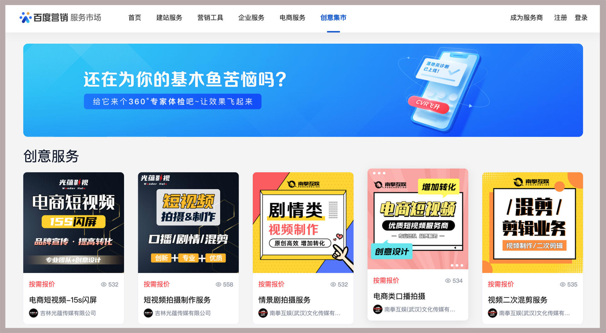
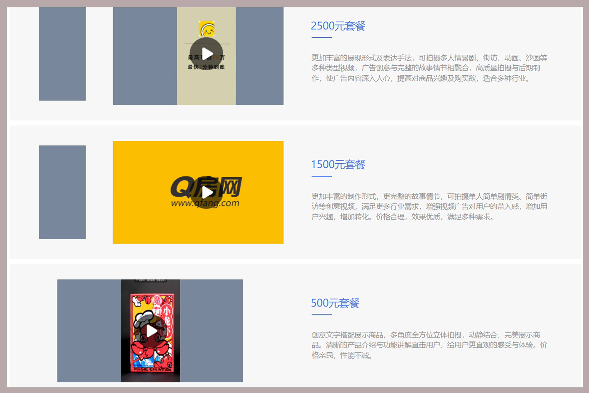
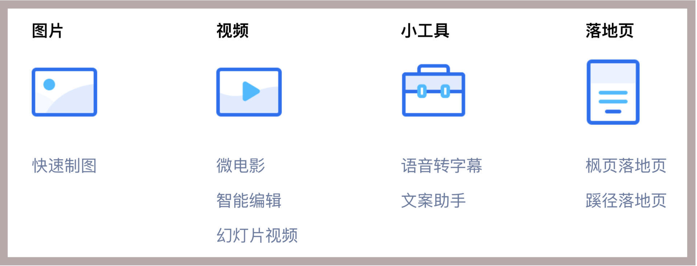
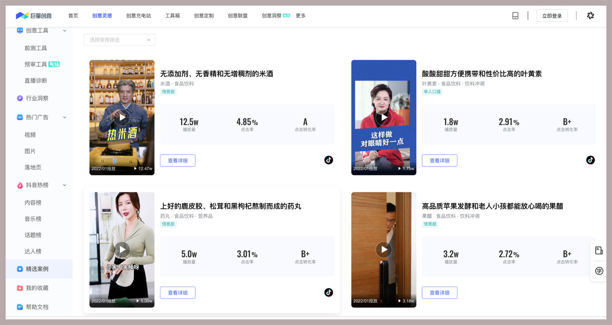
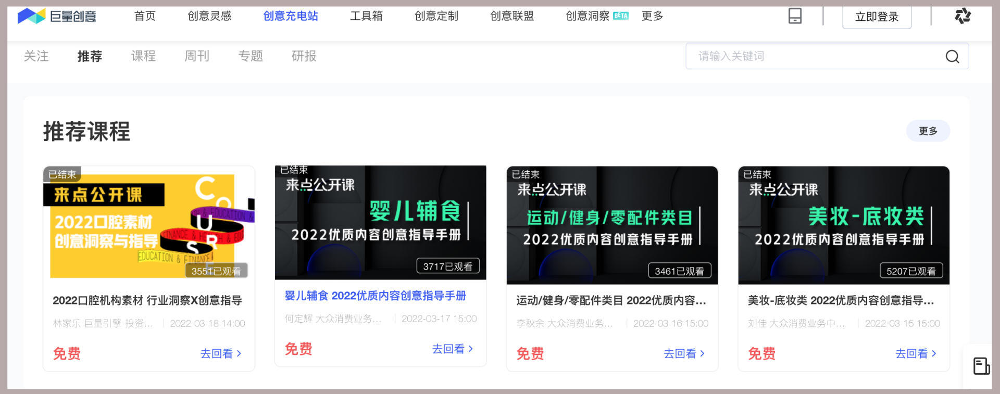
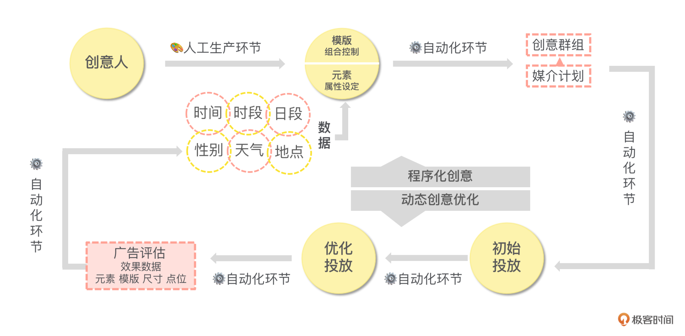
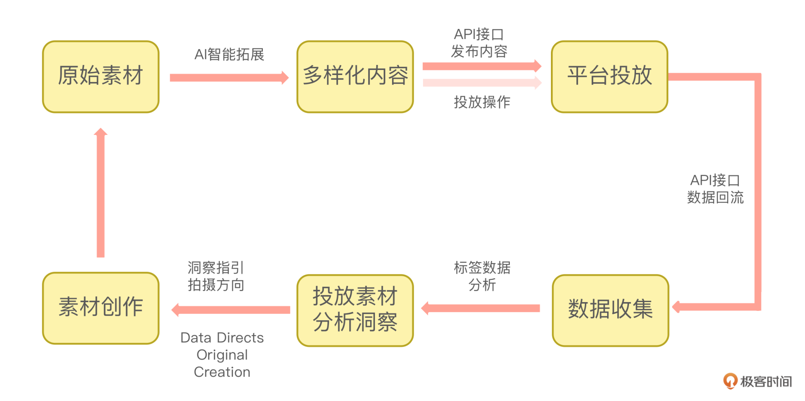
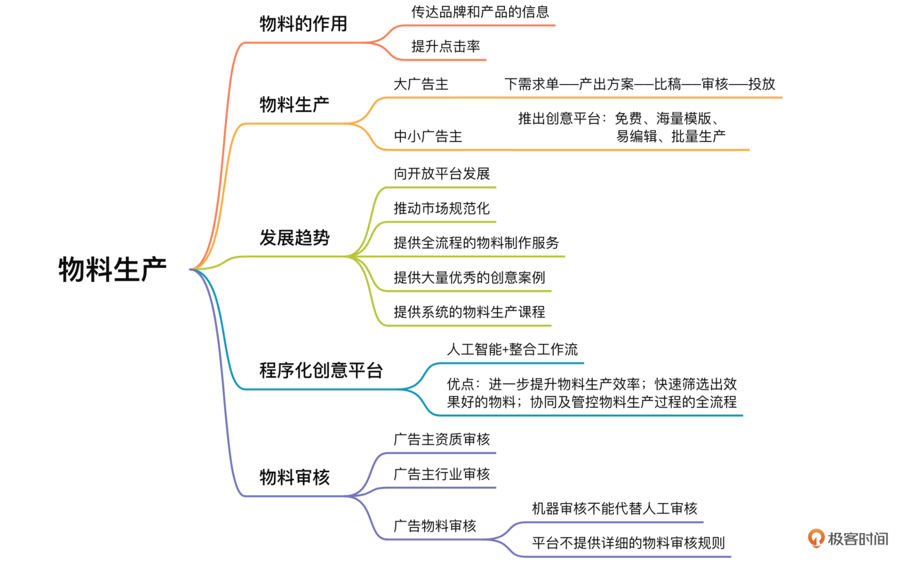

---
date: "2019-06-23"
---  
      
# 11｜物料生产：如何满足广告主的创意需求？
你好，我是郭谊。

在前面的课程中，我们分析了流量对于广告效果的重要作用。除了流量的影响之外，影响广告效果的第二大因素就是物料。今天我们就针对物料生产这一影响因素展开深入讨论。

> 广告物料：原来的意思是指在投放广告时所需要或所耗费的材料，如广告纸，传单，横幅，气球等等，只要是能体现出广告的所有材料就叫做广告物料。互联网广告的物料是广告内展现的内容，基本的物料形式包括文字、图片、富媒体、视频等。一个广告可以上传多个物料，而同一个物料也可以被多个不同的广告使用。（内容来自百度百科）

在[第9讲](https://time.geekbang.org/column/article/495903)中，我们讲过如果以点击率等效果指标为目标，应该如何优化广告物料。除了第9讲中提到的规则以外，广告物料在产品层面还面临着另外一个挑战。那就是：在庞大的互联网广告市场中，如何及时生产出大量且合规的物料以供投放？这一讲，我就带你一起把物料生产这件事聊清楚。

### 物料的作用

物料是广告产品的入口，也是用户与广告交互的第一关。物料主要有两个作用：

* 在用户只观看、不点击广告的情况下，**广告物料可以清晰地传达品牌和产品的信息**，引起用户对产品的兴趣，后续可能通过其他渠道购买，包括去线下购买。例如：用户在网上看了某零食的广告，之后在便利店购买了。这种情况下，你可能追踪不到广告的最终转化链路，但是广告主可以从投放量和售卖量的正相关性上进行推测。
* 在用户观看广告时，优秀的广告物料可以吸引用户点击，跳转到着陆页了解品牌或者产品的更多信息、参加活动、进行试用、完成购买、向其他用户分享等等。在这种情况下，**好的广告物料可以显著提升点击率**。

<!-- [[[read_end]]] -->

因此，如何高效地生产出优质的物料，就成为继流量转化之后广告效果优化的第二个关键问题。

### 大广告主的物料生产流程

大广告主，不管是跨国品牌还是本土品牌，也无论是哪个行业，一般都会通过自己的市场部和广告代理公司进行对接。广告代理公司的创意和文案人员会给广告主提供物料生产方面的服务。

大广告主的物料生产流程一般是这样的：

1.  广告主市场部给广告代理公司下需求单（brief），广告代理公司的创意和文案人员根据需求单产出方案，向广告主进行提案，经过修改后确认。广告主经常会让几家广告代理公司同时参加提案，这在业内叫做“比稿”。比稿胜出的广告代理公司就能拿到广告主的单子，进行后续服务。
2.  广告代理公司提案或者比稿胜出后，会根据具体的广告投放计划，以及媒体提供的广告位物料规格信息，进行物料的制作。物料成品出来后，要经过广告主审核，才能正式投放。因为大广告主一般都很注重品牌安全，很多跨国品牌的广告主甚至会要求物料素材或成品必须经过全球总部的审核。这就让大广告主的物料生产过程和时间较为漫长。
3.  物料成品经广告主审核通过后，媒体平台的广告审核团队会在上线前对物料进行审核，审核标准包括互联网广告相关的法规政策，以及媒体平台自身制定的规则。物料通过审核后，就可以用于投放了。
4.  在少数情况下，媒体平台也会参与到广告物料的生产过程中。比如百度PC富媒体广告产品，因为富媒体广告需要通过嵌入网站的代码进行投放，如果由广告代理公司来制作，很容易出现各种问题，所以我们专门成立了一支创意团队，负责富媒体广告物料的制作，客户按照要求提供素材，并在物料成品产出后，进行投放前的确认。

综上所述，媒体平台或者广告平台，在大广告主的物料生产过程中，主要承担的工作包括：提供广告位物料规格信息、审核物料成品，偶尔也会参与到物料生产的过程中。因为大广告主物料生产设计的环节多、流程复杂，所以需要重点强调提供物料成品的时间要求，避免耽误广告上线。

### 中小广告主的物料生产解决方案

大广告主虽然有大笔的广告产品购买预算，但绝对数量分配到媒体平台最多只有百位数到千位数的量级，而中小企业却有千千万，我国99\%以上都是中小企业。大的媒体平台可能拥有数十万乃至数百万中小企业广告主。绝大多数中小企业面临的首要问题是生存与盈利，显然不可能专门拨出营销费用来找专业的代理公司进行物料生产。

但广告物料生产是一个专业性的领域。物料设计和制作人员，除了具备一定的美术功底和软件使用能力，还需要了解什么样的物料能够通过媒体平台的审核，什么样的物料效果好。这对很多中小广告主来说，显然是一个大难题，阻碍了他们购买和投放广告产品。媒体平台的广告审核团队也天天为一大堆不规范、通不过审核、上不了线的物料发愁。

中小企业广告主在物料生产方面遇到的难题：

1.  缺少有经验的设计人员，没有预算聘请专业人士或者代理公司；

2.  简单粗暴，不重视审美，生成的物料往往影响用户体验，甚至无法通过上线前审核；

3.  不了解什么是好的物料，没有好的点击和转化效果。

这些问题应该怎么解决呢？

这里就要用到产品化思路了：既然中小企业广告主对物料没有太多要求，主要是希望能通过审核、能上线，转化效果不要太差，那我们是否可以利用自身对广告物料的专业知识，通过规模化、产品化的方式，为百万中小企业广告主赋能呢？

当然可以，且看百度是怎么操作的。关于在物料方面为广告主们提供帮助，百度可能是国内大厂中做得最早的一家。早在2010年，百度网盟就推出了“百度创意专家”这个产品。

> 百度创意专家，又叫多媒体创意制作工具，是百度网盟推广为有图片推广需求的用户量身打造的一款快速生成多媒体创意（图片/flash）的在线工具系统。用户无需任何设计经验，只需选择任意精美模板，经过简单编辑，即可快速完成多媒体创意（图片/flash）制作，若想打造独一无二的原创创意还可从空白开始直接设计。

这个产品具有什么特点呢？

* **完全免费**：中小企业广告主在制作物料时还不知道广告上线后能给他们带来多少转化和收入，所以成本肯定是越低越好。免费的物料生产工具型产品会更容易吸引广告主试用。
* **海量模板**：这个产品为中小企业广告主提供了适合各行各业的丰富的素材。这不仅可以满足广告主的需求，而且也能避免在媒体平台上向同一批用户展现的物料重复度过高，影响用户体验。因此，和外部的设计师团队和供应商合作，上线大量的模板和素材，是这类产品初期的重要工作。
* **易于编辑**：这个产品提供多样化的编辑功能，中小企业广告主可以任意更改模板的具体样式（背景、图片、颜色、动效等），增加文字，满足自身的需求。
* **批量生成**：因为广告位的物料规格非常多，而且中小企业广告主倾向于投放联盟类广告产品，更要适应不同媒体和页面形形色色的广告位物料规格要求。所以，它提供了批量生产多种规格物料的功能，能够做到在分秒间一键生成大量物料成品。

百度创意专家上线后，在很大程度上解决了广大中小企业广告主物料生产的需求。一个没有任何基础的从业人员，也可以快速掌握百度创意专家的使用方法，利用现成的模板和材料，制作出可以通过审核、可以投放，也不会太“辣眼睛”的物料。

百度创意专家虽然是一个完全免费的产品，但是因为它帮助很多广告主迈过了物料生产这道门槛，所以客观上推动了更多广告主投放百度网盟的广告。而且，这个产品中有“一键投放广告”的功能，让广告主在物料生成后，可以立刻在你的平台上进行广告投放。这是使用免费的工具型产品对B端客户进行引流的一个成功案例。

百度创意专家现在已经升级成了百度营销创意中心。这类产品已经成为了大媒体平台的标配：腾讯、阿里、字节也纷纷建立了自己的物料生产平台——腾讯创意中心、阿里妈妈创意中心和字节的巨量创意。

### 物料生产的产品及服务的发展趋势

当前，这类产品的发展具有以下几种趋势：

1.  **向开放平台发展**：百度营销创意中心等产品现在都已经从最早的单一工具型产品，发展成了集产品与服务于一身的平台化产品。在这些平台上，一方面，广告主可以使用免费的物料生产工具以及模板、素材；另一方面，这些平台引入了大量的设计师和创意供应商，可以为供应商和广告主提供业务对接。

2.  **推动市场规范化**：对于一些常见的、有一定门槛的广告物料制作需求，中小企业广告主很难借助工具自己完成，百度营销创意中心推出了价位不等的套餐，考核并选择优质的供应商加入，方便广告主选择，也降低了广告主自己筛选供应商的难度。

3.  **提供全流程的物料制作服务**：以腾讯广告创意中心为例，它的创意工具箱里除了常见的图片制作工具，和正在盛行的视频制作工具，还有语音转字幕、文案助手等文字编辑工具，以及常见广告着陆页的快速制作工具。

类似地，阿里妈妈创意中心也提供了图片、视频、文案、直播、着陆页等各种物料生产场景下的不同工具。

4.  **提供大量优秀的创意案例**：在满足了基本的广告物料生产需求后，广告主如何才能做到精益求精，不断优化出效果更好的物料？最直接的途径就是参考其他广告主的优秀案例。各大平台的创意中心会为广告主提供各行各业效果领先的广告物料案例，让广告主模仿和学习。

5.  **提供系统的物料生产课程**：模仿是提升的第一步，但如果停留在模仿，最终又会让媒体平台上的广告同质化严重，引起用户的审美疲劳，从而在整体上降低广告的效果。所以，各个大厂还会推出创意和物料生产方面的系列课程，帮助广告主和供应商了解进一步提升物料生产水准。

需要提醒你的是，每个媒体平台提供的物料生产工具、套餐服务、供应商和课程，都是根据自身平台的特征去设置的。因此，如果你要针对性地了解如何在某个平台生产出符合规范而且有高转化率的物料，最快捷的方法就是首先去研究一下这个平台提供的相关工具和信息。

### 程序化创意平台的诞生与发展

广告是一个结合了艺术和科技的行业，广告物料产品化领域更是这两者结晶的体现。在物料生产中，从2012、13年左右起，国内就出现了结合数据和算法驱动的程序化创意工具产品。

程序化创意（或程序化创意平台，programmatic creative platform）是一种由数据和算法驱动，通过对广告创意内容进行智能制作和创意优化，从而整合互联网创意产业上下游的技术。程序化创意平台主要需要实现以下两点：

1.  人工智能：通过预先设定的算法和流程，程序化创意平台可以快速产出成千上万个细分版本的广告群组，并在投放过程中智能决策、优化创意组合。
2.  整合工作流：利用程序化技术，将传统被置于线下的创意生产整合进入互联网营销工作流，实现创意与媒介的闭环。

#### 程序化创意平台的优点

* **进一步提升物料生产效率**：随着短视频广告产品的兴盛，对于短视频广告物料生产的质量与数量的要求对人力造成了巨大的挑战。程序化创意平台从图像、声音、脚本等各个方面，把原本要从头到尾生产的单条物料，拆分成不同规格、不同片段，并通过系统实现大量且快速地组合，并在进行重复率检查后留下可用的广告物料，从而满足广告主对于海量创意内容的生产需求。
* **快速筛选出效果好的物料**：程序化创意平台在同一广告的不同物料投放中，收集点击及转化等效果数据，并通过数据自动筛选出效果较好的广告物料，增加投放，快速实现对物料的优胜劣汰。这类效果数据的收集在时间粒度上可以精确到每一帧画面的数据反馈。
* **协同及管控物料生产过程的全流程**：程序化创意平台实现了从原始素材到多样化物料成品的生成，到在各个媒体平台进行投放，再到投放中的物料效果数据收集及效果优化这整个流程的监控及管理。

目前，大厂的物料生产平台上都引入了程序化创意的功能模块。例如字节，把类似百度创意专家那种半人工半机器化的物料生产过程称为“自定义创意”，以便和程序化创意相区别。百度、腾讯等也拥有自己的程序化创意工具。这一产品已经被广泛应用于广告主的物料生产。

> 自定义创意：自定义顾名思义就是自己设置，主要是标题和素材。我们上传X张图片或视频，每一张图片或视频对应都要有一条文案。上传几张素材就要有几条标题，组合起来就是几条创意，它就是固定的组合。  
> 程序化创意：程序化系统会自动根据你上传的素材、标题进行组合，你上传5条图片或视频，上传4条标题，系统会自动组成20条创意，并且系统会根据它的效果自动排列组合，根据效果分配流量。  
> （内容来自[知乎](<http://(https://zhuanlan.zhihu.com/p/205327365)>)）

第三方服务公司中也出现了若干程序化创意平台。这些公司积极地接入各个大的媒体平台，力图实现物料生产后的一键式投放，以便进一步增加自身的竞争力。从广告主角度讲，这些公司的优点就在于其第三方的身份，所以和媒体平台自身的物料工具型产品相比，更能站在广告主的立场。另一方面，媒体平台的物料工具型产品更贴合自身平台特点。这两种平台可以说是各有优劣。

程序化创意平台主要的客户是有一定实力的中大型广告主。因为只有他们才会对物料的生产效率、效果数据监控及优化、全流程乃至全媒体平台的监控，有这么大的兴趣，并且愿意分出一部分预算给程序化创意平台的第三方服务公司。

### 广告物料生产的必备环节：物料审核

广告物料生产中还有一个必备环节，就是物料审核。媒体平台在广告投放上的审核流程主要包括三步：

1.  **广告主资质审核**：广告主必须要提供营业执照、法人身份证、近一年的税收证明等必要文件，才能进入媒体平台的客户池子；早年在一些头部门户网站曾经出现过不合规的情况，造成了巨大的风险，所以广告主资质审核是必需的。
2.  **广告主行业审核**：像博彩属于禁入行业；医美、P2P等属于高风险行业，要根据相关的法规政策进行审核；还有一些媒体对广告主行业有独特的标准，例如百度网盟合作过的汽车类垂直媒体就曾经拒绝游戏行业广告主的投放，认为会影响自身的媒体调性。
3.  **广告物料审核**：前面已经讲过广告物料的审核需要通过相关法规政策和媒体平台自身的规则。这里面有几个关键问题：

* 用机器取代人工是每个产品经理的梦想，那么，机器审核是否可以取代人工？

非常遗憾，目前，在广告物料领域这是不可行的，因为机器审核的风险太高。我曾遇到过：客户因为看到自家的大品牌广告和一些他认为很low的广告出现在同一个页面上而找媒体问责，也遇到过合作媒体因为不满意投放的广告物料而中止合作。更大的风险在于政治监管上的风险，人工审核虽然也不是100\%保险，但是相对更灵活。因此，截至目前，大厂都有专门的广告内容审核团队。

* 媒体平台是否可以给广告主和代理公司提供一份详尽的物料审核规则，以便让后者能够一次性生产出更加合规的物料？

事实上，媒体平台不会给广告主详尽的物料规则。究其原因，一方面像前面说的，要关注监管部门的最新意见，还要关注广告主与合作媒体的即时反馈。媒体平台自己的审核规则和人工审核也不能做到尽善尽美，而且广告主理解物料审核规则的成本也比较高；另一方面，因为审核规则本身的不确定性，媒体平台也要给自己留下解释的空间。

> 互联网广告审核的相关法规参考：《中华人民共和国广告法》《中华人民共和国消费者权益保护法》《中华人民共和国反不正当竞争法》《互联网信息服务管理办法》《互联网广告监督管理暂行办法》等等。

### 重点回顾

好了，今天我们围绕着物料生产这一方面，做了深入的探讨。最后，让我们来回顾一下这一讲的内容吧！

广告效果的提升离不开合规、高效的广告物料生产能力。大广告主和中小广告主在物料生产方面的需求和能力都有很大区别。因此，作为媒体平台或者广告平台，我们为大广告主提供物料规范、物料审核等服务，很少介入物料生产环节。近年来兴起的程序化创意平台，以第三方服务公司的角色，成为中大型广告主物料生产环节中可能的一环。

同时，我们为中小广告主提供了物料生产的工具型产品，并逐渐发展为开放式的物料生产平台，提供工具、服务、供应商、案例、课程等一系列产品及服务，使用产品化思路来满足数以百万计的中小广告主的需求。

需要注意的是，物料审核是物料生产中不可或缺的环节。广告物料审核对媒体而言，和内容审核一样重要。目前，为了规避风险，物料审核还是以人力为主。

### 实战演练

请在[巨量创意](https://cc.oceanengine.com)、[腾讯创意中心](https://chuangyi.qq.com)、[阿里妈妈营销创意中心](https://chuangyi.taobao.com)或[百度营销创意中心](https://chuangyi.baidu.com/inspiration/user/idea/home)中选择一个你感兴趣的平台，了解并分析它提供的产品及服务类型，并找出它的优势和特点。欢迎你在评论区留下你的答案，也欢迎你把这节课分享给需要的朋友，我们下节课再见！