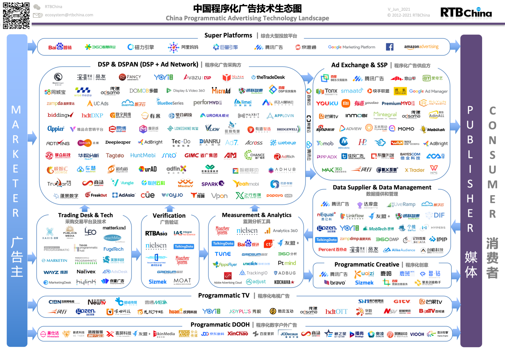
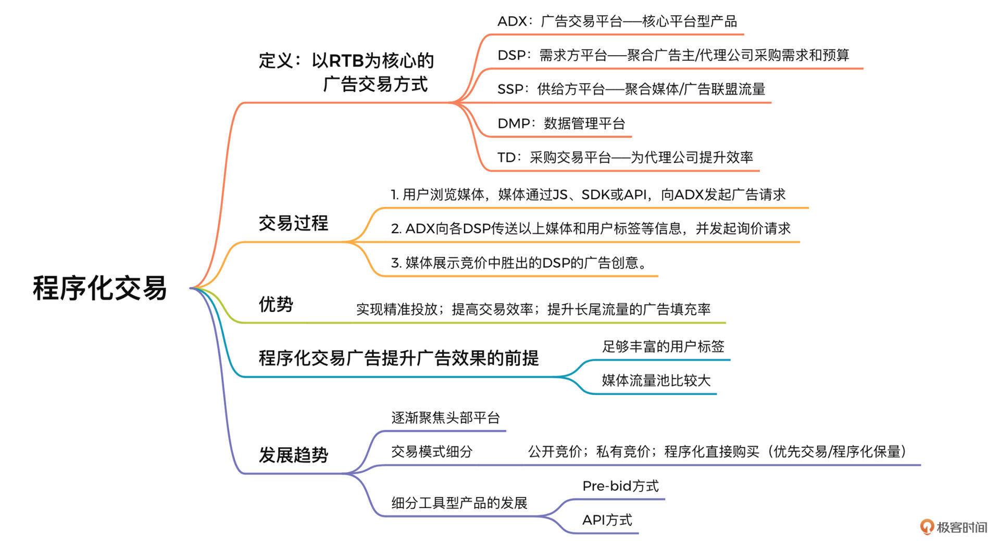

---
date: "2019-06-23"
---  
      
# 14｜程序化交易：程序化交易是否可以提升广告效果？
你好，我是郭谊。

在[第6讲](https://time.geekbang.org/column/article/493555)中，我们提到过大厂在广告产品发展路线中，继直投广告、联盟广告之后，都会上线自己的程序化交易广告。因为机缘巧合，我从2010年起就开始接触程序化交易广告，也参与了从2013年开始的百度程序化交易广告产品早期的运营工作。

因此，这些年来不断有人向我咨询程序化交易方面的问题，其中问得最多的就是：程序化交易真的可以提升广告效果吗？程序化交易有哪些优势呢？你想不想知道这些问题的答案？那就跟我一起来学习这一讲的内容吧！

在今天这一讲中，我将为你解答程序化交易广告的相关问题，对程序化交易的概念、基本原理，以及程序化交易广告对于整个广告行业的意义做一个整体分析。

### 什么是程序化交易广告？

**程序化交易广告是以实时竞价技术即RTB（real-time bidding）为核心的广告交易方式。**说到这里，你可能会有疑问：像百度搜索关键词广告还有百度网盟的广告，不也是CPC实时竞价的吗？程序化交易广告和这些广告有什么不一样呢？

百度搜索关键词广告和百度网盟广告的实时竞价全过程，是在媒体平台内部的广告投放平台上完成的。但是程序化交易广告的实时竞价过程，是需要SSP、ADX、DSP等不同平台之间的数据传输与博弈才能完成的。因此，**传统的CPC实时竞价广告不属于程序化交易广告。**

<!-- [[[read_end]]] -->

从2021年中国程序化广告技术图谱中，我们也可以看出，程序化交易广告业务的行业地图划分得越来越细致了，涉及的角色也非常多。为了更好地了解程序化交易广告，我们先来介绍一下里面的重要角色。

* **ADX**：Ad Exchange，广告交易平台，是程序化交易广告的核心平台型产品，负责程序化交易广告每一次曝光的实时拍卖过程，主要按照价格决定哪个竞拍方竞得这次广告曝光。你可以把它看作“拍卖官”。有竞争力的ADX一般是拥有优质自有流量的媒体平台建立的，例如BAT、字节。也有一些第三方的ADX，依靠客户关系拿品牌广告主的预算，或者依靠技术能力拿效果广告主的预算。
* **DSP**：Demand Side Platform，需求方平台，一般聚合了多家广告主的程序化交易广告采购需求及预算，代表广告主及其代理公司进行程序化交易广告的采买，针对每一次广告曝光决定是否竞拍，以及如果参与竞拍，如何向ADX出价。广告需求方可以通过DSP管理广告活动和投放策略，包括设置目标受众的定向条件、预算、出价、创意等。你可以把DSP看作拍卖现场的买方，也就是“竞拍方”。程序化交易中，ADX一般会接入多个DSP。
* **SSP**：Supply Side Platform，供给方平台，聚合了各种媒体方及广告联盟的流量，针对每一次广告曝光向ADX发送请求，并在ADX回复竞拍结果后，展现竞拍成功方的广告。你可以把SSP看作拍卖现场的“卖方”，ADX也会接入多个SSP。
* **DMP**：Data Management Platform，数据管理平台，它的应用场景有很多，程序化交易广告是其中之一。在程序化交易广告中，DMP最主要的功能是提供用户数据标签，以便DSP将自己库里的用户标签和SSP通过ADX传递过来的用户标签进行对比，判断此次广告曝光背后的受众是否是自己库里广告主的目标用户，来决定是否竞拍以及出价多少。媒体平台、广告主、第三方都可以建立DMP。
* **TD**：Trading Desk，采购交易平台，Trading Desk主要是满足需要管理多个DSP广告投放的代理公司的需求。代理公司可以通过TD统一管理多个DSP平台的投放，包括分配投放预算、制定和调整投放策略、查看数据报告等。你可以把TD看成程序化交易需求方的工作台。TD除了广告代理公司自建之外，媒体平台也会为代理公司建立TD，例如阿里妈妈的Unidesk，就是通过TD为代理公司提升程序化交易广告的采购和投放效率，来争取更多代理公司对阿里系广告的青睐。

### 程序化交易广告产品的交易过程

了解了程序化交易中各个角色的作用，那它们之间是怎么运作的呢？接下来，我们来分析一下程序化交易广告的交易过程。整个过程主要分成三个步骤：

* 步骤一：用户浏览媒体，媒体通过JS、SDK或API，向ADX发起广告请求。这一步，媒体可以通过SSP或网络联盟的系统联系ADX，也可以直接联系ADX。如果媒体通过SSP联系ADX的情况，SSP除了向ADX发出广告请求外，还需要把广告位的具体信息、例如所属媒体、最低出价，以及该次广告曝光针对的用户标签，打包发给ADX。
* 步骤二：ADX向各DSP传送以上媒体和用户标签等信息，并发起询价请求。DSP根据事先做好的各广告主所需要的用户标签等信息，查看与此次广告曝光是否匹配，决定是否参与竞价。如果参与，DSP会向ADX提供自己的出价。ADX等待一个固定时间后，会选出出价最高的DSP返回给媒体。

例如，媒体发送的标签显示这个用户对汽车感兴趣，DSP A为某汽车广告主出价，折合CPM 20元，DSP B为某车险广告主出价，折合CPM 10元，假设本次广告曝光只有这两家DSP出价，则此次DSP A胜出。

* 步骤三：媒体展示竞价中胜出的DSP的广告创意。该广告创意可能实时来自DSP，但是一般ADX会事先把DSP提供的素材存储在素材库中。这时候根据媒体的广告位尺寸、格式要求渲染后提供即可。

值得注意的是，程序化交易对服务器和技术有较高的要求，以上过程必须在0.1秒内完成，才算是一个成功的程序化交易。

### 程序化交易广告产品的优势

因为程序化交易本身就是数据驱动，以计算为导向而产生的交易工具。依托现代技术，它可以利用强大的算力，做到很多人工没办法完成的事情。下面我们就来具体看一下程序化交易广告产品有哪些优势：

* **从“买广告位”变成“买人”，实现精准投放**：程序化交易真正把广告购买与投放做到了每次广告曝光的粒度，广告需求方在每次广告请求下判断是否需要购买，并按照这次曝光背后的用户对自己的价值，折算成CPM进行实时竞价。
* **提升广告产品交易的效率**：广告主可以在DSP中确定需要的用户及媒体标签，对广告购买掌握更多的自主权，并且通过ADX连接SSP、网络联盟和终端媒体，更有效地分配预算。程序化广告交易中还增加了品牌安全（brand safety）功能，帮广告主避开可能有损品牌形象的广告位。对广告代理公司的媒介人员来说，程序化广告交易节约了他们与媒体平台谈判及走合同的时间成本。这一切都有赖于DSP、ADX和SSP等系统具备的强大技术能力，以及它们之间的有效合作。
* **提升长尾流量的广告填充率**：媒体在向ADX发起广告请求时，可以一并发送广告位底价，这就帮助长尾流量、剩余流量进入到广告主的采购视野中。SSP或者ADX可以通过技术手段把广告流量进行分级，实现定价差异化，兼顾DSP和广告主的利益。

> 阿里妈妈的程序化交易广告产品在2013年测试期间，2个月的时间帮助近2000家媒体的整体CPM收益提升超过20\%，体现了程序化交易和实时竞价对媒体长尾价值释放的优势。

### 程序化交易与广告产品效果的关系

既然程序化交易的好处有这么多，那它是不是就能提升广告产品的效果了呢？这个答案是，看情况。因为从程序化交易广告的整个运作过程来看，如果要实现对广告效果的提升，还需要满足一些前提条件。

**首先，媒体或者ADX需要向DSP开放足够丰富的用户标签。**但用户数据是一个极其敏感的领域。我们都知道数据是媒体最有价值的资产之一，所以媒体绝不会轻易对外开放自己的用户标签。在我工作的BAT等大厂内部，ADX团队在用户标签方向上的开放度，比起其他广告产品部门相对更高。但基于用户数据的敏感性，开放的程度还是有限的。缺乏更丰富的用户标签，限制了DSP进一步优化广告投放效果的能力。

另一方面，媒体平台也意识到，如果自家平台上的广告，最终都是通过第三方DSP拍卖出去的话，自己也很难掌握到广告主等需求侧的数据，难以进一步提升广告填充率和eCPM。因此，媒体平台也纷纷建立起自家的DSP。这就导致ADX+DSP，成为大厂程序化交易广告平台的标配。

同时，媒体平台利用自己的数据优势，搭建起了自己的DMP数据管理平台。广告主还可以和媒体平台的DMP合作，上传自己的CRM用户数据，通过媒体平台的DMP给这些用户打上更多标签，再结合Lookalike技术进行人群拓展后，在媒体平台上投放广告。经过这些步骤，广告主可以利用媒体平台的DMP能力，搭建出自己的第一方DMP，专门用于自己在这个媒体平台上的广告投放等营销活动。

除此之外，**程序化交易广告的效果上限最终还是受到媒体流量质量本身的制约。**所以，有经验的广告主和DSP，在接入之前，都还是会了解一下ADX中到底接入了哪些媒体和广告位。大厂的ADX之所以受到广告主和DSP的青睐，追根究底也是这方面的原因。例如字节的巨量引擎ADX上既有今日头条、抖音等字节自有流量，也有通过穿山甲联盟整合的外部合作App的流量，但首先吸引广告主和DSP的，肯定还是字节的自有流量。广告主通过巨量引擎ADX，可以在直投广告之外，竞拍到更多字节自身的广告曝光。

而且，媒体平台自有的DSP，还有其他优势：

* 安全地拿到更多的用户标签数据；
* 和媒体平台自有的转化优化、动态创意等功能结合得更加紧密，实现联动；
* 通过自身众多广告主的广告投放历史数据，训练优化投放模型。

因此，媒体平台自有的DSP，往往能够为广告主提供更好的程序化交易广告产品的效果。这也导致广告主虽然可能同时使用第三方DSP，但通常还是会把更多的预算倾斜到媒体平台自有的DSP上。

所以，我们一定要理性地看待程序化交易广告的优势与局限，不要盲目地相信使用实时竞价技术必然会带来广告效果的提升。

### 程序化交易广告产品的发展趋势

从2005年RightMedia发布全球第一个ADX广告交易平台起，程序化交易已经存在了十几年来，经过了野蛮生长时期，从16年、17年起，行业逐渐回归理性，也越来越规范。那么，程序化交易广告产品将来会往什么方向发展呢？我们一起来看一下。

1.  **聚焦头部平台**

随着行业洗牌的结束，目前的程序化交易广告产品的大头慢慢集中到了大型媒体平台内部，也就是BAT、字节等被称为程序化交易广告生态中的超级平台（Super Platform）。不仅是ADX，第三方独立DSP的生存空间也越来越小。这也从一个侧面充分说明了：**成功的广告产品首先还是要依赖于****大****规模的流量与用户。**

2.  **交易模式的细分**

程序化交易广告根据需求方和供给方范围的划分，又演化出了若干种不同的细分交易模式，其中就包括：

* 公开竞价（Open Auction，RTB）：ADX对需求方和供给方都是开放的状态，所有的DSP同时拥有竞拍每一次广告曝光的权利。你可以把这种交易模式看作公开的拍卖大厅。

* 私有竞价（Private Auction，PA）：有些优质媒体为了自身收益和品牌安全，只邀请部分广告主参与竞价，会优先把流量放到私有竞价中进行拍卖，剩余流量再给公开大厅。一般来说，私有竞价下的广告流量更加优质，CPM价格也相对较高。你可以把这种交易模式看成大户室。

* 程序化直接购买（Programmatic Direct Buy，PDB）：这种方式又叫做私有程序化购买，指买卖双方按照协商好的价格或流量，绕开竞价，直接进行一对一交易。你可以把这种交易模式看成贵宾室。这种交易模式又可以分成两种方式：优先交易和程序化保量。

  * 优先交易（Preferred Deals，PD）：保价不保量，买卖双方协商好固定价格进行交易，这个价格一般高于公开竞价的价格；
  * 程序化保量：一般有两种，一种是依照双方约定好的量100\%采购，另一种是依照约定的返量比例来进行采购，例如媒体按照广告主所需比例的1.5倍推送流量，广告主将多余的流量返还，CPM价格则跟广告主所需流量的数量和返量比例有关。

采取程序化直接购买方式的一般主要是大型品牌广告主，比如联合利华、宝马等。这里，你可能忍不住要问了：这种购买方式和直投广告以及联盟广告又有什么不同呢？

实际上，PDB与直投广告的交易模式是类似的。但与直投广告相比，PDB能够满足品牌广告主优先购买优质资源的需求，是直投广告的有力补充；另一方面PDB可以进行人群精准定向，保证了一定的广告效果。

相比联盟广告，PDB在广告展现上的优先级高于联盟广告，广告主对广告投放的位置更清楚，因此也更能保证广告主的品牌安全；而且PDB保量或支持返量对曝光量也有保障。

需要注意的是，私有竞价和程序化直接购买都需要广告主先下订单，所以不是完全自动化的，可以看成是半程序化的交易模式。

程序化交易模式的细分趋势，丰富了程序化交易广告产品的体系，也推动了媒体平台内部形成更加细致的广告展现优先级的排序：在同一个广告位上，直投广告的优先级是最高的，其后依次是程序化直接购买、私有竞价、公开竞价，之后是网盟广告。从这个次序，我们可以看出，长远来看，程序化交易广告的eCPM必须高于网盟广告，媒体才有利可图。

3.  **细分工具型产品的发展**

我们以Marketing API和Real Time API为例，来聊一聊细分工具型产品的发展。DSP给第三方Trading Desk平台提供的对接接口，分为Pre-bid（竞价前判断引擎）和API两种方式。

* Pre-bid方式下，DSP在出价前，会把媒体和广告位参数发给TD，询问是否出价，TD根据自己的DMP数据进行出价决策，并将决策结果返回给DSP。Pre-bid方式需要TD有较高的投放量级；
* 在API方式下，DSP为TD提供报表类和操作类两种API接口。前者只能查看DSP投放数据，后者可以进行投放决策和操作。

2017年，腾讯广告推出的Marketing API就是典型的操作类API。现在，随着效果广告预算的增加，Marketing API的使用越来越普遍。字节等大厂也纷纷推出了自己的Marketing API。之后，媒体平台又推出了基于pre-bid的Real Time API（简称RTA），给有较大投放量级的头部广告主提供DSP和TD进行预竞价的实时沟通与决策服务。

### 重点回顾

在这一讲中，我为你详细介绍了程序化交易广告产品中的重要角色和交易流程。从中我们可以看出，程序化交易广告真正实现了广告产品从“卖广告位”向“卖用户”的转变，利用技术从系统层面提高了广告投放的效率，也有助于长尾流量更好地实现广告变现。

与此同时，因为程序化交易广告产品的效果最终还是要依赖流量质量、用户标签数据和投放模型优化。因此，这类产品和整个互联网广告一样，渐渐聚焦于媒体平台的头部玩家。在这个过程中，程序化交易广告除了最原始的公开竞价之外，又发展出了私有竞价、程序化直接购买等细分的交易模式，并且通过Marketing API和RTA等方式，为DSP赋予了更多的操作空间。

  
如果你问我程序化交易广告产品是否能提升广告效果，我会回答你：或许可以。但是，程序化交易广告产品的真正价值并不仅仅局限在效果提升上，因为它已经实实在在地提升了广告产品的投放效率；而且，媒体平台内部的广告平台设计，也从程序化交易广告的产品设计思路中得到了启发。在后续的平台设计中，需求方、流量方、交易平台、数据管理平台之间会逐渐实现解耦，未来可以更加灵活地应对业务的新趋势。

### 实战演练

在第6讲中，我曾让你选择一个你感兴趣的平台，搜集资料，绘制它的广告产品发展路线图。那么今天请你参考本讲中的内容，为这个平台补充上“程序化交易广告产品”的内容吧！建议你优先选择BAT、字节等程序化交易广告中的超级平台，这样可以让你更加全面地了解程序化交易广告的发展历程。相信通过本次作业，你将在很短的时间内成为这个领域的内行人！

欢迎你在评论区留下你的答案，也欢迎你把这节课分享给需要的朋友。我们下节课再见！