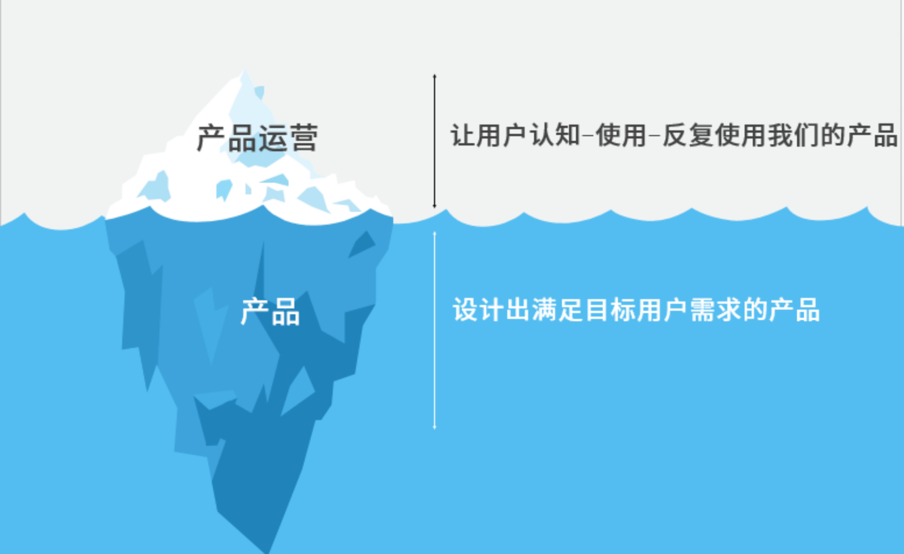
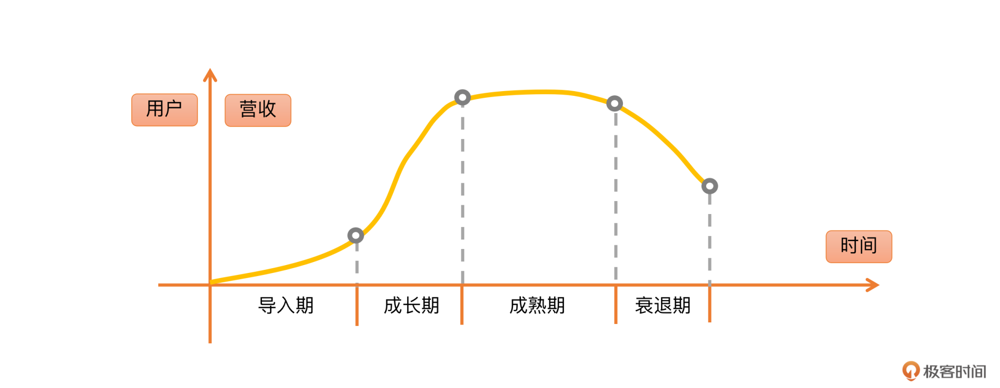
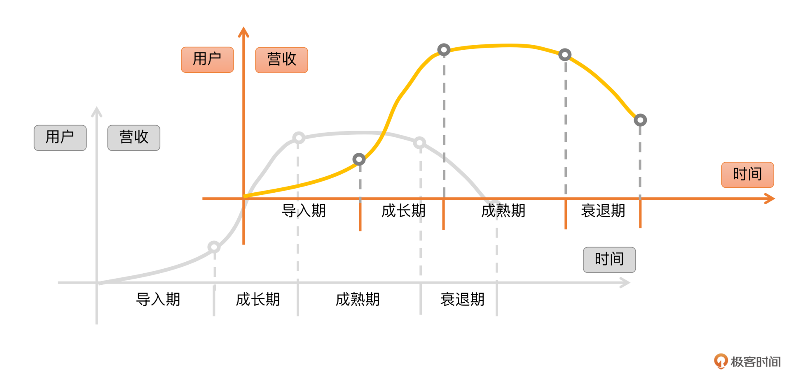
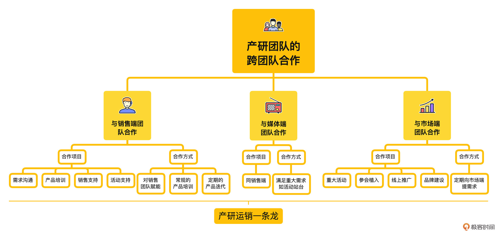

---
date: "2019-06-23"
---  
      
# 20｜产品运营：不同发展阶段如何制定业务目标和运营策略？
你好，我是郭谊。

这一讲我们要学习的是广告产品的运营策略。具体来说，就是如何在不同的发展阶段，制定相应的广告产品的业务目标和运营策略。

在公司决定采用广告作为产品变现模式之后，在你从0到1参与建立或者中途加入一个广告产品团队之后，除了产品设计和迭代工作本身之外，你还将面临一个无法回避的课题：广告产品的产品运营。

为什么我们说广告产品的运营工作是无法回避的呢？它对产品又有什么重要作用呢？

## 产品运营的必要性

好的广告产品离不开产品运营的努力，为什么这么说呢？这主要是广告产品本身以及外部市场环境两方面决定的。

1.  产品本身的价值体现

在讲述产品和产品运营关系的时候，我喜欢使用“产品价值冰山模型”来表示。你可以想象一下，产品价值是一座冰山，海平面是广告客户对价值的可感知线。海平面以下的冰山部分，主要来自产品本身对客户营销目标的满足，这部分是客户使用了产品之后才能感知到的。

那海平面以上的产品价值，是我们应该努力实现的部分，也就是如何让广告客户们发现、认识、喜欢、采购乃至复购我们的广告产品。这就需要靠广告产品运营这个职能模块去实现。

2.  市场竞争激烈

虽说产品本身的价值对产品的销量有很大的影响，但是现在市场竞争过于激烈，酒香也怕巷子深。即使是互联网大厂，也是如此。广告客户们可以在腾讯、阿里、字节跳动、爱优腾等各种平台及其产品之间挑来挑去。所以说，产品设计及上线工作的完成，并不意味着你完成了广告产品价值构建的全部工作。

<!-- [[[read_end]]] -->

如果想要实现产品价值最大化还必须有产品运营的加持，在运营的推广维护下，广告产品的生命会被推向高潮。

## 广告产品运营的方法与技能

对于广告产品运营，我们需要掌握哪些技能和方法呢？在这里我将给你分享广告产品运营常用的两个理论。

### 产品生命周期理论

首先，你需要掌握的是产品生命周期理论。产品生命周期理论起源于1966年哈佛大学的教授雷蒙德·弗农（英文名）的一篇论文，论文中是这样描述的：

> 产品生命周期是产品的市场寿命，即一种新产品从开始进入市场到被市场淘汰的整个过程。产品和人一样，在整个生命历程中，会经历类似我们每个人形成、成长、成熟、衰退这样的周期。（百度百科）

在互联网产品生命周期理论中，每个产品的发展都要经历导入期、成长期、成熟期、衰退期四个阶段。**一个广告产品，处于哪个阶段，是决定它的运营目标和策略的最基本的因素。**

下面，我们就来聊一聊广告产品在以上四个阶段，分别应该以什么为业务目标，以及在产品运营策略中应该做哪些工作。

#### 第一阶段——导入期

**导入期开始的标志是广告产品的正式版本上线。**在这个阶段，广告产品的运营目标是以下两点：

1.  验证原定的目标客户是否正确；
2.  验证产品设计的早期版本是否能满足目标客户的核心需求。

我们接下来分别讲一下这两点：

首先，验证原定的目标客户是否正确。

前面讲过，广告产品的目标客户可以分为大型企业和中小型企业，也可以按照行业划分为汽车、金融、快消、3C数码、电商、游戏等不同的行业。即使只把这两个维度交叉一下，形成一个二维矩阵，用它来给广告客户分类，也会生成至少几十个细分的目标客户群体。

你的广告产品针对大型企业还是中小型企业？最适合哪些行业？你都可以在导入期找你设想中的目标广告主去做投放测试，看他们的测试率和复购率，再进行判断和调整。

然后，验证产品设计的早期版本是否能满足目标客户的核心需求。

以广告主为例，他们的核心需求至少可以分为**品牌推广**和**效果转化**两大分类。仅仅效果转化就能再细分为下载、激活、购买等很多细类。比如游戏客户的核心需求往往是激活，你的产品如果以游戏行业作为目标客户，是否能满足游戏客户对于激活率的考核，就成为验证关键。

导入期的注意事项：

1.  导入期切忌在还没有经历市场考验之前，就对广告产品进行大范围的推广和售卖。

我经历过不止一个广告产品从0到1的过程，在导入期真的是天天都在报bug、修bug，每周都要升级版本，甚至还要维护服务器，一上线就数据回滚的事情也发生过。如果这一阶段就有很多广告主使用你的广告产品，那一旦发生问题，伤了客户，再想让客户回来尝试就千难万难了。

2.  导入期也不要对产品进行大规模的流量复制。

百度曾经有个广告产品，内部叫做LU，或者叫做中间页。简单来说，就是针对一些不擅长做落地页优化的行业广告主，给他们提前做一个聚合页面。逻辑上的依据是虽然转化链条多了一步，但是因为我们会对这个聚合页面的用户体验和广告主物料进行优化，所以整体转化率会有所提升。

如果一开始我们就给这个产品分配很多流量，这个产品的曝光量也就比较好。过了一两年我们再看这个产品的收入，就会发现有没有这个产品对我们广告总收入影响不大，意思就是这个产品的高曝光量是来自我们给它的流量倾斜，而不是市场对它的认可。做这种从左口袋掏钱到右口袋的事情，对于业务又有什么意义呢？

导入期结束的标志，是你的广告产品已经得到了某些行业广告主的认可，也就是他们会持续复购你的产品。从这时候开始广告产品就进入了成长期。

#### 第二阶段——成长期

**在成长期，你的目标是要尽快攻占市场份额，建立竞争壁垒。**因为就算一开始没有竞品，在竞争激烈的国内广告市场，任何度过导入期的产品也必将引来一批强劲的竞争对手，尤其是各互联网大厂。所以，这个阶段不要对产品利润要求太高，运营的重点在于增加广告主的数量和投放总额。

另一方面，产品功能的升级还是要跟上，产品运营要配合产品经理做好需求管理，及时把客户的核心需求输入到内部，推动广告产品的升级迭代。

举个例子，我们都很熟悉的微信朋友圈广告，一开始是图文5万元起投，投放地域选择只能到地级市或者直辖市的区。对于那种只开了一家奶茶店、做周围商圈或者社区生意的小店主，显然是不划算的，但是这些小店主非常多，而且他们也有营销的需求。所以，朋友圈广告在成长期做的一个重要的功能迭代，就是推出了本地推广，转向可以定位到几公里内的地域进行投放，3000元起投。这个功能推出以后果然受到了广大本地商家的热烈欢迎。

如果你的广告产品在成长期发展顺利，那么就会在市场上占据一席之地。**等到你的目标客户数量增长放缓，这个市场上的竞争格局和头部玩家趋于稳定，就标志着你的广告产品进入到了成熟期。**

#### 第三阶段——成熟期

成熟期广告产品运营的业务目标，会从目标客户数量增长和广告收入，逐渐转向追求每个客户的广告投放金额和利润。当年，腾讯广告进入成熟期之后，产品运营改变了业务目标，开始关注建立更多的销售渠道体系、产出及推广行业客户解决方案、通过线上线下的各种推广建设腾讯广告自己的品牌形象。而产品运营对内输入的产品需求，也更多地转向了以下几点：

1.  各种细节功能的实现，这些细节一般来自客户提的需求，或者对竞品的借鉴；
2.  内部使用的数据产品和工具产品，例如给广告销售策划团队使用的内部数据平台，策划同事会在其中选取数据放到给广告客户的提案或者结案中；
3.  针对行业客户的定制化开发，例如腾讯给京东等大电商客户提供的商品库和素材对接功能，可以结合腾讯广告的用户标签体系，实现“千人千面”的投放效果；
4.  对于整个广告产品效果的进一步优化，例如对点击率、转化率的算法模型优化。

最后，或迟或早，每个广告产品都必将迎来它的衰退期。

#### 第四阶段——衰退期

衰退期的到来通常有两种原因。第一种原因是**产品本身的优势不足。**

在PC电脑时代，我在百度参与过一个品牌曝光型的广告产品的从导入期到成长期的工作，在我离开百度之后，又过了几年，这个产品还是被其他产品合并了。后来的团队负责人跟我聊到这段经历的时候，感慨地说：“不是找一堆P7、P8，就能把一个总盘子注定只有5亿的产品干到50亿的。”

为什么呢？

因为百度在广告主心目中的形象就是搜索广告、效果广告。广告主在分配品牌曝光类预算的时候，首先考虑的是门户网站，然后是视频网站，到后面才会考虑百度。要想打破这个局面，根本上来说，只有开发出新的大流量用户产品才能力挽狂澜。比如新浪又做出了微博，腾讯又做出了微信。如果你判断你的广告产品本身的优势不足，那它的成熟期巅峰乃至衰退期到来的时间其实是不难预估的。

衰退期可能到来的第二种原因，也是最根本的原因，是**外界的环境发生了变化。**

我们继续以百度为例，我们原先讲到互联网广告大厂的时候常说的BAT，毫无疑问指的是百度、阿里、腾讯，而现在为什么要用Bytedance字节跳动替代百度呢？

其根本原因就是随着移动互联网和智能手机取代PC互联网和电脑屏幕，广告流量的入口从百度这样通用的搜索引擎转移到了垂直App。这种情况下，百度搜索广告的重要性对于广告主来说也就无可避免地越来越低，而字节跳动凭借着今日头条和抖音的信息流等原生广告，在移动互联网时代占据了越来越多的广告投放市场份额。

既然衰退期无法避免，那么我们应该如何应对呢？唯一的办法就是在产品到达成熟期的顶峰之前，开启一条新的产品生命周期曲线。

### 第二曲线理论

这里我们使用了一个经典的理论——第二曲线理论。第二曲线理论本来指的是一个企业在传统的优势产品发展曲线之外，另外开辟一条面向新市场或者应用新技术的新的产品发展曲线。我们同样可以把第二曲线理论应用在广告产品领域。

我们把第二曲线理论和产品生命周期理论相结合，在第一条产品生命周期曲线达到巅峰之前，开启一条新的产品生命周期曲线，也就是第二曲线。

第二曲线有一个非常重要的点是：你一定要在原有产品尚未达到生命周期曲线的巅峰，也就是收入最大化的时候，就早早开始新产品的规划和探索。

尤其在大厂里，原有产品可能收入规模非常大，品牌很响，外部的同行和其他部门同事都想加入这个部门，所以整个团队甚至连老板都难免产生一种想躺平的惰性心理。

但是，等到产品收入到达巅峰时，也就意味着紧接着就是收入停滞甚至下降。这时候公司和老板会觉得你们团队的工作做得不到位，会催着你们在原来的现金牛产品（利润率超高的产品）上继续使劲儿给公司挣钱，而不太可能冒险给你们很多资源去探索新的产品了。

因为新的产品必须先经历一个导入期，而且不是所有产品都能顺利度过导入期，进入高速成长期的。所以，你必须在产品还在高速成长期到成熟期早期，公司对你们信心最足、支持力度最大的时候，就开始探索第二曲线，才有可能战胜必将来到的衰退期，继续给公司带来新的增长。

广告产品第二曲线可能的方向很多，比较典型的有：

* **开发新的广告产品**，例如百度在搜索引擎广告之后，又开发了联盟广告，在进入移动互联网时代之后，又开发了App联盟广告；
* **开发新的用户产品**，例如我们原先的百度联盟广告产品团队，有一些老同事就转去做手机百度App，等于从商业产品转做用户产品，等到用户产品做起来之后，再把原来商业化的经验带进来；
* **开发新的商业模式**，例如抖音，最早的商业化模式主要是广告，后来做了线上电商，现在又发力在做O2O本地生活服务中的到店模块，你可以理解成短视频版本的大众点评。而电商和本地生活服务做起来之后，不仅开辟了抖音原有用户产品流量上新的变现模式，而且还能带动这些线上和线下的商家积极地购买抖音广告，为广告产品从需求侧注入新的发展动力。

你可以从以上几个方面入手，在目前产品发展势头正猛的时候，探索第二曲线。正所谓“未雨绸缪，毋临渴而掘井。”不要等到产品走下坡路的时候再去找别的路子，要时刻保持清醒，抓住发展第二曲线的最好时机。**虽说第二曲线的探索成功与否是未知的，但如果在惰性的驱使下不进行长远的思考，势必会失败。**

## 重点回顾

在今天这一讲中，我们学习了在广告产品发展的不同阶段，如何制定产品运营的业务目标和运营策略。你需要掌握以下的核心要点：

* 广告产品不能只有产品，没有产品运营，这两者对于产品价值缺一不可。
* 在产品生命周期的不同阶段，我们必须制定不同的业务目标和运营策略，而且要注意：导入期步子迈太大容易摔跤，成长期和成熟期不努力只能老大徒伤悲，等到衰退期一来就容易被后浪拍死在沙滩上。
* 任何广告产品都会不可避免地迎来衰退期，我们必须在原有产品达到成熟期的巅峰之前，开辟一条第二曲线，即新的产品生命周期曲线。  
  

最后，我希望你能够对于自己所在的产品线处于产品生命周期的哪一个阶段保持清醒的头脑，并且推动你的老板和团队也正确认识这一点。这样才有可能统一现阶段的产品运营目标与运营策略，让整个团队拧成一股绳，集中人力和资源办好现阶段的大事。

## 实战演练

学完了本课的内容，我们来实践一下吧！请你找到一个你感兴趣的广告产品，针对其产品发展过程，搜集所需的必要信息，指出其产品发展生命周期所处阶段，现阶段的业务目标和运营策略，并为其设想一条可能的第二曲线。欢迎在评论区留下你的答案和我一起讨论。