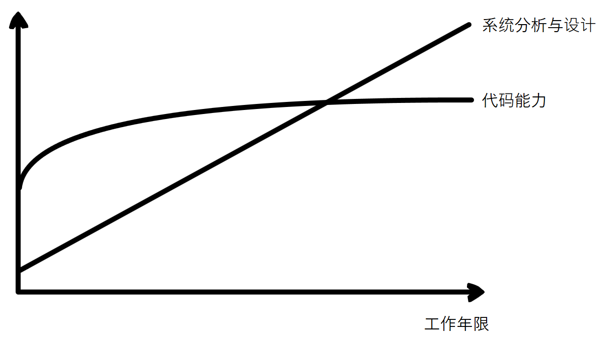
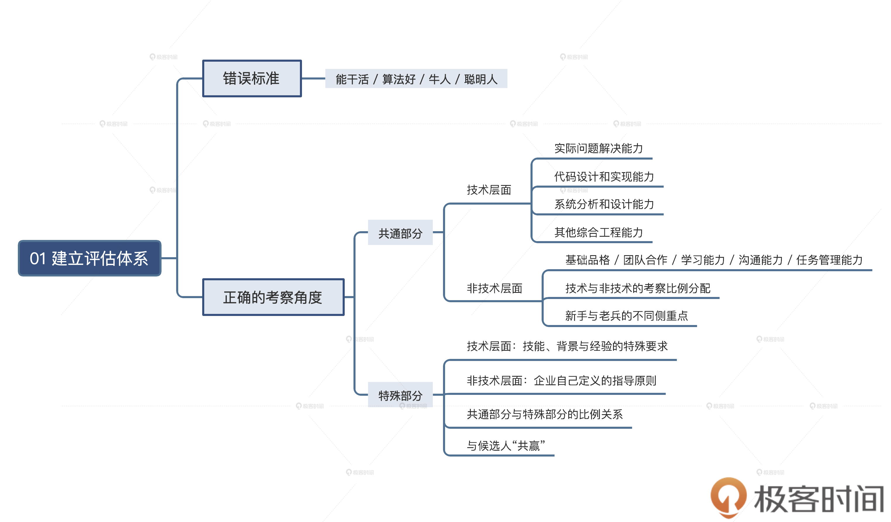

---
date: "2019-06-23"
---  
      
# 01 | 评估体系：公司和团队到底需要怎样的技术人才？
你好，我是四火。

孙子兵法中，有句话叫做“胜兵先胜而后求战，败兵先战而后求胜”，这句话的意思是说，胜利的军队总是先制造胜利的态势然后向敌方挑战，失败的军队则反过来，先发起交战，然后在作战中求得侥幸的胜利。

招聘和面试的过程，就如同一场大战，在我们正式开始讨论招聘和面试过程的话题之前，我们需要把初衷搞清楚，把对于软件工程师候选人考察的策略大体订立清楚，做到心中有谱，以“先胜后战”。

大公司也好，小公司也罢，招人，就需要面试，这我们都知道。可是公司和团队，到底需要怎样的技术人才？这就是我们建立整个面试考察评估体系的时候，最最基础的那个问号。

## 常见答案

在回答这个问题之前，我们先来看看一些常见的答案。

1.  ### “能干活的，能加班的”

我相信给出这个答案的大有人在，我听过这样的说法：“软件的架构都已经做好了，设计都已经完成了，现在需要的就是普通劳动力，把代码填上。”

在我看来，这种初衷可以理解，但实施起来却非常困难。也许在某些行业这的确是可行的，但是在软件工程的世界里却恰恰相反。

究其原因，是持有这个观点的人，把软件工程这个复杂的行为，使用简单的劳动分工来划分了。在历史上，这样的做法并非没有人尝试过，只不过大多数的尝试都失败了，或是最终令它的其它环节成本，高到失去了这样做的意义。

<!-- [[[read_end]]] -->

这是为何？

让我来进一步解释一下。比方说，我们可以把软件工程的流程简单地分为需求、设计、实现、测试、维护等几个步骤。当我们将“实现”环节的人员要求降低，也相应地将质量要求降低，那么我们就将迫不得已在其它环节投入更多的人力去平衡，最终导致研发成本并没有得到本质上的改善，反而在实现环节埋下隐患，比如糟糕的代码设计为未来的维护和扩展挖坑。

这样的平衡，可能是花更多时间来完成更细致的设计文档，可能是添加更多的测试人手和执行更全面的测试，也可能是花更长时间试运行版本和bug修复，还可能是招更多的、专门的管理人员来盯着这些程序员严格遵守流程。

**说白了，就是在软件工程的其它环节做更多的工作，然后给糟糕的实现环节擦屁股和买单。**

2.  ### “算法好的”

这是第二个常见的答案，但有意思的是，这个答案却很少从有经验的团队负责人或者招聘人员那里听到，而更多地是从踏入职场没多久的候选人那里听到。在我见到的面试实践中，这也确实是一个普遍现象。**好端端一个软件工程师的面试，最后变成了刷题成果检验会。**这个现象，你是不是也觉得似曾相识？

那么，为什么这样的观点是错误的？

**原因很简单，用四个字来概括，就是“以偏概全”。**

软件工程是一个多维度的、复杂的行为，代码实现只是其中的一个部分；而算法，更只是代码实现的其中一个部分。单纯的算法牛人离真正的软件工程师，其实还差了十万八千里。

也许你会有这样的问题，那既然单纯的算法面试如此片面，为什么还有那么多公司如此频繁地使用它？别急，我在这里先卖个关子，因为我会在这个专栏中慢慢展开来讲，详细告诉你这是为什么。

3.  ### “牛人”

这也是一个常见的答案，我不能简单地说这是一个错误的答案，因为“牛人”二字的定义实在是不明确。如果我们把这里的“牛人”理解成“技术杰出的人”是否就正确了呢？

我觉得，这依然不正确。相较于“牛人”，团队更需要的是“合适的人”。

先从技术角度来说。**理想的团队，技术层面上是需要在一定程度上互补的。**比方说，在一个全栈的团队中，有的成员擅长系统底层，有的擅长Web应用；有的系统思维严谨，有的产品直觉敏锐，那么无论在系统设计还是在问题定位的时候，团队的决策就可以因为取长补短而达到一定的平衡。

再从非技术角度来说。即便在技术层面候选人已经无可挑剔，我们都还有很多非技术因素需要考虑；即便在个人的非技术层面已经无可指摘，我们依然需要考虑候选人和团队风格的契合程度。举例来说，某些技术特别出色的人，个性更为鲜明，或者说不易相处。我们应该对这样的候选人说yes还是no？

这就要牵涉到一个公司的文化，以及团队的接纳程度了。显而易见的是，一个团队里面，如果全都是“刺儿头”，到处是激烈的观点碰撞，这肯定是一个糟糕的状况，很可能经理每天要忙于摆平冲突；而一个团队里面，如果全是“老好人”，只有赞美和观点认可，这其实也是一个令人担忧的状况，因为缺乏观点往往就意味着决策力的缺乏。

4.  ### “聪明、有潜力的”

这一类回答，主要是针对职场经验尚浅的候选人来说的。

一家公司也好，一个团队也好，有经验的工程师和有潜力的工程师，需要在构成上达成一定的平衡。

有的团队相对技术成熟，架构稳定，流程确凿，而有经验的工程师可以有一定的时间来指导和帮助新人成长，团队可以培养自己的骨干，那么这样的候选人可以说是再好不过了。

而有的团队则相反，特别是某些创业团队，或是产品初创团队，每个人都要挑大梁，甚至大家都忙于救火，那么这种情况就特别需要自我管理能力强、综合素质和经验皆备的老兵，这时这样的候选人就不适合。

你看，团队需要怎样的技术人才？这个问题并不是那么好回答的。

## 考察角度

那么，不回避问题，公司和团队到底需要怎样的技术人才？或者说，反映在面试中，我们应该从怎样的角度去考察和甄选人才？

我将分两个部分来回答这个问题。在这一讲我将谈谈，从宏观上怎样去把握软件工程师候选人甄选的维度；而在下一讲我将结合实际案例来分解面试计划，讲解在操作上的要点。

好，我认为，首先我们要充分认识职位，这里面既包括职位在普遍认知中所具备的共通部分，也是主要部分；又包括特定职位特殊的要求，这有时只占小部分比例，但也不可或缺。

### 共通部分

**共通部分，说白了，就是对于一名优秀的软件工程师普遍的、客观的理解。**

我们来看一个真实的例子，以下是一段来自某互联网公司的职位描述：

> 1.扎实的编程和数据结构算法基础，深入理解面向对象编程思想，具有较强的设计能力。  
> 2.具有较强的分析和解决问题的能力，有强烈的责任心和团队精神，善于沟通合作。  
> 3.具有音视频、直播、OpenGL相关开发经验者优先。

非常精简，但也很有代表性。短短的几条描述，就已经包含了下面我要讲的关于人才甄选共通（第1、2点）和特殊（第3点）这两个部分，并且也包含了技术和非技术这两个对立的范畴。

#### 技术层面

技术层面上，我们要考察软件工程师的基础技能。包括：实际问题解决能力，代码设计和实现能力，系统分析设计能力，测试和验证的能力。

**首先是关于实际问题解决能力**，工程师毕竟是要做工程的，做工程的目的就是要解决实际问题。

这也是为什么，我不赞成面试中，较多地使用单纯的算法和数据结构问题。不是因为它不具备考察性，而是它的覆盖面太窄，具体说，一个典型的实际问题的解决，需要包含两个部分：

1.**把具体问题抽象成若干个可解决的软件问题；**  
2.**使用软件工程的知识与技能去解决这些问题。**

而单纯的算法和数据结构问题，不但只能解决上述两点中的第二点，而且这第二点还必须得是一个落得到编码层面、甚至数学层面上的问题，足见其覆盖面之窄。至于怎样的问题才是一个好的面试问题，我们在专栏的后文中会去专门讨论。

**其次是代码设计和实现能力**，这是软件工程师的基础技能，就如同厨师切菜和钢琴师读谱一样，都是看家本领，技术面试要花相当比例的时间来验证这一点。

但请注意，即便只讨论这一点，它涵盖的范围也比单纯的算法和数据结构广泛得多了，像是有些公司特别喜欢考察的面向对象就属于这个范畴。

**再次是系统分析和设计能力**，包括是否能够针对问题给出合理的系统估算、架构设计等等。这一部分是和经验密切挂钩的。

对于代码实现层面，可以简单地认为，无论是刚工作1年的新手，还是工作15年的老兵，预期上当然会有差别，但并不那么大。

但是，如果是系统的分析和设计能力，就截然相反了，一般来说，丰富的工作经验，理应意味着一定的系统分析和设计能力，我们可以简单这样认为：

需要强调的是，这里说的“系统”是泛指的“软件系统”，而不是“分布式系统”。

这么强调是因为我觉得，如今的互联网的浪潮，给技术人也带来了一些不太好的影响，比如过度追捧“分布式”这样的热门词汇。仿佛谈及系统，就是大数据、海量、高吞吐，一些简单的系统都不太瞧得上了，我觉得这是很不妥的。

对于系统的理解，就如同数学的基础是初等算术一样，还是要把根基打扎实。

**剩下的共通的技术层面的部分，我觉得可以叫做“其它综合工程能力”**，比如测试与验证的能力等等。不是说它们不重要，也不是说不考察，而是说，在面试中，对于软件工程师的技术考察，我们要有所侧重。比方说，我们可以简单地约定只把20\%的技术考察时间，放在这部分。

你也许会问，**计算机的基础知识考察在哪里啊？其实，它就蕴藏在上述的考察项之中。**对于这些分项的考察，是不可能脱离扎实的计算机基础知识来进行的。

比方说，要设计一个网站系统，要有对于网络协议，特别是HTTP协议的基础认识吧，要有对于中间件、容器的基础知识吧，还要有对于数据库的基础理解吧。

在实际面试和考察的过程中，专业技术层面的指标相对容易辨别、容易执行，也往往是作为一个“技术人”的考察重点，我们也确实会花很多时间、设计很多方法在这一部分。但是非技术层面，却容易被具备软件工程师背景的面试官所轻视。

#### 非技术层面

那我们就再来说说非技术层面。**我们关注工程师的基础品格、团队合作能力、学习能力、沟通能力，以及任务管理能力等等。**

在非技术层面，单纯地分项考察有时候会比较困难，也很难覆盖所有我们关心的点（但并不是不能做，我在后续会介绍一些方法）。但我们每一个人，其实都带着我们对于职业素养的基本认知，如果某一点上出了问题，我们会察觉到的。因此多数情况下，我们只需要对于技术面试中发生的一切，保持敏锐。

举例来说，面试中，如果你发现与候选人的沟通存在很大问题，那么你不可能不留意到这一点，而根本不需要特别地去问一个“专门”考察沟通能力的问题。

综上，对于软件工程师的候选人来说，面试的轮次要保证大部分都以技术面试的形式覆盖，而允许少部分以非技术面试的形式覆盖（比如5轮中有4轮技术面试，1轮非技术面试）。但是每一轮技术面试拿到的数据，却应当同时覆盖二者。

举例来说，技术面试中，候选人被要求设计一个短网址系统。候选人二话不说，上来就开始绘制系统组件图，既不确认功能性需求，也不讨论非功能性需求。

面对这样的情况，面试官可能会觉得，候选人缺乏良好的问题澄清和沟通的习惯。也就是说，我们在技术面试的轮次中，也会得到一些非技术层面的数据。**即我们并没有在这个轮次的考察中特别地规划这个非技术考察项，但是我们却得到了关于它的考察数据。**

在技术层面，我们谈到了针对不同工作经验的候选人，我们考察项的不同侧重，而在非技术层面，这里也有一样的情况。

**对于踏入职场不久的工程师，要更关注潜力相关的素质**，比如是否能够听从建议并加以思考，以及是否具备兴趣与热情，因为这是学不到的东西。

**而对于有丰富经验的工程师，要更关注视野，技术理解的深度，以及职业素养。**

也就是说，“经验”，不是体现在年头上，不是体现在更复杂的算法和更高级的数据结构上，也不是体现在记忆那些晦涩难懂的参数配置上，而是对于软件系统的理解，对于团队和产品的理解，对于软件工程的理解。

这有点像足球俱乐部的建制，引入年轻球员更多考虑的是未来和潜力，而引入老兵则是要带来立竿见影的效果。

### 特殊部分

特殊的部分，指的是不同的团队和细分职位，对于软件工程师候选人，有着不一样的要求。

技术层面上，比方说有一些职位要求具备前端技能，有一些职位要求具备AI背景，而有的团队则要求云计算方面的工作经验。

在非技术层面，很多大厂都会设置几条特定的指导原则，这些原则就像纲领一样，指导对于候选人非技术部分评估的过程。比如[亚马逊的领导力准则](https://www.amazon.jobs/zh/principles)，这几年来讨论的人很多，在亚马逊每一轮面试都会被要求覆盖其中的一到两条。

好，上面就是我们从宏观上，从公司和团队的需要出发，对于面试的考察角度，所应具备的大体认识。

你可能注意到了，即便某一特定的细分职位，对于技能有着较为细致和明确的需求，我们还是可以发现，对于大厂的面试，往往共通部分所占比例就越大，我想在这里解释一下原因。

显而易见的是，越细分的职位，越特定的要求，就越能够提高候选人的匹配度，但是这也降低了人才筛选的普适性，让招聘变得无比困难。因此，这些大厂，给出了模糊的招聘标准，而选择在招进来以后，做进一步地培养。这既是刻意为之，也是无奈之举。

但请注意，这里面也蕴含了一个简单的道理，**一个面试中在“共通”部分表现优秀的软件工程师，更可能就是一个通常意义上的优秀的软件工程师，那么就算他并不立即具备特定职位的某项技能，但是经过较短时间的学习和融入，他也很可能可以很快地胜任这个职位。**

关于职位细分，我还想拓展一点，谈一下我对于开篇词中那个“培养起来跑掉了怎么办”担忧的看法。

在前文中，我已经提到，对于任何一个公司和团队来说，都不是要招“牛人”，而是要招“合适的人”，**我们大的目标是和候选人一起共赢，而不是单纯的劳动性价比。**

无论是领域、薪酬，还是工作内容，大家接触到的信息都是开放的，候选人和公司如果各自都能够在大体上得到想要的，就可以在一定程度上缓解这种担忧，你也可以不用太担心这个跑路的问题。

## 总结与思考

面试就像打仗，在打仗之前，我们要高屋建瓴，预先做好规划。因此，作为第一讲，今天我们介绍了，从团队需要的角度出发，宏观上该从怎样的角度去考察软件工程师候选人。这同时包括了技术层面以及非技术层面的关注点。

在最后，我想知道，你的团队又是从怎样的角度招人的呢，能否分享一下？欢迎在留言区一起讨论。

好，我是四火，我们下一讲见。