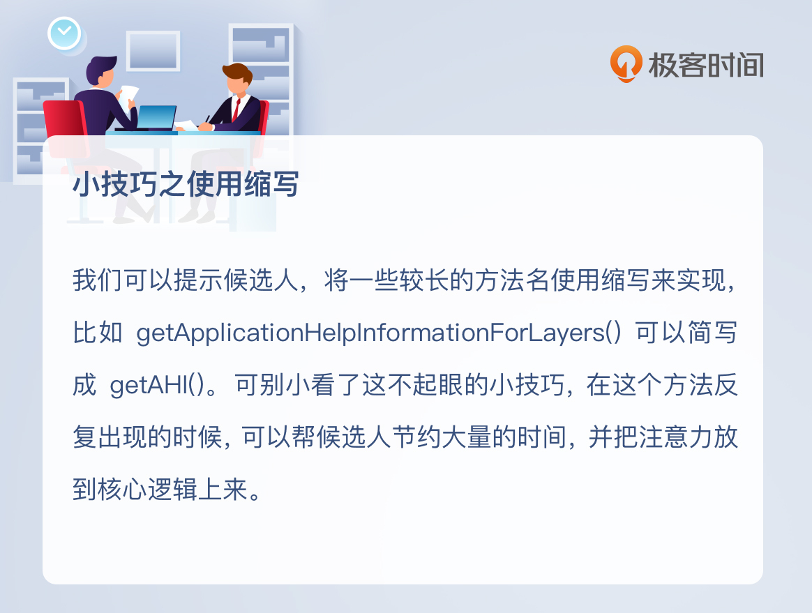
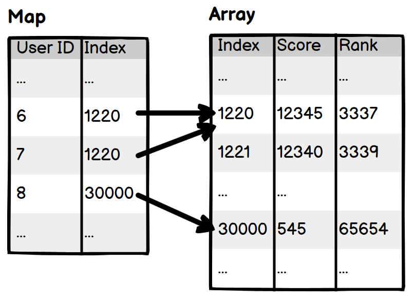
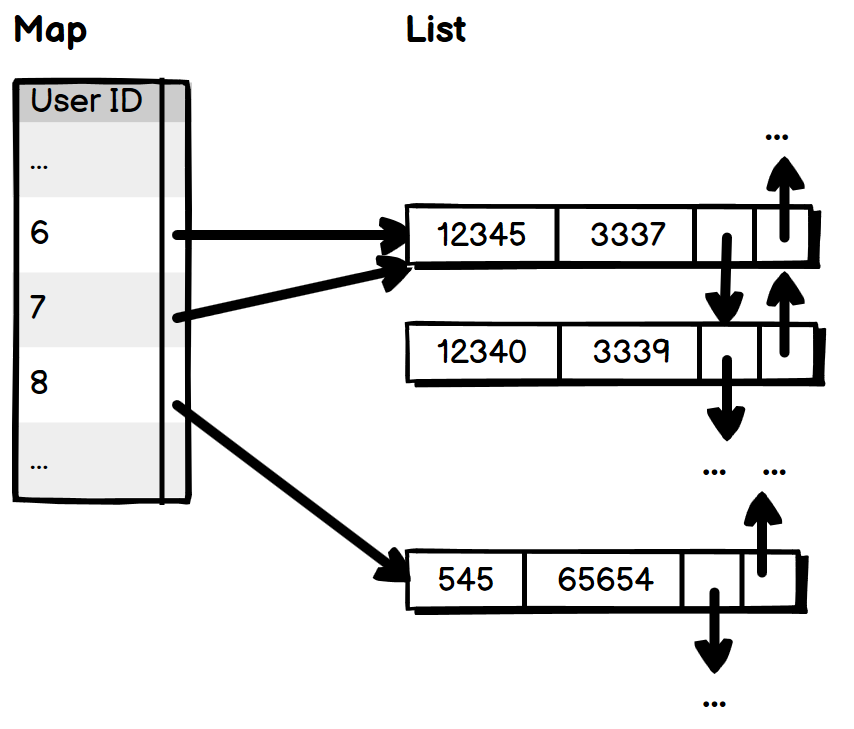
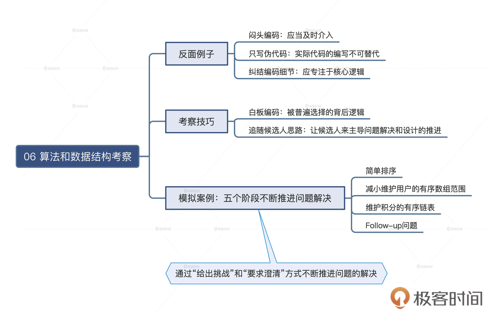

---
date: "2019-06-23"
---  
      
# 06 | 算法和数据结构考察：怎样有层次地驾驭算法考察？
你好，我是四火。

在上一讲中，我们学习了从整体上怎样做流程把控，那么从这一讲我将针对技术面试中最常见的考察重点，做进一步的展开。

为了让你系统地学习，我会根据常见的技术考察重点分类，从数据结构和算法，系统设计，面向对象、测试和其它工程技能，以及行为面试这样几个部分分别介绍。

每一部分，我都会从反面列举一些典型的不当实践，再从正面分享一些考察技巧。今天要讲的是数据结构和算法的部分，除去上述内容，我在最后还给出了一个模拟案例，帮助你完全理解进行算法和数据结构考察的过程。

首先我要说明的是，今天这一讲开始的这些阐述，都不是针对一个完整的面试过程展开的，而是从整个过程中，提炼出最能够体现考察重点的其中几个步骤。如果你不清楚一个完整面试过程应该怎样去把握，可以回看前几讲。

## 糟糕的例子

我先说几个典型的、糟糕的例子，可以说，数据结构和算法恐怕是技术层面最常见的考察点了，所以，所谓的不当操作，也出现得最多。

### 闷头编码

在我见到的编码面试中，这一点可以说是出现得最为频繁的问题。请你联想实际工作，如果你的团队中有这样一个工程师，拿到需求以后，不确认问题、不沟通设计、不讨论方案，直接就开始埋头苦干，就算能写出可以工作的代码，这是不是依然是一件无比恐怖的事情？

<!-- [[[read_end]]] -->

显然，**我们的面试一大目的就是排雷，就是要尽可能避免这样的事情在实际工作中发生。**毕竟我们要找的是软件工程师，不是只会刷题的编码者。

在专栏前面的几讲，我已经反复讲到了，我们怎样去设计问题，怎样层层推进，而不要上来就编码。

但事实上，据我观察，我相信**大部分具备技术背景的面试官都非常清楚，闷头编码“不好”，**但往往还是由于缺乏主动、坚决介入的决心，在这种情况下听之任之。作为面试官，我们不要去想当然地认为，这只是候选人自己应该意识到的问题。

### 只写伪代码

你也许会对这一点不以为然，为什么只写伪代码不行？伪代码和实际代码能差多远？

从工程的角度说，它们差得很远。**伪代码，其实说到底，只是问题解决逻辑的其中一个表达形式而已，**或者说，不写伪代码，也可以用作图、文字描述等等方式将逻辑表达出来。

我们不反对候选人写伪代码，如果这能帮助他理清思路，那为什么不呢？但作为数据结构和算法面试的一个核心，候选人不能只写伪代码。

那么我们就再说说代码。从代码可以看出编码能力，这是软件工程师最最基本的工程技能。就好像造房子，图纸上可以设计得清清楚楚，而编码就是根据图纸把房子造出来、把方案真正落地。编码能力，从本质上说，就是将思路、逻辑工程化的能力。

从编码可以看出工程思维是不是严谨，是不是各种corner case都考虑到了？是不是具备编程语言功底，能够比较流畅地将思路转化到具体实现上？是不是能够比较好地组织代码，方法设计合理，层次结构清晰，变量命名一致？是不是具备良好的面向对象思维和模块化思维？

有了具体代码以后，我们还可以进一步给面试中这个迷你项目收尾，比如讨论一下对于实现的代码，怎样使用测试去覆盖，哪些地方容易出现瓶颈，哪些地方可以进一步优化等等。从这里可以看出，实际代码的作用非常之大，别的形式都无法代替。

事实上，我本周刚刚面试了一个职业经历很丰富的软件工程师候选人，他做过产品经理，做过解决方案工程师，最近的一份工作是咨询师。

他的面试其它表现基本可以说还不错，但就是几乎没有编码能力。最后我们给了他一个进行其它职位评估的可能，但毫无疑问的是，软件工程师的岗位，恐怕他是很难胜任的。

### 纠结编码细节

不同的编程语言，有不同的库函数、API可以调用，但是有的时候候选人记不太清楚。比如说，对于Java的Queue接口来说，往队列里面添加一个元素可以用offer\(\)，或者用add\(\)，我注意到很多候选人都不清楚这两个的区别，甚至有用push\(\)的。有时候候选人就很沮丧，觉得这是一个大错。

但在我看来，这完全不是什么问题，属于“知道最好，不记得也没什么大不了”的小记忆点而已，它并不能左右我们对于候选人整体的评估。我遇到这种情况时，为了避免候选人担心，往往会主动向其说明。

类似地，有时候我们能见到候选人纠结于某一个变量的命名，把A改成B，觉得不好，又改成C，过一会又回来把它改回A。

这样的“纠结症”真的非常常见，我们当然要关心变量的命名，是不是一致、是不是具体化、是不是符合实际的意义，但是归根结底，**我们需要帮助候选人把最多的编码时间精力花费在最核心的代码逻辑上，不要让他们捡了芝麻，丢了西瓜。**

## 考察技巧

好，前面我们从反面列了一些典型情况，它们都发生在数据结构和编码的考察过程中，它们也都说明，面试官本可以帮助候选人在这样的面试中给出更充分、更客观的，关于编码能力的数据点，不知道你是否也有相似的经历呢？

下面我从正面介绍几个考察技巧。这些内容来自我的经验，这里选了面试比较常见和常用的，但如果你有希望补充的场景，或是遇到了具体问题，也欢迎在评论区提出来。

### 白板编码

一直有争议的白板编码必须得放在第一条。

现场的白板编码好不好？老实说，不好。面对什么都没有的白板，候选人压力大，也没有工作中IDE能够带来的方法提示，还需要考验候选人的握笔和书写能力。

但是，我依然觉得，**白板编码是如今这些现场编码考察的操作方式中，最公平、最直接，且最有效的一种方式了，**这有点像高考。

和使用IDE编码比，它更为公平、统一，所有候选人都是一样的，而且候选人往往更放得开、参与性强，在白板上讨论问题可以说是非常高效；和使用白纸相比，除去前述优点以外，还便于涂改。

当然，现在疫情期间，或是电话面试的原因，如果白板不方便，那么一些在线的编码工具也是一个折中的方案。

白板编码的过程中，作为面试官，我们要扮演一个怎样的角色呢？我们不光要做候选人的同事，一起讨论问题，我们还需要在必要的时候介入，推进问题的解决，或是帮助候选人进行时间管理。

### 追随候选人的思路

在思考数据结构和算法这一类问题的时候，我观察到，有很多不同的思维方式。比如说，有自上而下的，也有自下而上的，有按照递归思考的，有按照循环思考的。

作为面试官，只要思考是向着大体正确的方向，我们的**优先选项一定是顺着候选人的思路走，一起讨论，即便这样的思路不是最佳的。**

在有了思路基本清晰了以后，如果时间充裕，且候选人显示出具备挑战更好的解决方法的能力，那么我们可以再进一步挖掘，看看能否在给出一定提示的前提下，促使候选人更进一步，找到一个更好的解。

但是如果觉得继续前进比较困难，或者看起来要花费较多的时间，我们可以立即收手，告诉候选人“我们一会有时间的话再来讨论这个思路”，先回归到他原来的思路上去。

我们经常能够听到一些面试“箴言”说：如果你无法给出最优解，那么至少也给出一个解，哪怕是一个暴力解，也比没有解要强。这道理朴素且正确，但我们要清楚的是，这件事情不能完全依赖于候选人，期望他自己就能意识到，还需要面试官引导。

## 模拟案例

好，在正反两个角度都谈过之后，我们讲一个模拟案例。比如有这样一个问题：

> 某社交网站有两千万的注册用户，每个用户都有积分属性，且根据在线用户在社交网站上的行为，积分会有小幅度的变更（比如登录一次就+1分，评论一次就+2分等等，每次不超过3分），在线用户还需要频繁地获取自己在所有用户中基于积分的排名，那么，要设计一种什么样的算法，才能**高效、准确、实时**地获取指定用户的排名呢？

这个问题描述有两个关键字：“准确”和“实时”，如果没有这两个词的限制，那么很多“模糊准确”的方法都可以采用，说白了就是牺牲一致性的方法，比如异步、定时的排序，就些是最容易想到的方案。

如果候选人具备更进一步的能力，我们就可以尝试，能否在满足这两个修饰词限制的情况下，找到好的实现方案。

接下来，我会列举一个详细的对话片段，我们来看看面试官怎样和候选人一起讨论，逐步推进模拟案例中这个积分排序问题的求解。

**第一阶段：简单排序**

候选人：我觉得问题的解法就是，在每次需要获取排名的时候，根据用户的积分，对这两千万个用户进行排序。

面试官：好，这样的方式下，对于每次排名的获取，时间、空间复杂度是多少？（要求澄清）

候选人：用户量是n的话，时间复杂度是n\*log\(n\)……（说着说着自己意识到时间复杂度较大）

面试官：对了，如果说这个时间复杂度我们无法接受，你能否优化这个效率？（给出挑战）

候选人：……（提出了一些排序的优化思路，但是他自己对它们的效率也不满意）

**第二阶段：维护用户的有序数组**

面试官：好，为什么这些思路的效率都不令人满意呢，就是因为这个排序对不对？如果在需要获取排名的时候，才给那么大的数组排序，看起来就很难高效了。（给出挑战）

候选人：对了，可以让数据一直是排好序的！这样就不用在获取排名的时候现排了。

面试官：嗯，是一个挺有意思的方向，那你怎么设计这个机制呢？（要求澄清）

候选人：我可以使用一个map来保存用户ID到排序记录的映射，再把所有用户的记录，根据积分从大到小按序放在数组中，这样二分查找就可以找到对应积分所处的排名。

面试官：能举例说说吗？（要求澄清）

候选人：你看下面这个图，左边是一个map，右边是一个数组。用户（ID=6）通过数组下标index找到对应的在右边数组中的记录，积分是12345，和用户（ID=7）的积分相同，排名也是相同的3337；而用户（ID=8）的积分是545，排名是65654。

面试官：了解了，很不错的想法。那么这时候获取排名的时间复杂度是多少？（要求澄清）

候选人：Map映射的复杂度是O\(1\)，找到右侧数组中的记录，也就找到了排名，所以整体的时间复杂度是O\(1\)。

面试官：嗯，那每当用户的积分小幅变化的时候，你怎么保持这个数组依然有序？（要求澄清）

候选人：更新一下这个积分，然后再调整一下这个记录在右侧数组中的位置。

面试官：这个变更影响的数据量有多少呢？（要求澄清）

候选人：影响的数据量取决于积分变化幅度，对于积分是12345的这条记录，如果积分+3，那么就可能影响所有积分从12345到12348的用户。

面试官：不错，那么这些受影响用户，对应右侧表中的index都可能会发生改变，你怎么去更新左侧map中的记录呢？（要求澄清）

候选人：哦，那就需要在右侧数组的每一条记录中，增加一个用户ID，这样对于任意一条发生更新的记录，就可以以O\(1\)的时间复杂度找到左侧map中的记录来更新。

**第三阶段：维护积分的有序数组**

面试官：好，现在，假设说新注册用户很多，可能会有大量的用户拥有相同的积分，比如只有1分，或者2分这样非常小的数。那样的话，如果这些用户的积分有一点微小的变化，就会引起排名的剧烈变化，于是右侧数组中大量数据的移位——这个问题，你能否解决？（给出挑战）

候选人：……有了！使用积分关联，而不是单个用户数据来关联——左侧map只存放用户ID和对应右侧数组中积分记录的下标，右侧数组只存放积分对应的排名，这样每次小的积分变更，只需要根据下标往上、往下找几条记录就可以了，因此影响的行数就非常少了，并且右侧数组的更新也不需要改变左侧map。

面试官：能举例说说吗？（要求澄清）

候选人：你看下面这个图，左边map的用户（ID=6）和用户（ID=7）都有12345分，都指向了下标是1220的数组记录，因此在右侧数组的第1220条记录中就找到了排名。下标是1221的排名比相邻的1220的排名高了2，说明有两个用户的积分都是12345。

**第四阶段：维护积分的有序链表**

面试官：很好，可右侧的数组里面，积分的出现并不一定是连续的，因此这个方法会带来一个问题，你能想到吗？（给出挑战）

候选人：……（思考）

面试官：比如说，上面的例子，右侧数组里面，用户（ID=6）增加了1分，12345变成了12346，而12346又不存在，会出现什么问题？（给出挑战）

候选人：哦，如果积分变化以后，新的积分是没有出现过的，那么添加到数组里，就是一个新元素，于是所有比它小的积分，其所在的数组元素全部都要向后平移（shift）一个单位，这样的错位导致左边的map和右边的数组中的元素都要大量更新。

面试官：非常好，那么你怎么优化？（要求澄清）

候选人：如果使用链表代替数组，就可以解决这个问题了。把通过数组下标的关联，改成通过链表元素引用的关联。因此，我需要一个双向列表，这样积分新增或减去一个小的变化量的时候，就可以快速完成更新了。

**第五阶段：Follow-up问题**

对于上面这个问题，在讨论清楚思路以后就可以写代码了，如果编码顺利，还可以继续follow-up问题的挑战，比如：

面试官：由于某个原因，我们一次赠送给一批量用户十万积分，也就是说，我们讨论的这个积分变化的增量，如果非常大，那么在右侧链表中可能影响的数据量也非常大，这种情况有没有办法优化？（给出挑战）

候选人：……（这一步也有很多可行的思路，比如有用跳表的，有用线段树等解法的）

以上，问题其实有很多解法，而**这个具体的问题与解法不是最重要的，最重要的是，****我希望通过刚才的例子把这个互动的模式交代清楚。**

你可能已经发现了，面试官最重要的话基本可以分成下面这两类：

* 给出挑战：接着既有的内容，提出新的问题，增加新的限制，给候选人创造新的挑战；
* 要求澄清：基于候选人的陈述，要求进一步解释问题，细化解决方法，或者给出实例。

候选人往往就是这样在面试官给出挑战，或者是要求澄清的反复引导下，一起分析思考，逐步推进问题的解决。

实际这个过程并不一定那么顺利，或许也只能抵达到其中的某一步位置，但是我们的难度控制，是希望最终候选人能抵达一个“踮踮脚能够到”的位置（我们在[第4讲](https://time.geekbang.org/column/article/362407)已经谈到过），并至少有时间完成核心代码。

如果你觉得意犹未尽，我在《全栈工程师修炼指南》的[第36讲](https://time.geekbang.org/column/article/173359)中，介绍了一个流量控制问题如何从算法角度层层推进，你可以继续做拓展阅读。

## 总结与思考

好，今天的内容主要就是这些，我列出了算法和数据结构考察的一些反面实践，并结合自身经验推荐给你一些考察技巧，最后还通过一个模拟案例，帮助你理解这个过程。

在这个过程中，我们需要用**“给出挑战”和“要求澄清”**两种方式，不断地推进问题的解决。

在最后，我想问一个问题，对于算法和数据结构的考察，都有哪些你觉得很有价值的技巧，或者有哪些需要避开的坑，你能否在留言区谈一谈呢？我会就你的想法和问题和大家一起讨论。

好，我是四火，我们下一讲见！