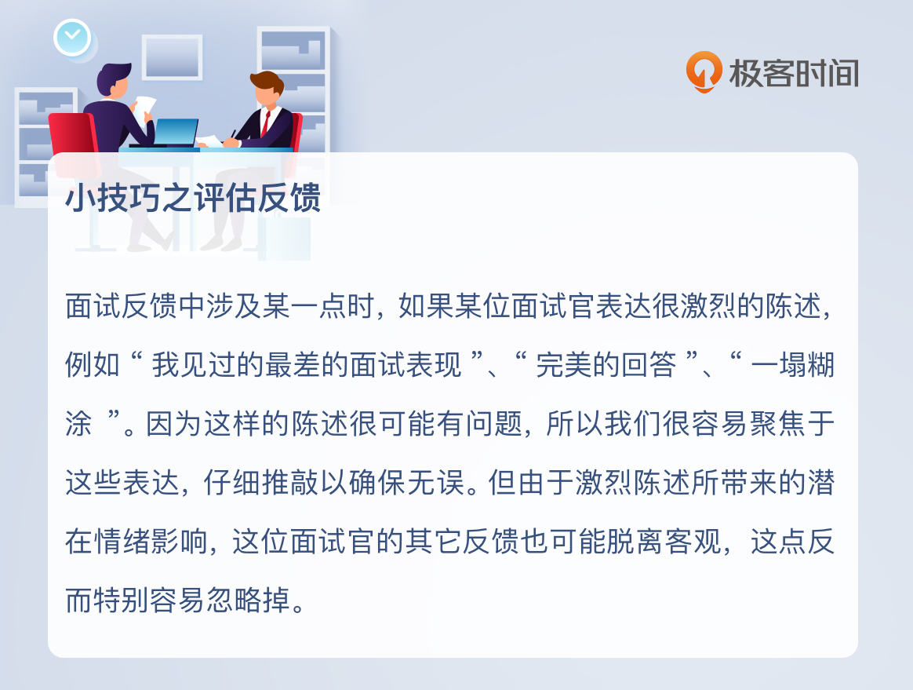
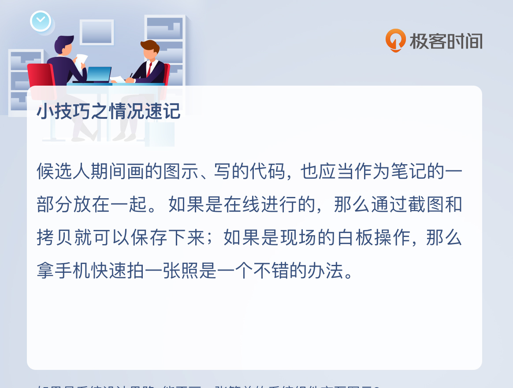
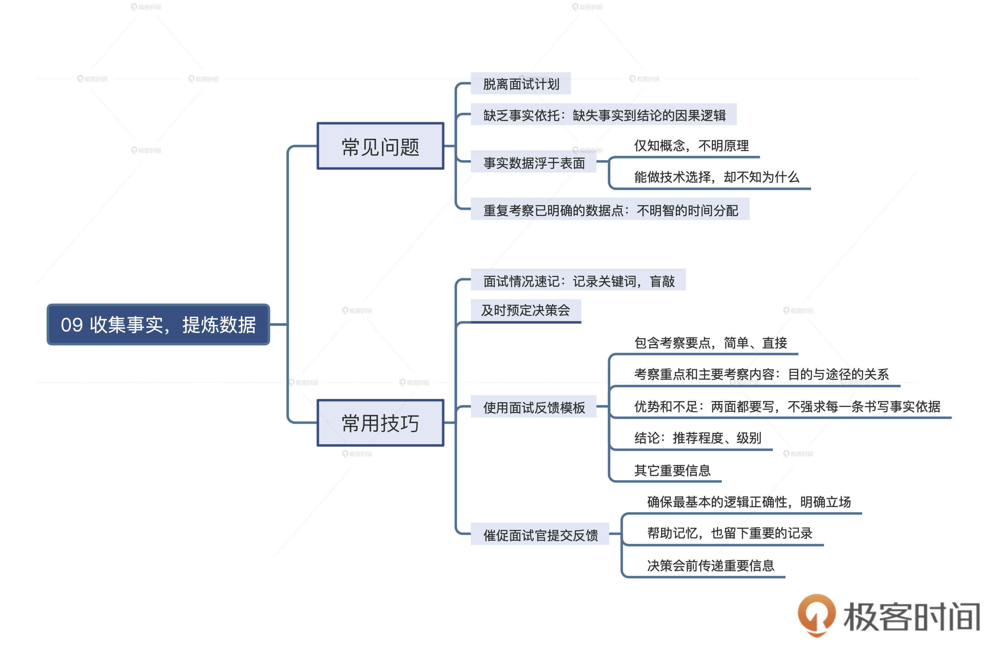

---
date: "2019-06-23"
---  
      
# 09 | 决策会准备：怎样全面收集事实，有效提炼数据？
你好，我是四火。

讲完了面试前的准备，讲完了面试时的把控，现在我们要讲到面试后的决策了。在决策会前，我们通常要求面试官准备好一份简短的面试反馈（feedback），这份反馈包含了面试官自己观察，以及对于候选人“推荐程度”的结论。

你我都知道，包括面试在内，凡是“考试”，最基本的原则就是要客观公正，可是事实上，每个人都难免戴着有色眼镜看世界，这跟我们总是期望着的客观公正背道而驰。

那么在这一讲，我来着重谈一谈，我们该怎样去收集事实、提炼数据，尽可能地少受情绪与主观臆断的影响，尽量保持客观公正，把这些采集到的信息真实地提供给决策会。因此，这里的关键就是，专注于具体的事实和考察数据，减少对模糊主观感受的依赖。

## 常见的误区

老规矩，我们先从反面来看看在数据采集和整理方面，都有哪些常见的误区。

### 脱离面试计划

还记得[第2讲](https://time.geekbang.org/column/article/360268)介绍的面试计划吗？没错，脱离面试计划，就是最常见的一个问题，有时候这个“脱离”，是面试官忽略了计划安排，而有时候甚至就是因为压根儿“没有”面试计划，在这种情况下，谈何“全面、客观”地评估呢？

面试计划的一大要点就是确定了每个面试官的考察重点，谁负责考察编码能力，谁负责考察对系统的理解，都分别确定了下来，因此对于一个面试，哪怕大家遵循了一个非常简单的面试计划，都要远远好于没有计划，或者是订立了计划却抛之脑后。

<!-- [[[read_end]]] -->

我们当然鼓励面试官自由发挥，但是自由发挥的底线是保证和安排的面试重点保持一致。这就像是做软件，如果没有遵循设计，甚至根本没有设计，哪怕代码写得再精致，很可能也是事与愿违，甚至南辕北辙。

### 缺乏事实依托

“专注于事实和数据”有时是一件并不容易做到的事情。我们都知道要摆事实、讲道理，通过实际的事实和数据来佐证我们的观点。但是在实际操作的时候，特别对于一些面试经验较浅的面试官而言，很容易被情绪或者是第一印象带着跑。

我来举一个真实的例子，有一位面试官在他的面试反馈里说，候选人“coding能力不足”，但是读完整个面试反馈也没有找到非常扎实的事实描述，来佐证他的判断。于是在debrief的时候，我就仔细追问了他给出这个观点的原因。

后来才知道，候选人的coding之所以表现不佳，是因为他走了一条错误的路线，但其实问题的根源是候选人没有能够沟通清楚和理解问题，而并非coding本身。再结合其他两位覆盖coding的面试官的反馈，我们得到的大致结论是，候选人的coding本身是没有问题的，基础知识也比较扎实，但是沟通等方面存在不小的问题。

### 事实数据浮于表面

这一点，指的是有时候我们觉得已经得到了考察数据，但是这样的数据不够深入，缺乏足够的说服力。比如说，知道概念，不知道原理；说得出选择什么技术来实现，却说不出为什么。有时候面试官缺乏过硬的技术基础，或者缺少一点往“具体”，甚至“细节”挖掘下去的动力，就很容易陷到这个坑里。

比方说，有位候选人对于一个分布式系统的大致理解谈论得还可以，在问到怎样做系统平滑扩容的时候，他也明确提到可以使用基于“一致性哈希”的技术，那好，“什么是一致性哈希呢？”，结果候选人听到这个问题就卡壳了。

其实对于面试官来说，多一个这样的追问并不难，而对于候选人来说，一致性哈希也可以说是分布式系统的一个基础知识，但这个快速追问就是一个向下探查的过程，很有意义。换言之，可能通过这样的提问来谈论自己的理解，加起来也就一分钟时间，这个过程很自然地发生了，但是却可以得到一个很有价值的考察数据。后来，我们发现，这位候选人对于系统的很多基础知识并不是真正理解。

类似地，在技术选型的讨论上也有这样的情况。例如说持久层的技术选择，有候选人说要使用NoSQL，那我们就可以要求澄清，“使用哪一种NoSQL存储技术呢？”，候选人说是HBase，紧接着进一步追问就可以抛出来“那为什么选择它呢？”。通过这样的方式，我们希望获得的数据，是候选人是否真正理解这些他自己说出来的概念和技术，还是只知道一个名词而已。

此外，需要小心的是，在技术方面，我们可以考察能力和基础，而不是考单纯的记忆力，更不是钻牛角尖。这在[第3讲](https://time.geekbang.org/column/article/361420)的“知识性的问题”部分我已经强调过了。

### 重复考察已明确的数据点

面试的时间是宝贵的，面试官都应当有“珍惜双方的时间”这样的意识，因此，我们对于已经非常明确的考察数据，不应该再去重复考察，而是应该把时间分配到其它的考察项上去。

我来举一个例子吧。候选人在算法部分，problem solving的部分表现得非常好，思路清晰，问题解决推进迅速，复杂度分析准确，但是代码却写得有些混乱，比如命名不一致，组织欠缺条理，重复代码多等等。

这时候，在编码后问follow-up问题的部分，我觉得面试官就可以先放一放对于problem solving的进一步考察了，而是可以问一下候选人，对于代码的组织和书写，有没有可以优化的地方呢？

这样做的目的就是，对于我们有疑虑的部分，又觉得考察程度还不够，可以给出提示，看看候选人能否改进他的“作品”，而对于他已经很明确的强项部分，我们已经有了足够的数据，就可以先放一放了。

## 可采用的技巧

好，说完了常见的问题，下面我们就从正面来讲一讲，除了上面提到的注意要点，还有哪些数据采集和整理的技巧。这些技巧的目的都是一致的，围绕预先规划好的考察重点，尽量客观地去评估候选人。

### 面试情况速记

速记，这是一个很有价值的技能，并且这个技能因人而异，需要不断练习。我的习惯是，对于面试过程中的沟通，基本上重要的信息，都会用几个单独的词记录下来，这些信息，自己能看懂就好，目的只有一个，就是能够帮助自己回忆。同时，在记录笔记的过程中，最好能大部分情况下盲敲键盘，这样，眼睛可以用来和候选人进行沟通，提供直接的眼神交流是很重要的。

### 及时预定决策会

决策会将是所有参与该候选人面试的面试官碰头的一个机会。一般来说，“及时”是要点，只要各自的面试反馈能够及时在会前整理，这个会议定的时间越早越好，因为越早大家脑海中的印象也越新鲜。

如果这个会议发生在面试的一周后，判断的准确性就要大打折扣了。在有的公司里，这个会一开始由招聘专员（Recruiter）制定，有的则是由招聘经理制定，这都可以，但是，我们要尽量保证每个面试官都参加。特殊情况下个别人无法参加的，需要提供一份比较详细的面试反馈。

### 使用面试反馈模板

在我看来，面试反馈模板的使用，是效果最强大的技巧了。一般来说，每一组面试的Bartender，可以在面试计划的时候，给出一个反馈模板，要求大家都按照模板上的格式来提供反馈意见。模板的要求很简单，就两点：

1.  保证包含面试考察最关心的点；
2.  模板要简单、直接（越简单、直接，可操作性就越强）。

下面这个模板的例子供你参考：

> 考察重点：  
> 主要考察内容：  
> 优势：  
> 不足 / 担忧：  
> 结论：  
> 其它重要信息：

好，我来逐条讲一下。

**首先是反馈模板的第一部分：考察重点和主要考察内容。**它们各一句话，这些都要和[第2讲](https://time.geekbang.org/column/article/360268)的面试计划一致。如果你忘了，请回看。比如说，考察重点是：

> 实际问题的解决，代码设计和实现，面向对象设计

这就要求这一轮面试的反馈，要包含对上述考察项的评估意见。通过模板的方式再一次明确这一点，从而保证面试过程有着明确的目的，而不是漫无边际地谈论。

接着的主要考察内容，也是来自于面试计划，也就一句话，比方说：

> 要求设计一个电梯系统，设计其中的主要类和方法。

要不要详细说明具体是怎样定义的，划定了哪些具体需求点，又是怎样实现的？我的建议是：不要求。如同上面所说，模板要尽量保持简单、直接，要求越多就越难以实施。

但是不知道你注意到没有，各一句话，**考察重点是目的，考察内容是途径**——通过这两句话，就可以大致了解，这一轮面试，通过怎样的途径，主要要考察候选人的哪些方面。

**其次，反馈模板第二部分，优势和不足。**这两个部分，我想谈这样两个操作要点：

第一，优势和不足都要写到，如果面试官只看到了一面，也就是只看到了好的一面，或者是差的一面，这样的反馈是不合格的。因为这样的观察说明是不客观的，或者是不深入的。

第二，写出观点的时候必须要写事实论据吗？需要，但是我们不强求每一条观点都写论据。比如这样的例子：

> 编码能力不够扎实，花了很长时间才把一个BFS逻辑的基本结构写出来。

这就是一个合格的表述，但是据我观察，大多数人在反馈中，总会有部分观点是不写事实论据的，有时甚至连描述性的语句也没有。但只要在整个反馈中占比是属于少数的，这就没有关系，遇到这种情况，我们可以在决策会的时候再要求该面试官说明即可。

**再次，是反馈模板的第三部分：结论。**怎样写结论？这包括两个部分：

1.推荐程度  
2.级别

“推荐程度”，指的是根据该轮表现，面试官认为候选人是否能通过面试，成为团队的一员。有的公司要求填写Hire / Weak Hire / Weak No Hire / No Hire，有的公司要求填写强烈推荐/推荐/不推荐/强烈不推荐，还有的公司干脆要求打1\~5分，但它们原理都是类似的。

“级别”，顾名思义，根据该轮面试官对于候选人的综合评估，如果结论是正面的，那么该结论是基于哪个级别得出的。如果不提及级别，那么就以面试计划中设定的默认级别为准。

有些时候，有的面试官会给出一个简单的“条件表述”，也是可以的。比如：

> 综合表现尚可，但对于coding有所疑虑，如果其它轮次coding没问题的话，我给出“Weak Hire”，否则“No Hire”。

**最后，是“其他重要信息”，但这是一个选填内容。**通常这部分都是留白的，但是有些特殊情况需要和整个面试团队交代，比方说，我经历过的一个例子，有位面试官发现候选人作弊，具体来说就是线上面试，一遍用语言应付，一遍在互联网上搜索问题的答案。这就是一个非常重要的信息，对这一类“道德品行”的问题该怎样看待，我们在后续会谈到。

此外，如果有候选人的绘图、代码片段等你认为有必要陈列的，可以一并附在反馈中。

### 催促面试官提交反馈

上面我讲了一个我推荐的面试反馈模板的例子。那么，这个反馈写好了发给谁呢？一般来说，不要发给面试团队全员，而是只发给Bartender（技术负责人，我们在[第2讲](https://time.geekbang.org/column/article/360268)介绍过，如果忘记了请回看）和招聘经理就好了。

按理说，反馈写得越及时，面试过去的时间越短，效果就越好。如果面试已经过去一天了，或者是决策会快要开始了，而有的面试官还没有提交反馈，那么Bartender就需要催促面试官把反馈提交上来（当然，有时候这个角色是招聘经理负责的）。

好，接下来，我想讲一讲为什么把面试反馈写下来那么重要。

**首先，面试反馈确保最基本的逻辑正确性，明确立场。**作为一个面试官，我这一轮关注的重点是什么，我做了什么操作来考察候选人，候选人有哪些好与不好的表现，分别支持我的哪些判断，而最后又是一个怎样的结论。

这些内容，说起来都是很简单的逻辑，但是只有把它们写下来，有因有果，才算真正梳理清楚了。尤其对于“纠结症患者”，逻辑清楚非常重要，这样在激烈的决策会讨论中，对于自己的观察，有着明确的立场，不会轻易摇摆。从这个角度说，其实，面试反馈写下来这个过程，要比面试反馈本身的内容，重要得多。

**其次，面试反馈帮助记忆，也留下重要的记录。**如果你做过面试官，你也许会有这样的体会，完成了一轮面试，感觉有很多话要说，但是过了一天之后，忘记了一半，剩下的部分，再过一天，又忘记了剩下的一半。但是面试反馈可以帮助你把最重要的部分记录下来，在debrief的时候帮助回忆。

有些时候，面试的决策不容易做出，在极端情况下甚至需要有其它人参与进来，回看面试的情况（我们在后两讲会谈到，如果面试团队自己无法达成一致怎么办），那么这些面试反馈就是很有价值的文字记录了。

**最后，这些反馈可以帮助Bartender和招聘经理在决策会前留意到一些重要信息。**比如前文中提到的一些反映严重道德品行问题的事情，这样的信息在后面决策会的时候可以优先拿出来确认。

## 总结与思考

今天，我介绍了在面试中收集数据和记录事实信息的误区，以及可以采用的正确的技巧，并且介绍了在面试后如何根据它们总结成客观、有效的反馈。

希望这些内容对你有所帮助，但是我要强调的一点是，要保持独立思考的习惯，所有的这些对候选人的评价，要独立进行，在决策会开始以前，不要去和任何别的面试官讨论面试的事情，以免影响自己的判断。

在本文的最后，我想留一个问题供大家讨论。动员面试官写反馈的一个常见困难是，对方说“太忙，没时间”，对此，你怎么看？

好，我是四火，我们下一讲见！