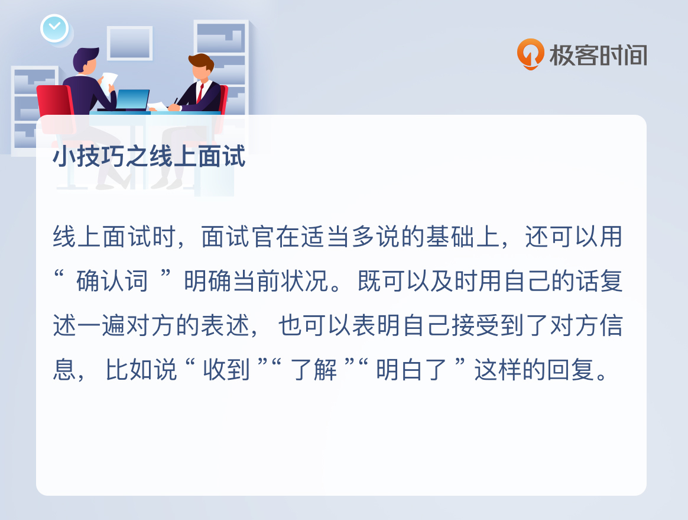
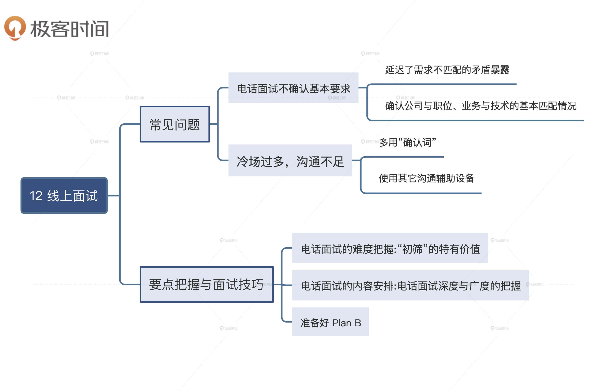

---
date: "2019-06-23"
---  
      
# 12 | 线上面试：隔屏对话，交流依然畅通
你好，我是四火。

这是我们场景再现部分的第一篇，我想和你聊一聊线上面试。

线上面试，是指候选人和面试官双方不实际见面，而是通过电话、网络等形式“虚拟”地面对面交谈，最终完成面试。

通常来说，电话面试就是线上面试最典型的情形，而在当前的疫情大背景下，许多本该面对面进行的现场面试，也移到了线上。

这一讲，我将从三个部分谈论线上面试：首先是常见问题，我会介绍几个因为面试操作移到线上而导致的常见问题，接着明确线上面试和常规线下面试相比，需要把握的要点，以及一些具体操作方面的技巧，希望这些内容对你有所帮助。

## 常见问题

### 电话面试不确认基本要求

在[第2讲](https://time.geekbang.org/column/article/360268)的时候，我讲了这样一个例子：

> 走完了整个面试，候选人拿到 offer 的时候说：“啊，我不知道这个职位还需要我长期出差办公啊？我不能接受出差办公。”

还有类似的例子，比方说，有不少候选人对于自己的职业生涯有明确的规划，而对于自己在技术或业务方面的选择也非常清晰。

有的说“我不做前端”，有的说“想进入‘大数据’团队”，还有的说“希望从事和分布式系统有关的工作”。可是，有很多时候，候选人直到进入了现场面试，甚至通过了面试，都没有人和他们确认这些最基本的需求。

显然，这样的面试流程是有问题的，那问题出在哪里呢？

<!-- [[[read_end]]] -->

我们知道，所有的职位都是有“基本情况”的，而所有的候选人也其实都是有“基本要求”的，但是他们往往不会明说。

等到职位的基本情况和人的基本要求不符，矛盾总有一天会暴露，那时面试团队也好，公司也好，都要被迫承担浪费时间、浪费资源的损失，甚至还会大大影响团队建设。

也许是offer发放了，但是候选人拒绝了；也可能候选人入职了，但是因为这样的原因不顺心，不能发挥所长，甚至还会早早离职。

那么，这样的信息到底包括哪些内容，又应该在什么时候确认呢？

我认为，基本要求是不是匹配，需要问清楚两个方面的问题：

* **公司和职位的基础信息**，比如说，工作地点在哪里，是不是需要出差等等，看候选人是不是能够接受；
* **业务和技术的基础信息**，包括团队是做哪方面的产品或项目的，如果候选人加入团队，那么他会承担怎样的角色。

通常来说，一些非技术和业务方面的基础信息，一般招聘专员（recruiter）一开始就应该和候选人聊清楚了，如果候选人不接受，那么后面的面试就不应该安排下来。

还有一些具体信息，招聘的同事不一定懂，但是负责电话面试的面试官必须要清楚，并且要在电话面试的环节就要和候选人明确下来。

因此，这里的分工合作非常重要。一般说来，在电话面试中，有一轮是团队的经理去负责的，原因之一就是经理往往是团队中对这两个问题最清楚的人。

### 冷场过多，沟通不足

在[第5讲](https://time.geekbang.org/column/article/363067)的时候，我们谈到了面试礼节的重要性，不知道你是否记得，其中一条就是要做简单的自我介绍，哪怕再简单，它也是面试互动中必不可少的环节。

尤其在线上面试时，其实双方很容易会因为缺乏语言交流，干扰整个面试氛围，有时甚至会陷入一种尴尬的境地。

如果面对面交流，哪怕语言交流不充分，大家还可以用其他方法弥补，可能一个眼神、一个点头就能表达相当丰富的信息了。但到了线上，交流更依赖语言这个形式，所以语言沟通不充分带来的影响就被放大了。

当然，我还想提醒你，线上面试确实更依赖于语言，但我们也还是有其它沟通方式的。比方说，我们曾经讲到过，远程沟通的时候，摄像头请尽量打开，面对面的沟通会让彼此距离拉近很多。

如果考虑到网络带宽受限等因素，必须关闭摄像头，那也请和候选人说清楚。而且，我们还有一些在线编辑工具，通过这些工具，候选人和面试官都可以看到彼此输入的文字，甚至绘制的简单图像。

我知道面试官都清楚用它们可以考察代码，但是其实作为常规沟通套路的辅助工具，它们依然很有价值。

## 要点把握与面试技巧

好，分析完常见问题，我们从正面谈一谈线上面试的一些常见操作要点，以及相应的面试技巧。

### 电话面试难度把握的原则

对于电话面试的难度，我的建议是更重视广度覆盖，把基本情况了解清楚，把基本问题排查清楚。

至于技术深度，我反而认为是第二位的。这里面的逻辑是，**我们要优先考虑电话面试带来的特有价值，它最大的价值其实就是两个字——“初筛”。**

为什么需要初筛？这里我们不妨简单估算一下成本。

比方说，电话面试两轮 + 现场面试5轮，加上决策会，面试前后的联系、沟通、反馈等等时间和人力开销，加起来就相当于工程师一天的工作时间。再加上其他人员、培训、宣传、差旅、招聘渠道合作等等费用，可以说成本相当巨大。

以下数字来自我自己的经历，而非官方数据，但你也会有个大体感受：电话面试的通过率大概在一半左右，在此之后我们还要考虑现场面试的通过率（大概在1/3左右），以及发了offer后候选人接受的比例（每家企业差异较大，这里按1/3估算），粗略估算一下，整体的offer接受比例就只有 1/2 x 1/3 x 1/3 = 1/18。

可以看出，仅从综合费用的角度考虑，招聘成本也是非常高的。

所以，在电话面试中，我们要达到这个初筛的目的。通过电话面试这样成本相对较低的流程，留下基本素质合格、基本要求符合，且有一定希望通过现场面试的候选人，而这，也正是电话面试难度把握的原则。

至于候选人全面和有深度的考察和评估，就放到之后的现场面试去完成。这样，在电话面试之后的大量流程成本，就能节省下来了。

另外，这些年来我还发现一个有意思的现象，和你分享一下。有时候和候选人沟通的“第一棒”——recruiter，甚至也会问一点技术问题探底了。比方说，我所认识的一位recruiter朋友，就会在第一次和某些候选人沟通的时候，问候选人这样的问题：

> 进程和线程的区别是什么？

这其实是属于很常见的问题，当然，他是懂一点，但毕竟不是软件工程师，也直言只是想“听听回答是不是靠谱”。但是通过这样的方式，可以过滤掉那些明显不合格的候选人，这样，连电话面试的流程成本都可以省下来。

### 电话面试的内容安排

既然我们已经提到了电话面试的最大价值就是“初筛”，那么具体我们该怎样安排电话面试的考察内容呢？

电话面试一般安排较为简洁，招聘经理和某位工程师一碰头，双方各自过一下对方简历和recruiter留下的重要信息，就可以参与电话面试了。电话面试之后，双方也一碰头，确定要不要继续下一步的现场面试。

电话面试有一轮的，也有两轮的，两种情况都不少。

对于一轮的情况，一般由具备技术背景的经理主持，既要考察一些较为简单的技术问题，也要通过询问尽量了解对方的基础信息。

如果是两轮，那一般其中一轮由工程师完成，主要考察技术和业务背景，而把其它方面的考察，留给另一轮的经理。

关于技术考察，有个细节值得一说——要不要在电话面试考察编码呢？

我的建议是，**只要时间安排能够满足，就尽量覆盖编码考察。**我们已经强调过，对于软件工程师来说，编码能力是硬能力，如果连基本的编码能力都不具备，就没有继续这个面试流程的必要了。

当然，电话面试时间往往较短，一个简单的算法问题，或者写一段简单的代码逻辑，就可以了，我们不要在电话面试中，像[第6讲](https://time.geekbang.org/column/article/363972)一样去层层递进，完整地覆盖问题分析、讨论、解决的考察链。

说了那么多，我来举一个具体的电话面试安排的实例吧。

候选人小王是一名软件工程师，他研究生毕业后工作3年了，第一年做的是软件测试工作，而后转为开发。他面试的岗位是一家互联网公司的某后端软件工程师岗位，电话面试一共包括了两轮：

* 第一轮的面试官由一位团队经理担任，在寒暄之后，他和候选人顺着简历的内容，讨论了他的背景和工作经历，包括他对下一份工作的期望；之后，他向候选人介绍了职位、工作地点、工作内容，使用的技术和流程，以及团队的文化氛围等基本情况，并向小王了解了他的想法；最后，在提问时间他回答了不少小王关心的问题。
* 第二轮的面试由该经理团队中的一名软件工程师担任，他们花了大约二十分钟时间讨论了小王最近在做的一个项目，候选人都负责了哪些部分，系统的架构是怎样的，主要用到了哪些技术；之后面试官和小王一起讨论了二叉树几种遍历的形式，小王也写了一段递归的二叉树遍历代码。

在电话面试之后，两位面试官聊了一下。

主导第一轮电话面试的团队经理表示，候选人小王对于这个职位有明确的意向，背景经验符合要求，性格和沟通等方面也没有什么问题；而主导第二轮电话面试的软件工程师表示，候选人小王对业务和技术的理解均衡，有一定的经验积累，而且对做过的项目和系统有清楚的理解，他写的代码逻辑虽然简单，但是可以看出具备合格的算法和数据结构功底。

于是，小王就通过了电话面试，准备进入下一轮的现场面试。

最后，我想额外提一下，某些企业，满足一定条件的情况下，甚至允许候选人跳过（直接通过）电话面试，而直接进入现场面试的环节。有这样两种情况比较常见。

第一种情况，对于重要岗位员工“强烈推荐”的候选人，这背后的逻辑是企业和团队对于自己员工“眼光”的高度信任。

第二种情况是，该候选人是“旧人”，曾经在这里工作过，或是在冷冻期（一般大厂都会设立一个招聘冷冻期，比方说，候选人在面试后的半年内，不可以申请相同类型的职位）之前曾经面试过，属于二次求职，而他的历史数据显示，他在曾经的面试表现不错。

当然，**无论是哪一种情况，如果电话面试选择跳过，那么我们通常也要求招聘经理和候选人至少电话沟通一次，以了解、更新一些基本信息，确认一下双方的需求。**

### 准备好Plan B

无论是电话面试，还是移到线上进行的现场面试，我们都要有 Plan B。这里的 Plan B 指的是，在线上面试遇到阻碍的时候，要有基本的替代方案。

最常见的情况是，网络不佳，声音断断续续，这很影响面试沟通交流。

在一些成熟的面试团队中，负责一开始接洽候选人的recruiter，就会提示候选人准备好面试当天的设备条件。但是，谁也没有办法避免突然出现的网络状况，无论是彻底掉线还是视频或音频卡顿。

对于这样的情况，我们要有准备。例如，在网络不好时，我们可以关闭视频信号，甚至，可以将线上会议改为使用手机通话来进行，当然，在线编辑（包括编码）的工具的使用可以保留，一方面这样的工具对网络条件的要求低，另一方面，我们确实也没有更好的替代工具，可以在离线状况下考察编码能力。如果条件过于恶劣，我们只能考虑改天再继续面试。

## 总结与思考

今天我先介绍了两个线上面试的常见问题，然后分享了线上面试，特别是电话面试中的一些要点，以及该怎样具体把握。

总的来说，线上面试在很多方面都有所限制，不能像面对面的现场面试那样沟通自然、直接，但在固定的电话面试环节，以及如今“后疫情”的大背景下，线上面试已经从一个选择，变成了唯一的选项。

因此，希望你能很好地掌握这些技巧，逐渐积累经验，真正驾驭好它。

在文章的最后，我想给你提一个问题。你能否在留言区，分享一下你经历过的电话面试呢？无论是作为候选人，还是面试官。

好，我是四火，我们下一讲见。