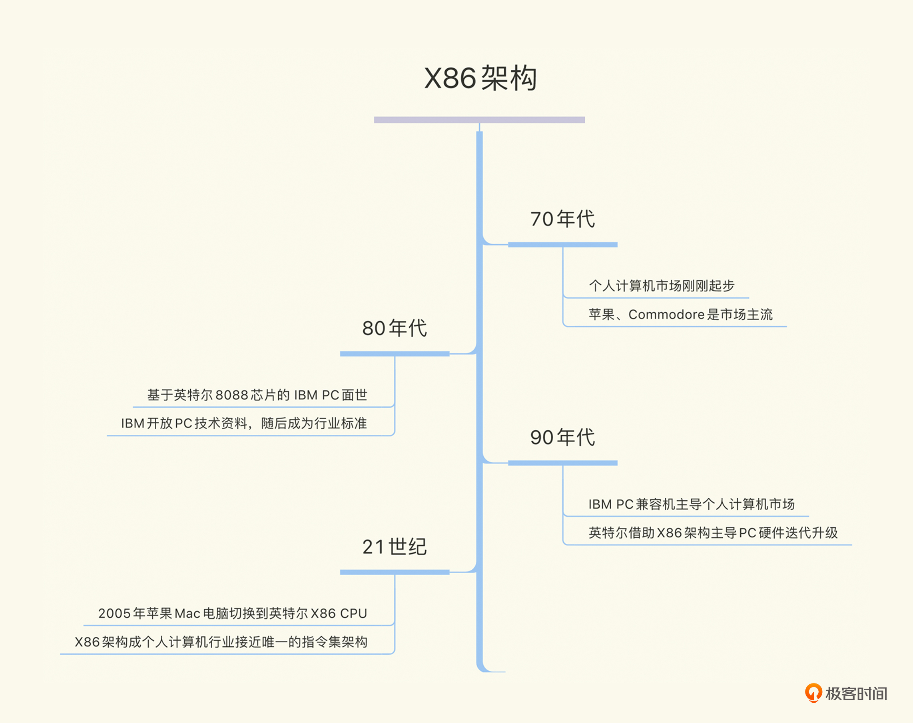
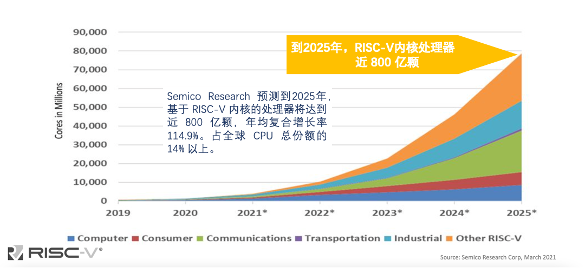
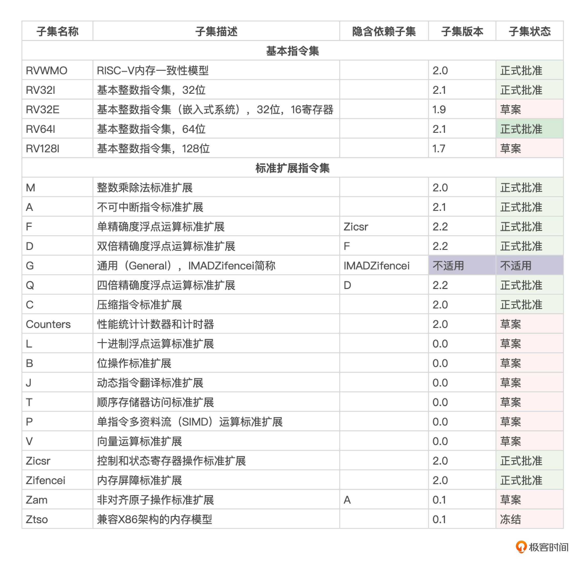
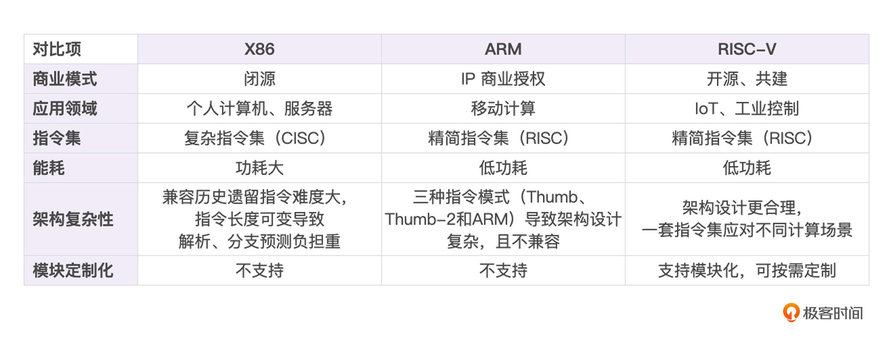

---
date: "2019-06-23"
---  
      
# 引子｜RISC-V：物联网领域值得关注的芯片趋势是什么？
你好，我是郭朝斌。

时隔一年多，我选择再次更新我们的物联网专栏，这里有两个因素在驱动我。

一是，当初在创作这个专栏时，我就希望把它作为一个与你交流的窗口，能够围绕物联网行业持续分享所知所想，为推动行业的发展尽自己的一点绵薄之力。

二是，最近我关注到芯片领域的一些新变化，例如英伟达收购 ARM 以失败告终，例如英特尔以最高级别会员的身份加入 RISC-V 基金会。而芯片是物联网设备层的关键组件，**芯片领域的任何发展和变化都会深刻影响到物联网行业。**

那么，我们的更新就从芯片领域的具体变化开始说起吧。

## RISC-V 正在快速崛起

芯片领域的变化具体是什么呢？

正是 RISC-V 架构在快速崛起，并且大有与 X86架构（包括X86和X86-64）、ARM 架构形成三足鼎立格局的势头。

X86、ARM你应该比较熟悉，一个是借助“Wintel联盟”（指微软和英特尔两家公司）在PC电脑行业称霸的CPU芯片架构，背后是以英特尔、AMD为首的少数几家公司；另一个是移动智能手机上主处理芯片的内核架构，背后是提供ARM架构的芯片内核IP的ARM公司，和像高通、三星这样通过授权使用ARM内核IP设计开发SoC（System on Chip）芯片的芯片厂商。

<!-- [[[read_end]]] -->

那 RISC-V 又是什么来历呢？我们一起来了解一下。

### RISC-V的历史

RISC-V是一套开放、开源的通用指令集架构（Instruction Set Architecture，缩写ISA）。其开始于2010年加州大学伯克利分校，当时，并行计算实验室的 Krste Asanovic 教授及其团队需要选择一种指令集架构来使用，但是考虑到商用授权费用太高，后期修改扩展不方便等问题，他们重新设计了一套基于精简指令集计算（RISC）的 ISA，取名 RISC-V。

小提示：这里的 V 是数字5的拉丁文表示，因此读作 five。隔壁邵巍老师的[《说透芯片》](https://time.geekbang.org/column/intro/100079201)专栏中也有RISC-V的相关介绍，你也可以扩展阅读一下。

RISC-V ISA 真正获得快速发展始于2015年。那一年，三位RISC-V发明者，Krste教授和他的两位学生创办了SiFive芯片公司。同时，SiFive公司联合以谷歌为首的几家公司，创立了RISC-V基金会。

### 渐趋完善的 RISC-V 生态

不得不说，这种以基金会形式来推动 RISC-V 发展的方式，是充分地借鉴了 Android 的发展路线的。现在，已经有70多个国家的2400多个组织加入了基金会。其中，既有芯片 IP 设计公司，又有芯片制造工厂；既有各种应用领域的芯片供应商，又有开发工具链等软件企业。

这些组织已经形成一个围绕着 RISC-V 的、完整而强大的生态。而正是这样的生态，推动着RISC-V不断向前发展。那么，为什么产业生态对于 RISC-V 这么重要呢？

其实，产业生态对任何芯片指令集架构都很重要。以X86的发展为例，我们可以先看一下**整机和配件厂家对硬件技术提升的推动。**

在上世纪70年代，个人计算机发展的初期，CPU 的指令集架构种类是多种多样的，占据领先地位的是 Commodore 和苹果等公司的产品。到80年代，随着 IBM 公开基于英特尔X86芯片设计的 IBM PC 的整个技术资料，各种兼容机开始出现，而IBM PC成为事实上的行业标准。上世纪90年代初，个人计算机市场上仅剩下了 IBM PC兼容机和苹果的Macintosh电脑两个主要系列，而 IBM PC兼容机处于绝对的市场主导地位。到2005年，乔布斯宣布将Macintosh电脑的中央处理器也切换到英特尔提供的X86芯片。

在这个过程中，英特尔凭借着80286、80386、80486和奔腾（Pentium）等一系列产品，成为了 PC 计算机中中央处理器（CPU）的绝对标准。同时，它也逐渐开始替代 IBM 主导 PC 硬件的迭代升级。

你会发现，正是这些整机和配件厂家，它们一起推动了X86的迭代发展，成就了 PC 行业的繁荣。客观上，它们也保证英特尔赚取了PC硬件的大部分利润。

**同时，硬件的技术提升和创新更是离不开软件的支持。**英特尔与微软的密切合作形成的强大的协同效应，也促成了被称为“Wintel联盟”的 PC 行业“双寡头垄断”的格局。还有MMX、SSE这些旨在增强图形图像和音视频处理性能的新增指令，如果没有编译器的支持，没有2D/3D算法库、音视频算法库的适配，没有游戏等应用软件的使用，这些指令集就无法发挥作用，也就不能形成产品的竞争力。

回到我们在开始讲到的RISC-V生态，你会发现，在整个生态的共同努力下，RISC-V 已经不仅仅是高校实验室或者研究机构的教学、实验工具，而且在产业界也获得了越来越大的影响力。

### RISC-V 的实际成绩

对于开发者来说，工具链是使用芯片必不可少的基础，而且因为每种指令集的具体编码和编程模型并不相同，每种指令集都需要一套适配自己的工具链。目前，开源软件，如编译工具GCC、LLVM，调试工具GDB、OpenOCD，模拟器QEMU，还有商用软件，如嵌入式领域流行的集成开发环境 IAR ，调试器 SEGGER、Lauterbach（劳特巴赫）等都已经支持 RISC-V。

其他软件生态方面，如主流高级开发语言C、C++、Golang，操作系统Linux，各种嵌入式系统常用的RTOS系统内核也都适配RISC-V芯片架构。

或者，我们也可以具体到芯片产品来看RISC-V的影响力。例如，国内的阿里平头哥是一家RISC-V芯片IP设计公司，目前已经有超过百家使用授权公司。最近，其[宣布](https://www.icspec.com/news/article-details/1734929?type=prefecture)截至2021年10月，RISC-V内核的芯片出货量已经达到25亿颗。除此之外，中国台湾的晶心科技（Andes Technology）是中国台湾一家提倡自主芯片设计的公司。[据报道](https://cn.design-reuse.com/news/51560/andes-10-billion-cumulative-shipments.html)，它从2017年全面投入RISC-V架构以来，芯片出货量年化增长率有50\%，截止2021年底已经有100亿颗的 RISC-V IP 出货量。

据 Semico Research 研究机构测算，到2025年，RISC-V内核芯片将达近800亿颗，成为一股继X86和ARM架构之后，不可小觑的指令集架构。

其实，这也是英特尔在2022年2月宣布加入RISC-V基金会的行业背景。

随着移动智能手机的发展，英特尔承受着来自 ARM 巨大的竞争压力。所以，英特尔希望扶持 RISC-V 的发展，一方面可以通过 RISC-V 的应用扩展，与ARM竞争，抢占ARM的应用领域和市场份额，另一方面可以在 RISC-V 的发展过程中，主导发展路线，推动自己的芯片代工业务的发展。这就像三国魏蜀吴相争，诸葛亮倡导的联吴抗魏策略一样。当然，这也充分说明了RISC-V的行业地位和发展前景。

## 为什么是 RISC-V \?

到这里，你应该已经了解RISC-V的崛起过程和预期前景了。但是，“打铁还需自身硬”，RISC-V是不是担得起大家给它的这份期待呢？我从技术角度给你分析一下。

### 新生代没有历史包袱

RISC-V 指令集项目发起于2010年，相比于 X86 和 ARM 架构，它绝对算是新生代。

借助于后发优势，RISC-V 在设计上吸收了历史上各种指令集的经验，规避了很多前人踩过的坑。它没有X86 和 ARM那样沉重的历史包袱，具有的是初生的生命力和活力。一个直观的对比就是[指令集文档](https://riscv.org/technical/specifications)，RISC-V 最新发布的[指令集文档](https://github.com/riscv/riscv-isa-manual/releases/download/Ratified-IMAFDQC/riscv-spec-20191213.pdf)篇幅只是238页，另一个[特权架构文档](https://github.com/riscv/riscv-isa-manual/releases/download/Priv-v1.12/riscv-privileged-20211203.pdf)仅有155页，作为对比 ARM 指令集文档有数千页。

当然，这带来的不仅是**芯片设计人员的学习成本降低**，RISC-V在指令集上的简洁设计也**降低了芯片的设计复杂度和芯片尺寸，进而压缩了研发和生产成本。**这迎合了物联网行业在设备端、边缘侧场景中对于低成本、低能耗的需求。

### 模块化迎合芯片DSA发展趋势

另一方面，我整理了一份最新的 RISC-V 指令集架构模块信息，如下面表格所示。

你可以很直观地看到， RISC-V 指令集是使用模块化的方式定义的。因此，芯片设计人员可以根据具体场景来选择组合。除了基本的整数指令子集要求强制实现外，其他模块都可以自由选择。

其中，根据不同的地址空间位数和寄存器个数，基本的整数指令子集有 4 种选择。芯片设计人员一般会根据性能、功耗和成本等因素来决策。比如，字母E表示 RISC-V专门为嵌入式提供的指令集架构（见表格内第三行数据）。这个架构对指令进行了精简，以减少芯片的面积和功耗，这对于嵌入式应用场景非常必要。

可以说，随着AI、IoT等新计算场景出现，现在的算力需求有向多样化、定制化（DSA，Domain-Specific Architectures的缩写）发展的趋势，而RISC-V指令集的模块化特点正好可以适应物联网、MCU、边缘计算、AI加速器等领域的芯片需求。

### 开源模式优势

最后不得不提的是，X86架构是一种完全封闭的指令架构，而 ARM 架构虽然开放，但是芯片设计公司需要支付昂贵的 IP 授权费用。至于RISC-V指令集架构，则从一开始就采用了开源的模式。

这样，任何企业、研究机构和个人都可以围绕RISC-V来研究开发，丰富 RISC-V 的软硬件生态，并且推动架构的不断进化。

### 中立开放

除了技术上的优势，RISC-V 的成功也有产业发展、国际竞争格局等因素的助推。

RISC-V虽然起源于美国的加州大学伯克利分校，但是RISC-V基金会一直倡导构建开源、开放计算生态的理念。随着国际形势的发展，RISC-V基金会甚至把总部转移到了国际上传统的中立国——瑞士，来避免国际政治的影响。

这为美国以外的，渴望掌握芯片自主权的国家提供了信心和机会。欧洲、日本、印度等国家都在推动RISC-V在本国、本地区的发展。印度甚至将其作为国家指令集架构。

不管公司还是国家，基于不同的需求，都共同选择了 RISC-V，推动了 RISC-V 的快速崛起。我相信，未来基于 RISC-V 架构的MCU等芯片将会越来越多，作为物联网行业从业者，你我如果可以尽早接触 RISC-V 生态，熟悉相关工具链，了解各种代码库，“踩足够多的坑”，那对于将来的工作和发展都会大有裨益。

## 你可以学到什么？

正是基于RISC-V这样的发展背景，接下来，我会基于平头哥的 RVB2601开发板，把之前“实战篇”中的[智能灯](http://time.geekbang.org/column/article/322528)、[自动浇花器](http://time.geekbang.org/column/article/326153)实验重新做一遍。

为什么我会选择RVB2601开发板呢？

一是，因为平头哥提供了相对完善的 RISC-V 工具链，这样便于你顺利地上手实验。二是，平头哥有多种技术支持渠道可以选择。除了访问[平头哥开发者社区](https://occ.t-head.cn)，你还可以加入社区交流钉钉群，通过提交在线工单或者直接交流获取帮助。三是，RVB2601开发板兼容 Arduino 的扩展接口，你可以复用前期实验中的传感器、继电器等外围器件。

### RISC-V 实验课程安排

那么，我们接下来具体的更新课程安排是什么呢？

> 首先，我会带你熟悉RISC-V开发环境，并使用C语言开发智能电灯。  
> 接着，我会讲解通过MQTT协议实现联网控制。  
> 然后，我会讲解RVB2601开发板的蓝牙开发，实现光照传感器。  
> 最后，我会讲解RVB2601开发板的 OLED 屏幕开发，实现带屏幕显示的浇花器。

整体的课程分为4节，你会发现，它们仍然是遵循“实战篇”的内容节奏一步步展开的。不过，我们将会基于 RISC-V 芯片架构的 RVB2601 开发板和 C 语言来完成动手实践。

在这个过程中，你可以获得：

1.  熟悉 RISC-V 通用指令集架构。

2.  掌握一种 RISC-V 工具链。虽然我们使用IDE集成开发环境，但是背后其实是一套交叉编译和调试程序，你可以在掌握 IDE使用的基础上，去了解学习编译工具 GCC+LLVM 等。

3.  学习基于 C 语言的嵌入式开发。之前的课程是基于Python，当时我是为了降低上手门槛，现在使用 C 语言更加符合实际工作中主流的嵌入式开发方式，实践编写代码、交叉编译、烧录固件和调试的全流程。

4.  对比 C 语言和 Python 语言开发的不同。有人说过，掌握一门外语才能更好地理解母语。编程语言的学习也是这样，只有通过不同语言的对比，你才能更好地掌握编程开发。

最后，这次的加餐会以一周一次的频率更新，和今天一样，在每周三的零点准时和你相见。希望这样的慢节奏更新，能够让你有更充裕的时间来动手实践，来交流碰撞。看过听过不是我们学习的目的，真正把知识掌握好才是最终的目标。

## 写在最后

今天，我讲到了RISC-V架构的发展趋势，还有RISC-V的技术优势。

考虑到RISC-V对物联网行业的影响，我规划了这次扩展内容，希望对你的实际工作有一定的帮助。你也可以在评论区谈谈你对这次扩展内容的看法，或者分享一下曾经与 RISC-V 相关的工作经历。

期待在下一讲与你再次交流，我将带你完成基于 RISC-V 芯片的智能灯开发。