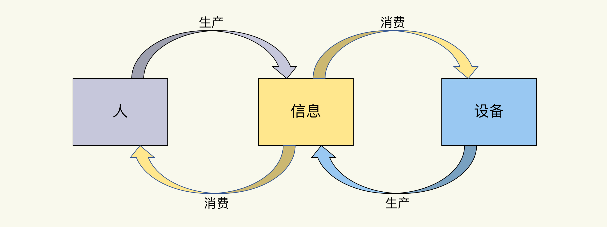

---
date: "2019-06-23"
---  
      
# 01 | 入门介绍：如何定义物联网？
你好，我是郭朝斌。

在课程的第一讲，我想跟你讨论一个入门级的问题：怎么定义物联网呢？

看到这个问题，你肯定希望我直接给你一个一针见血的定义，帮你打通认识物联网的任督二脉。

但是我跟你说实话，定义物联网真的不是一件容易的事情。因为物联网行业是一个新兴行业，它的内涵和外延都在发展变化的过程当中。今天是智能家居、智慧城市，明天是车联网、边缘计算，未来还会有更多……新的应用和新的理念还在源源不断地出现。

那么，我们还有办法讲清楚物联网这个概念吗？别着急，我想请你先思考一个问题，说到物联网，你会想到哪些关键词呢？是不是包括这些：**互联网，传感器，5G，云计算，MQTT，大数据，人工智能，智能家居**……

其实，只要你搞清楚它们跟物联网的关系，也就知道物联网到底是怎么一回事儿了。

## 1\. 物联网和互联网有什么关系？

我先来说说物联网和互联网的关系，因为很多人都对这两个概念“傻傻分不清楚”。

有人说，物联网和互联网没有区别，手机也是一个物品，所以移动互联网就是一个物联网。

这种说法并不准确，因为他没有看到手机的本质。

手机本质上是一个移动化的电脑设备：

* 电脑的鼠标点击，变成了手机的手指触摸；
* 电脑的实体键盘，变成了手机上的虚拟按键；
* 电脑联网要用Wi-Fi或网线，手机也可以用Wi-Fi，但舍弃了网线，支持移动蜂窝网络；
* 电脑的摄像头、音箱、麦克风，集成到手机上时都进行了小型化……

<!-- [[[read_end]]] -->

这也是为什么主导手机行业发展的企业，和主导电脑行业发展的企业一样，仍然是操作系统厂商和芯片厂商。谷歌就相当于微软，高通就相当于英特尔。 当然，还有同时控制操作系统和芯片的苹果公司，它在手机和电脑行业都很有分量。

所以手机和电脑一样，仍然是**围绕人的需求来设计的设备**。

人是信息的“生产者”，手机为人生产信息提供各种工具。这些信息可能是一篇微信公众号文章，一条语音消息，或者一段抖音短视频。

同时，人也是信息的“消费者”。这些信息的各种媒体形式都是给人浏览、收听和观看的。

所以我说，互联网是连接人，连接人与信息。人和信息的关系就像下面这张图所展示的：

那么，物联网和互联网相比，最本质的区别是什么呢？答案就是，**设备（物）**成了另一个重要的参与主体。设备跟人一样，也是信息的生产者和消费者。

怎么理解呢？我举一个例子。在智能家居的安防设计中，有一种磁力传感器，它可以监测你家窗户的开关状态。比如，当它发现窗户被打开时，这个信息将传送到云端服务器，然后服务器就会下放指令给监控摄像头，让摄像头拍摄照片、录制视频，并且推送给你。

这个过程中，磁力传感器“生产”了窗户打开这个信息，而监控摄像头和人“消费”了这个信息。这个安防系统就是在你家时刻待命的“电子保安”，跟真人保安有类似的功能。这种情况下，人、信息和设备的关系可以参见下图：

看到这里，可能你会说，物联网和互联网确实是两个不同的事物。

其实，这个理解也不够准确。在刚才提到的智能家居场景中，我们可以发现，设备产生的数据，仍然是通过互联网的网络传输到互联网的云服务器上的，而且人仍然是物联网中信息的重要参与者。

所以，物联网和互联网并不是完全割裂的，**物联网是互联网的发展和延伸**。而且，因为接入设备在供电情况、网络环境、功能和数量上的差异，物联网也会出现很多跟传统互联网不一样的技术需求和特性。

## 2.物联网和传感器有什么关系？

在智能家居安防设计的例子中，我们提到了一个很重要的技术，**传感器**。

有人说，物联网就是一个传感器网络，把各种传感器设备接入互联网，就组成了物联网。

这曾经是很流行的想法，有些物联网的书籍，甚至直接把物联网的设备层称为“感知层”。这可能是因为，在物联网发展的初期，传感数据的远程收集是主要的应用领域。比如 MQTT 协议，就是 IBM 在20世纪90年代，为了监测偏远地区的石油和天然气管道而开发的。

但是物联网早就不只是通过传感器设备监测数据那么简单了，而是已经发展到了基于信息实现设备联动控制的阶段。比如，我在下班的路上就可以通过手机，提前打开电饭煲开始熬粥；打开热水器，进门前为我准备好热水。

不过有一点不得不说，因为传感器设备一般是计算资源少、网络环境差、电池供电的资源受限设备，所以传感器网络技术，尤其是**无线传感器网络**（WSN，Wireless Sensor Networking）技术，极大地推动了物联网的发展。

## 3.物联网和5G有什么关系？

除了刚才说的无线传感器网络技术，还有一种网络通信技术也对物联网的发展有非常重要的意义，那就是 **5G**。

你可能经常在媒体上看到这样的言论：“5G时代，物联网才会真正落地。”真的是这样吗？现在用于物联网的通信技术只是过渡方案吗？

我先不着急回答这个问题，因为我想先谈谈5G技术本身。

提到5G，你可能首先想到的是网速快，其实这只是一方面。实际上，5G 被分为3个主要应用场景，分别对应 eMBB、uRLLC 和 mMTC 3个标准：

1.  **eMBB** 用于我们日常的手机移动通信，网络传输速率高主要就是指这个标准。
2.  **uRLLC** 应用的场景是无人驾驶、远程手术等，所以强调的是极低时延，而且是稳定的时延和速率，这不难理解，如果远程做手术，那肯定不能出现卡顿和忽长忽短的时延。
3.  **mMTC** 可以支持大规模设备的连接上网，适合智能门锁、烟感传感器、路灯等低速率、低成本、低功耗的物联网设备。

为物联网场景提供新的想象空间的，其实是 uRLLC 和 mMTC ，但是这两个标准还没有正式发布，真正部署的时间更是不确定。

不过，这并没有影响物联网的落地，原因主要有两个：

1.  像智能门锁等场景可以选择 NB-IoT、LTE-Cat1等已经成熟的蜂窝网络技术；
2.  物联网的场景非常多样，Wi-Fi、BLE、LoRa等非蜂窝技术一样有用武之地。

这些通信技术我会在下一讲为你介绍。

现在我们可以回答刚才的问题了：5G 时代，物联网才会真正落地吗？并不是这样。虽然 5G 中的 uRLLC 和 mMTC 将推动物联网在更多的场景落地，但也有很多场景不需要等到 5G 时代就可以走进现实。

## 4.物联网和云计算有什么关系？

除了5G，还有一个经常被提到的概念，那就是**云计算**。

云计算厂商都有各自的物联网平台，而且不遗余力地推动着物联网设备厂商和解决方案企业作为合作伙伴加入它们自己的平台。

于是很多人开始担心，云计算厂商会不会主导物联网标准的建立？

实际上，这种担心是多余的。因为云计算厂商可以把控的地方主要是物联网设备的平台接入，还有数据的存储和处理。

平台接入会涉及到网络协议的选择，目前他们主要支持 **MQTT** 等协议。而这些网络协议都是开放的标准，他们很难控制。

对于数据的存储和处理，云计算厂商会提供基于分布式系统的高性能、可伸缩的**大数据**存储产品，还有各种数据处理产品，甚至**人工智能**算法平台等等。虽然这的确会导致设备厂商对云计算厂商有一定的依赖性，但是产品主要还是基于社区主导的开源软件来开发的。

因此，在设备厂商、技术标准组织、开源社区、云计算厂商和网络运营商等多方参与的物联网中，云计算厂商很难主导物联网标准的建立和发展。

## 5.物联网和智能家居有什么关系？

随着云计算的发展，平台对海量数据的处理能力大幅提升。也许你在生活中最直接的感受就是，**智能家居**设备的功能越来越多，响应速度也越来越快。

的确，从日常感知的角度来看，很多人认为，物联网的火热似乎主要体现在智能家居领域。尤其当看到很多知名公司的宣传时，这种感觉会更强烈。

其实，我们想一想那些知名家电品牌，比如西门子、海尔、格力等等，就知道家电向来是个大产业，所以很容易想到智能家居的未来充满前景。

而手机厂商、互联网巨头和创业公司当然也看到了这个机会，因此一拥而上，使智能家居成为物联网中发展迅猛的行业。这样一来，一个正常价格在500元左右的智能音箱，在互联网流行的补贴大战下，只需要一两百元也不奇怪。

那么，智能家居就是物联网的主要应用场景吗？

其实，物联网不只有智能家居这一个主流应用。我经常以智能家居举例，也只是因为它贴近生活，你可能更容易理解。

除了智能家居，工业制造中的工业物联网应用因为可以直接提高效率、降低人工成本，市场规模逐年增长。尤其大热的**工业4.0**，更是推动了整个产业的发展。另外，还有农业，基于物联网技术，农业正在改变劳动力密集、靠经验等缺点，从而提高产量、解放人力。

## 小结

讨论完上面这些问题，物联网的样子，我们已经看得越来越清楚了：

1.  物联网是互联网的发展和延伸，是设备和人一起作为主体组建的互联网。
2.  物联网不只是通过传感器设备监测数据那么简单，而是已经发展到了基于信息实现设备联动控制的阶段。
3.  5G 通信技术可以推动物联网在更多的场景落地，但对很多场景来说， 5G 不是必需的。
4.  云计算平台提供的标准网络协议接口，还有海量数据存储、处理能力，这些都是物联网的重要基础设施。不过，物联网行业的发展一定是多方共同推进的。
5.  物联网应用不止是智能家居，大家看到了智能家居的前景，但是工业、农业、交通、物流等各个领域同样是物联网的大舞台。

如果你对我在开篇词提到的物联网三大层面还有印象的话，不难发现：

这里讨论的传感器和通信技术（5G），对应了**设备层**；与平台接入有关的MQTT协议，对应了**网络层**；云计算的大数据存储、处理，以及智能家居等领域的应用，对应了**应用层**。

正是这三大层面技术的发展，推动了整个物联网的发展，并改变着我们生产和生活的各个领域。

在基础篇接下来的几讲中，我将沿着信息数据流转的路径，依次带你初步了解设备层、网络层和应用层三层相关的一些技术，然后通过智能家居场景的简易物联网系统设计，带你建立对物联网基本框架的认知。

## 思考题

最后，给你留一个思考题。许多互联网巨头都已经看到了智能家居的发展前景，但是它们主要发力的细分市场可能有所不同。在未来的智能家居市场争夺战中，你觉得关键的突破口会是什么呢？智能音箱是你心目中的答案吗？

欢迎你在评论区留言和我交流，也欢迎你将这一讲分享给对物联网感兴趣的朋友，大家一起交流学习。