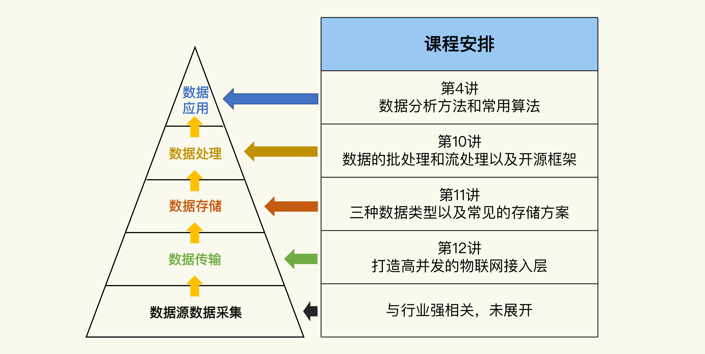
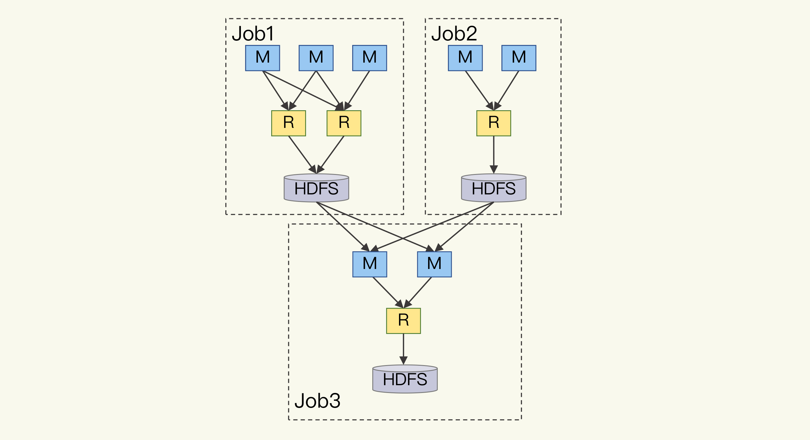
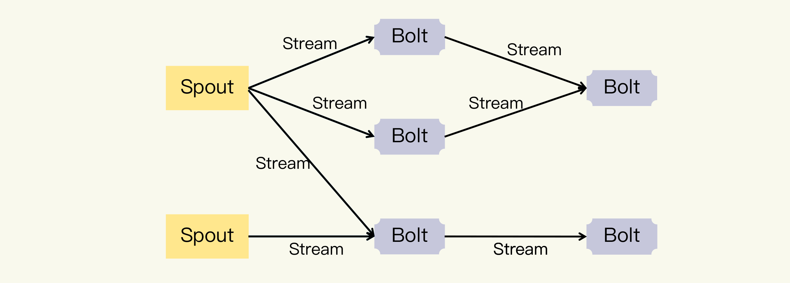
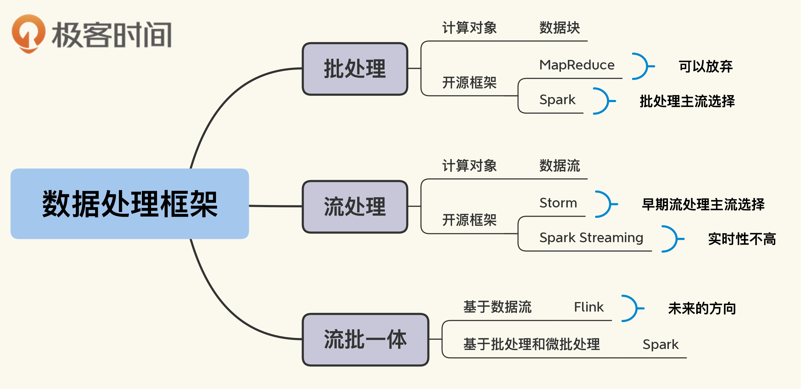

---
date: "2019-06-23"
---  
      
# 10 | 数据处理框架：批处理还是流处理？
你好，我是郭朝斌。

在[第4讲](https://time.geekbang.org/column/article/308366)中，我分析了物联网系统的数据技术体系。它包括 5 个部分：数据源数据采集、数据传输、数据存储、数据处理和数据应用。

不过，这还只是一个整体的认识框架。数据技术体系涉及的内容很多，虽然我在第4讲已经介绍了**数据应用**中用到的分析方法和算法，但是你还需要在这个框架的基础上，继续了解其他几个部分的知识。

所以我会从今天开始，用连续3讲的篇幅，分别讲一讲数据处理、数据存储和数据传输涉及的技术。每一讲分别专注其中一个主题，把它们都剖析透。至于数据源的数据采集，它跟具体的行业应用有关，不同的行业差别很大，所以我们这门课就不展开讲了。

## 处理海量数据时的难题

我们知道，数据分析需要用到很多算法，比如支持向量机和K-means。那么在物联网系统的应用中，我们要怎么使用这些算法呢？

你可能会想：这算什么问题？从文件中或者数据库中读取数据，然后使用一个算法工具，比如 Python 语言的机器学习框架 **Sklearn**（也称为 Scikit-Learn），不就可以快速应用算法处理数据了吗？

其实没有这么简单，因为这种方式一般只适合用来学习和做研究。在真实的物联网场景中，你面临的是海量的数据。当我们面对海量数据的处理时，一切就不是这么直接和简单了。先不说高效地处理，首先你面临的挑战就是，如何把高达几GB甚至数TB的数据直接读取到内存中计算，显然直接加载到内存是不现实。

<!-- [[[read_end]]] -->

所以，对于海量数据，我们要借助大数据处理技术。

## 经典思路：MapReduce的分而治之

那么，大数据处理技术是采用什么思路解决海量数据的处理任务的呢？

为了让你更好地理解，在解答这个问题之前，我想先跟你讲一个故事。

记得上大学的时候，为了提前体验一下工作招聘的流程，我参加过一些公司的笔试。笔试题目中有很多是关于**大文件处理**的，比如给你一个或者几个很大的文件，问你怎么找出其中出现频次 Top 100 的词。搜索引擎公司尤其爱出这种题。

对于这种问题，如果我们要提高处理的效率，就需要考虑**“分而治之”**的策略了：把数据分成几份，分配给几台计算机同时处理；每台计算机统计它负责的文件块中每个词出现频次，然后再将所有计算机统计的结果进行汇总，最终得到所有数据中最高频的100个词。

虽然这只是一道笔试题，但是它来源于搜索引擎公司真实的业务需求。搜索引擎需要对海量的网页内容进行处理，建立索引，计算权重。为此，工程师们要做很多事：

* 数据切分：把大文件分成小文件
* 数据传输：把文件分发给可用的计算机
* 结果汇总：把每台计算机的计算结果做汇总处理，得到最终结果
* 容错处理：解决多台计算机协作过程中出现的机器故障
* 灵活扩展：根据计算机临时的增加，随时调整计算任务的分配和汇总

显然，这不是一项轻松的工作，还涉及到很多分布式系统的技术。如果每次有不同需求的时候，我们都得重新走一遍这个过程，就要投入大量的时间和精力，太不划算了。

怎么解决这个问题呢？方法当然有很多。在大数据技术的早期，应用最广泛的方法是 MapReduce ，流行的原因很简单，就是分享和开源。

首先，**谷歌**（Google）基于公司内部的实践，在2004年发表了**分布式计算框架**的[论文](https://users.soe.ucsc.edu/~sbrandt/221/Papers/DataManagement/dean-osdi04.pdf)。这篇论文提出了 **MapReduce** 计算框架的设计思想，主要用于解决海量网页的索引生成问题。

接着，开源搜索引擎项目 **Nutch** 的开发人员，基于这个设计思想开发出了开源的 [**Hadoop MapReduce**](https://hadoop.apache.org/docs/r1.2.1/mapred_tutorial.html) 实现。

MapReduce 是怎么设计的呢？其实他们的想法跟刚才那道笔试题的解法一样，也是分而治之。

具体来说，就是把数据分成相同大小的多份，然后相应地创建多个任务，并行地处理这些数据分片，这个的过程被定义为**Map**过程；接着，再将Map过程中生成的计算结果进行最终的汇总，生成输出结果，这个过程被定义为**Reduce**过程。

这两个过程合起来就是MapReduce了。

这个设计思路本身，还不是最关键的地方。更重要的是，它提供了一个**框架**，把与计算机硬件相关的容错和扩展功能都实现了。同时，它也提供了统一的开发接口，我们只需要基于业务目标，定制 Map 和 Reduce 的具体计算任务就行了。这就大大降低了我们分析海量数据的难度。

当出现一个好用的工具时，人们就会试图用它来解决一切问题。随着 MapReduce的流行，人们开始把它应用在各种场景中，而不仅仅是计算索引，比如执行 Hive 中的 HQL 查询（这是一种 SQL样式的交互式计算）。

这个时候，MapReduce就显得越来越“力不从心”了，原因主要有两个方面。

一方面，MapReduce的计算模型非常简单，只有Map和Reduce两种类型。就连对数据进行排序和分组这样简单且常见的任务时，都需要转换成Map和Reduce来进行；而像上面说到的 HQL 查询，更是需要使用多个 Map 和 Reduce过程才能实现。

这有点像函数调用。我们使用C、Java和Python这些高级语言的时候，直接引用函数名，填上函数参数就可以了。但是如果我们使用的是汇编语言，就需要自己写代码实现函数入参的压栈、返回地址压栈、跳转到函数代码的地址、执行完成后的出栈和返回等操作。

这非常不直观，也容易出错。

另一方面，MapReduce 是基于分布式文件系统 HDFS 来实现数据存取的。注意，不只是读取源数据和写入计算结果，包括中间的计算结果的存储和数据交换也是基于HDFS的。

HDFS 是磁盘上的文件系统，读写的效率要远远低于内存。HDFS之所以选择磁盘作为存储介质，是因为它出现的时代计算机内存还是很昂贵的。

这就导致 MapReduce的效率不高。

## 高效率开源框架：以“快如闪电”为目标的Spark

高效是工程师们一直追求的，不管是开发还是处理，我们都希望越快越好。为了实现高效，新的设计思想和数据处理框架开始出现，其中的翘楚是 Spark 项目。

那么，Spark是如何打造高效率框架的呢？

首先，在计算模型上，Spark 抛弃了MapReduce的两个过程模型，采用了**DAG**（Directed Acyclic Graph，有向无环图）模型。为什么采用DAG呢？我给你挖掘一下这背后的本质。

下面这张图展示了 MapReduce 处理数据时的数据流：

学过数据结构和算法的你，一定知道这就是**有向无环图**。所以，采用DAG来描述数据处理的过程，应该说是反映了数据处理过程的本质。这样一方面开发人员可以更容易地描述复杂的计算逻辑，另一方面计算框架也能更方便地自动优化整个数据流，比如避免重复计算。

其次，Spark 的数据存取充分地利用了**内存**。

它的数据分片被称为**Partition**。然后它基于Partition，提出了**RDD**（Resilient Distributed Datasets，弹性分布式数据集）的概念。

所谓的**“弹性”**就是指，数据既可以存储在磁盘中，也可以存储在内存中，而且可以根据内存的使用情况动态调整存储位置。这就提高了计算的效率。

## 另一种思路：为实时计算而生的流处理

到这里，你可以想要问：怎么还没有说到批处理和流处理呢？

其实我刚才介绍的MapReduce就是批处理的经典思路和框架，而Spark就是目前更高效、更流行的数据批处理开源框架。

之所以没有在一开始的时候就提出来，是因为“批处理”这个概念一定是相对于其他处理方式来说的，比如流处理。如果后来没有流处理模式，我们也只会说“大数据处理”或者“分布式数据处理”，而不会专门定义一个批处理出来。

那流处理为什么会出现呢？当然是因为业务需求。随着社交网络的出现，产品中的个人**信息流**（Feeds）需要基于好友关系和好友的发布动态，快速地计算和显示出和本人有关系的信息。类似的需求还有个性化的广告和消息推送服务。

而在物联网中，当采集的数据传输到系统后，我们可能需要对数据进行一些预处理，处理之后再存储起来。

这些需求在现在的应用中很常见。它们的共同特点是，数据像流水一样流入系统，然后被处理，而数据的快速处理，也就是实时计算，是这个过程中的关键点。这就是流处理出现的背景。

那怎么实现呢？考虑到数据输入的速度和数据处理的速度不一定一致，我们可以按照一定的分配策略，将数据输入多个消息队列中缓存数据，每个消息队列由一个进程或者线程处理数据。

但是和我一开始提到的计算词语出现频次的例子一样，这种基于消息队列自己开发的系统，同样会遇到拓展性、容错性的问题；另外，还要保证消息队列中消息的可靠传输。

所以一些流处理框架开始出现，一方面解决这些问题，另一方面也给开发人员提供统一的开发接口，从而方便流处理的任务的开发和实现。

## 流处理开源框架：Storm、Spark Streaming 和 Flink

这其中最早的代表就是社交网络公司Twitter开发的**Storm**框架。

Storm的一个重要概念就是**数据流**（Stream）。相对于批处理针对数据块的处理方式，所谓的流处理，就是针对数据流的处理方式。Storm把Stream描述成是**元组**（Tuple）构成的一个无限的序列，如下图所示：

Stream 从**水龙头**（Spout）中产生，也就是说，Spout把需要处理的数据转换为由Tuple构成的Stream。然后Stream经过**转接头**（Bolt）的处理，输出新的Stream。其中，Bolt的处理可以是过滤、函数操作、Join等任何操作。你可以参见下面的流程图示例：

图片中的Spout、Bolt 和Stream共同构成了Storm中另一个重要概念，**拓扑**（Topology）。

你应该可以看出来Topology是一个DAG（有向无环图）。Storm框架中运行的正是一个个Topology，而且因为是流处理，它会一直运行直到被手动终止。

基本上和Storm同时出现的流处理开源框架是Spark Streaming。看到Spark Streaming，你可能疑惑，Spark的计算引擎不是基于RDD数据集，也就是**数据块**来处理数据的吗？它要怎么处理**数据流**呢？

其实无论是数据块还是数据流，都只是数据的不同使用和处理方式，它们之间是可以相互转换的。

这就像在一些编程语言标准库中的**File**操作接口，File本身在磁盘中是按照块存储的，但是File操作的接口可以按照流（Stream）的方式读写文件。同样地，用户键盘输入的Stream，或者通过网络连接Socket接收的数据流，也可以先缓存起来，然后作为整块的数据统一处理。

Spark Streaming 正是将数据流转换成一小段一小段的**RDD**。这些小段的RDD构成一个流式的RDD 序列，称为**DStream**，所以它的流处理被称为**“微批处理”**。

显然，它的实时性取决于每小段RDD的大小，实时性不如Storm框架；不过，这种方式也使它的吞吐能力要大于 Storm。

整体来看，你可以认为Spark（包括Spark Streaming）基于数据块的数据模型，同时提供了批处理和流处理的能力。

那么既然数据块和数据流可以相互转换，是否存在基于数据流的数据模型，然后同时支持批处理和流处理的开源框架呢？毕竟数据输入系统的本来方式就是数据流，这样理论上可以获得更好的实时性。

答案是有的，比如**Flink**。Flink将数据块作为一种特殊的数据流，通过从文件等持久存储系统中按照Stream（流）的方式读入和处理，来提供批处理的能力。在这个基础之上，Flink提供了统一的批处理和流处理框架，也就是所谓的**“流批一体”**的数据处理框架。

Flink虽然出现的时间不长，但凭借着优秀的设计，性能非常强，延迟可以低到微秒级别，是对实时计算性能要求的高的场景的理想选择。行业内，阿里云和腾讯云对于 Flink 的支持都非常好；很多企业也在实践中逐渐尝试使用Flink来替代Storm框架。

## 小结

总结一下，在这一讲中，我介绍了物联网系统的两类数据处理框架，顺便讲了很多大数据处理技术的起源和设计思想。这不是我想啰嗦，而是因为学习一个东西的时候，最有效的方式就是搞清楚它的底层原理，把握它的发展脉络。只有这样，每个知识点才能各归其位，遇到问题时你就可以顺藤摸瓜地去分析、去解决。

今天的重点，这里我再概括一下：

1.  批处理适合海量静态数据的非实时处理，延迟比较高，也叫离线计算，主要用于离线报表、历史数据汇总等场景。
2.  流处理适合动态输入的流式数据的实时处理，延迟低，也叫实时计算，主要用于实时监控、趋势预测、实时推荐等场景。
3.  批处理可以选择的开源框架有Spark和Flink。至于Hadoop MapReduce，你了解一下基本原理就可以了，它在应用中应该已经被放弃了。当然，如果你有遗留系统仍然使用MapReduce，那就只能维护着，或者找机会迁移到新的框架。
4.  流处理的开源框架可以选择 Storm、 Spark Streaming和Flink等。

另外，我还做了一张思维导图，供你在使用中参考。

技术的发展是需求推动的。随着互联网上网页数量的增多，从搜索引擎开始，大数据处理相关的技术经历了萌芽到成熟的快速发展过程，已经在电商推荐系统、广告营销、金融科技等领域得到广泛的应用。

未来随着物联网的发展，智能家居、智慧城市、工业物联网的领域应用越来越多，数据量更是极速膨胀。这一定会对大数据技术提出新的挑战和需求，新的计算框架也许也会出现，因此这是一个非常活跃的技术分支。不过，你在了解、学习新的框架时，都可以回到我这里讲的数据处理的本质来思考。

## 思考题

最后，给你留一个思考题吧。

这一讲我们讨论了很多批处理和流处理的内容，我们知道一个完整的业务系统，一般既需要批处理，也需要流处理，那这些不同的数据处理框架在系统中应该如何配合呢？或者说数据处理系统的架构应该是怎样的呢？

欢迎你在留言区谈一下自己的看法，或者分享一下你工作中应用的架构方式。如果你有朋友对物联网感兴趣，也欢迎你将本课程分享给他们，一起交流学习。