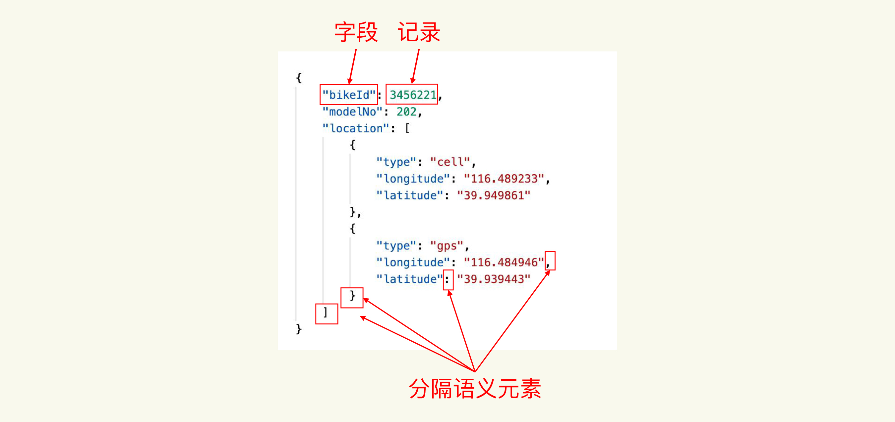
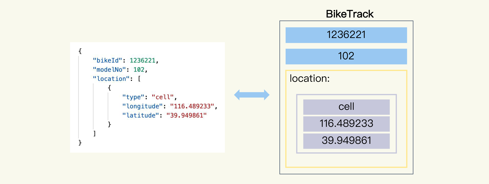
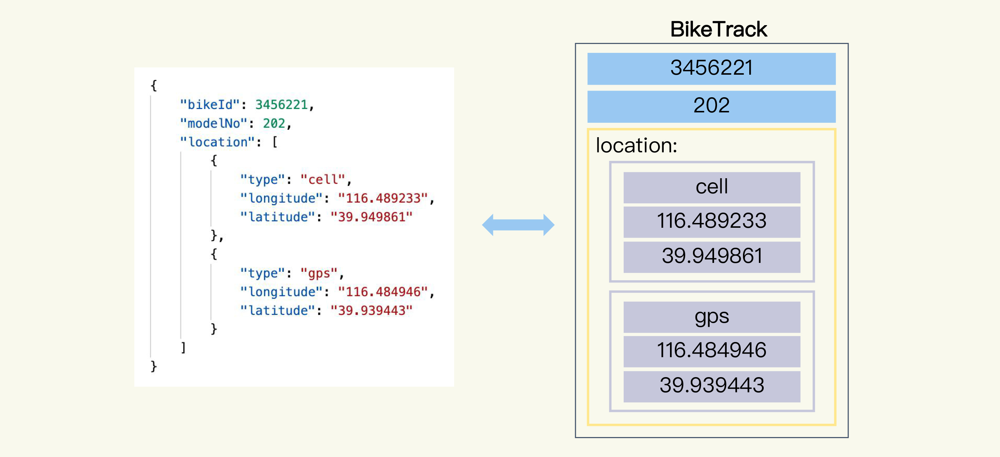
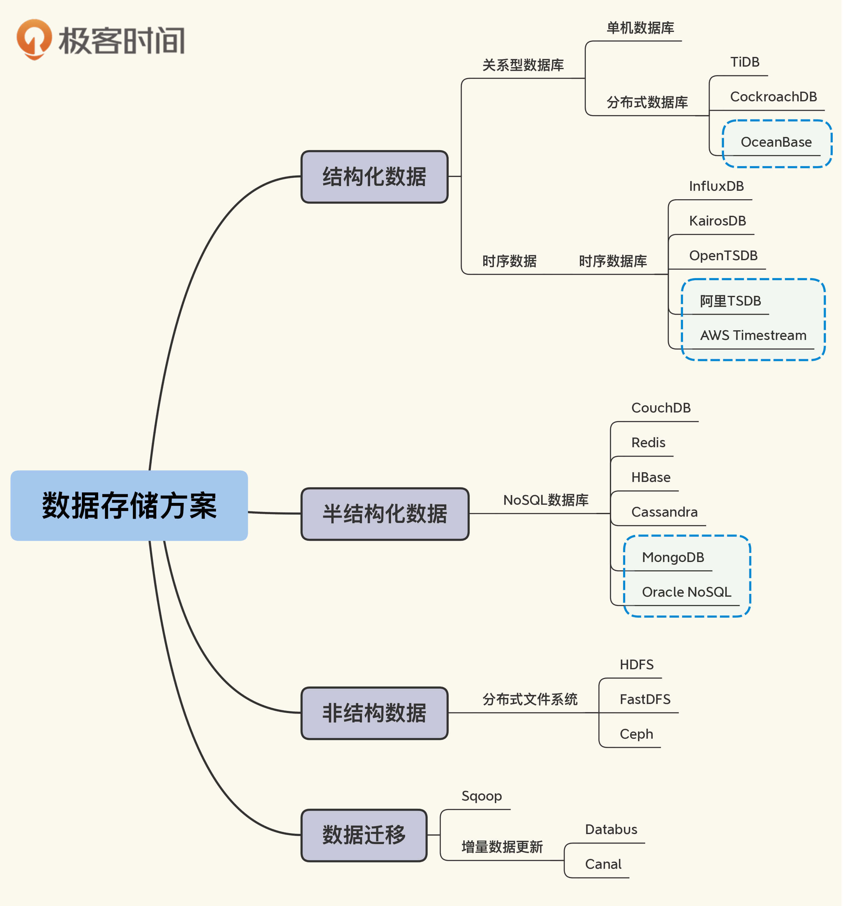

---
date: "2019-06-23"
---  
      
# 11 | 数据存储：物联网中的数据库有哪些？
你好，我是郭朝斌。

上一讲，我讲解了物联网系统进行数据处理的思路和常用的开源框架。那么，这些数据要从哪里读取呢？还有，数据处理完成的结果要写入到哪里呢？这就涉及到数据存储方案。

跟灵活多变的数据处理框架比起来，数据存储方案要固定得多。

为什么这么说呢？因为确定了数据存储方案，其实也就确定了用来存储数据的具体软件。当系统开发出来并投入使用后，数据就会源源不断地流入软件存储起来。

当你因为存储软件的读写性能无法满足需求，希望重新做软件选型的时候，就会发现把数据从一种软件迁移到另一种软件是一件费时费力还容易出错的事情。它就像给飞行中的飞机换引擎，难度可想而知。

更何况数据是一种重要的**数字资产**，之前的数据公司是不能轻易丢弃的。

所以一旦确定存储软件，一般很难切换。这就要求我们做软件选型的时候，必须非常谨慎。因为一旦做出错误的决策，将来可能追悔莫及。

那么，怎么正确地选型呢？基本的原则还是我在第4讲中提到的，根据数据类型来选择。

数据大体上可以分为3类：

1.  结构化数据（Structured data）
2.  半结构化数据（Semi-structured data）
3.  非结构化数据（Unstructured data）

这一讲，我会一类一类地为你介绍选型经验。

<!-- [[[read_end]]] -->

## 结构化数据：关系型数据库

我们先来看看**结构化数据**。

结构化数据是指具有**明确的**、**固定的**结构关系的数据。

怎么理解呢？你可以回想一下班级通讯录的Excel表格，表头有姓名、性别、生日、家庭住址、手机，然后下面是一行一行的数据。正因为表头有明确和固定的结构，所以每一行的数据的结构都是一样的。这种用二维的表结构就可以表示的数据，就是结构化数据。

这个表结构和关系型数据库中的表结构非常一致，所以结构化数据适合使用**关系型数据库**来存储。基于关系型数据库，我们可以很容易地实现数据的“增删改查”，而且可以方便地实现事务操作，保证数据操作满足ACID特性（也就是原子性Atomic，一致性Consistency，隔离性Isolation和持久性Durability）。

举例来说，共享单车中用户的个人信息、骑行记录和支付信息等这类属性明确，而且对于一致性要求很高的数据，一般就采用关系型数据库来存储和操作。

不过随着业务的发展，当物联网系统面临海量数据时，单机数据库的计算和读写性能会受到影响。这时，我们已经不能简单地通过提高计算机的硬件性能（垂直扩展）来解决了。

### 分布式关系型数据库

为了应对大数据对计算和读写性能的挑战，数据库系统需要借助分布式架构的威力（横向扩展）。

这就像为了解决“灭霸”这个难题，我们当然希望出现一个更加强大的超能力者。但是即使是钢铁侠和绿巨人，也是有能力瓶颈的，所以就需要各种超级英雄组成联盟才能达成目的。

那么怎么用分布式架构来解决大数据的问题呢？行业内一开始的实践是对数据库进行**分库分表**，然后借助**数据库中间件**实现关联查询、主键避免重复、分页查询和事务一致性等功能。

但是这种方式有很多弊端，比如分库分表需要根据业务数据的特点仔细设计，而且这种分库分表操作一定会涉及非常麻烦的数据迁移工作；通过中间件执行SQL的效率不高；事务一致性很难保证，往往需要在应用中实现“最终的一致性”。

为了解决这些问题，**分布式关系型数据库**出现了。它也经常被称为**NewSQL数据库**。它的优势主要体现以下3个方面。

1.  **高扩展性**。NewSQL天生支持数据**分片**，支持动态增加节点，不需要进行麻烦的数据迁移工作，所以能够轻松地满足数据不断增大时的存储需求。
2.  **高并发性**。相比于单机关系型数据库基于**磁盘**的设计，NewSQL在设计上更好地利用了**内存**，所以SQL执行效率很高。在事务的支持上，NewSQL有着高效的分布式事务特性。所以它可以实现海量数据的读取和写入，以及大量用户的查询和更新等操作。
3.  **高可用性**。NewSQL采用Paxos或者Raft协议来实现**多副本**的存储，而且还支持自动选择主节点，保证了数据库的故障切换时间很短。

所以，对于需要**强一致性**事务的场景（比如共享单车物联网系统中的支付交易），以及需要基于关系模型进行**复杂查询**的场景（比如共享单车中涉及用户信息表、单车信息表和骑行记录表的丢失单车查询），当单机关系型数据库已经无法满足大数据需求时，可以考虑分布式关系型数据库。

尤其是当之前的业务已经基于关系型数据库开发完成，并且在实际服务环境中运行的时候，分布式关系型数据库简直是业务开发人员的福音。因为这种情况下想改用其他类型的数据库，如果数据库不支持SQL语言，业务代码就需要进行大量的修改和调整。

在实践中，分布式数据库的开源选择有TiDB、CockroachDB等，也有商业化的产品，比如阿里巴巴的OceanBase等。

### 时序数据库

分布式关系型数据库这个方案，是从**增加能力**的角度得到的。那么，我们能不能从**简化问题**的角度出发，找到其他解决方案呢？

从原理上看是可行的。这就像假如把灭霸的手套去掉，也许作为高中生的蜘蛛侠也可以对付他。

物联网中传感器的应用系统就是这样的场景，比如监控冷库中温度和湿度条件的传感器。这些传感器会按照一定的周期不断地上报数据（比如每1分钟上报1次）。这样的数据按照时间顺序排列，形成了一系列的数据点，所以被称为**时间序列数据**（Time Series Data），简称**时序数据**。

时序数据在读写、存储和分析处理方面有下面这些特点：

1.  时序数据是持续地写入，一般是采用固定的频率，没有写入量忽大忽小的明显变化。数量非常大，而且并发写入的需求也很高。但是数据很少做更新，旧数据除了特殊情况下的修改，基本是不需要更新的写入操作。
2.  时序数据的读取很少，相比写入的高并发和高频率，读取的需求主要是进行数据分析的应用，而分析应用的并发访问量是比较少的。
3.  时序数据时效性很强，一般是越新的数据价值就越大，旧数据会迅速失去价值。
4.  时序数据的数据分析主要关心的是新数据，旧数据被查询和分析的概率不高。旧数据一般是粗颗粒度的读取分析。而且在被分析时，一般是基于时间范围读取分析，读取某一条记录的几率很小。

基于时序数据结构和应用上的特点，人们开发出了**时序数据库**，它在近些年随着物联网的应用变得非常流行。

时序数据库简化了关系型数据库很多不必要的功能，比如采用读取性能不高的LSM 树代替 B+树的存储结构。它专注于支持**高并发的数据写入**，采用更高压缩比的压缩算法来支持海量数据的存储，降低存储的成本，同时，通过预处理等方法来支持海量数据的高效分组聚合计算。

那么，时序数据库的具体产品有哪些呢？

首先是开源软件，你可以选择InfluxDB，KairosDB和OpenTSDB等产品。

另外，云服务企业一般都开发了自己的时序数据库，比如阿里巴巴的TSDB和亚马逊的AWS Timestream等。其中，TSDB还扩展支持了空间信息，以便处理地理围栏和空间轨迹等需求。

## 半结构化数据：非关系型数据库

接下来，我们再看看**半结构化数据**。

半结构化数据包含相关标记，用来分隔语义元素，以及对记录和字段进行分层。比如，JSON格式的数据，我们在[第6讲](https://time.geekbang.org/column/article/310441)的物模型中应用过，它就是一种半结构化数据。JSON中大括号“\{\}”，中括号"\[\]"，冒号":"，逗号","就是**分隔语义元素**，每个冒号前面的内容是**字段**，后面的是**记录**。

我拿共享单车的运行轨迹数据作为例子，展示了一条JSON数据，你可以参考。

半结构化数据的特点是，它的结构并不固定，属于同一类实体可以有不同的属性，这表明它有很好的可扩展性。另外，即使它们被组合在一起，这些属性的顺序并不重要。这些特点决定了我们很难按照关系型数据库的数据模型来建立半结构数据的结构和相互之间的关联。

除了JSON，常见的半结构数据还有XML等。在应用系统中呢，日志文件就是典型的半结构化数据。

为了更有效地存储半结构化数据，我们可以选择**NoSQL数据库**。它以键值对存储，且结构不固定，每一个元组可以有不一样的字段。每个元组可以根据需要增加一些自己的键值对，这样数据库就不会局限于固定的结构，可以减少一些时间和空间的开销。

比如，在共享单车系统中，我们有一款新型单车，它除了可以基于蜂窝网基站定位外，还可以基于GPS进行精度更高的定位。那新、老单车的运行轨迹数据就会有区别。你可以参考下面的一张对比图。

也就是说，你可以根据需求去添加自己需要的字段。比如在获取用户的不同信息时，你不需要像关系型数据库那样，对多表进行关联查询，而是只需要根据id取出相应的value，就可以完成查询。

其实，我们知道SQL只是一种操作数据库数据的接口，所以NoSQL中的“No”真正表达的意思是 No Relational，专业的叫法应该是**非关系型数据库**。

非关系型数据库由于不再强调数据的一致性，不支持事务操作，也不再关注复杂的关联表查询，所以它对海量数据的处理性能更好，而且存储的数据格式比较丰富，易于扩展。有些非关系型数据库会使用内存来存储数据，以便支持更快的查询速度。

非关系型数据库也有很多的开源产品，比如CouchDB、Redis、HBase、Cassandra等，你可以根据熟悉程度和生态支持选择。商业化的选择也有MongoDB和Oracle NoSQL等产品。

## 非结构化数据：分布式文件系统

虽然半结构化数据的结构会根据需求变化，但多少还保留了一些结构化的描述信息。可是有一类数据却完全不能按照结构化的方法来描述，这就是**非结构****化****数据**。典型的例子有监控系统中的视频、图片和音频等信息。

非结构化数据没有预定义的数据模型，无法简单地用数据库二维表结构来表现。它的格式非常多样，标准也不是统一的。对于这一类数据的大规模存储，我们只能使用**分布式文件系统**。

其中最有名的当然就是 Hadoop 实现的一个分布式文件系统（Hadoop Distributed File System），简称HDFS。因为拥有Hadoop的大数据生态，所以它是分布式文件系统的最理想的选择之一。其他的分布式文件系统还有FastDFS和Ceph等。

## 小结

总结一下，在这一讲中我主要讲解了关于数据存储方案的选择。重要的事情说三遍：

选型一定要慎重！

选型一定要慎重！

选型一定要慎重！

错误的决策不仅会影响系统的性能，还会增加成本投入。

基于不同数据类型的特点，选择方案的原则如下：

1.  **结构化数据**，比如用户和设备的关系，用户信息、设备参数等，还是适合**关系型数据库**。为了应对海量数据，你可以采用**分布式数据库**，有TiDB、CockroachDB等，也有商业化的产品，比如阿里巴巴的OceanBase等。另外，物联网中的传感器设备，随时间不断产生新数据。要存储这类数据，你可以选择**时序数据库**，来获得更高的读写和查询性能。
2.  **半结构化数据**，比如JSON结构的数据，日志记录等，一般采用 **NoSQL 数据库**产品。常见的开源选择有MongoDB、CouchDB、Redis、HBase和Cassandra等，商业化的选择有MongoDB和Oracle NoSQL等产品。
3.  **非结构化数据**，比如视频和音频，一般采用分布式文件系统。Hadoop 体系中应用广泛的 **HDFS** 是非常理想的产品。除此之外，FastDFS和Ceph也可以作为选择。

我整理了一个数据存储方案相关的思维导图，供你参考。

## 延伸：数据迁移工具

在这一讲一开始的时候我就说过，数据的迁移工作比较麻烦，需要在设计阶段就尽量避免。但是，有些数据迁移的需求可能是你避免不了的。比如你要把已运行系统中MySQL数据库里的数据，导入到NoSQL数据库HBase中，以便使用大数据技术进行分析处理。

对于这样的需求，我们就得借助工具来完成，比较有名的工具就是**Sqoop**项目。它在 Hadoop 大数据存储系统和关系型数据库等系统之间架起了桥梁，借助Sqoop，你就可以很方便地把MySQL数据导入到HBase中。

另外，Sqoop采用了被称为**Connector**的插件架构，不同的Connector还可以对接不同的数据源，而且你也可以根据自己的需求定制专属的Connector 来完成一些特殊的迁移工作。所以，Sqoop也可以完成NoSQL数据库（比如CouchDB）和文件存储系统（比如FTP）之间的迁移任务。

当然，Sqoop也有一个缺点，那就是不太适合**增量的数据更新**，又叫**CDC**（Change Data Capture）。如果基于Sqoop采用定时扫描整张表的方法，那么执行会比较低效，延时也比较严重。

这时，你可以考虑LinkedIn开源的Databus项目，或者阿里巴巴的Canal，它们都是基于分析数据库日志文件来高效地实现数据的增量更新。

## 思考题

最后，给你留个思考题。

除了从数据类型上考虑，在选择数据库时，我们还要结合业务的需求来判断，因为我们的最终目的是高效地、低成本地解决业务问题，比如时序数据库可以更高效、更低成本地解决传感器监控应用的数据存储需求。你能从处理性能和成本的角度，分析一下NewSQL数据库、NoSQL数据库和分布式文件系统针对的业务分别有什么特点吗？

欢迎在留言区谈谈你的思考，也欢迎你将这节课分享给你的朋友一起学习。