---
date: "2019-06-23"
---  
      
# 19 | 场景联动：智能电灯如何感知光线？（下）
你好，我是郭朝斌。

在上一讲，我们基于NodeMCU ESP32开发板，开发了一款光照传感器。考虑到低功耗的需求，它是基于低功耗蓝牙技术来实现的。但是蓝牙设备本身无法直接联网上报数据，那么我们要怎么根据光照强度数据来联动控制智能电灯呢？

不知道你还记不记得[第9讲](https://time.geekbang.org/column/article/313631)的内容？对于蓝牙设备，我们需要借助**网关**来实现联网的目的。所以在这一讲中，我会带你用树莓派打造蓝牙网关，最终实现光照传感器和智能电灯的场景联动（如有需要，你可以根据[这份文档](https://shimo.im/sheets/D3VVPdwcYRhhQRXh/MODOC)自行采购相关硬件）。

## 网关系统架构

首先，我们先看一下网关的系统架构。

网关的主要功能是**协议转换**，一方面它需要接收低功耗蓝牙技术的光照传感器的广播数据，另一方面，它需要把解析的数据上传到云平台。

具体的架构图如下所示。

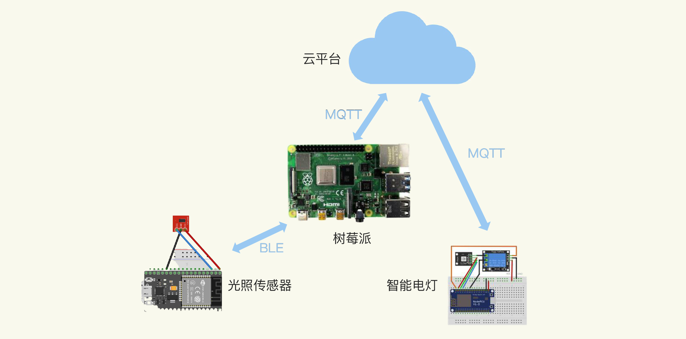

## 南向蓝牙通信

在树莓派上进行蓝牙开发，你可以使用[bluepy](https://github.com/IanHarvey/bluepy)软件包。它提供了一个Python语言版本的低功耗蓝牙API接口，而且对树莓派的适配非常好。

### 通过终端登录树莓派

在学习[第15讲](https://time.geekbang.org/column/article/320675)的时候，你应该已经在树莓派上部署好了包含Gladys Assistant系统的Raspbian操作系统，现在你可以直接使用这个系统。安装软件包之前，我们在电脑终端上输入下面的命令，通过SSH协议登录到树莓派系统中。

<!-- [[[read_end]]] -->

```
    $ ssh pi@gladys.local
    

```

其中，pi就是默认的登录用户名，gladys.local是树莓派开发板的本地域名。

当提示输入密码时，我们输入默认密码raspberry，然后回车，就登录到了树莓派系统中。

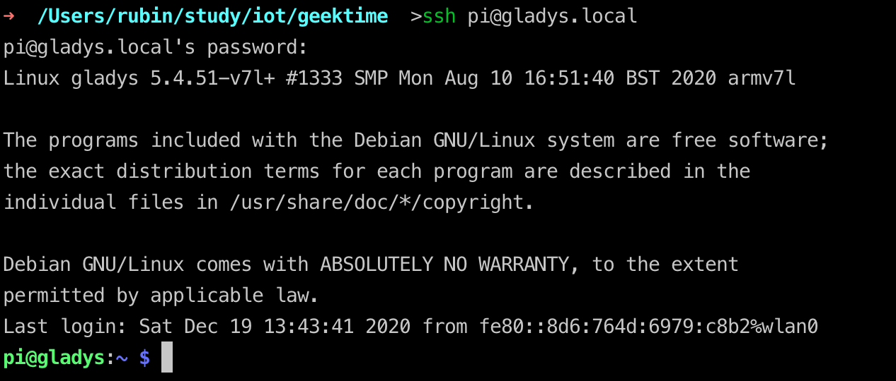

### 通过图形化窗口软件登录树莓派

当然，你也可以使用提供图形化窗口的软件来登录树莓派，比如**SecureCRT**，它除了支持串口协议，同时也支持SSH协议。你只需要新建一个连接会话，按照下图所示的内容填写就行了：

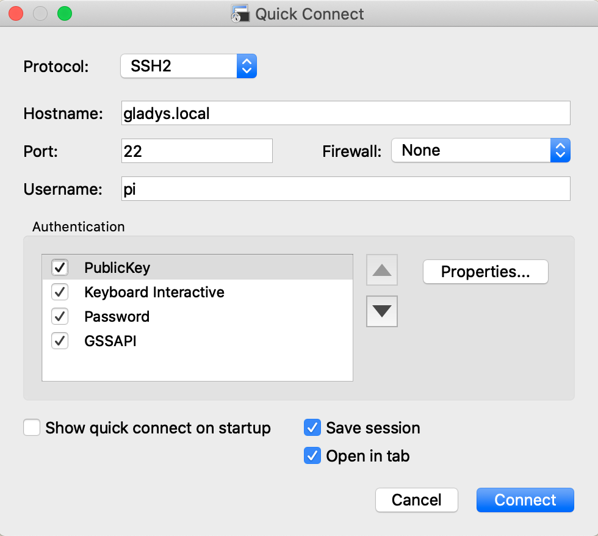

第一次登录时，SecureCRT会弹窗提示我们查看“Host Key”，这时点击“Accept Once”即可。


然后我们输入密码“raspberry”，同时勾选“Save password”，省去以后重复输入密码的麻烦。点击“OK”后，就进入树莓派系统了。

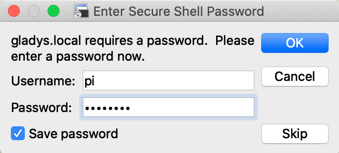

### 在树莓派开发蓝牙程序

我们在树莓派的终端上输入下面命令，就可以完成bluepy的安装：

```
    $ sudo apt-get install python3-pip libglib2.0-dev
    $ sudo pip3 install bluepy
    

```

另外，我们还需要安装interruptingcow软件包。它主要是便于编写定时任务。它的安装命令是：

```
    $ sudo pip3 install interruptingcow
    

```

具体代码如下，供参考：

```
    #File: blescan.py
    import time
    from threading import Thread
    from interruptingcow import timeout
    
    from bluepy.btle import DefaultDelegate, Peripheral, Scanner, UUID, capitaliseName, BTLEInternalError
    from bluepy.btle import BTLEDisconnectError, BTLEManagementError, BTLEGattError
    
    class LightScanner():
        SCAN_TIMEOUT = 5
    
        def __init__(self, name):
            self._name = name
        
        def status_update(self):
            results = self._get_data()
    
            # messages = [
            #     MqttMessage(
            #         topic=self.format_topic("property/light"),
            #         payload=results.lightlevel,
            #     )
            # ]
    
            return results
    
        def _get_data(self):
    
            scan_processor = ScanProcessor(self._name)
            scanner = Scanner().withDelegate(scan_processor)
            scanner.scan(self.SCAN_TIMEOUT, passive=True)
    
            with timeout(
                self.SCAN_TIMEOUT,
                exception=Exception(
                    "Retrieving data from {} device {} timed out after {} seconds".format(
                        repr(self), self._name, self.SCAN_TIMEOUT
                    )
                ),
            ):
                while not scan_processor.ready:
                    time.sleep(1)
                return scan_processor.results
    
            return scan_processor.results
    
    class ScanProcessor:
    
        ADV_TYPE_SERVICE_DATA = 0x16
        def __init__(self, name):
            self._ready = False
            self._name = name
            self._results = MiBeaconData()
    
        def handleDiscovery(self, dev, isNewDev, _):
            is_nodemcu = False
            if isNewDev:
                for (adtype, desc, value) in dev.getScanData():
                    #Service Data UUID == 0xFE95 according to MiBeacon
                    if adtype == self.ADV_TYPE_SERVICE_DATA and value.startswith("95fe"):
                        print("FOUND service Data:",adtype, desc, value)
                        #Object ID == 0x1007 according to MiBeacon
                        if len(value) == 38 and value[26:30] == '0710':
                            light_den = int((value[-2:] + value[-4:-2]), 16)
                            mac = value[14:26]
    
                            self._results.lightlevel = light_den
                            self._results.mac = mac
    
                            self.ready = True
    
        @property
        def mac(self):
            return self._mac
    
        @property
        def ready(self):
            return self._ready
    
        @ready.setter
        def ready(self, var):
            self._ready = var
    
        @property
        def results(self):
            return self._results
    
    class MiBeaconData:
        def __init__(self):
            self._lightlevel = None
            self._mac = None
    
        @property
        def lightlevel(self):
            return self._lightlevel
    
        @lightlevel.setter
        def lightlevel(self, var):
            self._lightlevel = var
    
        @property
        def mac(self):
            return self._mac
    
        @mac.setter
        def mac(self, var):
            self._mac = var
    

```

## 北向MQTT对接云平台

接下来，我们要实现网关和云平台的对接。

### MQTT开发环境准备

1.  **安装软件包**

蓝牙网关与云平台交互的通信协议也是使用MQTT协议，所以我们需要安装MQTT的软件包。

使用哪个软件包呢？在[第8讲](https://time.geekbang.org/column/article/312691)中我介绍过几个常用的MQTT软件包，这里我们选择支持Python语言开发的[Eclipse Paho](http://www.eclipse.org/paho/)软件包。我们在树莓派的终端上输入下面的命令来安装。

```
    $ sudo pip3 install paho-mqtt
    

```

安装成功后，我们可以写一个demo程序测试一下。下面是我测试的代码，你可以参考。和第8讲一样，这段代码仍然会连接到 test.mosquitto.org，并且订阅“/geektime/iot”的主题消息。

```
    #File: mqttdemo.py 
    import paho.mqtt.client as mqtt
    
    def on_connect(client, userdata, flags, rc):
        print("Connected with result code "+str(rc))
    
        client.subscribe("/geektime/iot")
    
    def on_message(client, userdata, msg):
        print(msg.topic+" "+str(msg.payload))
    
    client = mqtt.Client()
    client.on_connect = on_connect
    client.on_message = on_message
    
    #Still connect to mqtt.eclipse.org
    client.connect("test.mosquitto.org", 1883, 60)
    
    client.loop_forever()
    

```

2.  **部署文件到树莓派**

现在，我们把测试文件 mqttdemo.py 上传到树莓派上。

你可以在电脑终端上，运行下面的命令。（注意，你需要先在树莓派上创建 pi-gateway 这个目录。）

```
    $ scp mqttdemo.py pi@gladys.local:/home/pi/pi-gateway/
    

```

其中这个scp命令是基于SSH协议实现的安全文档传输功能。

当然，你也可能更习惯图形化的软件，所以我再介绍一个能实现scp功能的软件 [FileZilla](https://filezilla-project.org/download.php?type=client)。它支持MacOS、Windows和Linux操作系统，操作界面也非常直观。

打开“站点管理器”，创建“新站点”。你可以按照下图设置具体配置参数，然后点击“连接”，登录到树莓派系统。为了方便之后的使用，你可以勾选“保存密码”选项。

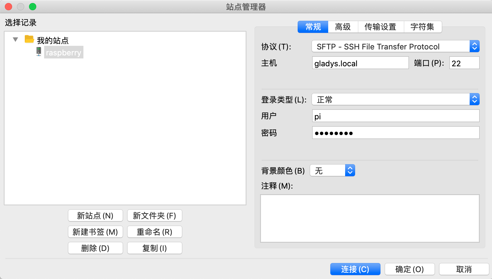

在软件界面的左半部分是你的电脑上的文件目录，右半部分是树莓派上的目录。你只需要双击左边的某个文件，就可以将文件传输到树莓派上。当然你也可以双击右边树莓派上的文件，将它传输到你的电脑。

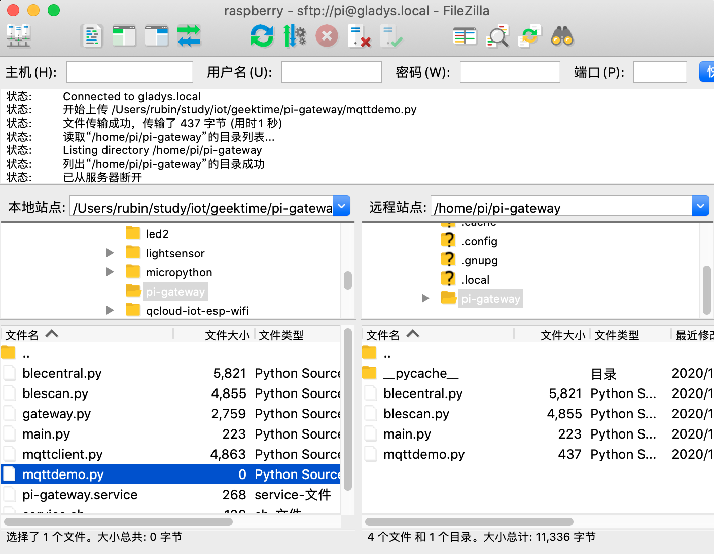

把文件传输到树莓派之后，我们就可以在树莓派的终端上输入下面的命令，运行上面的demo程序。

```
    $ sudo python3 mqttdemo.py
    

```

这时我们把[第8讲](https://time.geekbang.org/column/article/312691)中的发布消息命令再执行一次，如果一切顺利执行，那么就可以在树莓派的终端上看到这个消息。

```
    hbmqtt_pub --url mqtt://test.mosquitto.org:1883 -t /geektime/iot -m Hello,World!
    

```


### 云平台创建光照传感器设备

现在，我们已经做好了对接云平台的准备工作。在树莓派上开发与云平台的通信代码之前，我们还需要在腾讯云平台上创建对应的光照传感器设备。

创建的过程与第17讲智能电灯的过程类似。我快速介绍一下，你重点关注不同的地方就可以了。

在“新建产品”中，产品类别选择“智慧生活”-->“安防报警”-->“光照度传感器”。数据协议仍然选择“数据模板”，其他的保持默认值即可。

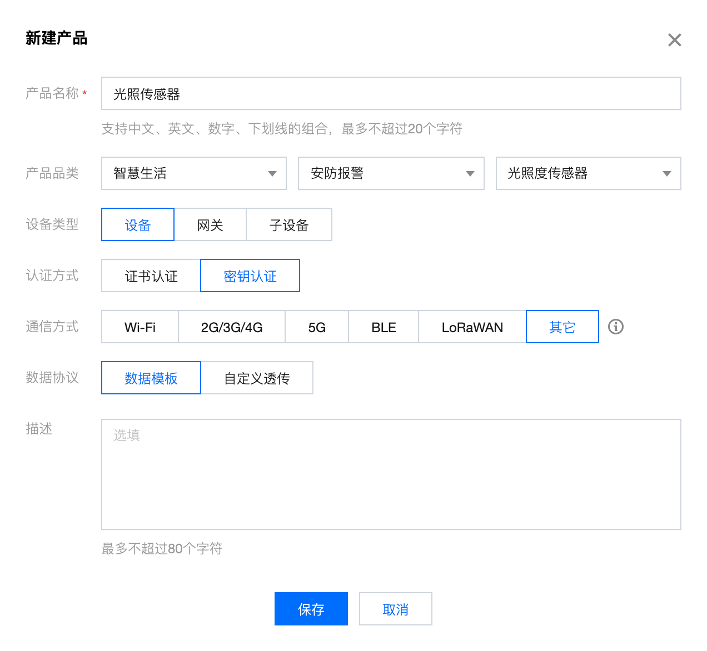

创建成功后，我们点击进入数据模板的设置界面。为了尽量简单，我只定义了一个属性“光照度”，而且是只读类型。你可以直接导入下面的JSON文件完成数据模板的设置。

```
    {
      "version": "1.0",
      "profile": {
        "ProductId": "你的ProductID",
        "CategoryId": "112"
      },
      "properties": [
        {
          "id": "Illuminance",
          "name": "光照度",
          "desc": "光照度检测",
          "mode": "r",
          "define": {
            "type": "float",
            "min": "0",
            "max": "6000",
            "start": "0",
            "step": "1",
            "unit": "Lux"
          }
        }
      ],
      "events": [],
      "actions": []
    }
    

```

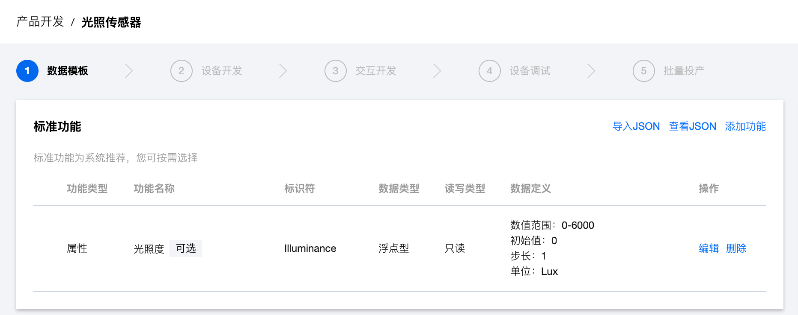

在“交互开发”标签页中，和智能电灯一样，我们仍然保持“使用官方小程序控制产品”选项是打开状态。另外，还有一个配置项需要关注，那就是“智能联动配置”，因为后面我们要为光照传感器设置联动场景。

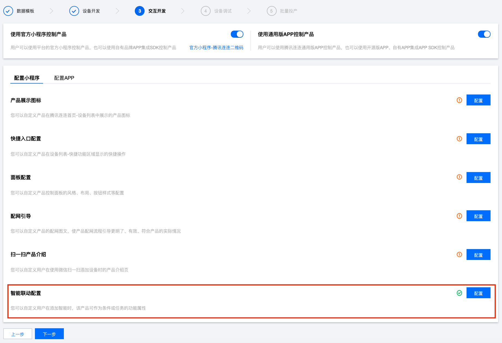

我们点击“配置”，在设置页面中，就可以看到“光照度”这个属性，因为它是只读属性，所以只能作为联动的触发条件。我们勾选“作为条件”的选项，完成配置。

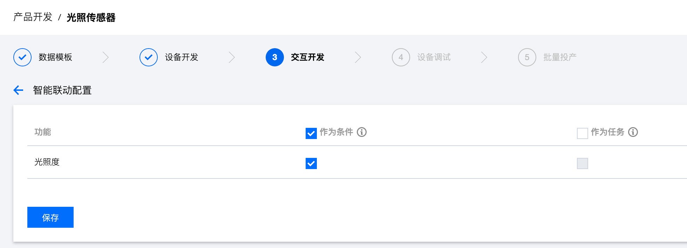

下一步，在“设备调试”界面中，我们创建一个测试设备。点击“新建设备”，输入设备名称“Lightsensor\_1”。


创建成功后，在测试设备列表中，点击“Lightsensor\_1”，进入设备的详情页面，我们可以看到设备三元组的信息。你需要将这些信息记录下来，因为后面的开发中需要使用。

在测试设备列表中，我们点击“二维码”操作，获取测试设备的二维码，以便在小程序“腾讯连连”中添加这个设备。

到这里，腾讯云平台上的产品创建工作就完成了。

### 产品联网开发

在腾讯云平台准备好产品的配置工作之后，我们继续在树莓派上完成北向的通信交互的开发工作。

在[第17讲](https://time.geekbang.org/column/article/322528)中，我们已经了解了MQTT通信的主题 Topic ，以及 Broker 服务器地址、端口号、设备ID（ClientID）、用户名（UserName）和密码（Password）等连接参数的知识。

我们还是可以使用**sign.html**这个网页工具生产用户名和密码，然后就能得到所有的参数。这时，把这些参数替换到下面这段代码的对应位置就可以了。

```
    #File: gateway.py
    from blescan import LightScanner, MiBeaconData
    
    import time 
    import asyncio
    import json
    import uuid
    import paho.mqtt.client as MQTTClient
    
    """
    QCloud Device Info
    """
    DEVICE_NAME = "Lightsensor_1"
    PRODUCT_ID = "MAO3SVUCFO"
    DEVICE_KEY = "TYjuKNc2GpDykXUv4MWBOA=="
    
    """
    MQTT topic
    """
    MQTT_CONTROL_TOPIC = "$thing/down/property/"+PRODUCT_ID+"/"+DEVICE_NAME
    MQTT_CONTROL_REPLY_TOPIC = "$thing/up/property/"+PRODUCT_ID+"/"+DEVICE_NAME
    
    def mqtt_callback(client, userdata, msg):
        # Callback
        print(f"Received `{msg.payload.decode()}` from `{msg.topic}` topic")
    
    async def mqtt_connect():
        #connect callback
        def on_connect(client, userdata, flags, rc):
            if rc == 0:
                print("Connected to MQTT Broker!")
            else:
                print("Failed to connect, return code %d\n", rc)
    
        mqtt_client = None
        MQTT_SERVER = PRODUCT_ID + ".iotcloud.tencentdevices.com"
        MQTT_PORT = 1883
        MQTT_CLIENT_ID = PRODUCT_ID+DEVICE_NAME
        MQTT_USER_NAME = "MAO3SVUCFOLightsensor_1;12010126;2OYA5;1609057368"
        MQTTT_PASSWORD = "8f79b7f1b0bef9cde7fd9652383b6ff8bfeb8003cc994c64f3c8e069c11fd4c7;hmacsha256"
    
        mqtt_client = MQTTClient.Client(MQTT_CLIENT_ID)
        mqtt_client.username_pw_set(MQTT_USER_NAME, MQTTT_PASSWORD)
        mqtt_client.on_connect = on_connect
        
        mqtt_client.connect(MQTT_SERVER, MQTT_PORT, 60)
    
        return mqtt_client
    
    def mqtt_report(client, light_level):
        client_token = "clientToken-" + str(uuid.uuid4())
    
        msg = {
            "method": "report",
            "clientToken": client_token,
            "params": {
                "Illuminance": light_level
            }
        }
    
        client.publish(MQTT_CONTROL_REPLY_TOPIC, json.dumps(msg))
    
    async def light_loop(mclient):
    
        bles = LightScanner('Nodemcu')
    
        mclient.subscribe(MQTT_CONTROL_TOPIC)
        mclient.on_message = mqtt_callback
    
        mclient.loop_start()
    
        while True:
            try:
                data = bles.status_update()
            except Exception as e:
                print("BLE SCAN error:", e)
                continue
            
            print("Light Level:", data.lightlevel)
    
            mqtt_report(mclient, data.lightlevel)
            
            time.sleep(0.1)
    
    async def main():
        mqtt_client = None
        # MQTT connection
        try:
            mqtt_client = await asyncio.wait_for(mqtt_connect(), 20)
        except asyncio.TimeoutError:
            print("mqtt connected timeout!")
    
        if mqtt_client is not None:
            await asyncio.gather(light_loop(mqtt_client))
    
    asyncio.run(main())
    

```

### 在树莓派上部署软件

接下来，我们把代码文件gateway.py 和 blescan.py 两个文件也上传到树莓派的/home/pi/pi-gateway目录中。

同时，为了让程序作为后台服务运行，并且能够开机自启动，我们来做一个Pi Gateway Service。

首先，你需要新建一个service.sh脚本文件，内容如下：

```
    #!/bin/sh
    set -e
    SCRIPT_DIR=$( cd "$( dirname "$0" )" >/dev/null 2>&1 && pwd )
    
    cd "$SCRIPT_DIR"
    sudo python3 ./gateway.py "$@"
    

```

然后，创建我们service的配置文件，内容如下：

```
    [Unit]
    Description=Pi Gateway
    Documentation=https://time.geekbang.org/column/intro/100063601
    After=network.target
    
    [Service]
    Type=simple
    WorkingDirectory=/home/pi/pi-gateway
    ExecStart=/home/pi/pi-gateway/service.sh
    Restart=always
    
    [Install]
    WantedBy=multi-user.target
    

```

接着，把这两个文件上传到树莓派系统的/home/pi/pi-gateway目录中，并且运行下面命令，修改文件的属性。

```
    $ sudo chmod a+x service.sh 
    $ sudo chmod a+x pi-gateway.service
    

```

最后，执行下面的几条命令，为树莓派系统增添上 Pi Gateway 这个服务。

```
    $ sudo cp /home/pi/pi-gateway/pi-gateway.service /etc/systemd/system/
    $ sudo systemctl daemon-reload
    $ sudo systemctl start pi-gateway
    $ sudo systemctl status pi-gateway
    $ sudo systemctl enable pi-gateway
    

```

到这里，网关程序已经在树莓派上运行起来。我们在腾讯云物联网平台上可以看到，光照传感器变为“在线”状态。

## 设置场景联动

在第17讲和第18讲的实战中，我们分别完成了智能电灯和光照传感器的开发，现在终于可以为它们设置场景联动了。

### 场景联动任务分解

我们希望实现的联动场景是，基于环境的光照强度自动控制电灯的开和关。具体来说，这个目标可以拆解为3个自动触发任务：

1.  当光照强度大于1024Lux时，关闭电灯。
2.  当光照强度小于1024Lux时，打开电灯。
3.  至于光照强度等于1024Lux时，也打开电灯。

注意，这里的1024Lux是我自己选择的一个值，你可以根据房屋情况自己调整。

### 联动设备准备

如果你还没有在小程序中添加光照传感器设备，这时可以打开微信中的腾讯连连小程序，扫描上面云平台“设备调试”中保存的那个二维码，添加光照传感器测试设备“Lightsensor\_1”。

现在你的小程序里面已经有了两个设备，如下图所示。

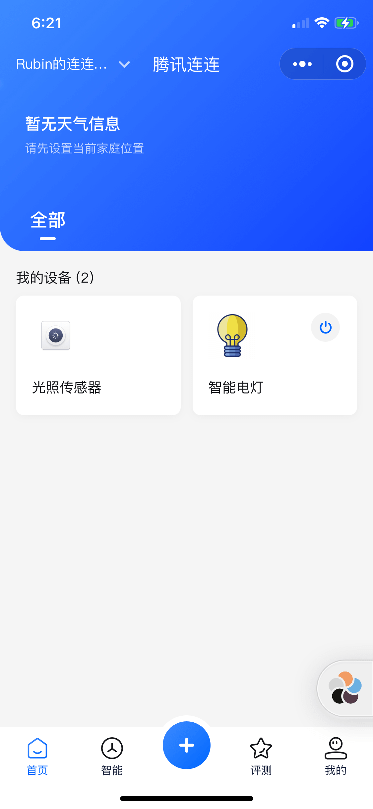

刚才我们已经在腾讯云物联网平台上，为光照传感器设置了“智能联动配置”。现在，我们来为智能电灯配置智能联动能力。

我们进入智能电灯的“交互开发”页面，打开下面的“智能联动配置”页面，然后，像下图显示的那样，把“电灯开关”的“作为任务”条件勾选上。

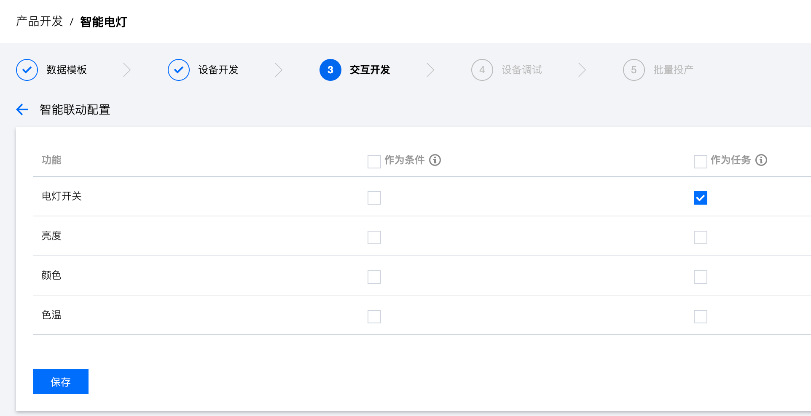

### 联动任务创建

然后，我们进入腾讯连连小程序，点击下面的“+”，选择“添加智能”，开始配置工作。

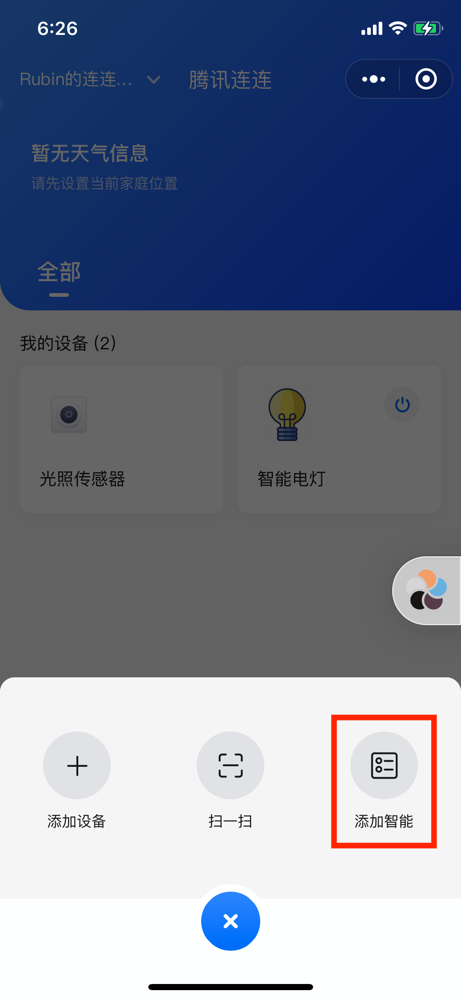

我们从弹框里选择“自动智能”，可以看到下图的配置界面：

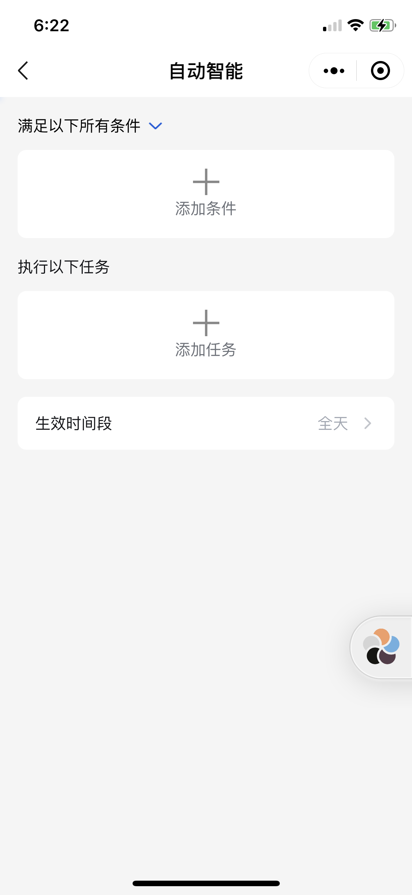

首先，我们添加条件，选择光照传感器设备，然后就会看到光照度属性。我们先设置大于1024Lux的条件。

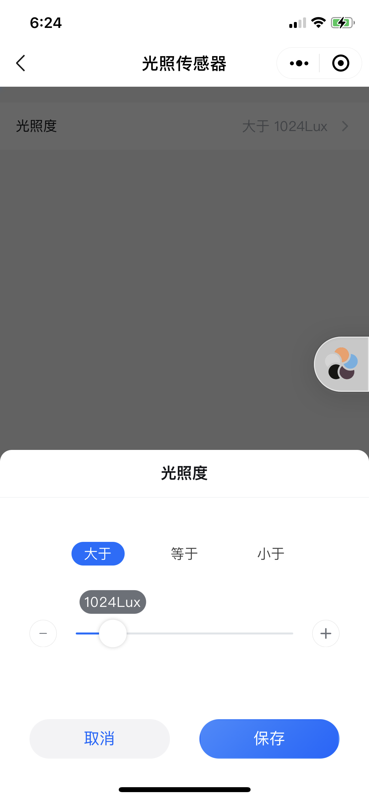

然后，我们添加任务，选择智能电灯设备后，可以看到电灯开关的属性，选择“关”，点击保存。

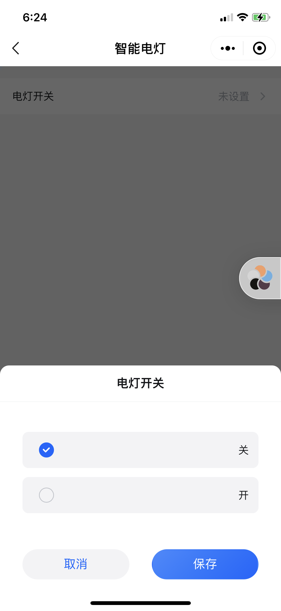

这时，我们可以看到这个智能联动的条件和任务已经配置完成。腾讯连连小程序还支持配置“生效时间段”，可以限定智能联动在选定的时间段内运行。

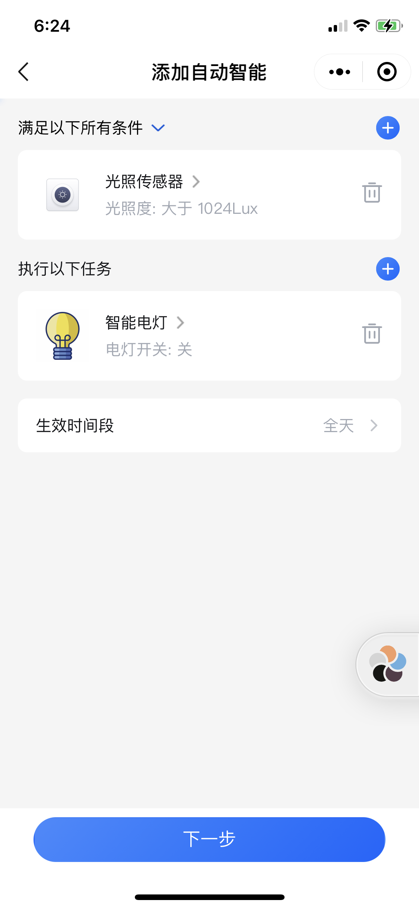

接下来，我们还可以设置一个主题图片和名称，这个根据喜好来就行了。

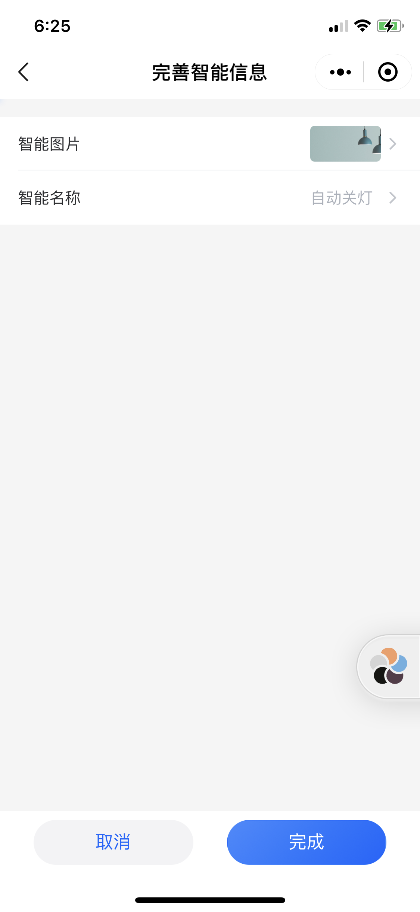

按照相同的方法，我们可以设置其他两个条件，如下图所示：

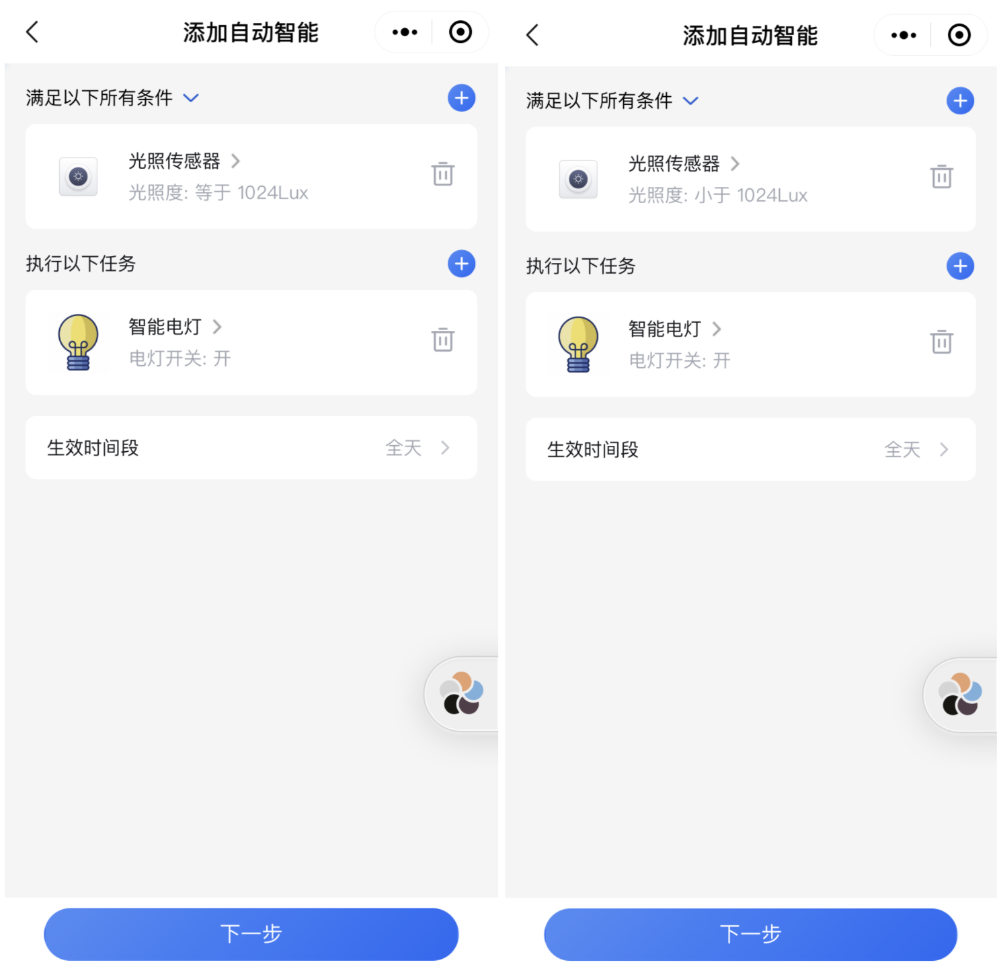

最终的智能联动，包括了刚才提到的3个不同的触发条件。

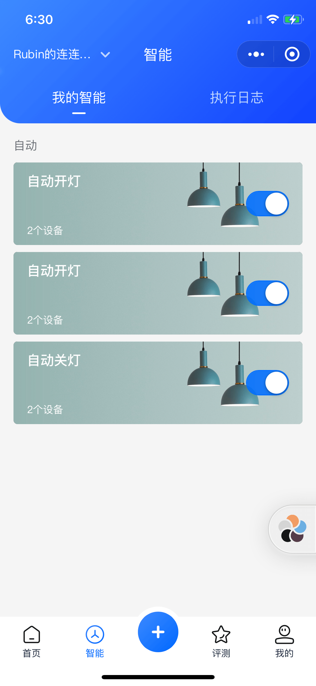

现在，你可以通过控制光照传感器的光照明暗（比如用手遮挡光敏元器件然后再把手拿开），来观察智能电灯的打开和关闭，检验功能是否正常。

## 小结

总结一下，在这一讲中，我介绍了利用树莓派打造网关，让光照传感器接入物联网平台的办法，并且带你实现了光照传感器和智能电灯的场景联动。你需要重点关注的内容有：

1.  为了实现协议转换，树莓派的南向接口，也就是蓝牙功能，你可以基于bluepy软件包开发。这里实现的功能是扫描光照传感器的广播包，并按照MiBeacon蓝牙协议解析出光照强度的数值。
2.  北向接口要实现对接云平台的功能，这是基于MQTT协议实现的。你可以基于Eclipse paho的Python语言版本来开发MQTT Client的功能。
3.  场景联动一般由条件和任务组成。其中，条件和任务是从我们的设备中定义的智能联动配置中选择的。

为了避免光照的短暂变化，导致智能电灯的忽明忽暗，我将光照传感器的数据上报间隔设置得比较长。如果你有特殊的需求，可以修改光照传感器和网关程序中的参数来实现。

下一讲，我将讲解智能音箱的实现，并通过智能音箱控制智能电灯的开关。

## 思考题

最后，我给你留一个动手实践题。

在这一讲的场景联动中，我们实现了光照强度对电灯打开和关闭的自动控制。你可以通过光照强度的不同数值实现对智能电灯亮度，或者颜色的控制吗？

你可以动手设置一下，并且在留言区和我分享你的成果，同时，也欢迎你将这一讲分享给你的朋友，大家一起讨论学习。