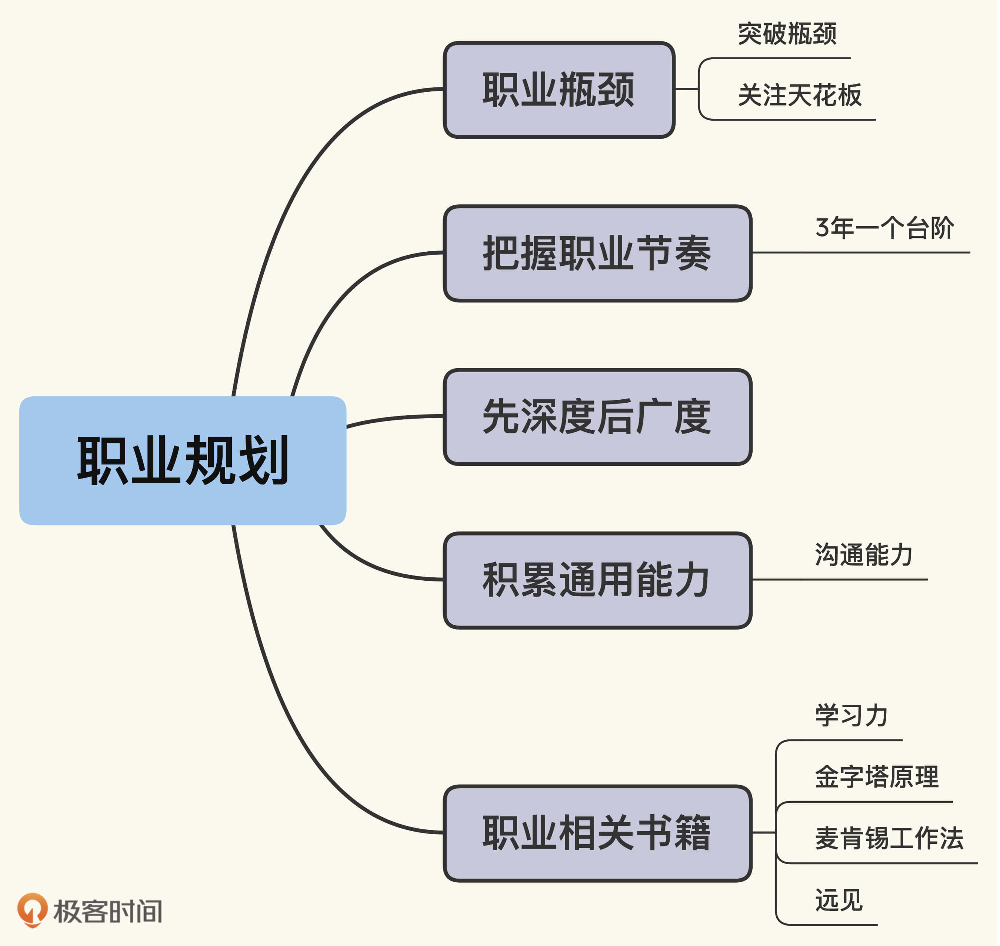

---
date: "2019-06-23"
---  
      
# 加餐五 | 投身物联网行业，如何做好职业规划？
你好，我是郭朝斌。

物联网是一个新兴行业，我想你选择进入物联网行业之前很可能有这样一个疑问：怎么做好自己的职业规划呢？

别着急，我们的老朋友司马特跟你也面临同样的问题，于是找到了学长求助，我们来看看他的学长是怎么说的吧。

今天是周日，司马特已经有了安排，中午要去拜访一位学长。这位学长在大学时期就是学校的“风云人物”，现在已经成为一家知名公司的中层管理者。司马特非常羡慕和崇拜他，并且把他当成自己的榜样，不断努力着。

司马特和学长是在一次同乡会上认识的，一直保持着联系。不过，平时他们各自忙于工作，虽然在同一座城市，见面的次数却不多。

最近司马特一直在思考下一步的职业发展，但是思路还是不清晰。今天好不容易约了一个饭局，他正盘算着好好请教一下学长。

吃过早餐，司马特开始看书。十点十五分，他听到了智能家庭管家的提醒。穿戴整齐后，司马特离开家，前往地铁站，他需要在十一点半赶到丽泽商城。那个商城离学长的家不远，司马特特意选在了那里，希望给学长省点时间。

十一点半，司马特到了丽泽商城，直接来到约定好的一家湘菜馆。他心里庆幸自己来得早，因为门口已经有人开始取号等待了，要是再晚一会儿，他等待的时间会更久。

很快就叫到了司马特的号码，他进入了餐厅，选了一个靠近墙角、比较安静的座位坐下。

<!-- [[[read_end]]] -->

十二点差五分的时候，学长终于到了，坐定后问道：“小特，你来得很早吧？我看外面等号的人很多。”

“还好了，没有太早，我到的时候，正好人还不多。你来点菜吧，我不太擅长。”司马特一边说，一边把菜单递过去。

## 职业瓶颈

点完菜，学长问司马特：“工作最近怎么样？”

司马特回答说：“最近工作上有些困惑，正想向你请教呢。”

学长示意他说下去，所以他接着说：“我感觉自己最近一年都没有明显的进步，做的事情难度不大，所以也提不起太大的兴趣。我是不是遇到职业瓶颈了？”

学长说：“**瓶颈不可怕，天花板才可怕。**遇到职业瓶颈有很多种原因，一种原因是**自己的能力无法提高了**。这在职业的初期比较少遇到，因为只要你肯学习，专业知识总是可以熟练掌握的。再加上现在的学习资源这么丰富，这么方便，学习的门槛更是大大降低了。以我对你的了解，你肯定不是这种情况。”

喝了一口水之后，学长接着说：“还有可能的原因是**外部环境导致**的，比如行业的趋势变化，影响了公司的业务发展，或者公司业务拓展的速度太慢等等。你们公司今年的业务的发展情况怎么样啊？”

司马特说：“公司今年业务挺好的，老产品销量不错，还开辟了一个新产品线。”

学长继续分析：“所以也不是公司成长的原因。据我了解，你们公司对员工的职业发展规划还是很完善的。那是不是你没有**向领导提过自己的升职期望**呢？”

司马特有些惊讶：“这怎么好意思主动提呢？上次我们老大问我‘你的职业规划是什么？’，我还不好意思地说‘听领导的安排’呢。”

学长听完，立即说：“这可千万不能不好意思啊！你工作已经有3年了吧，而且你的工作成绩很好，其实你已经符合晋升的条件了。但你们老大下面也有十来号人呢，如果你不主动说明自己的诉求，他是很难了解你的想法的。毕竟指标也有限，他不得已降低你的优先级，这种情况也是完全有可能的。”

这时，服务员端上来两道菜。在服务员走后，学长接着说：“而且，这会影响到工作任务的分配。你的工作没有挑战也是自然的事情了。”

司马特点头，表示明白了。

学长说道：“关于职业瓶颈，你也不需要太担心，分析出原因，去解决就是了。在你的职业生涯里面，你肯定还会遇到多次瓶颈，解决之道就是一个个跨过去。真正难突破的是天花板，这在小公司尤其常见。

“小公司层级少、业务小，一旦发展速度不够快，你很容易就会碰到职业的天花板，往往只能通过跳槽才能解决。不过你们公司足够大，已经给你提供了一个很好的平台。从这点说，你一毕业就站在了一个不错的起点。”

司马特感激地说：“我也是当时听取了你的建议，才进入了这个公司。”

学长摆摆手，说道：“我没有什么功劳，这是你努力学习，用你的才能争取来的。”

## 把握职业节奏

“不过，有一点我要提醒你。”学长接着说道，“你需要把握好自己职业发展的节奏。”

司马特问：“这个节奏要怎么把握呀？”

学长说道：“一个简单的方法是，**每3年上一个台阶**。这个‘3年’的数字不是定死的，你可能快一点，也可能慢一点，但是它可以提醒你对照自己的职业情况。”

吃了口菜，学长接着说：“时间是最宝贵的，失去了，你就永远也找不回来了。所以，千万不能停滞不前，否则短期内你可能看不出来，但是5年、10年过去你再看，可能已经跟别人拉开了很大的差距。”

司马特说：“确实是这样，那我要抓紧了，争取每年都有突破。”

学长提醒说：“你可千万不要从一个极端到另一个极端啊。每个人的职业生涯差不多都有二三十年，**这是一场马拉松，而不是短跑冲刺**。初期就是打基础、做好积累，不要太关注职位的提升、薪资的涨幅。否则你就成了揠苗助长，不利于自己职业的长期发展。”

司马特点了点头。

这时，服务员又端上两道菜，说道：“菜上齐了。祝你们用餐愉快。”

## 先深度后广度

司马特继续请教：“说到打基础，我一直有个疑问。我们上学的时候学得非常全面，计算机软硬件、通信技术、电子电路、传感器技术、网络安全、数据分析，甚至还有控制技术和物流管理等。但是工作中，我感觉好多东西都没有用到，这是不是基础打错了呢？”

学长思考了片刻，说道：“在学校学的主要还是通识性知识。虽然物联网专业的课程涵盖了很多不同的专业，但都只是对基本概念的了解，目的是让你有一个基本的认识。真正的职业基础还是从工作后开始积累的。

“打基础的一个基本原则是先选择一个方向，最好是自己感兴趣的方向，深入钻研下去，把这个方向变成自己的强项。然后再向外扩展自己的能力，也就是**‘先深度后广度’**。这样的话，你永远有一个根基，学习起其它知识，你也可以触类旁通。

“在拓展广度的时候，你仍然会遇到职业瓶颈。比如，你需要学习项目管理、团队管理、财务、营销等各种和你的专业完全不同的知识，这就需要你不断去突破自己。”

## 积累通用能力

司马特听完，有点沮丧：“这么多需要学习的东西啊，这怎么学得过来呢？”

学长鼓励道：“这没有你想象的那么难。因为你不一定要把每个技能都学到专家的程度，很多东西只要投入一定的时间，掌握个七七八八就够用了。而且，有些通用的能力，你只要不断积累，就会在各方面受益。”

司马特问道：“有哪些能力是通用的呢？”

学长说：“比方说**沟通能力**，无论你以后是继续从事技术专业的工作，还是走管理路线，它都非常重要。阐述技术构想的时候，你需要通过沟通来让大家真正理解，从而获得认可和支持。管理团队的时候，你也需要通过沟通来阐述团队目标，协调各种资源。”

司马特说道：“我感觉自己一直比较内向，不擅言辞。”

学长进一步鼓励说：“你放心，沟通能力你肯定可以不断提高。而且，你记住，关于沟通能力更重要的一点是，沟通不只是表达，还包括倾听。有效沟通的前提是听懂了对方，然后才能准确地回应，并且简单、清晰地表达出自己的意图。”

## 职业相关书籍

司马特听了学长的话，高兴地说：“那我有信心了。之前我只关注技术，以后我会多留意训练这方面的能力。学长你有什么书可以推荐给我学习吗？”

学长回答说：“我也只是工作了十年而已，对职场的认识也不一定全面。像《学习力》《金字塔原理》《麦肯锡工作法》这些讲具体的工作方法的书，我想别人也跟你推荐过了。这样吧，我给你推荐一本跟个人成长有关的书。

“这本书从更宏观的角度介绍了职业生涯的不同阶段，以及做好整个生涯职业规划的方法。书名是**《远见：如何规划职业生涯的3大阶段》**。你回头可以读一下，我相信一定会有收获的。”

司马特立即说：“我回去一定买来读一读。”

接着，他们一边吃饭，又一边聊了聊自行车骑行和家乡的话题。

饭菜吃得差不多了，学长看了一眼手表，说道：“我下午需要带孩子去上击剑课，今天我们只能聊到这里了。下次我们约着一起去骑行吧。”

“没问题。”司马特边说，边掏出手机，打算结账。结果，学长亮出手机，对司马特说已经支付了账单。司马特知道自己又晚了一步，也不再说什么。他们说笑着，一起走出了饭馆。

## 小结

总结一下，职业生涯是我们大部分人都要经历的一段旅程。在这段并不算短的旅程中，你可以从下面几个方面多思考：

1.  职业瓶颈。意识到职业瓶颈是你在职业生涯中经常要面临的情况，你需要分析原因，并且不断突破。
2.  把握职业节奏。你需要不断对照自己的职业情况，有节奏地不断进取。
3.  先深度后广度。在专业技能上，你需要先关注深度，然后再扩展其它方面的能力。
4.  积累通用能力。有些能力是可以让你在多方面受益的，比如沟通能力，你要更早地关注这类能力的积累。
5.  职业相关书籍。关于职业生涯的规划，你可以读一读《远见：如何规划职业生涯的3大阶段》这本书。

## 思考题

关于职业发展，你有什么困惑吗？欢迎在留言区和我交流，也欢迎你将这一讲分享给你的朋友，大家一起讨论交流。