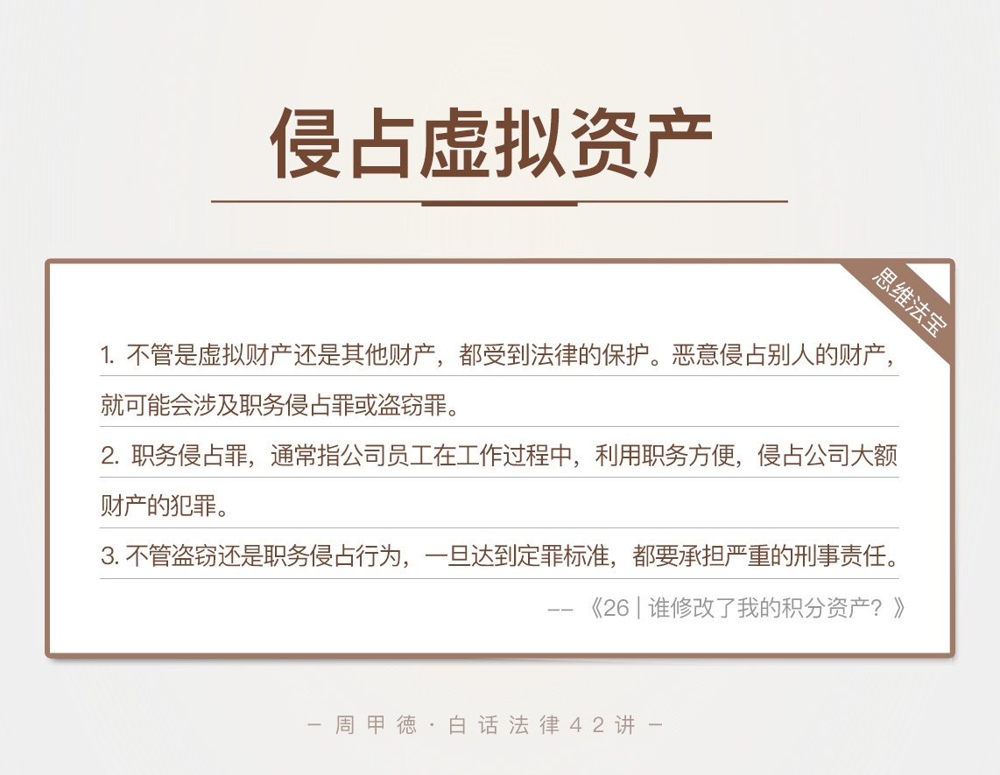

---
date: "2019-06-23"
---  
      
# 21 | 谁修改了我的积分资产？
80后、90后的回忆里，一定包括了各类社交软件和游戏。还记得几年前，积分充值会员升级，开通红钻、黄钻等装扮自己的账号，各类玩法在年轻人中特别流行。不过，涉及到花钱的事情，总会有些风险隐患。

Q币被盗了，积分减少了、莫名其妙降级了，这类游戏里的资产，或者可以叫做网络虚拟财产的东西，引起的纠纷也是逐渐增多。

虽然法律对于虚拟财产还没有特别明确的定义，但是虚拟财产的价值毋庸置疑，也得到了社会的广泛认可。今天我们就来看看虚拟财产的问题。

先来看这样一个真实的案例。

前端程序员小马，是一款“捕鱼”游戏的重度玩家，闲暇时间基本都花在了游戏上，乐此不疲地升级、获取积分然后提现。有一次，他发现这个游戏的积分兑换系统有明显漏洞，他可以借此修改系统后台的数据，获得大量积分，然后提现。

发现了这一点后，小马又研究了不少游戏网站，都找到了类似漏洞。商机砸脸上，要还不是不要呢？小马陷入了挣扎中。

细化一下小马的问题，其实主要有这么三点。

* 利用这些网站的漏洞，修改积分获利是否违法？

* 如果违法，有什么后果呢？

* 其它方式，比如利用工作便利，获得积分再提现，又会怎样呢？

这里，我们先需要了解几个法律知识。

## 法律知识

### 网络虚拟财产

开头我们提到过，这类积分、游戏币，可以叫做网络虚拟财产。网络虚拟财产跟我们平常所说的财产有什么关系呢？

<!-- [[[read_end]]] -->

其实，法律上的财产，一般指的就是货币，或者其他可以用货币兑换的物品。所以前面学过的房子、车子、存款，都属于这个范围。

而网络虚拟财产，尤其是我们接触比较多的网络游戏中的虚拟财产，主要包括账号等级、游戏装备、游戏币和积分等。这些东西大多是玩家花费大量时间、精力和金钱得到的，自然具有价值，同时一般也能用货币兑换（比如账号转卖、设备转卖、提现等），所以也是一种财产。

所以，不管是虚拟财产还是其他财产，都受到法律的保护。恶意侵占别人的财产，就可能会涉及职务侵占罪或盗窃罪。

### 职务侵占罪

职务侵占罪，指单位员工，利用职务便利，非法占用单位大额财产的行为。根据这个定义，我们也能看出，这个罪名的三个客观要素：

* 利用自己职务的便利，不管是直接还是间接方式都算数；

* 有侵占的行为，不管是侵吞、偷窃还是骗取，非法私有化的行为都属于非法占用；

* 财产数额比较大，如果数额比较小的也不能算作职务侵占，最低数额一般在5000到20000左右。

另外要注意，这里的单位和员工，不包括国家机关、事业单位等，也不包括国家工作人员，国家工作人员如果有同样的行为，属于贪污罪。

换句话说，职务侵占罪，适用的是非国家财产发工资的人。

职务侵占罪，其实大多还是因为公司管理不到位，给某些特殊岗位的员工留了漏洞，创造了违法的条件。不管因为什么原因起了贪念，走错一步就是犯罪之路。

### 盗窃罪

顾名思义，盗窃一般是指秘密窃取别人的东西，并占为己有的行为。不过，随着时代的发展，秘密窃取四个字你可以看成是通俗的说法，因为我们生活中大张旗鼓的盗窃事件也不少，所以盗窃不一定是秘密的手段。

盗窃的东西自然有一定的经济价值，而构成盗窃罪，对于数额也有一定的要求。

## 情景分析

现在我们在来看小马遇到的问题。

如果小马利用网站的漏洞，通过修改系统获得积分，并且提现来获利，显然是违法的。

虽然他直接获得的只是虚拟的积分，但积分本身有价值，可以直接提现，属于网络虚拟财产。而这一行为的主观上有非法占有的故意，客观上也有秘密窃取的手段，符合盗窃罪的条件。

至于盗窃的后果，各地要求不一。拿北京来说，如果盗窃数额超过2000元，就达到了盗窃罪的认罪标准，会被追究刑事责任。不过这里要注意，这里的2000元标准，指的是盗窃的数额，而不是你具体获利的数目。

第三个问题，小马如果利用工作便利，将可以提现的积分占为已有，那可能就是职务侵占罪了，具体能否构成，当然还要看数额等情况。

## 思维法宝

随着互联网技术的普及和发展，网络虚拟财产的范围会越来越广，相应的纠纷肯定也会越来越多。还是那句话，网络从来不是法外之地，网络虚拟财产的价值属性越高，相对应的，法律保护力度也一定会越大。

网络世界不越界，可以说我们的原则。你觉得可以获利的东西，在别人那里可能就是实实在在的财产，如果随意越界，轻一点的可能是民事责任，严重就是刑事犯罪了。  

最后，我们来总结一下今天的内容。

* 职务侵占罪，通常指公司员工在工作过程中，利用职务方便，侵占公司大额财产的犯罪。

* 不管是盗窃或是职务侵占行为，一旦达到定罪标准，都要承担严重的刑事责任。

虽然一两次的小额窃取，往往很难被发现，但是你要知道，人的本性是贪婪的。有了第一次第二次，就会有第三次第四次，大贪都是从小贪开始的。另外，这两种犯罪的认定，都是可以累计钱数的，并不是只看你被抓住这一次的后果。所以，莫伸手才是聪明的做法。

最后我想留一个思考题。在日常工作中，报销虚假的消费行为，违法吗？会有什么后果吗？你可以思考一下，写下你的答案。如果有其他的疑问或者经历，也欢迎你在留言区和我分享。