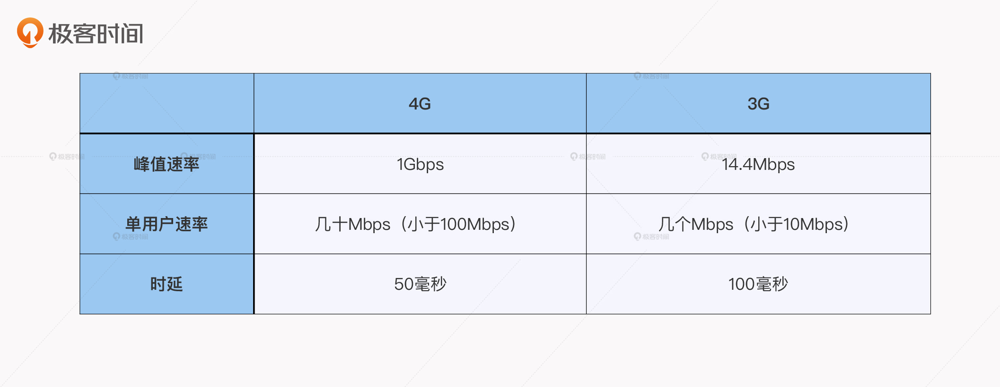
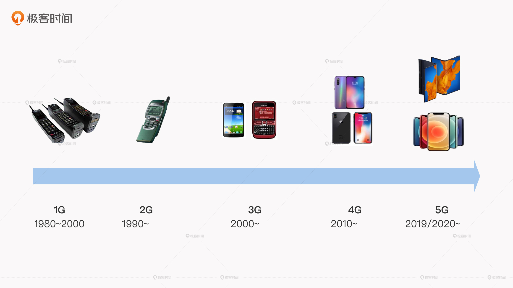
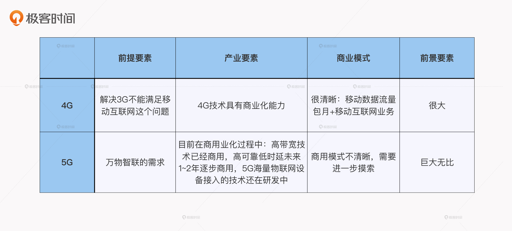

---
date: "2019-06-23"
---  
      
# 02 | 从4G到5G：发展5G真的有必要吗？
你好，我是杨四昌。

在上一讲，我们在分析1G\~3G发展历程时，从前提要素（满足需求或者解决问题）、产业要素（技术满足商业化条件）和前景要素（是否具备规模经济效应）这3个维度找到了移动通信技术的内在发展规律。

4G和5G也是移动通信技术，那它们的发展还遵循这样的内在规律吗？有人说“4G改变生活，5G改变社会”，又是怎么理解呢？

今天这一讲，我们就一起去看看4G的发展和5G的前景，一起来弄清楚这个说法吧。

## 4G：移动宽带改变生活

上节课讲到，2008年智能手机的普及促进了移动互联网的发展。而随着移动互联网业务的发展，3G网络逐步暴露出各种问题。我这有典型的两个例子：

* 用3G网络看在线视频，时延、卡顿、黑屏是家常便饭；
* 用3G网络下载一个App或者打开一个电商网站的购物页面，也是慢得出奇。

这些问题的出现，恰恰说明了3G速度慢、时延大，用户在使用很多业务时都感觉不畅顺、不痛快、不爽。很明显，3G已经不能满足移动互联网的发展了，这种情况下，4G就逐步发展起来。

**4G 怎么解决3G速度慢和时延大的问题呢？**

通过正交频分复用\(OFDM\)、多输入多输出\(MIMO\)、载波聚合\(CA\)、全IP分组核心网等技术，4G能提供峰值速率高达1Gbps、单用户速率能达到几十Mbps、时延一般在50毫秒的网络体验。

<!-- [[[read_end]]] -->

如果你对这个数字不敏感的话，可以对比看下3G的数据：3G的峰值速率为14.4Mbps、单用户速率能达到几Mbps、时延一般在100毫秒左右。

因此，4G技术能更好地支持各种移动互联网业务的发展，解决了3G技术存在的问题。

我可以带你看几个关键节点和数据，感知下4G发展的节奏：

* 早在2004年，移动通信行业就开始启动4G的标准技术研究工作了；
* 接下来几年，4G技术标准制定完成，技术产业化进展顺利，在2010年开始在欧洲和美国商用；
* 4G开始商用后几年内，4G在全世界陆续商用，用户数达到了5亿。

看到这些数字，是不是想起了我在上一讲说过的一句话：移动通信的发展基本遵循每10年升级一代技术的节奏。

没错，但是从4G时代开始，移动通信产业不仅仅是一个移动通信技术以一个周期进行迭代升级那么简单了。这是因为从4G时代开始，**衡量移动通信技术市场规模经济大小的指标，发生了变化**。

在1G\~3G时代，移动通信技术的使用和影响力，主要是在移动通信产业内部，因此其市场规模可以通过“用户数×每用户产生的话费”来衡量。

而4G技术除了提供1G\~3G的各种通话业务外，其影响力已经辐射到我们生活的方方面面。主要原因是，4G能提供的移动宽带能力和互联网的业务创新能力相结合，催生了各种各样的移动互联网业务，而这些业务成功改变了我们的生活：

* 微信改变了人与人之间交流和沟通的方式；
* 支付宝改变了人们的支付方式；
* 淘宝、京东和拼多多等电商改变了人们的购物习惯；
* 美团和饿了么改变了人们的就餐习惯；
* 滴滴等打车App改变了人们的出行习惯；
* 手机微博和今日头条改变了人们获取信息的方式；
* 爱奇艺和腾讯视频改变了人们的影视娱乐习惯；
* 各种共享经济在一定程度上让使用权和所有权分离。

当然，这样的例子还有很多。“4G改变生活”这句话，一点也不假吧？

因此，在衡量4G技术的发展潜力时，除了需要考虑4G用户数产生的话费总额，我们还得考虑4G和互联网结合产生的经济效应以及对人们生活的影响力。综合考虑这几点，**4G产生的规模经济效应该是远大于1G\~3G的**。

通过上面这些例子你也可以看出来，4G的整个价值链条非常复杂，不同的参与方挣钱的方式肯定不一样。也就是说，不同参与方商业模式不同，而商业模式的成功或者失败，也直接影响到各参与方的生产。

因此，**从4G开始，判断一个移动通信技术成功与否时，需要增加一个关键因素，这就是商业模式**。

这么说可能有点抽象，我们举一个4G网络投资建设的主体运营商的例子吧。运营商在4G时代的主要商业模式，就是通过提供各种不同的数据流量套餐来挣钱。运营商的这个商业模式虽然简单，但是挣得却是自己能力范围内的钱：运营商作为数据管道，通过提供数据流量带来的收入和利润，都在持续增长。

你看，综合上面这些因素，我们已经可以判定4G是一项成功的技术了：

* 前提要素：4G是为了解决3G不能满足移动互联网业务需求的问题而出现的，所以有坚实的前提条件；
* 产业要素：4G时代，移动通信产业合力制定技术标准，并在2010年完成产业化，开始商用；
* 前景要素：4G移动宽带和互联网结合，其影响力渗透到我们日常生活的方方面面，发展潜力远远超过了1G\~3G。可以说，4G的发展潜力，包括4G移动通信业务本身再加上移动互联网的潜力；
* 商业模式要素：由于4G参与方多，价值链条变得更复杂。4G时代运营商的商业模式清晰，作为主要参与方的互联网企业也有清晰的商业模式，因此4G商业模式是清晰且成功的。

但，随着4G业务的发展，新的需求和问题也来了：大量的新型业务如AR/VR、云游戏、高清直播、高清/超高清视频等，导致流量需求剧增，需要更大的带宽；车联网和车路协同、工业互联网，对时延和可靠性严格要求；物联网业务蓬勃发展，带来了海量物联网设备的接入需求。

而4G技术不能给大带宽、低时延高可靠、海量物联网设备接入这3类需求的提供足够的支持，此时5G技术就逐步提上日程了。

那么，5G又是如何解决这3类需求的呢？

## 5G：万物智联的社会

5G通过100MHz甚至高达400MHz的频谱带宽，结合新型编码、大规模天线阵列和载波聚合等技术的使用，极大地提升了系统的性能指标，你可以看看下面的具体数据感受一下：

* 5G最高峰值速率达到了20Gbps、单个用户速率能达到1Gbps，可以满足各类AR/VR，云游戏、高清直播、高清/超高清视频的大带宽需求；
* 5G的时延为1毫秒/10毫秒，可以满足各类低时延高可靠业务的要求；
* 5G能支持每平方公里100万物联网设备的接入，折合每平方米一个物联网设备，可以满足目前物联网的接入需求。

满足了这些需求，**5G的产生就具备了前提条件。**

接下来，我们看看5G的技术成熟度和商业化情况。

目前，5G的技术标准化和产品商业化在同步进行中，具体情况如下：

* 支持高带宽的技术已经商用，如高清直播、高清视频等等，各国也在陆续部署中；
* 支持低时延、高可靠的技术标准化工作已经基本完成，目前处于商用的初期，还是以试点或者小规模部署为主，离大规模商用还需要一些时间；
* 目前所说的5G物联网技术都是指NB-IoT或者eMTC，采用5G来支持海量物联网设备接入的技术标准，目前还在制定中，预计在2022年基本完成，目前看来，距离商用还有一段时间。

总体来看，说到5G的发展潜力和市场前景，没有人会怀疑，但是真要达到改变社会方方面面的程度还需要一定的时间和努力。如果套用一句俗语的话，那就是：前途是光明的，道路不是一帆风顺的。

从目前已经商用的情况来看，5G目前的商用模式还是以To C（面向消费者个人）为主，比如运营商目前主推的5G视频类业务等，运营商的5G套餐也是流量包月为主，与4G的商业模式类似。而5G目前To B（面向企业用户）业务的商业模式还在摸索中。

但业界对5G的前景和可能带来的规模效应还是非常乐观的：

* 对于国内情况，信通院对5G的规模经济效应已经有了专门的研究，发布了《5G经济社会影响白皮书》，预测2030年，5G带动的直接产出和间接产出将分别达到6.3万亿元和10.6万亿元；
* 对于全球情况，IHS在《5G技术如何影响全球经济》中指出：2035年5G将在全球产生12万亿美元的经济活动产值。

因此从客观上看，5G目前处于发展初期。5G的大带宽类型技术已经商用，5G低时延高可靠类型的技术预计在未来1\~2年逐步迈入商用阶段，但5G支持物联网设备接入的技术还在研发中，不过我们从业界的预测中依然可以乐观地相信，5G的未来，大有可为。

而这也意味着，现在就是学习5G的技术、寻求5G技术红利的最好时机。

## 总结

好了，这一讲就到这里，我们来回顾下这一讲的重点吧。

我们一起回顾了4G的发展历程，也介绍了5G 的发展情况，然后我们对5G的发展阶段做出了判断。4G和5G的发展，与移动通信产业发展的4个关键要素密切相关：

* 前提要素：解决当前的主要问题或者满足当前主要需求；
* 产业要素：技术是否可商用化；
* 商业模式：清晰的商用模式，也就是靠什么挣钱；
* 前景要素：是否具备规模经济效应（衡量指标：用户数 x 每用户产生的价值）。

为了便于你理解，我这里用了一张表来总结归纳一下这四个关键要素和4G、5G发展历程的关联。

## 课后思考题

学完这一讲的内容，我想请你按照这一讲的思路，找到一个5G典型的低时延高可靠的行业应用和海量物联设备接入的应用，分析一下它们的应用前景和商业模式。

我是杨四昌，感谢你和我一起学习。如果你身边的朋友，也在讨论5G到底有没有必要、前景如何，欢迎你把这一讲内容分享给他，我们下节课见。