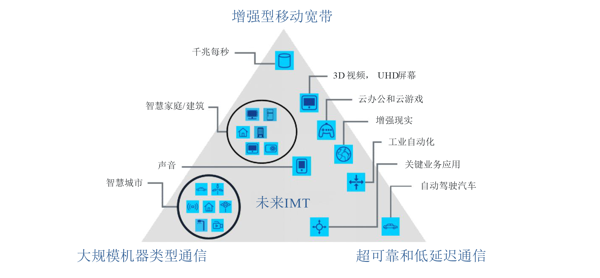
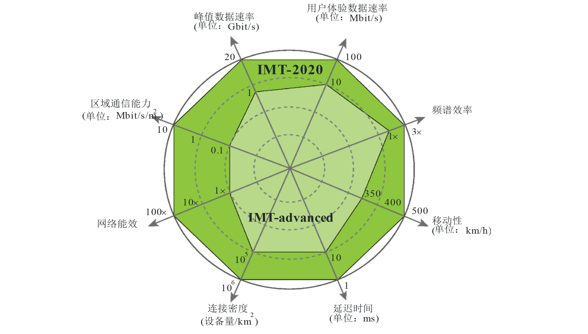
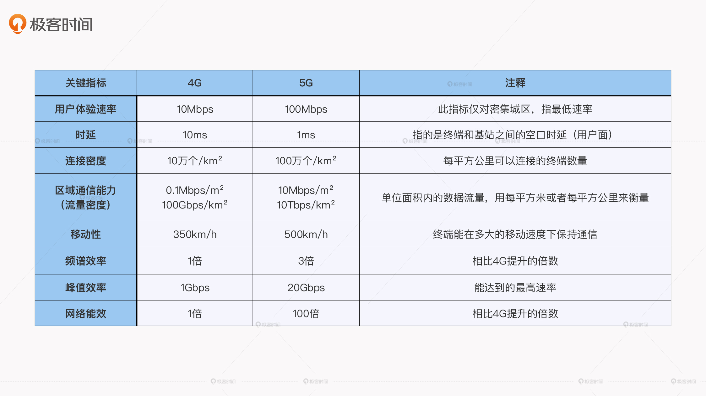
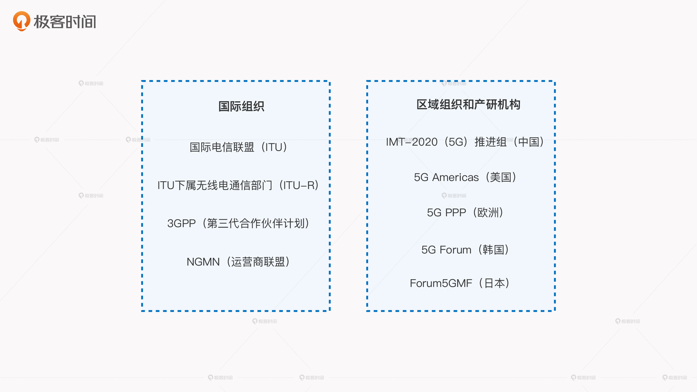
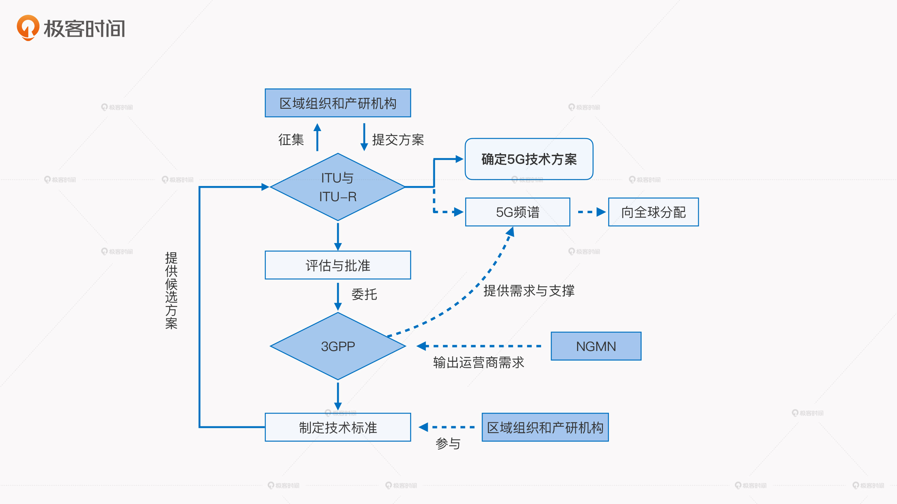
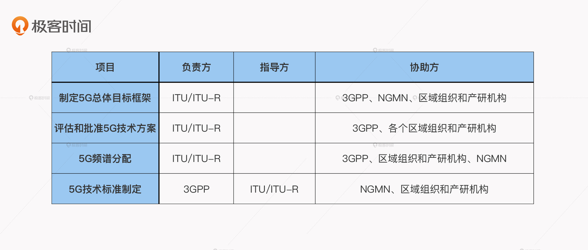
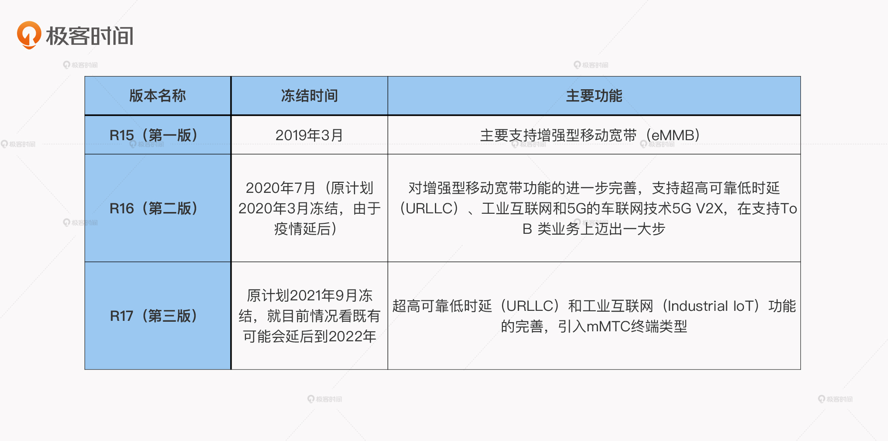

---
date: "2019-06-23"
---  
      
# 05 | 决定5G产业生态的技术标准，是怎么制定出来的？
你好，我是杨四昌。

通过上节课的学习，你已经知道了5G的整个产业全景图是怎样的，也对5G有了初步的了解。

那当前5G的产业生态能如此欣欣向荣，靠的又是什么呢？答案很简单：标准。万事万物要成体系都得有标准，**5G的技术标准就是5G产业生态的重要基础**。

一说到5G标准，你可能觉得很太专业、太遥远，是科研工作者才需要关心的事情，但其实5G标准离我们并不远，它与我们的日常生活息息相关。业界有个说法：“一流企业靠标准，二流企业靠品牌，三流企业靠产品”。这里所说的标准就是行业的游戏规则，只要你在这个行业里，就必须遵守这样的游戏规则。

制定标准的企业，就对这个“游戏”有了绝对的掌控权。

我们就拿掌握了5G专利技术的高通和华为来说，每一部5G手机，我们都大概需要给高通缴纳大概2.275\%～3.25\%的专利费，给华为不超过2.5美元（折人民币大约16元）的专利费。除了他们之外，诺基亚、爱立信等公司也要收5G专利费。现在，你知道为什么5G手机比4G手机贵了吧？

除了5G手机，5G技术被越来越多地应用到汽车行业中。5G的专利费，已经成了汽车行业和5G移动通信行业之间争论的焦点。你看，5G专利费都开始收到汽车行业去了，可见5G技术标准的辐射力确实很厉害。

<!-- [[[read_end]]] -->

既然5G标准这么重要，那5G标准是怎么制定出来的呢？别急，我慢慢跟你讲。

从以往的3G和4G标准制定的情况来看，在制定一代新的移动通信技术标准时，业界首先要开展广泛的讨论，就这个新的移动通信技术标准要实现的目标和关键性能指标达成共识，也就是说，我们制定5G技术标准的前提，就是要先明确5G的愿景目标和性能指标。

## 5G的愿景目标和性能指标

那5G的愿景目标和性能指标，是由谁来确定的呢？是国际电信联盟（简称**ITU**）。

国际电信联盟，是联合国专门负责信息通信技术（ICT）事务的机构，致力于实现世界上所有人之间的互联互通。可以说，我们今天打的每一通电话、发送的每一封电子邮件、浏览的每一条微博，都受益于它的工作。

国际电信联盟（ITU）从1985年开始，启动移动通信系统课题的研究，并于2000年首次主导了3G移动通信技术的发展，在这以后，包括4G、5G，以及未来6G在内移动通信技术的发展，都是由国际电信联盟来主导的。

接下来，我们先分别看看5G的愿景目标和性能指标是什么，然后再看看有了这些前提条件怎么去制定技术标准。

国际电信联盟在2012年启动了5G研究，并在2015年完成了5G愿景建议书。

这里的“发展愿景”，其实就是我们常说的用户和市场需求、业务趋势和应用趋势。根据这个愿景，它还制定出了移动通信技术的总体框架，细分出了应用场景、关键特性、研究方向和标准化时间表。

在愿景建议书中，国际电信联盟定义了5G的3大目标场景，以及衡量这3大目标场景的8个关键性能指标，也就是8个KPI指标。

这3大目标场景是什么呢？我们先看下[这张图](https://www.itu.int/dms_pubrec/itu-r/rec/m/R-REC-M.2083-0-201509-I!!PDF-C.pdf)：

我们先看第一个场景，**增强型移动宽带（Enhanced mobile broadband，eMBB）。**

增强型移动宽带可以提供大范围的连续覆盖，同时还能提供更多的流量，满足大容量、高速率的传输需求。

给你举个例子感受一下。试想你现在在听周杰伦的演唱会，现场有几万人，你想用手里的4G手机，给没到场的亲朋好友发视频、开直播，这显然是不太可能的，估计你连手机信号都找不到。但是在5G的支持下，现场的每一个人都能轻松发视频、开直播，网速不会因为海量的人群受到影响。

这就是热点高容量和连续广域覆盖的场景，像AR/VR、高清视频、超高清电视、3D等应用，都需要超高速率的支持。于是，国际电信联盟就把需要这类应用的需求归纳为一个目标场景，命名为增强型移动宽带（eMBB）。

除了一些应用对超高速率有额外的需求外，还有一些应用场景对网络的可靠性和时延的要求非常苛刻。比如，我们日常生活中的抢红包就是这样。在手速一样的情况下，你用4G手机肯定抢不过使用5G手机的朋友。其中，很重要的一个原因就是5G的时延比4G低得多，直观感受就是快人一步。

这就涉及到了，第2个目标场景：**超可靠和低时延通信（Ultra-reliable and low latency communications，URLLC）**。

当然了，我们大力发展5G并不是专门为了你能抢到红包。其实，除了抢红包，在URLLC下还包括了很多重要且关键的应用，比如自动驾驶、智能制造、自动控制和工业机器人等。这些应用需要在各自的场景下，实时应对各种突发情况，并能迅速、准确地作出判断和响应，这就要求网络具备超可靠、低时延的特性。

比如，行驶在道路上的自动驾驶汽车，面对突然闯入的行人，必须及时识别并作出紧急刹车等决策，才能避免酿成悲剧。在这样“毫秒必争”的时刻，网络的延迟显然不能再以“秒”来计算了。

好了，我们来看5G的第3个目标场景，也就是**大规模机器类通信（Massive machine type communications，mMTC）**。

这个名词可能有点不好理解，我们换个词，它也叫海量物联网设备的接入，适用于低功耗大连接的场景，例如我们常说的智慧工厂就适用于这种场景。

5G时代，工厂里各种设备和生产物料将通过5G物联网接入工厂管理系统，企业不再需要人工或电脑定时检查物料的使用情况和设备日常维护信息，物联网会把这些信息实时送到你手里，有效提升管理效率、降低成本。届时，我们将进入智慧工厂时代。

未来物联网还将在城市公共设施、物流、农牧业、环保、家居、个人健康监测，以及个人穿戴设备等许多领域得到大规模地应用，童年曾经畅想的“科幻世界”正一步步来到你面前。

好了，你现在知道了，**增强型移动带宽、超可靠和低时延通信、大规模机器类通信就是5G的3大目标场景**。那对应到每个场景的性能指标又是怎样的呢，也就是说我们要怎么样把这3大场景的主要特性描述清楚呢？

其实每个场景对应的性能指标都是不同的。比如，你用5G手机上网，可能对最高网速有要求，对平均网速有要求，对移动性有要求，对时延也有一定要求。你看，用这4个性能指标，我们就可以衡量5G上网到底好不好了。

国际电信联盟在考虑了这3大目标场景后，提炼出了8个关键性能指标，力求把5G的3大场景的各种应用描述清楚。

这8个关键性能指标，你可以看一下[这张图](https://www.itu.int/dms_pubrec/itu-r/rec/m/R-REC-M.2083-0-201509-I!!PDF-C.pdf)：  

这张图看起来还挺复杂的，那该怎么理解呢？

你看到中间的放射状色块了吗？其中，浅一点的绿色区域被标记为IMT-Advanced，它代表的是4G的关键性指标；而深一点的绿色区域上写着IMT-2020，代表的就是5G的指标。

我把4G和5G的指标对比数据放在了一张表。相对于4G，5G的关键性能指标的提升是很直观的。

好了，明确了5G的三大目标场景和八大关键指标后，接下来的问题就是怎么制定这个5G技术标准。

相信你已经从一些相关报道了解到，很多组织以及不同国家的企业都在参与5G标准的制定，比如华为、爱立信、各国运营商、3GPP等等。那么，他们到底在做些什么？又是如何分工协作的呢？这里就不得不提5G技术标准的运作机制了。

## 5G技术标准运作机制

3G时代，全球有四个标准（包括：中国的TD-SCDMA、欧洲的WCDMA、美国的CDMA2000以及美国的Mobile WiMAX），到了4G时代全球已经集成为两个标准，分别是中国主导的TD-LTE和在欧美部署比较多的FDD LTE 。

从4G开启的移动互联网时代开始，移动通信行业的利润被苹果和谷歌这类互联网企业持续侵蚀，包括运营商在内的移动通信行业利润不断下滑。面临日益艰难的竞争环境，大家都不想也确实没那么多投资，来搞不同的技术标准了。因此到了5G时代，移动通信行业达成共识，要在全球范围内统一标准，实现全球范围内的互通互联和产业融合。

而要制定一个国际通用的技术标准，就离不开几个国际组织和区域组织以及各国的产业和研究机构的统一协调工作。由于区域组织和产研机构很多，这里只列出重要的几个。可以说，整个5G技术标准的运作机制就是靠这些重要的组织和产研机构来实现的：

这些国际组织和区域组织及产业研究机构承担着不同的职责，他们会相互配合，一起推动5G技术标准的制定。

ITU和它下属的无线电通信部门（ITU-R），负责制定5G的总体框架，也就是5G的愿景目标和性能指标，并向各个区域组织和各国产研机构征集符合国际电信联盟5G愿景和5G总体框架要求的5G标准候选方案。

收集完5G候选方案后，ITU和ITU-R这两个组织还会对方案进行评估和批准。当5G方案获得批准，ITU会委托3GPP负责5G技术标准的制定，并负责在全球范围内统一分配5G所需的频谱的工作。你应该可以感受到，ITU和ITU-R这两个国际组织在整个过程中占据着主导地位。

而在此过程中，由全球运营商组成的联盟NGMN，会代表运营商向3GPP提供自身的网络技术需求。

而那些区域组织和产研机构则会集结所在国的产学研力量，进行5G的前瞻性研究，把研究成果代表所在国的方案提交给ITU进行评估。与此同时，他们也会和3GPP合作，参与5G技术标准的制定。

为了让你更加直观地理解这些国际组织和区域组织的运作机制，现在，我把上述过程用一张图呈现给你：

最后，你还可以通过这张表对各个标准组织在5G技术标准制定中的作用有一个总体认知。

讲到这里，我们已经清楚5G技术标准是由哪些组织来制定的，以及这些组织之间的运作机制和各自分工是怎样的。在此基础上，我们就详细来看看当5G方案通过后，3GPP是如何把这些方案变为具体的5G技术标准的。

## 3GPP与技术标准的完善

我们先不急着进入到具体的制定流程里，我们先来了解一下3GPP这个组织。为什么呢？因为当你搞清楚这个组织是怎么一回事之后，就能基本明白制定5G技术标准的背后逻辑了。

3GPP，又叫第三代移动通信合作伙伴计划，成立于1998年12月，最初由欧洲电信标准化组织牵头，联合了几个标准化组织成立的，来共同制定欧洲的3G技术标准（WCDMA）。随着时间推移，3GPP逐步成为了移动通信技术标准的制定机构。

目前，3GPP有7个成员伙伴，负责共同决定3GPP的总体策略，这7个标准组织分别来自：中国CCSA、日本TTC、ARIB、韩国TTA、印度TSDSI、欧洲ETSI和美国ATIS。

除此之外，3GPP还有22个市场代表伙伴，这些市场代表伙伴来自各个产业组织机构，在标准需求、市场和产业领域展开合作，同时3GPP还有大量的个体会员，一般是企业或者研究机构，可以参与标准的制定工作。具体名单你可以参考[3GPP网站](https://www.3gpp.org/about-3gpp/partners)。

看到这里你就应该明白了，**3GPP是从需求和利益相关方这两个维度代表了广泛的产业需求**。

在具体的制定流程上，3GPP严格的遵循下面的流程：

* **研究内容收集阶段**：广泛收集各方的需求，通过内部讨论确定每个版本的研究范围，这个阶段结束后就进入标准研究阶段，在研究内容收集阶段，3GPP内部各个成员组织会提交需求，NGMN也会代表运营商提出需求，同时各个行业组织也会从本行业的角度出发提出需求。因此内容收集的来源是有广泛代表性的。
* **标准研究阶段**：组织讨论各种技术提案，在多方博弈中确定技术方案，这个阶段结束后，这个版本的内容就不能再变更了。
* **标准发布阶段**：整理各种文稿，形成最终的版本发布材料。

3GPP就是这样严格地按照发布一个版本，再进入下一个版本研究这样的节奏在推动标准的完善。

**到这里，你可能想问了：5G技术标准当前的进展是怎样呢？**

我们就以3GPP的5G标准的进展，来展开说明一下吧。3GPP的5G技术标准化工作主要在三个版本的迭代，分别是R15、R16和R17。你可能又要问了，5G技术标准化工作为什么不一次完成，而要分成不同的版本来迭代完成？

其实原因很简单，主要有以下两个方面：

* 5G是一个很复杂的技术，涉及的技术很多，如果要一次完成需要好几年时间，商用时间会比较晚，我们会错失产业化时间窗口，同时商用时产生的新需求，也能推动我们标准不断完善。
* 5G技术包括3个场景，增强型移动宽带是To C的应用，只需要考虑移动通信产业内部，相对容易一些；而超可靠低时延和大规模物联网设备接入更多的是To B的应用，需要综合考虑各行业的实际情况，在标准制定上比较复杂。所以在制定5G标准的时候，3GPP先制定了To C场景的标准，再来制定To B场景的标准。

基于上面两点原因，3GPP对5G技术标准制定了3个版本，每个版本都给出研究的范围和版本完成时间，专业术语叫版本冻结时间。

第一个版本R15主要实现了对增强型移动宽带（eMBB）这一个应用场景的支持，R15对超高可靠低时延（URLLC）只有初步的研究，没有深入，R15在2019年3月的时候就被冻结了。

接着，在R15的基础上，3GPP开始制定5G技术标准第二个版本，也就是R16。R16进一步完善了增强型移动宽带的功能，除此之外，它还支持了超高可靠低时延（URLLC）应用和支持工业互联网（Industrial IoT）、5G车联网技术5G V2X ，这也就意味着**基于R16的5G在支持To B类的业务上迈出一大步**。

不过，由于疫情的影响，R16的冻结时间，从预先确定的2020年3月推迟到了2020年7月。

到了第三个版本R17，3GPP又在R16的基础上，完善了超高可靠低时延（URLLC）和工业互联网（Industrial IoT）的功能，引入增强型的mMTC终端类型，主要目的是支持这么几个功能：

* 工业无线传感器（2Mbps以内速率，5\~10ms时延，电池寿命几年）；
* 中高速视频监控（上传速率为2\~25Mbps，可靠性高于NB-IoT/eMTC，但低于URLLC）；
* 高速可穿戴设备（上行50Mbps下行150Mbps）；
* 切片性能增强（在无线侧引入不同服务等级的切片）；
* 终端高级节电功能（通过极小数据包传输特性）。

当前，3GPP还在研究R17版本的5G技术标准，并计划在2021年9月冻结这一版本，不过根据目前的进展情况来看，这个时间极有可能会延后到2022年。

到这里，你已经知道3GPP是如何将世界上各大主要通信标准组织和产业化组织提供的方案，汇总制定成正式的5G技术标准了，你也了解了当前5G标准各版本是如何完善和推进的了。当前，3GPP制订好的5G技术标准正在推动5G产业的飞速发展，关于5G产业的内容我会在后面详细和你讲述。

## 总结

最后了，我们来总结一下吧。

这节课我带你全面了解了5G技术的要达到的目标（三大应用场景）和它们相对的性能指标（8大关键性能指标），还带你了解了在ITU主导下各个区域组成参与的5G标准运作机制，以及5G技术标准的负责方3GPP在5G标准上的版本进展情况。我在这里用一张图总结一下。

目前5G的标准正在按部就班地制定中，按3GPP的之前的工作规划，到R17版本，5G的标准应该就比较完善了。但从目前的情况来看，R17也没法完全覆盖URLLC和mMTC的所有场景需求。

因为在以前，可以说直到4G为止，移动通信技术都是以To C的场景和需求为主，所以如何根据To C 的需求来制定标准，3GPP轻车熟路。但进入到5G后，我们要同时把应用场景极其复杂的两大To B场景纳入到5G技术架构下，这就比较难了。3GPP要做的5G相关的工作到R17也还没有结束，未来还将继续在R18甚至R19版本中完善。

接下来的一讲，我们就要开始正式学习5G的技术，了解5G技术的方方面面了。

## 思考题

好了，今天的课就到这就告一段落了。我给你留了个思考题，我想请你结合这节课所学内容，分别找一个URLLC和mMTC的应用场景，并分析一下它们分别需要8大关键性能指标中的那几个来支持，也可以谈谈你的看法，我在留言区等你。

感谢你的学习，如果你喜欢这节课，也欢迎分享给更多的朋友。我是杨四昌，我们下节课见。