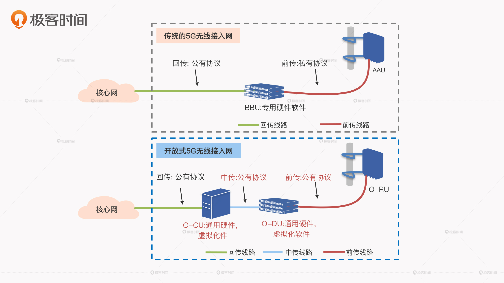
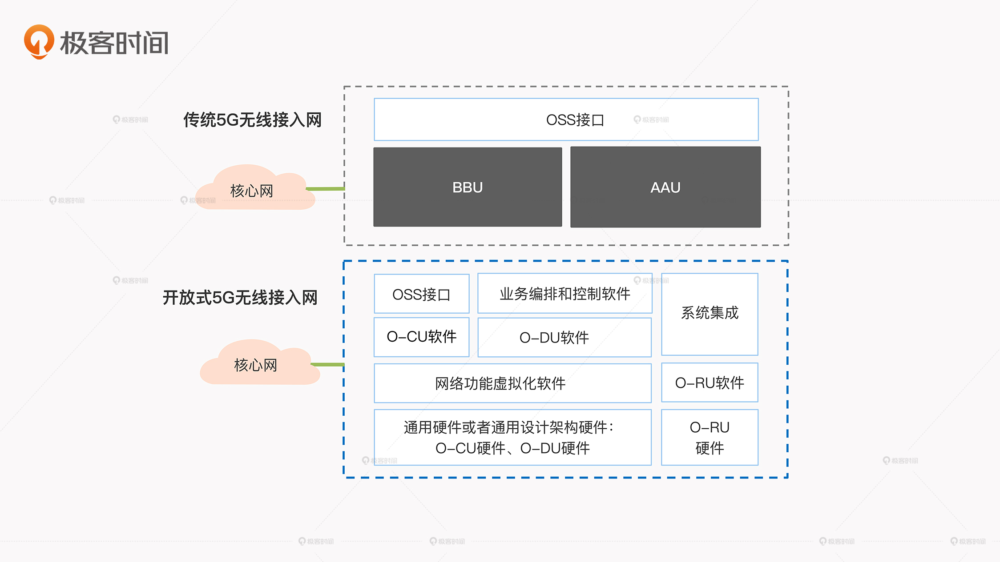
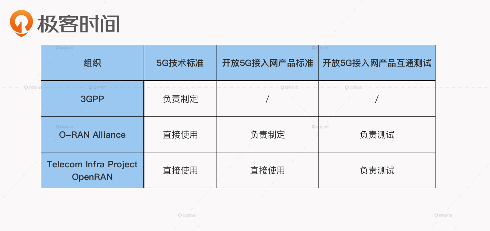
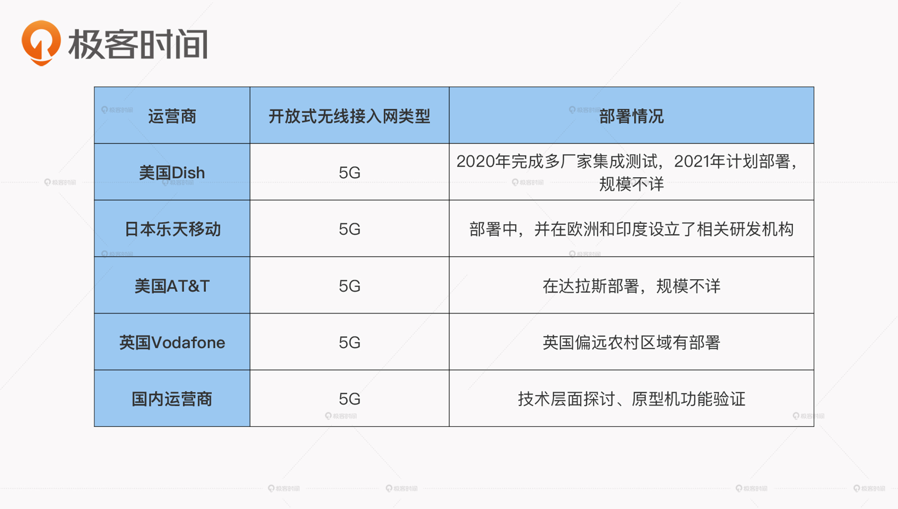

---
date: "2019-06-23"
---  
      
# 08 | 基于IT技术的开放式无线接入网，到底可不可行？
你好，我是杨四昌。

最近这几年，不知道你有没有听过这样一个新闻，美国的电信巨头——AT\&T，突然宣布要向全软件化、IT化转型了，立志成为一家软件企业，还说要通过虚拟化和开源技术来部署5G基站。

你可能会觉得很奇怪，一家传统电信巨头，怎么突然转行来搞IT了？

其实它不是真的要投身互联网搞传统的IT，而是希望通过IT技术把封闭的无线接入网生态IT化，变成一个开放式无线接入网来支撑AT\&T的数字化转型，打破传统的无线接入网设备巨头的市场垄断地位。

这样的一个开放式无线接入网，你可以简单理解为使用通用的硬件架构，结合开源的云计算和虚拟化软件，来把以前专用的基站产品变成类似IT一样的、用通用硬件安装软件的产品结构。

这种和传统截然不同的开放式无线接入网受到了很多移动运营商的追捧，甚至成为了近几年移动通信领域最热门的讨论话题。比如新晋移动运营商日本的乐天移动（Rekuten）和美国的Dish都纷纷开始部署开放式5G网络；还有很多老牌运营商，比如日本NTT Docomo和欧洲最大运营商Vodafone，也开始尝试在局部小范围内部署开放式5G无线接入网。

当然，它也收到了很多质疑。最典型的代表是美国的T-Mobile，在公开场合表示开放式无线接入网目前并不成熟，质疑开放式无线接入网所宣传的节省部署成本是不正确的。华为也从产品成熟度、性能指标和功耗等技术角度对开放式无线接入网提出质疑。

<!-- [[[read_end]]] -->

这个基于IT技术的开放式无线接入网，未来发展前景究竟是怎么样的呢？现在众说纷纭，每个人有每个人的看法，但我觉得一个专业的判断，必定是基于足够多的事实和信息为基础做出来的。

现在，我就会带你全面了解这个基于IT技术的开放式无线接入网的前世今生，进而帮助你对开发式无线接入网的发展前景做出分析和判断。

## 开放式无线接入网是啥？

开放式无线接入网，英文也叫Open Ran Access Network 。前面我已经和你简单介绍了它的概念，这里就用5G作为一个例子帮助你深入理解一下。

其实，开放式无线接入网不仅仅适用于5G网络，当然由于5G正好处于发展初期，采用新的架构没有啥历史包袱，所以我们开放式无线接入网在5G中用得比较多。我们把开放式5G无线接入网与传统的5G无线接入网放在一起对比一下，你就能很快知道它们的差异了。

你从图中可以看到，对传统5G无线接入网来说，BBU采用的是专用的硬件和软件，BBU和AAU之间的前传采用的是私有协议。

但到了开放式5G无线接入网，BBU从功能分解成了O-CU（中央处理单元）和O-DU（分布式处理单元）这两个部分，其中O-CU负责高层协议处理，O-DU负责实时物理层协议处理。到这里，传统5G无线接入网的AAU变成了O-RU（无线单元），这个时候，O-DU和O-RU之间的前传采用了公有协议，O-CU和O-DU之间是中传，也采用了公有协议。等于说，开放式5G无线接入网的所有传输接口都是采用公有协议。

另外，O-CU和O-DU都采用的是通用硬件，并基于虚拟化软件和开源软件实现软件与硬件的解耦。

接下来，我把“传统5G无线接入网”和“开放式5G无线接入网”的功能做了一个对比，你可以看看下面的功能示意图：

从图中可以看出来，传统5G无线接入网的BBU和AAU完全是一个黑盒子，内部实现机制只有厂家自己清楚，对外开放的接口只有OSS接口和到核心网的接口。

而开放式5G无线接入网，是通过通用硬件和虚拟化、开源的软件，把传统的BBU和AAU这两个黑盒子变成8个标准的功能组件。每个组件都之间的互联互通都是开放和公开的，因此每个组件都可以形成多供应商供货的局面。当然另一方面，一致性测试的工作量也大大增加了。

我这里再强调一下，以便加深你的印象。开放式无线接入网就是通过把无线接入网的前传、中传、回传接口全面标准化，并采用通用硬件叠加云计算和虚拟化软件，把封闭的无线接入网生态变成开放的IT通用硬件+云计算虚拟化软件的生态，也就是无线接入网IT化、虚拟化、云化和开源。

介绍完开放式无线接入网，你可能会问，传统的无线接入网用了几十年，运营商为什么会推动开放式无线接入网的发展呢？

**首先，当然是为了避免厂家锁定，进而掌握无线接入网的产业主动权。**

我们刚才也说了，传统的无线接入网， BBU是专用的硬件软件深度耦合，且BBU和AAU/RRU之间是私有的协议传输数据流。这造成的一个结果就是BBU和AAU/RRU只能从同一个厂家购买，而目前经过多年的竞争，无线接入网市场上已经形成“四大供应商”垄断的格局，这也就是运营商口中所说的“厂家锁定“。

运营商打心里希望形成多供应商的格局，所以他们这么多年来一直在努力，试图推动BBU和AAU/RRU接口的开放，推动软硬件解耦，从而形成多供应商的格局，这样运营商才有机会掌握产业主动权。

**其次，降低采购成本和运维成本。**

掌握了主动权，运营商也就能提升议价权，达到降低无线接入网的基站采购成本的目的。与此同时，硬件通用化和软件虚拟化后，运营商能很方便地把数据分析、机器学习和人工智能等功能引入到基站中，实现基站的自动化运维，提升资源利用率，降低功耗和人力开支，从而降低运维成本。

**第三，具备很强系统集成能力的运营商将主导价值链。**

从另一方面来说， 这样一个硬件通用化、软件虚拟化和云化，吸收开源成果的无线接入网，未来的主导权将取决于运营商整合多供应商软件的集成能力上，运营商的价值创造能力将从传统的硬件设备转移到软件的集成上，有很强系统整合能力的运营商将具备主导整个价值链的能力。

**最后，也是为了适应行业客户的快速和不断变化的需求。**

这样硬件通用化，软件IT化、虚拟化、云化的结果，也能让这个开放式的无线接入网更适合为各行各业做定制化，也能通过软件的开放实现功能的迭代进而满足不断变化的客户需求。

既然运营商对于打破传统封闭式无线接入网有那么迫切的需求，那现在开放式无线接入网发展到哪里了呢？现在我们就接着来看一下。

## 现在开放式无线接入网发展到哪了？

说到这里，我们一定要先聊聊[O-RAN Alliance](https://www.o-ran.org/)和 [Telecom Infra Project OpenRAN](https://telecominfraproject.com/openran) 这两个重要组织，它们的作用与制定5G标准的3GPP类似，又有所不同。

**O-RAN Alliance**由5个创始成员组成，分别是中国移动、美国AT\&T、德国电信、日本NTT Docomo和法国电信，另外，除华为之外，几大传统基站设备商都参与其中。

**Telecom Infra Project OpenRAN** 是Telecom Infra Project 组织下的一个项目，这个组织成立于2016年，目的是推动电信基础设施的开放。你可以猜到Telecom Infra Project OpenRAN的目标也是类似，它希望通过通用的硬件服务器、软件定义技术和基于行业标准的开放接口来开发开放的2G/3G/4G/5G无线接入网，并且满足多厂家产品之间的互通需求。

它的成员更加多元，包括运营商、通信设备商、IT公司、互联网公司等，诺基亚和三星这两个传统基站设备商也有参与其中。

至于这两个组织的具体作用和工作，我希望你和之前[05讲](https://time.geekbang.org/column/article/384929)介绍的5G技术标准制定组织3GPP结合着来看。

其实，3GPP在R15里就已经定下了5G无线接入网的前传接口（DU和AAU）、中传接口（CU和DU）、回传接口（CU和核心网）的技术标准，但没有进一步定义这几个接口如何实现。

而O-RAN Alliance虽然也在制定开放式无线接入网的的标准，还会负责组件一致性和互操作性测试，但是在这个过程中，它还是在3GPP技术标准下来解决产品的实现问题。**O-RAN Alliance的标准是聚焦于具体的产品实现，在技术标准上并没有另起炉灶，还是在3GPP 的大旗下。**

相比于O-RAN Alliance，**Telecom Infra Project OpenRAN的运作更强调产品的开放和互操作。**它与O-RAN Alliance合作成立了合作开放测试和集成中心（OTIC），重视和鼓励运营商进行各种场景的部署验证。

在技术标准上，Telecom Infra Project OpenRAN遵循3GPP的标准，并通过合作协议使用O-RAN Alliance的相关标准，同时吸收开源组织（ONF、Open Source SW）的研究成果，它也强调研究成果在内的共享。

你可以看出来，O-RAN Alliance和Telecom Infra Project OpenRAN并没有另起炉灶制定一套新的5G技术标准，而是在遵循3GPP标准的前提下，进行更细化的、产品实现上的标准细节以及测试部署方面的工作。

它们希望在产品实现上采用开放思路，实现基站的硬件通用化、软件虚拟化和开源，从而顺应开放、软件定义的潮流，也就是把基站从专用产品做成通用IT化的产品。

看到这里，你可能会想，有这么专门的组织去推动，这个开放式无线接入网应该发展得还不错吧？但很遗憾，总的来说发展并不如预期。

你可以通过下面这张表里列举的开放式5G无线接入网的先行者，有美国Dish和AT\&T、日本乐天移动、 英国Vodafone，以及我们国内的运营商的情况先感受一下。

你可以看到，美国和日本的这几家运营商步子迈得相对大一点，部署和研发也更加积极，英国的Vodafone也开始在偏远地区部署，而我国的运营商还是将开放式无线接入网停在了方案规划、技术探讨以及原型机的功能验证上。总体上来看，目前开放式无线接入网还处于产品持续完善的过程中，处于刚刚开始商用部署的阶段，规模和推进速度都不如预期。

可是，开放式无线接入网这么好的一项技术，为何发展不如预期呢？当然了，它也如所有新技术一般，初期总面临着各种各样的问题。

## 开放式无线接入网面临什么问题？

单从问题角度来说，目前主要有这几个：

1.  **研发投入时间较短，目前技术还不成熟。**

你可以试想一下，从O-RAN Alliance于2018年2月成立开始制定接口开发标准开始，到现在也就是3年时间，这么一个涉及硬件、软件的复杂系统的标准制定本来就需要比较长的时间。更何况，多组件和多接口一致性也需要投入研发资源，这个耗时更长，现在的整个技术成熟度还不够。

2.  **多厂家集成，出了问题谁负责？**

对于开放式无线接入网，多组件和多供应商的集成是最大的挑战，一个很实际的问题是：出了问题该找谁负责？对于以前传统的无线接入网，出问题只要找一个厂家就可以，而开放式无线接入网处理问题，可能要找多个厂家，面临多厂家推诿、多厂家协调的问题，花费的时间和精力以及对业务的影响折算成钱是巨额的。

美国的大型运营商T-Mobile就认为，对于开放式无线接入网来说，多厂家集成的问题是首先要解决的问题。

3.  **现有的大型无线接入网设备商不积极支持，造成推进缓慢。**

这个原因是显而易见的，现在几个大厂设备卖得好好的，各有各的地盘，大家安心挣自己的钱不就好了？反正多年市场竞争形成了极高的竞争壁垒。现在要让我开放，还有把产品拆分成多个标准组件，这不是要砸我的饭碗吗？我就这么先默默看着吧，做好基本功，该出手时再出手。

4.  **功耗、性能等产品成熟度存在问题，总成本是否能降低还是未知数。**

目前，开放式无线接入网多数采用X86平台产品作为标准硬件，而X86是基于流水线的指令集，而且多年发展下来指令集极其复杂。现在用来做基站芯片，一方面很大指令用不上，浪费处理资源；另一方面X86对于物理层的实时处理能力不足，需要额外辅助解决办法。这些都会导致设备体积大、功耗高的问题。

另外，开放式无线接入网还需要虚拟化层来适配多供应商的软件，这样对实时性和稳定性会有一定影响，也就是说可能会为了追求灵活性而牺牲了稳定性。并且，X86硬件、虚拟化软件还有各厂家软件形成的多供应商格局，存在着多产品适配、一致性和系统集成的问题，这样带来的总成本是否真比专用硬件更便宜，也需要时间来考证。

看到了这么多的问题，你可能会对这个开放式无线接入网的前景有些灰心。在我看来，现在面临的这些问题也是正常的。

开放式无线接入网的理念确实很好，也顺应了开放、软件定义的大趋势，但目前面临的问题是这个要开放的对象的问题。这个要开放的对象是最复杂、难度最大、要求最苛刻的无线接入网，因此到目前为止发展缓慢也是意料之中的事情。

毕竟，只有通过时间去解决一个一个的产品问题，才能迎来新的发展机会。

据业界预计，在未来，传统无线接入网和开放式无线接入网应该是共存并生的关系，毕竟它们各有各自的优势和部署场景，具体情景因各个国家和各个运营商而异，目前没有通用原则。

说到这里，其实开放式无线接入网可能也会给更多的企业和团队带来新的机遇，不排除未来通用的基站硬件随处可见、一个小团队就能基于虚拟化和开源软件开放出一款适合某个特定行业或应用的基站的情况。或许，一个小团队就能成为行业的引领者，未来一切皆有可能。

## 总结

好了，我们今天的这节课就到这里。我们在这一节中主要介绍了开放式无线接入网的定义、起源和发展情况，以及业界对开放式无线接入网的看法，还对无线接入网的发展进行了分析。

开放式是无线接入网的一个趋势，这个趋势是顺应软件定义和开源的时代潮流，这里面也孕育着新的机遇和挑战。希望你能把握好趋势，在开放式无线接入网的潮流中找到合适的机遇。

对于IT人员来说，现在的移动通信网上一样有可发展的一席之地。这样一个采用市场上的通用硬件，加上标准的硬件加速解决方案或者虚拟化实时处理平台进行实时信号处理的工作的平台，结合开源的云技术和虚拟化软件，以及开源的无线接入网软件协议栈，你可以根据具体的行业需求或者应用场景开发相应的算法，对开源的开放式无线接入网协议栈进行定制化优化。这样，你甚至就可以DIY一个开放式接入网产品。

## 思考题

今天，我还是给你留了个思考题，我想请你构想一个开放式无线接入网的应用场景，并在留言区给出你的分析依据。

欢迎在留言区留言，和我一起讨论。也感谢你和我一起学习，如果你身边也有朋友对开放式无线接入网的话题感兴趣，欢迎你把这节课分享给他。我是杨四昌，我们下节课见。