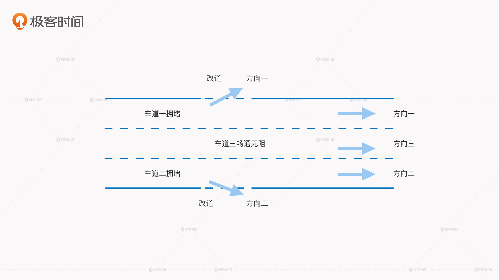

---
date: "2019-06-23"
---  
      
# 15 |  车联网：5G能给车联网带来什么？
你好，我是杨四昌。

上一节课，我们一起学习了5G和智能医疗相结合，给我们就诊和治疗带来的便捷。这一节课我们学习讨论5G在车联网中起到什么作用这个话题。

说到车联网，你应该也不陌生。这几年，高通、谷歌、苹果、英特尔、百度、华为、阿里、腾讯、滴滴、字节跳动等芯片和互联网公司纷纷投重兵押注自动驾驶，以特斯拉为首的、包括国内的蔚来、小鹏汽车等等造车新势力也开始布局车联网，老牌汽车制造企业也纷纷投资开发车联网技术，车联网成为兵家必争之地，中、欧、美、日等各国从国家层面对车联网也是给予大力的支持。可以说近些年，车联网一直热度不减，是业界公认的超级风口。

具体来说，车联网是什么意思呢？车联网, 也就是Internet of Vehicle , 是通过移动通信网络4G、5G以及V2X网络，实现车、路边基础设施、行人和移动通信网络之间的相互通信。

车联网和自动驾驶是密切相关的。目前自动驾驶还存在不同的技术路线，比如，有一种是以特斯拉和谷歌为代表的强调单车智能的路线，也就是在车上安装各种高清摄像头、激光雷达和毫米波雷达，通过车自身感知周围的环境的方式来发展自动驾驶技术；还有一种是强调智能网联，也就是车联网+单车智能的技术路线。

<!-- [[[read_end]]] -->

**我在这里想跟你强调的是，自动驾驶本身就是一个极其复杂的产业，涉及电子电气架构、计算芯片、软件工程、复杂的机械结构、传感器、4G/5G车联网，安全机制等等。而且，不同技术路线选择，也会让自动驾驶发展面临更加复杂的产业环境，这本身就是一个极其复杂的话题。**

所以呢，我们这一节课不讨论自动驾驶的技术细节，只是聚焦5G在车联网的应用，因为5G在车联网中的应用本身就是一个不断探索的长期过程，现在没办法去下一个定论。我们这节课，会带你了解5G在车联网的一些应用，也会带你来看看业界关于5G+车联网有什么相对成熟的应用实践。

总的来说，目前5G在车联网上的应用，主要包括**车联网信息服务、车联网提升交通效率、车联网交通安全**这三个层面，下面我们来一一介绍一下。

## 5G助力车联网信息服务的提升

目前，汽车的电子化，软件化是未来一段时间内必然的趋势。对于汽车相关的信息服务而言，**软件的更新订阅服务和高精度地图下载功能**，也会逐步成为我们汽车的基本功能。我们先来看看软件更新和订阅服务。

### 软件更新和订阅服务

你可能觉得这个话题好像更多与电动汽车相关，目前来说的确是这样。

以特斯拉为例，现在特斯拉已经实现了通过OTA（Over The Air，也就是空中自动下载）订阅服务来自动更新软件，并对这个服务收取一定费用。

随着大量的智能化汽车尤其是新能源汽车的普及，这个服务将变成一个基本需求。而且，随着汽车智能化、软件化程度的提升，未来的汽车会定期进行软件版本的更新，实现整车系统性能、人工智能算法和人车交互体验的提升，也会通过电池管理软件实现电池寿命和效率的持续提升，就像现在的iPhone，能通过系统软件的更新来增加功能、提升用户体验一样。

你看，未来那么多车都要通过OTA来升级软件，需要移动通信网络提供很高的带宽。而且这个升级需要通过网络切片来提供独占式的网络资源，这样才能避免升级过程发生网络资源的拥塞，导致升级失败产生不可预知的后果。这些都需要5G来支持，而且对于这种升级，运营商每比特流量产生的价值绝对大于给普通用户提供的增强型移动宽带（eMBB）带来的价值。

### 高精度电子地图实时更新

高清度电子地图的实时更新，也是未来5G在车联网领域大有用处的地方。你可能觉得现在我们4G的电子地图导航就很好了，不过目前的电子地图只能反映行驶路线，定位精度比较低，而且不能反映路面是上坡还下坡、是不是斜坡、弯度如何等等这些信息。

可是，未来的汽车需要1米级、甚至小于1米级别的定位精度，需要详细的路面基本情况和实时情况。所以我们需要在行驶过程中动态更新高精度电子地图，这个场景需要很高的数据速率来下载和更新高精度的电子地图。

随着大量智能化汽车尤其是新能源汽车的普及，这个服务将变成一个基本需求，行驶中的车都需要实时下载高精度地图。因此对网络带宽的要求很高，必须用5G来满足，同时5G也有足够的精度，满足小于1米的精确定位精度需求。

这样小于1米的精确定位，不仅可以用在地图这类信息服务之中，还可以用在提升交通效率方面。

## 5G+车联网提升交通效率

5G提供的小于1米的精确定位精度和车联网结合在一起，能够帮助交通智能调度系统进行精确地交通控制，进一步提升交通效率，比如**行驶路径优化、车速优化**等等。下面我们一一来介绍。

### 行驶路径优化

5G的高精度定位，和车联网结合在一起，能够精确地知道每一辆车行驶在哪一条车道上，知道每条车道的车流量大小。这些数据通过车联网汇集到城市智能交通调度控制大脑，智能交通大脑就可以精确地动态调整每一条道路的车流量。

以前司机收到的信息可能是“前方某某路段拥堵，请司机朋友提前绕行”，以后收到的信息可能变成了“前方路段车道1、2拥堵，车道3可以通行，通过车道1去往方向1、车道2去往方向2的司机朋友们提前通过其它路口前往，通过车道3去往方向3的司机朋友们请放心行驶”。

5G+车联网，与城市智能交通调度系统结合在一起，可以通过这样的精确动态控制，极大地提升交通通行效率。

### 行驶车速实时导引

车速问题也是我们日常生活中与具体的交通状况、天气状况非常相关的，你也可以看到现在的限速基本都是一刀切、统一限制的。这是因为，我们现在没法掌握这么精细的路面动态交通情况，只能对车速进行统一限制，这就跟你在路上看到的，“前方路段限速80公里”一样。

未来，5G的高精度定位和车联网结合在一起，能够把车流量、车速、拥堵情况、路口等所有信息，实时地通过车联网汇集到城市智能交通调度控制大脑，智能交通控制大脑可以结合这些信息更精准地对每一条车道的限速进行实时动态调整，极大地提升了交通通行效率。

除了在信息服务和交通通行效率上的帮助外，5G+车联网还有一个更重要的应用，它能够让你开车时更加安全，更有保障。

## 5G+车联网让行驶更安全

我们知道，提升交通安全是一个极其复杂的系统工程，涉及自动驾驶的所有环节，也是自动驾驶的终极目标。

当然，车联网是能够帮助提高交通安全的。车联网可以通过把路、车、人、网的信息紧密结合成一个整体，形成一个无边际的大型分布式智能网络。每辆车、每个人、每条车道都是这个大网络中的一个小小的节点，把一切都数据化，这样我们可以通过对这个大型网络的精准控制，提升每一辆车的安全系数。

具体来说有下面这3种情况。

**首先是前方路况预通知。**比如在我们车上传感器、各种雷达和摄像头都“看不见”的地方，可以依靠前面的各种高清摄像头、传感器收集实时视频和各种数据，再通过车联网告知行驶中的车，让车提前做判断，做出恰当的应对。

这个场景需要传输大量的实时视频和各种数据， 也就需要5G网络来满足这个极高的带宽要求，对网络时延要求一般。

**其次是恶劣天气安全行驶的问题。**我们知道，极端天气下开车是比较危险的，视野会受到很大的影响。我们可以结合路边基础设施单元和移动通信网络，再通过车联网来告知行驶中的车实际路况。结合5G的精确定位和高精度地图的指引，我们可以在极端天气情况下，保证车辆的安全行驶。

**另外，还要考虑意外情况的规避问题，**其实车联网也可以通过路边基础设施随时了解周边的突发状况，然后通知附近行驶中的车，避免在有遮挡的路口，或者没有红绿灯的路口，突然出现机动车或者非机动车、违章行人时出现意外情况。

总的来说，你从上面的5G在车联网中的应用也可以看出，通过车、路、人、网协同，5G+车联网能提升车对周围情况的预知能力，降低各种事故发生的概率，也能极大提升交通系统的效率，降低碳排放。单从对自动驾驶的贡献上说，也降低了单车自动驾驶的成本，降低了单车的计算量，这也就意味着功耗的降低。

但是由于车联网涉及利益方很多，所以它的部署也非常复杂，所需时间周期很长，商业模式也很复杂，需要平衡各方诉求。同时，5G刚开始发展，5G网络的建设本身就需要一个时间周期。因此车联网和5G结合在一起，需要一个很长的时间。

不过呢，现在业界也在积极进行5G和车联网结合的应用探索，也取得了一些进展。下面我跟你介绍几个目前比较常用的5G和车联网结合的实践吧。

## 5G+车联网的业界实践

现在，5G和车联网的发展正在发展中，在业界的积极探索下，已经有了一些相对成熟的应用，主要集中在**5G的远程驾驶**、**车辆自动编队行驶**、**园区或者物流区的自动驾驶**、**自动引导泊车**这4个方面。

5G的远程驾驶，现在主要应用在一些港口和矿山等现场工作环境比较危险或者艰苦的场景。这些场景需要回传超高清视频，而且在远程对车辆进行实时的操作，所以对带宽、时延和可靠性都有严格要求，必须使用5G技术。

第二个，通过5G实现车辆自动编队行驶，主要在物流货运行业、长途客运领域前景比较好。这个场景要求车辆之间能实时分析状态信息、回传超高清实时视频，以及对行驶中的车队实时控制，对带宽和时延和可靠性有严格要求，必须使用5G车联网技术。

另外，就是园区或者物流区的无人自动驾驶。疫情期间，我们也看到了很多无人快递车来给封锁区的居民送快递、送菜，这也可以基于5G车联网技术来实现的。而且，通过5G的高精度定位，和5G车联网结合在一起，能够轻松地自动控制车辆停泊到空闲的车位上。

总的来说， 你可以看到，业界在5G和车联网的应用方面，也探索出了一定的成果，但还有更大的空间，需要继续探索5G和车联网更多的结合。

## 总结

好了，这节课我们到这里就结束了，让我们简单来回顾一下吧。

这一节课我们重点介绍了车联网。车联网就是把车、人、路、云通过无线技术整合在一起，实现车、人、路边设施、网络、云之间的信息互通和流动。

接下来，我们分别介绍了5G在车联网的信息服务、提升交通效率、提升交通安全方面的一些应用。由于车联网涉及利益方很多，车联网发展是一个长期的过程。而且5G也才刚刚开始发展，5G和车联网的结合还需要很长的周期，目前业界还在积极探索中。

最后，我们介绍了几个目前业界探索得比较成熟的几个5G+车联网中的应用场景，分别是5G的远程驾驶、车辆自动编队行驶、园区或者物流区的自动驾驶、自动引导泊车。你可以看到，这些应用已经有了一些成果，但还有更大的发展空间。

总的来说，我们可以继续相信，随着5G车联网技术的逐步成熟，5G技术将在车联网中找到更大的发挥空间。

## 思考题

今天的思考题，我想请你思考一下，请你找一个5G车联网和自动驾驶结合的案例，并分析一下这个应用的商用模式和应用前景。欢迎在留言区给我留言。

感谢你和我一起学习，如果你有朋友也对5G+车联网的话题感兴趣，欢迎把这节课分享给他。我是杨四昌，我们下节课见。