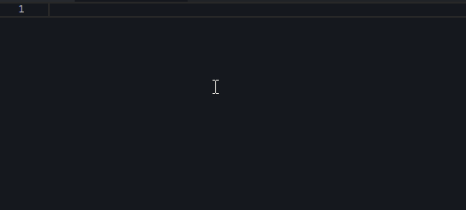
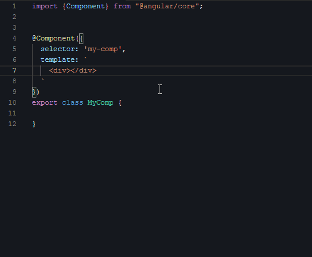
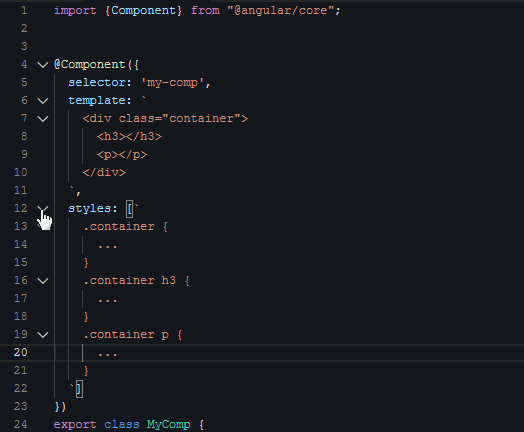
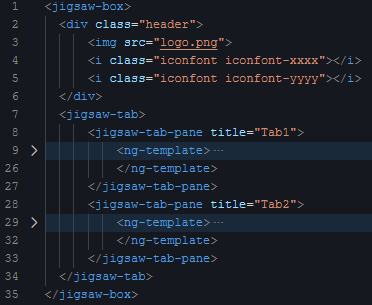

---
date: "2019-06-23"
---  
      
# 07｜结构化代码生成法：代码如何生成代码？
你好，我是陈旭。

编辑器是低代码平台一个非常重要的基础设施，而代码生成器是编辑器的引擎，是编辑器做到所见即所得效果的基础。

在上一讲中，我从架构的角度详细理清了代码生成器和编辑器之间的关系，以及代码生成器与低代码长期演进之间的关系。

那么今天，我们就从实现的角度说清楚代码生成器是如何实现的。

## 人类是如何写代码的？

虽然写代码是我们日常工作内容，没有啥特别的。但这一讲的目的，是让代码代替人工来生成代码，所以我们需要快速回顾一下我们日常敲代码的过程，以及敲出的代码都有哪些部分。为了帮你快速回顾这个过程，我把手工正常开发一个组件的部分过程录屏下来了。

需要特别说明的是，首先我是用Angular写的这段代码，即使你没学过Angular，但你光看代码也是可以轻松理解的；其次我今天介绍的这个方法是通用的，不限于生成Angular的代码，你可以用这个方法用生成任意框架代码，甚至用来生成Java/C/C++等后端代码。

下面我们看第一段视频，演示的是创建组件骨架代码：



把这十来秒的视频多播放几次后，你会有一个感触：**正常敲代码的整个过程是按需的**。显然你不会一上来就去敲第一行的import，而是当前需要用到Component这个渲染器时，你才会想起来：哦，我应该去import一下。

<!-- [[[read_end]]] -->

接下来是第二段视频，给组件编写样式：



如果给一个不会写代码的人看这段视频，他可能会觉得，你们敲代码怎么是东一榔头西一棒的，一会在这里插入几个字符，一会在那插入几个字符，而不是像写文章一样，基本保持自上而下、从头到尾的节奏。

然后是第三段视频，在给组件创建输入条件（用Angular术语是：输入属性/Input）：



组件的外部可以通过视频里的title/content两个参数给这个组件喂数据。显然，输入属性的种类、数量、类型都是按需定义的，我们无法事先约定一个组件需要啥输入属性。下面这行代码就很好地演示了如何使用这两个属性：

```
    <my-comp title="the title" content="the content"></my-comp>
    

```

除此之外，一个普通组件的开发过程还至少包括如下的内容：

1.  类成员方法的定义：  
    
2.  组件对外事件的定义（用angular术语是：输出属性/Output）：  
    
3.  某些比较复杂的组件，可能还会涉及到类的继承和接口实现定义，关注下图中的extends和implements关键字：  
    

我们再把前面几段视频展示的内容列出来，会发现还有：

4.  import其他类（含第三方的或者其他类）；
5.  组件HTML模板的定义；
6.  组件样式的定义；
7.  类成员变量的定义和初始化；
8.  类构造函数需要注入的功能，这里，注入/Inject 是一个Angular术语，比如下图中的 \_http 变量就是通过注入而来的：  
    

如果你不是用Angular开发前端，那可能不会涉及到所有条目，但根据你所用技术栈，可能也会多出一些新的条目来。不过，没有关系，我给出的方法依然适用，你只需要将多出的内容像我一样将其列出即可。

## 结构化代码生成法

有了前面的铺垫，我们现在就可以来介绍一下如何让代码生成代码了。

前面我们提到，正常写代码的过程是按需、跳跃式地在不同部位插入一个个片段，没人能像写文章一样自上而下、从头到尾、一气呵成地写出一个视图组件的代码，利用代码来生成代码的过程也不可能是这样的方式。

虽然正常写代码过程是东一榔头西一棒，一会在这里插入一个片段，一会在那插入一个片段，甚至还要修改别的文件，**但是插入点的类型总是有限的**！如果你能意识到这一点，那你就朝着正确的方向迈出第一步了。

接下来需要解决的问题就是，都有哪些类型的插入点呢？

如果此时你还无法马上回答这个问题，那么再翻回去，重温一下前面的内容。我在第一个小标题末尾处详详细细列出了开发一个普通视图组件要做的事情，每一条就是一类插入点。起码在生成一个普通视图组件的代码的时候，插入点种类就这么多了。

那么如何生成一段有特定功能的代码呢？我们先看一段简单但有代表性的伪代码：

```
    import {EventEmitter} from "@angular/core";
    
    export class MyComp {
      public select: EventEmitter;
    
      constructor() {
        this.select = new EventEmitter();
      }
    }
    

```

这段代码功能极其简单，在一个类中定义了一个名为select成员变量，然后在构造函数里初始化了select变量的值，就这么多。但是开发这段代码至少涉及到了3类插入点了，分别是：

1.  import区；
2.  构造函数区；
3.  成员变量区。

假设现在有3个值分别代表这3个区：importSection，constructorSection，memberSection，那我们实际上只是向这3个值里分别放入对应的代码片段，完成之后，这3个值分别大概如下

 *    importSection：

```
    'import {EventEmitter} from "@angular/core";'
    

```

 *    constructorSection：

```
    'this.select = new EventEmitter();'
    

```

 *    memberSection：

```
    'public select: EventEmitter;'
    

```

仔细观察一下，你就会发现各个插入点的代码片段都是普通的文本了，**此时的它们没有任何语义，也没有任何功能**。

再仔细观察一下，你会发现代码片段里包含了许多关键字，这些关键字实际上是冗余的，可以省略去。

最后，不难发现，每一个插入点应该是一个数组，因为任何功能的实现都可能会往一个或多个插入点插入点添加片段。所以经过一番思索后，各个插入点的内容可以先优化成这样：

 *    importSection：

```
    [
      {identifier: 'EventEmitter', from: '@angular/core'}
    ]
    

```

 *    constructorSection：

```
    [
      {statement: 'this.select = new EventEmitter()'}
    ]
    

```

 *    memberSection：

```
    [
      {modifier: 'public', identifier: 'select', type: 'EventEmitter'}
    ]
    

```

这里，我不仅删去了冗余的关键字，还把代码片段解析成了一个个结构化的数据，可以方便我们后面的处理。

下面我们继续给这个类添加新的修改。假如我想让MyComp类继承一个名为Base的类，并实现两个接口：OnInit/OnDestroy，也就是我们预期将这行代码改为：

```
    export class MyComp extends Base implements OnInit, OnDestroy
    

```

其中，Base类来自工程里的另一个文件 base.ts，OnInit/OnDestroy 类来自Angular的npm包。

采用同样的方法，你需要往多个插入点添加新的数据，先在importSection这个插入点里，添加如下3个数据：

```
    [
      {identifier: 'EventEmitter', from: '@angular/core'}, // 原来已有的
      {identifier: 'Base', from: './base'},                // 下面3个是新增的
      {identifier: 'OnInit', from: '@angular/core'},
      {identifier: 'OnDestroy', from: '@angular/core'}
    ]
    

```

再往extendSection里添加一个数据：

```
    [
      {identifier: 'Base'}
    ]
    

```

最后往implementSection里添加如下数据：

```
    [
      {identifier: 'OnInit'},
      {identifier: 'OnDestroy'}
    ]
    

```

其他的任何修改只是重复上述过程，所做的事情无法就是找到对应的插入点，然后把代码片段拆解为适当的结构化数据，再追加到该插入点列表中去。

你可能会有疑问：插入点里会不会有重复项，出现了重复项该怎么办？

答案是插入点出现重复项是正常的。比如多个功能点需要import相同的类，那么importSection里就会出现多个重复的条目，在转为代码时，应该先将importSection里的重复条目过滤掉。

那么是不是所有插入点都是要去重呢？

不一定，不同的插入点处理方式不一样。比如成员变量插入点里，如果有两个条目的modifier、identifier、type三个属性都一样，就可以认为是重复条目，过滤掉就好了；如果这三者之一有不一样，那此时就应该报错，否则代码生成器可能会生出类似下面的代码来：

```
    public  select: EventEmitter;
    private select: EventEmitter;
    

```

显然，这样的代码是有错误的。再比如，构造函数插入点里的重复条目就不应该过滤掉，应该按照顺序依次生成代码块。

你可能还会有疑问：插入点里的顺序敏感吗？

答案依然是视不同插入点而定。比如import插入点的顺序一般是不敏感的，生成代码时可以按照特定顺序排列，还可以将from值相同的合并到一起去。而一些输出是代码块的插入点（如构造函数插入点）则对顺序是敏感的，此时不应该随意调整顺序。

另一个可能的疑问是：在插入点里添加结构化的代码片段非常繁琐，手工不可能完成啊。

请注意，**往插入点里插入代码片段的，是另外一段代码，而不是人工！**而这里的“另一段代码”就是我们的代码生成器了。

我前面花了这么大篇幅详细说明了如何把一段我们习以为常的代码拆分，并散落不同的插入点里去的过程，实际上就是**对代码生成器的逆向工程**，这样说是为了让你更好地理解代码生成器是如何生成代码的。只有理解了代码生成器的工作原理之后，我们才能更容易来实现它。

计算机非常擅长读写结构化数据，因为结构化数据没有二义性。DSL也好、自然语言也罢、甚至包括编程语言，都充斥着各种二义性，需要上下文才能准确解释，计算机很难轻易理解这种形式的数据。

因此，低代码平台基本都会采用结构化数据作为持久化的数据格式，而我在前文里则给出了一个如何将一组结构化数据转为代码的方法。虽然编辑器持久化采用的结构化数据，与代码生成器所需的插入点结构化数据不是严格对应的。但是两者之间的数据结构已经非常接近了，只需要做少量简单的转换，我们就可以将编辑器持久化采用的结构化数据转为插入点数据，然后再传给代码生成器。

代码生成器会先将各个插入点的数据做校验，一旦发现有冲突，就会报错。校验通过之后，代码生成器需要将各个插入点的结构化代码片段，按照该类插入点的语法拼装成一个代码块。之后，再按照语法要求的顺序将代码块拼装在一起，最终就得到了一大块代码，此时的代码才具有语义和功能，也可以被其他编译器编译了。

这个时候，你再看看最终生成出来的代码，会发现它与手写的代码非常接近，这样的代码是可以被人类理解和二次编辑的。但我们应该极力避免这样做，保持对这些代码的只读，因为任何对这些代码的编辑都难以反向同步到输入的结构化数据上。

## HTML模板的生成

插入点生成代码的过程基本都很简单，唯独组件的HTML模板的生成比较复杂，需要专门拎出来说明。

Web组件集提供的组件可以分为两大类，一类是普通组件，另一类是容器。容器具有普通组件的所有特性，但与普通组件不同的是，容器可以将任何普通组件、容器装到它内部去，这样逻辑上就形成了一棵树。

我们不难理解，**从树叶到树根的各个节点都是相互独立的**。那么同样，编辑器持久化时也必须保持各个节点相互独立，这样的一个特性就给生成HTML模板代码造成了一些小麻烦。这是因为，每个节点只能知道自己能产生啥样的HTML**片段**，而不知道其父级和子级的HTML片段，但是现在的目标是要生成视图的**完整**HTML。

我们可以通过这个例子来理解一下：



单从结构来看，上面这段HTML代码是这样的结构：

```
    jigsaw-box
         ├─ div.header
         │      ├─ img.logo
         │      ├─ icon.xxxx
         │      └─ icon.yyyy
         └─ jigsaw-tab
                ├─ Tab1
                │    ├─ ...
                │    └─ ...
                └─ Tab2
                     ├─ ...
                     └─ ...
    

```

这个例子里，有两个问题需要解决。**一个是各个节点生成的HTML片段都不一样**：

 *    jigsaw-box节点需要生成 这样的片段；
 *    div节点需要生成

  <div class="header" />
  这样的片段；
 *    jigsaw-tab需要生成下面这样更复杂的片段：

```
    <jigsaw-tab-pane>
        <ng-template>
        </ng-template>
    </jigsaw-tab-pane>
    

```

另一个问题是：**需要把这些独立节点的HTML片段融合成一个整体**。

如果你观察得足够仔细，就会发现jigsaw-tab（页签组件）节点实际上是一个容器。每个tab页签内部完全有可能再放一个独立的页签组件，也就是它的内部完全可能包含另一棵类似这个例子的节点树。这样一来，这棵节点树就形成了一棵具有递归结构的树了。

最后还有一个重要的要求：**为了保持代码有良好的封装内聚性，不允许采用if else的方式来解决节点之间的差异**。

那怎么同时满足这三个要求呢？我采用的解决方法是，给每层数节点上都定义一个相同签名的函数（我们起名为htmlCoder），每层节点的htmlCoder只干两个事情：

第一，如果该节点有子级，则正确地组织好参数并调用其子级节点的htmlCoder，驱动其子级生成HTML片段；

第二，正确地生成好自己的HTML片段，该生成几层包裹层就就生成几层，并将子级返回的HTML片段与自身生成的HTML包裹片段，正确组装成一个合法的HTML片段，并返回给父级节点。

这段话虽然简洁但是比较绕。这里实际上是一个深度优先的递归调用过程，HTML片段总是从最深处（树叶）开始真正组装完成，然后一级一级向树根递归出去。直到递归到树根时，一个完整的HTML代码也就生成好了。

用这个方法可以完美达成我预设的3个要求：节点与节点之间松耦合，没有if else，且无论节点自身需要多复杂的HTML片段，都能满足。

其实如果你能熟练使用OOP，大概现在就能猜到我在实现这部分代码的时候，会让描述节点的类都去实现一个包含htmlCoder这个函数的接口：

```
    export interface IHtmlCoder {
      htmlCoder(sCode: StructuredCode, env: ProjectEnv): string;
    }
    

```

这样做的好处，是在编译时就约束各个节点的代码必须要实现这个htmlCoder函数，并且函数的签名和返回值必须全部保持一致。

这样我们在运行时就不需要去判断某个节点实例是否有htmlCoder函数了。如果在代码长期维护过程发现htmlCoder的签名发生了变化，也无需担心哪些节点代码忘了对齐，因为编译器会不厌其烦地、一遍又一遍地检查所有节点的代码。

作为这个知识点的补充，你可以去找找我在2021年12月GMTC深圳站上[关于低代码平台实现方法](https://time.geekbang.org/course/detail/100101601-466735)的演讲，在演讲的17分36秒到20分43秒，我从代码级详细介绍了这个知识点。限于篇幅，这里无法展开更多的细节。

实际上采用相同的方法，可以把各个节点隔离得非常彻底，可以实现节点之间的极致松耦合，而TypeScript为我提供一个非常完善好用的OOP实现。在此我要顺道再安利一波TypeScript！

## 如何应用这个方法？

那么低代码编辑器是如何使用这个方法来生成代码的呢？

编辑器侧重于交互的易用性和人性化设计，显然不可能按照生成代码所需的顺序设计交互过程，这就导致编辑器和人工编码类似，会在不确定的时间和位置插入某些功能逻辑。结构化代码生产法可以很好地满足编辑器的这个需求。

简单一点说，在新建一个App的时候，编辑器会创建一个类似下面结构的空白数据：

```
    {
      importSection: [], constructorSection: [], memberSection: [],
      ...
    }
    

```

然后将这个对象传递给各个编辑流程（可能是一个表单，或是一个文本框），所有编辑流程在采集到开发人员的编辑数据后，按照该功能所需的逻辑往这个对象不同片区插入数据。最后，编辑器通过我们前面介绍的方法，就可以将这个结构化的数据转为代码了。

虽然我用了TypeScript+Angular为例，介绍了结构化代码生成法的原理和简要实现方式，但并没有将它和这两者的任何特性绑定，所以你使用相似的原理和思路，完全可以做出一个可以生成JavaScript+Vue的代码生成器，抑或是用于生成JSX+React的代码生成器。

我已经将这个方法推广到了生成TypeScript+Nodejs的后端Rest服务的代码生成中了，整个推广过程异常顺利，几乎没有做任何修改就直接切换过去了，丝滑得有点不真实。实际上，任何一门指令式的计算机语言，都是可以采用相似的方法来生成代码的，也就是说，只要你愿意，你可以使用这个方法来生成Java代码，甚至是C/C++/Python等后台语言的代码。

不过，由于我本人比较痛恨函数式编程，对这种编码方式理解得并不深刻，所以此时此刻，我无法下结论是否这个方法也适用于函数式编程语言，但以我对Scala语言肤浅的了解，我觉得问题也不大。如果你对这方面比较了解，也欢迎你在留言区说说你的看法，我们一起讨论。

## 总结

这一讲中，我采用逆向工程法从实际代码反推出了代码生成器的工作原理，并将复杂的人工编码过程抽象成了向有限种类插入点添加代码片段的过程，再在编辑器各处按需往插入点中添加所需的代码片段。这样，我们对收集到的代码片段做过滤、合并和优化之后，再按照一定的顺序重新组装，就可以获得一份完整的代码了，这份代码与手写的代码相似，对人类友好，具有可读性。

为了帮助你更好地理解结构化代码生成法，在最后我再拿它生成代码的过程与手写代码做一次比较，**其实结构化代码生成法创造代码的过程和你我日常写代码的过程，是一样的**。你可能会反驳：我平时编码是在IDE上直接敲入一行行代码，从没用一个数据结构替代代码，更没将它存到哪个数组里。

假设有一个偏执狂码农，他写代码的时候总是极其严格地、甚至比编译器还严格地按照特定的顺序写代码。比如严格遵守这样的顺序：所有import代码→所有HTML模板→类声明→类构造函数→类成员变量→类成员函数→…，即使编译器允许某些代码交织在一起，他也会偏执地保持同一类代码聚集在一起。

此外，他还有令人发指地要求同一个片区内，后插入的代码一定是追加在最后面。在这个情况下，每类代码所在片区实际上就是一个数组，而他在编写特定功能代码时，就是按需朝各个片区里插入代码片段。现在，你是否会觉得这个偏执狂码农的编码过程和我给出的结构化代码生成法生成代码的过程极其相似呢？

普通码农不会按照偏执狂码农的方式来编码，你我敲的代码不存在永不交织的代码片区，但对应的永不交织的逻辑片区是存在的，它们存在于你的逻辑思维中。所以我说，结构化代码生成法创造代码的过程和你我日常写代码的过程其实是一样的。至于结构化代码生成法是往代码片区里插入一个结构化数据，这只是为了在最后拼装成代码时可以更容易做优化而已。

也正是因为结构化代码生成法与人工写代码的过程实际上是一致的，最后我才能下这样的结论：**结构化代码生成法几乎有无限的推广空间**。

## 思考题

如果采用结构化代码生成法来生成Java或C++代码，你会设计出哪些插入点？

欢迎在评论区写下你的想法。我是陈旭，我们下节课见。