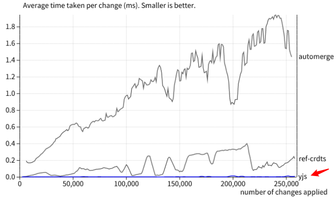
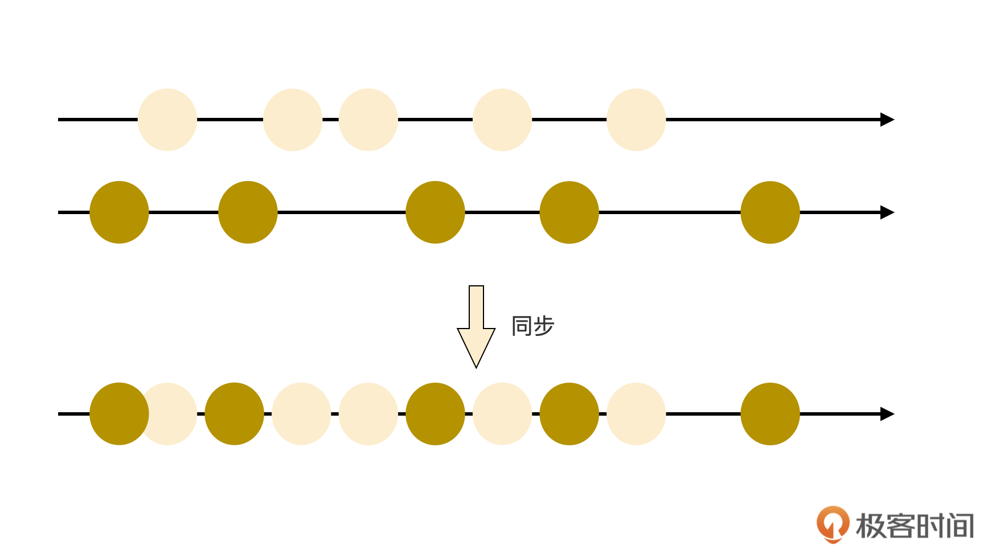
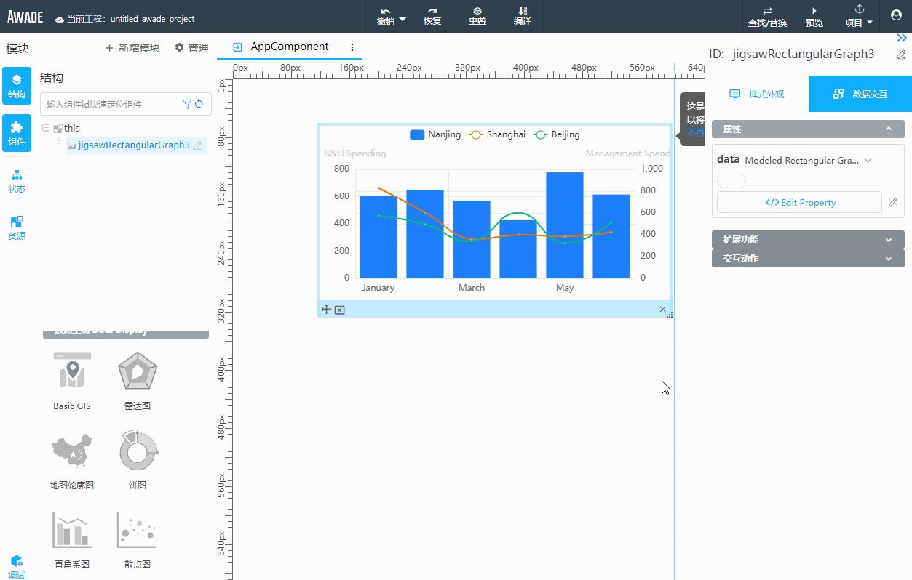
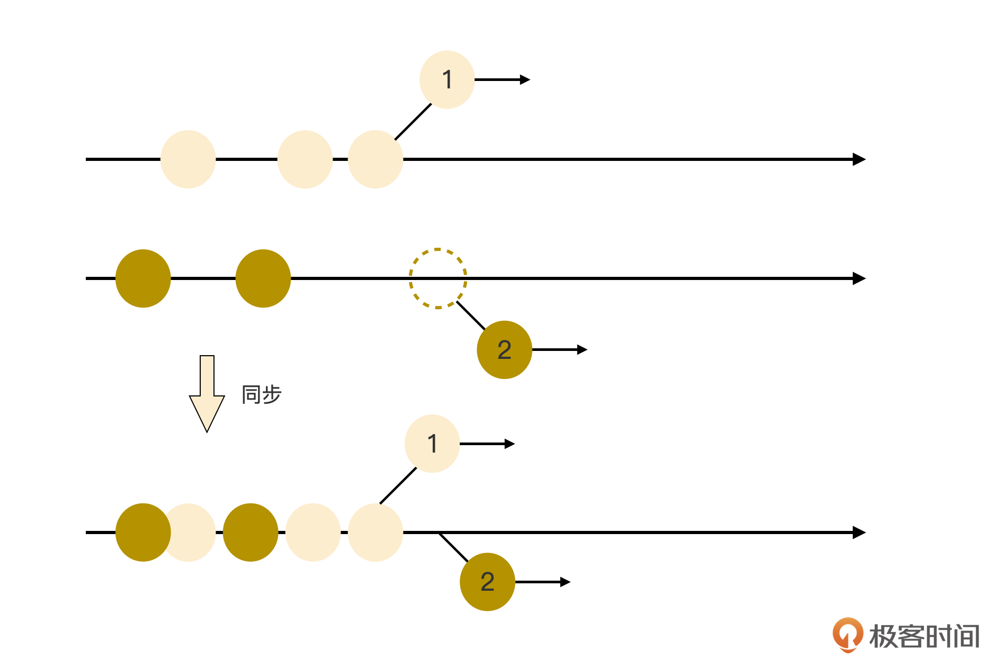
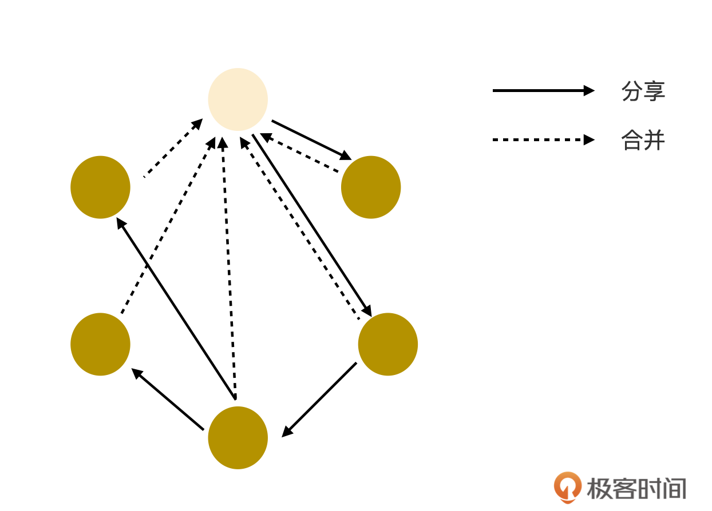
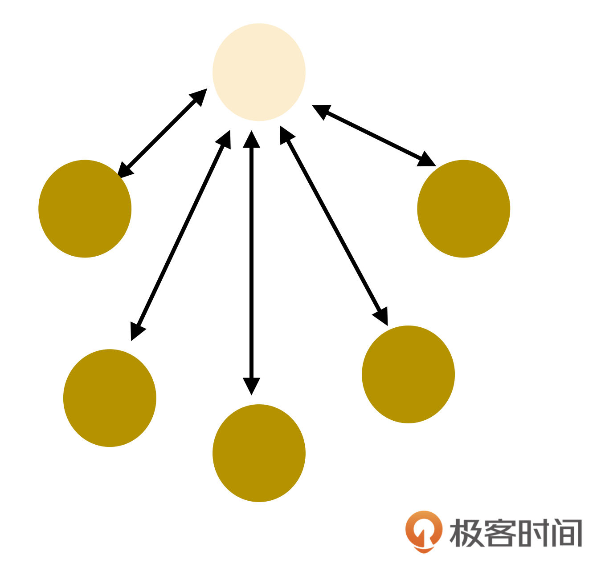
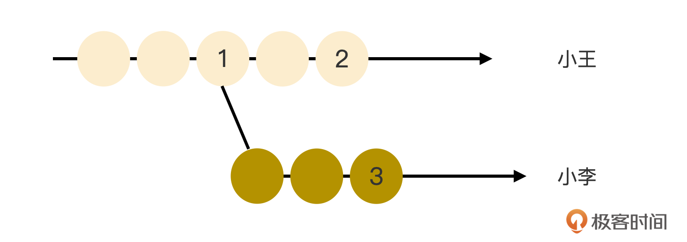

---
date: "2019-06-23"
---  
      
# 13｜多人协同编辑：野百合的春天为啥来得这么晚？
你好，我是陈旭。这一讲我们来说说低代码平台的一个甜蜜的烦恼：多人协同编辑。

为什么说这是一个甜蜜的烦恼呢？因为一旦低代码平台有了这样的需求，就意味着它已经可以开发出有相当复杂度的App了，也意味着各方对低代码平台已经有了较强的信心，甚至说它在复杂App开发方面已经相当深入了。我们可以说这样的低代码平台已经具备了较强的开发能力。

说它是一个烦恼，是因为往往这个时候的低代码平台已经成型了，底层数据结构必然已经固化。如果平台架构早期未考虑到多人协同的话，此时就很难采用最优解来解决这个需求了，只能退而求次，采用迂回方法。

那么今天，我们就从多人协作功能的实现难点入手，聊聊它的实现方案和注意事项。

## 多人协作功能的难点是什么？

面对这个问题，可能你会猜难点是多个编辑器之间的点对点通信和实时数据传输。不可否认，这是一个难点。但现在的web技术有太多的解决方案了，WebSocket，WebRTC等都是极好的解决方案，我推荐优先选择WebSocket。

因为WebSocket更成熟，服务端实现方案多且完善，它更加适用于一对多广播，相对来说，WebRTC更适合用于P2P传输音像多媒体信息，实现更加复杂。更具体的，你可以自己搜下相关资料。

<!-- [[[read_end]]] -->

那么真正的难点是啥呢？我认为首先是**如何解决冲突**。你想，多人对同一个工程进行编辑，难免会同时对同一个组件的同一个属性做操作，或者是你在改某个组件，而我要把它删除。这样的操作就会产生冲突。

那么如何解决冲突呢？有一个办法，我们可以像git那样，标记每个冲突点，然后中断App开发的工作，强制要求他们做出抉择呀。这是一种办法，但是不彻底。这个问题，我们可以用一种釜底抽薪式的解决方案，就是**不让冲突出现**！

那么如何避免冲突呢？到这里就需要介绍CRDT算法了，CRDT，也就是Conflict-free Replicated Data Type，无冲突复制数据类型。

实际上冲突是不可避免的，只是CRDT采用了某种策略，就像一个和事佬一样，帮助协同编辑的各方妥善安排了冲突。但这个策略已经超出了这讲的范畴，有兴趣你可以自行了解一下LWW（即Last Writer Wins）策略。当冲突发生时，谁对谁错不重要，重要的是，各方能协商一致，且各方都可稳妥地拿到这个协商结果。

CRDT是一个算法，而且还挺复杂的，那么有没有实现了这个算法的库呢？

必须有！适合JavaScript生态圈的，有3个，分别是Yjs，automerge和ref-crdts。这三者的性能对比，你可以参考下面这个图（[引自雪碧的文章](https://zhuanlan.zhihu.com/p/452980520)）：

这三个都是当前主流的CRDT实现，它们主要的应用场合都是多人协作在线文档，但他们也支持json这样的数据结构，所以，也可以用于低代码平台的多人协作功能。

这里你要注意图中红色的箭头，Yjs的效率非常高，几乎与横轴贴合在一起。所以应该选择哪个，无需我多言了吧？

前面我说了，多人协作的难点首先是冲突，既然有首先，那当然就有其次了。其次的难点就是**历史记录管理**。

请你想想，多人一起编辑一个App，你总不能把别人的修改给撤销了吧？如果真是这样，那冲突就可能从线上发展到线下去了（要打起来了）。但是大家同时操作产生的历史记录交织在一起，要完全依赖你自己设计解决方案来实现撤销功能，想想都觉得很复杂。

莫急，Yjs提供了一个UndoManager，可以用于记录使用人的历史记录和正确地执行撤销、重做等功能。非常贴心。

既然有其次的难点，想必还有再次的难点，那就是，**很可惜，CRDT的解决方案，你可能用不了！**（手动恐惧）

这就是多人协作功能作为一个甜蜜的烦恼中的烦恼的那一部分。

为啥这么说呢？如果你采用CRDT解决方案，数据保存的格式就必须采用它定义的格式。一句话说明CRDT的原理：对所有操作打上时间戳，然后通过网络把各人编辑产生的历史记录分发出去，本地接收后，完成合并。合并历史记录时，所有冲突点，都使用LWW策略处理冲突。所以**历史记录的格式是所有CRDT解决方案的根基**。

但是，历史记录的格式，何尝又不是低代码平台正常运行的基础之一呢？虽然不是决定性的基础，但是在低代码平台成型之后，我们要对这个部分做调整，必然是伤筋动骨啊！

另外，**应用数据的归属**也是一个阻碍多人协作的问题。低代码平台基本上都会按照用户来隔离应用数据，即用户只能看到自己的应用数据，无法看到他人的数据，甚至多数平台会采用租户的方式，对应用数据做物理隔离。

一言蔽之就是，用户数据的存储方式也需要在平台建设之处就有多人协作的考虑，否则后期的调整也是伤筋动骨。

多人协作这个功能，就是一株野百合，它总能等到属于它的春天的到来，但是春天的脚步是如此缓慢，姗姗来迟，待到低代码平台的成熟度高到足以支持需要多人一起开发复杂App的时候，已然太晚，木已成舟，这时再对底层基础功能做调整很不现实。此时，CRDT解决方案再巧妙，Yjs性能再好，UndoManager再贴心，你也只能望洋兴叹。

这小段文字描述的正是我的心情。但是，当你看到这一讲的时候，希望你还有机会做出选择。

前面描述了CRDT的种种好处，如果你的平台现在还未定型，还有机会选择CRDT的话，可能已经摩拳擦掌要试一试CRDT了，请先别急，我现在要来泼点冷水。

## CRDT一定是银弹吗？

目前业界对CRDT最成熟的使用是多人协作在线文档。虽然CRDT算法的初衷并非只针对多人协作文档，同时Yjs、automerge等实现也确实可以支持JSON数据结构，这是低代码平台所必须的。但是，我确实很少听说有低代码平台实际使用这个功能的。

低代码平台的使用过程（即App的开发过程），与在线文档是有很大差别的，我接下来会给出一个情形，说明低代码平台即使使用CRDT，也会出现冲突。作为一点背景知识，虽然前文已经有提了一点了，这里我们还需要进一步解释为啥CRDT可以做到conflict-free。

简而言之就是及时，及时意味着任何修改，都要及时记录。注意只需要及时记录就好，而无需及时同步给各个协同者。

因为及时记录下来的同时，一个时间戳和插入位置就被生成并记录到编辑历史中。此时即使有多人在同时编辑，产生大量编辑记录，但各个历史记录的时间戳却各不一样。即使此时网络都堵塞了，导致这些编辑记录都未能及时同步，也没关系的。在网络恢复之后，他人的编辑记录同步过来后，不同插入位置的编辑记录不会有冲突，它们会按照时序在本地生效。相同插入位置的编辑记录则以LWW策略，挑选最后一个改写记录作为最终结果。

这个过程的示意图如下：

那在低代码平台上，啥情况下会出现保存不及时的情形？

这就和低代码的开发方式的特征有关了。可视化开发是低代码的主要特征，因此在开发过程中，如果涉及到复杂的配置，不可避免地需要使用对话框来承载。比如下面这个例子，弹出一个对话框来组织一次复杂配置的过程，是很常见的

注意，为了使用友好，对话框会有确定按钮，等用户点击确定按钮之后，再一次性保存使用的配置，点击取消则会丢弃对话框上所有修改，这是一个很有用的功能。

问题就出在这个地方了。如果对话框上的修改未能及时保存下来，有人在某个对话框上编辑的同时，恰好另一个人也打开了同一个对话框开始配置，这个情况下，冲突就出现了：

你可能会有疑问，此时LWW策略不再适用了吗？

其实，LWW是适用的，但问题在于这样非常不友好。为啥呢？因为对话框承载的是复杂配置，包含大量的配置项，使用LWW简单粗暴地进行二选一，这样必然有人的工作会被白白浪费掉。再者，即使在同一个对话框上，也有可能未编辑到同一个属性，此时记录1和记录2是可以直接合并的，因此我们不能简单粗暴地使用LWW策略来处理。

在这个情形下，CRDT无法避免冲突。

CRDT在低代码平台上“水土不服”的第二个表现是，**性能问题**。在线文档也有所见即所得效果，任何修改同步过来后，都可以毫秒级生效。但与在线文档不一样的是，低代码的所见即所得效果则“昂贵”许多，它需要时间来编译，需要更多的时间来渲染。在App复杂时，需要三五秒才能完成一次反馈。在这样的响应速度下，如果同时编辑App人数太多，那基本大家的时间都会消耗在无休止的等待上了。

第三个“水土不服”的表现是，**修改位置**。在线文档的插入位置十分简单，只需两个整数记录光标所在的行和列即可。

但低代码平台的插入位置则复杂得多。因为低代码平台存储的数据是一份结构化的数据，因此插入位置需要使用一个类似DOM树的xpath的形式来表示。这还不够，一个xpath对应的是结构化数据里的一个属性，这个属性的值有可能是简单值，也有可能是多行文本，比如一段代码（关于为啥属性值会是一段代码的原因，你可以回顾一下第11讲高低代码混合开发）。

如果是简单值，那使用LWW策略时，二话不说，直接覆盖就完了，但当面对多行文本时，直接覆盖就不妥了。设想一下，前一个人，对某个多行属性做了数十行的改动，而后一个人只对同一个多行属性修改了1个字符，无脑应用LWW策略的话，前一个人的数十行修改就丢了。这也是一个问题。

那这些问题有没有解决办法呢？都有。

* 对于冲突问题，有一个比较优雅的解决方案是，使用一个临时的独立的影子历史记录来及时保存所有修改。在确定要保存这个影子记录时，将所有的修改合入主修改记录序列中，否则将其丢弃即可。影子历史记录里的修改依然保持及时被记录的特征，所以在应用LWW策略规避冲突时，被直接覆盖的工作就小到可以忍受的程度；
* 对于性能问题，可以考虑约束同时编辑的人数，但这治标不治本。一个更好的方法是引入懒渲染的方式，即只在需要的时候启动渲染，其他情况下只记录并提示有多少未渲染的修改即可；
* 对于多行属性的问题，可以学习一下git的做法，你一定用过git合并过代码，对不同行所做的修改，git合并时是不会冲突的，对吧？所以，除了xpath外，还需要增加一个行号。只有对同一个xpath属性的同一行做编辑，才需要应用LWW策略，其他情况直接合并即可.

这一讲到现在，前半部分是在疯狂安利CRDT，后半部分却又不停地对它泼冷水，为了避免你不知道我的目的是啥，这里我提前做一点小结。

总的来说，**如果你现在还有的选，那么我建议你引入CRDT算法**，作为你的低代码平台的底层数据保存和历史记录管理功能的基础，即使你现在看不到有实现多人协作功能的必要，但CRDT也可以提供成熟的数据结构、历史记录管理等有价值的功能。还有，万一以后做大了，需要多人协作功能的话，就不需要再去苦思解决方法了。

现在主流的几个实现CRDT的库中，我推荐你**重点关注Yjs**，但可以适当了解一下automerge和ref-crdts。Yjs除了性能优越之外，还提供了UndoManager用来处理历史编辑记录，提供了回退和重做的功能，这两点是其他两个库所不具备的。

同时我们也要注意到，CRDT算法在低代码平台的应用案例还不多，至少我还没看到有实际应的用案例，所以你需要重点关注和评估我列出的3个注意点，分别是由于未及时记录带来的冲突、渲染性能挑战、多行属性值的合并，对应的解决措施你可以翻到前文再看看，我不再重复。

万一，你和我一样，已经没的选了，有没有补救的方案呢？

## 有没有补救方案？

说没有是不可能的，但补救方案要根据已有实现而定，没有标准解。我介绍一下我实际采用的补救方案，希望对你有所启发。

我先介绍一下我们低代码平台的背景，主要是下面两个困难让我与CRDT失之交臂：

1.  应用工程数据与应用开发人员账号是强关联关系（物理关联），并且所有的自动化脚本都建立在这个关联关系之上，如果强制改为逻辑关联，会导致所有自动化脚本都需要改写；
2.  前端持久化数据时，一时偷懒，每次都发送全量数据给后台，而后台则是基于全量数据为基础来实现的历史管理功能。之所以保存时采用全量数据，一方面是追求更快实现功能，内网速度快，不需要“省吃俭用”，使用全量数据可以快速实现功能；另一方面是实现非常简单可靠，全量数据拿到后直接持久化即可，如果是增量数据则还需要合并，当时的Yjs等完成度远不及当下，没敢入坑。

从这两个困难中可以看出，当初我是一点都没有考虑到多人协作这个功能，不然也不可能实施这样的方案。

那么在补救方案中，我首先要解决的是**应用工程数据与应用开发人员账号强关联的问题。**让每个人都用同一个账号是不可能的，因此，我们还是要想办法让待多人协作的应用工程数据能做到“人手一份”。

要实现数据的冗余是很容易的，我设计了一个分享动作，允许开发人员将一个工程分享给其他人，每一次的分享，都是对数据的一次冗余。

收到分享的开发人员，就可以像对普通工程那样对它做编辑。每次编辑产生的修改记录也和普通工程一样，被发送给后端，持久化到该开发人员名下的那份冗余的数据里，所有持有该冗余数据的开发人员此时是各干各的，互不影响。可以看到，这个过程对已有的流程是完全没有冲击的，除了新增的分享功能之外，完全复用原有流程。

**难点在于冗余的数据如何实现归一**。

如果要做到两两合并，过程会非常复杂，而且极其容易出错。因此我做了一个约束，冗余的数据能且只能往合并到最原始的版本去。下面是相应的示意图：

无论数据在中途被转发了多少次，它始终记录着原始账户名。只有原始账号才能发起合并操作，并且，每次合并只能指定一个目标冗余数据。这样就可以控制每次合并动作都只发生在两份数据之间，并且合并的方向是确定的，始终都是合入到原始所有者的版本中去。在合并完成之后，原始数据所有者会把合并后的数据发送给对方，对方收到数据后，无需合并，直接覆盖掉合并前的数据即可完成两者同步。

在实际操作时，也可以做进一步的约束，不允许二次分享应用数据，这样会让这个拓扑图看上去简单许多，但是这对数据归一的复杂性没有帮助，只是看上去简单一些而已。

接下来我们再说说如何合并两份数据。经过前面的一番约束之后，单次合并只剩下两份数据了，看起来可以直接合并，并且不可能出现冲突了。真的是这样吗？你可以先思考思考。

虽然只有两份数据了，但是这两份数据依然是有3个状态，只要有3个状态的合并就必然会有潜在的冲突。其实这两份数据完全可以拿git的两个分支来类比，如下图。

一开始只有一份数据，在分享出去的一刹那，就产生了分叉，并且这两个分叉将在两个不同的开发人员手里独自演进。只要修改没有冲突，那就可以直接无脑合并，所以合并前的关键步骤就是如何检测有哪些冲突点。比如上面这图，是拿节点2和节点3来比对冲突点吗？

只有两个节点是不会有冲突的，至少要有3个节点才会有冲突，图中的分叉点1就是这第三个节点。比对过程是这样的，拿节点2和节点1相比，得出一组修改集，每个修改点是由属性xpath和属性值变更行号组成的二元组。再拿节点3和节点1相比，得出另一组修改集。然后从这两组修改集中筛选出所有相同修改点。二元组的两个属性都相等，则认为是同一个修改点。每一个相同的修改点，就是一个冲突点。

如果一个冲突点都没有，那意味着可以直接合并，合并之后的历史记录如下：

图中虚线框是原来两个分支各自使用修改点融合在一起后的集合。这个过程和git合并时把一些commit squash在一起，然后rebase一样。

当冲突出现时，是否有LWW这样的策略可以用呢？

很可惜，没有，只能手工解冲突。单行属性值的冲突，可以二选一，多行属性值冲突，则需要采用和git合并代码时相似的解决方式。[Monaco](https://microsoft.github.io/monaco-editor)这个编辑器内置提供了diff功能，带有差异点着色功能，非常棒，再次推荐你使用。

解过冲突的人都知道，这不是一个愉快的过程。因此，我建议你采用这样的方法来缓解这个不愉快：任何协同者对应用数据做了修改，都在后台实时计算出是否有冲突，一旦出现第一个冲突的时候，立即给出提醒，甚至强制要求解决冲突。

这样可以降低解决冲突的难度，避免冲突过多导致无法合并。同时，也可以对未合并的修改计数，当数量超过某个阈值时，通过一些非侵入性的方式提醒协同这要及时合并。常见的非侵入性提示是在侧边弹个气泡，就像[这个效果](https://jigsaw-zte.gitee.io/latest/#/components/notification/demo)。

与代码比对不同，低代码平台上应用的“源码”是一份结构化数据。所以直觉上，你可能会首先想到要去找一个json比对工具来辅助。但实际上，对应用的结构化源码的比对，不能采用通用的json形式。

举个例子你就清楚为啥了。在已更新的内容中， 我不止一次提到容器是一种特殊的组件，它可以把其他的容器或组件装在它内部，所以在应用结构化源码中，容器的子级是一个数组。对通用json数据来说，顺序是敏感的，但容器子级数组里的对象的顺序不一定是敏感的（有可能敏感，也有可能不敏感）。在子级顺序不敏感时，如果依然严格按照数组顺序来比对，必然会得到一个很大的错误的修改集。

所以，比对在应用结构化源码时，我们必须根据组件的id找出两份数据中的同一个组件，然后，再根据组件的schema依次遍历组件的所有属性，这样获取到的修改集才是准确的。对于同一个组件的配置数据来说，它有哪些属性是事先已知的，你在实现低代码平台的时候，一定会有一份schema用于描述组件所具有的配置项。

## 总结

我在前面已经提前对CRDT做了总结了，你可以翻回去回顾一下。这里我再补充一点，Yjs在保存数据时，采用了quill的[delta](https://quilljs.com/docs/delta)数据结构，只发送增量部分的修改，而非发送全量数据。这是一个很好的特性，一方面节约带宽、使得同步更及时，另一方面安全性更好。如果你拿捏不准以后是否需要有多人协作的功能，也可以先引入Yjs这样的CRDT解决方案，为以后的演进留一条路。

这讲中我给出了我所使用的一个补救的方案，不一定适合你的实际情况，但我在这部分给出了两个导致我无法使用CRDT的原因，你可以着重了解一下，绕开我所犯的错。

第一点是注意不能让应用数据与开发人员账号形成物理隔离的关系，即把不要把应用数据保存到开发人员名下，形成一一对应关系。而是将所有数据都集中存在一个地方，然后通过关联关系挂到开发人员名下，从而形成逻辑隔离，这样日后要实现应用数据与开发人员账号之间的多对多关系，就会简单许多了。

第二点是数据持久化时偷懒采用发送全量数据的方式，这导致后端保存数据的方式与CRDT的各种实现所使用的增量保存的方式有很大差异，从而导致后端改造成本巨大。

总之，即使你后续不需要实现多人协作功能，也可以现在就引入Yjs这样的CRDT，是一个很好的选择。

## 思考题

假设你也没有条件使用CRDT来解决多人协作的问题，你会采用啥样的补救方案？欢迎在评论区简要写下你的方案。

下一讲我会说说低代码编辑器的编辑历史的实现，你可以做些准备。我是陈旭，我们下一讲再见。