---
date: "2019-06-23"
---  
      
# 07｜回归分析：怎样用模型预测用户的生命周期价值？
你好，我是黄佳。

首先，恭喜你成功通过“获客关”。在获客关中，我们把互联网电商“易速鲜花”的用户们分成了高、中、低三个价值组，你还记得这个项目是属于监督学习还是无监督学习吗？没错，是无监督学习。

今天，我们开启“变现关”的挑战。而且我们将进入更为常见、更主流的机器学习应用场景，监督学习的实战。更确切地说，这是用监督学习解决回归问题的一次实战。

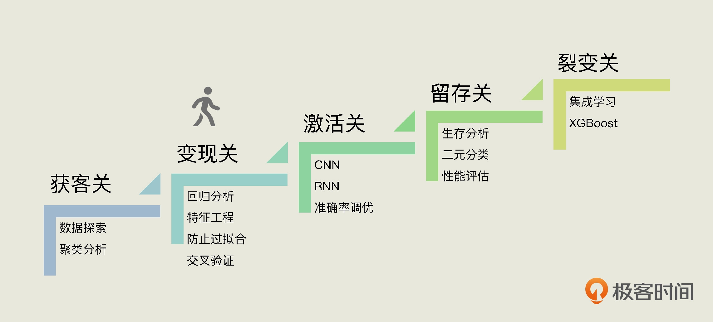

监督学习，主要应用于回归和分类两大场景，分别可以用来预测数值和进行分类判断，这两类问题也是我们课程的两大重点。在这节课中，你就能够学到用回归来进行数值预测的方法了。因为这是监督学习项目，所以，我们会完全跟着前面讲的“机器学习实战5步”来走。

# 定义问题

请你想象一下，你刚为客户做了分组画像，老板推门而入：“价值分组这个项目做得不错嘛！现在有这么一个新需求，你看看你这边还有什么idea。”

他继续说道：“你也知道，现在流量太贵了，拉新成本平均下来每注册一个用户我几乎要花接近500元。我是这么想的。500元，说贵也贵，说不贵也不贵，关键还是要看这些用户能给我们带来多大价值、多大回报，你说对吧？要是多数人用我们的App，用几次就不用了，订花的总消费甚至比500元还少，那就没什么意思了。所以，你看能不能根据历史数据，预测一下新用户未来一两年的消费总额？”

<!-- [[[read_end]]] -->

好，那现在我们来分析一下这个问题。其实，这个问题的实质是计算一个用户使用某产品的过程中消费总量是多少。比如某类手机App，用户的平均使用长度是两年左右，那么两年内用户在App上消费所产生的总收益就是用户的生命周期价值，英文是Lifetime Value，简称LTV，有时我们也叫CLV（Customer Lifetime Value）。

请你想想看，如果你得到一个新用户的成本是500元，看上去是很贵，但如果这个人在你的店铺买花的钱预计会超过万元，那么扣除进货成本和获客成本，你还是赚到了，ROI高嘛。

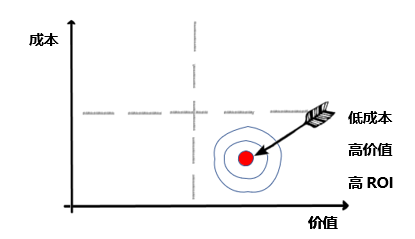

所以，我们的目标就是通过现有数据，找到一个能预测出用户生命周期价值的模型，来指导我们获客的成本，避免超出回报的盲目投入。

那对于这个问题，我们还是会使用上一个项目中的原始数据集，你在[这里](https://github.com/huangjia2019/geektime/tree/main/%E5%8F%98%E7%8E%B0%E5%85%B307)就能下载到。拿到数据集后，我们就可以开始数据的预处理工作了。

# 数据预处理

通过前面的课程，我想你应该已经想到：“用户生命周期价值”是一种连续性数值，对这种连续性数值的预测，属于一个回归问题。那么，在数据预处理阶段，我们就要确定把哪些特征字段输入到回归模型中。

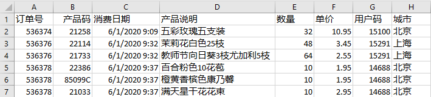

我们看到，这个数据集的字段包括订单号、产品码、消费日期、产品说明、数量（订单）、单价、用户码和城市。那么，哪些字段和用户的LTV相关呢？

很显然，像订单号、用户码、产品说明这些信息，肯定和用户的LTV值是不相关的。你可能会说，用户所在的“城市”这个字段，也许和用户的消费能力有一定的关联。

这看起来有一定的道理。不过，像“北京”、“上海”这样的文本字段肯定不能直接被输入回归模型，如果要考虑城市信息，也应该转换为0、1的哑变量值，再输入模型。也就是说转换成“是否北京”\(值是0或1\)，“是否上海”（值是0或1），“是否深圳”（值是0或1）……

你看，这样一下子就增加了好多个特征，而且对这个数据集来说，城市对于LTV值的影响其实并不大。综合这些因素，在这个项目中，我们就不考虑“城市”这个字段了。

看到这，你也许会想：那这么说的话，用户的消费金额肯定和LTV非常相关，可是，用户的消费金额不就是LTV本身嘛，用自己去预测自己，这样的模型有什么意义呢？

这个想法没错，用户的消费金额确实是和LTV最为相关的变量。不过，我们要做两个小调整，来解答你的困惑。

第一个调整是，我们可以考虑用头3个月的消费金额，而不是全部一整年的消费金额，来预测用户后续一年或两年的“价值”。这样，根据历史数据搭建起模型后，对于新注册的用户，我们只需要观察其头3个月的表现，就能够预测他今后一、两年的消费总量。如果某类App用户平均使用长度是一年或两年的话，这也就是该用户的生命周期价值。

第二个调整是，用我们在前两节课中学到的R、F、M值来做特征变量，这就避免了单一维度建模的局限性。在RMF用户分组中，我们不仅可以得到消费金额，还能得到新近度、消费频率。这些层级把消费频率、最近消费日期这些非数值变量转化成了数值变量，而且这些数值与用户的LTV也都密切相关。

因此，**在我们的模型中，可以用头3个月的R、F、M这3个数值作为特征，也就是回归模型的自变量。而回归模型所要预测的因变量，即数据集的标签，就是一年的总消费额，你可以认为它就是用户的LTV。**

我要说明一下，这里的3个月、12个月都只是思路上的示意，我们不去考虑用户平均会使用该App一年还是两年、三年。在不同业务场景中，计算RFM特征值的时间区间和LTV的时间区间可以视情况而定。

下面我们要做的就是数据清洗，这其中包括删除不符合逻辑的负值、查看有没有缺失值、添加每个订单的总价字段等。这部分内容和上一讲的类似，我就不再重复了，你如果不清楚，可以去回顾[上一讲](https://time.geekbang.org/column/article/416824)的内容。

在数据预处理阶段，唯一不同的就是，当前项目需要显示数据集的时间跨度，因为我们要拆分出头3个月的数据作为输入特征，并且只考虑12月的总消费金额作为LTV，所以我们要通过数据集的时间跨度来把它分为两部分，一部分用来构建RFM特征（头３个月），另一部分用来构建LTV这个标签（整个1２个月）。

1.  **整理数据集记录的时间范围**

通过这段代码，我可以知道当前数据集一共覆盖了多长的时间。

```
    import numpy as np #导入NumPy
    import pandas as pd #导入Pandas
    df_sales = pd.read_csv('易速鲜花订单记录.csv') #载入数据
    print('日期范围: %s ~ %s' % (df_sales['消费日期'].min(), df_sales['消费日期'].max())) #显示日期范围（格式转换前）
    df_sales['消费日期'] = pd.to_datetime(df_sales['消费日期']) #转换日期格式
    print('日期范围: %s ~ %s' % (df_sales['消费日期'].min(), df_sales['消费日期'].max()))#显示日期范围
    

```

输出如下：

```
    日期范围（格式转化前）: 1/1/2021 10:11 ~ 9/9/2020 9:20
    日期范围（格式转化后）: 2020-06-01 09:09:00 ~ 2021-06-09 12:31:00
    

```

结果显示，数据集中的时间跨度是从2020年6月到2021年6月9号。

因为我们希望求的是整年的LTV，所以，这里我们把不完整的2021年6月份的数据删除：

```
    df_sales = df_sales.loc[df_sales['消费日期'] < '2021-06-01'] #只保留整月数据
    print('日期范围: %s ~ %s' % (df_sales['消费日期'].min(), df_sales['消费日期'].max())) #显示日期范围
    

```

输出如下：

```
    日期范围（删除不完整的月份）: 2020-06-01 09:09:00 ~ 2021-05-31 17:39:00
    

```

目前的数据集中，共包含了整整12个月的数据。下面，我们开始构建机器学习数据集的特征和标签字段。

2.  **构建特征和标签**

基于前面的分析，我们用前3个月的R、F、M值作为特征字段，然后把整个12个月的消费金额视为LTV，作为标签字段。

首先，我们把头3个月的销售数据拆分出来，形成独立的df\_sales\_3m对象。这部分数据将是对用户LTV预测的依据。

```
    df_sales_3m = df_sales[(df_sales.消费日期 > '2020-06-01') & (df_sales.消费日期 <= '2020-08-30')] #构建仅含头三个月数据的数据集
    df_sales_3m.reset_index(drop=True) #重置索引
    

```

接下来，我们创建以用户码为主键的df\_user\_LTV对象，利用头3个月的数据，构建R、F、M层级，形成新特征。具体的思路和步骤，我们在[第5讲](https://time.geekbang.org/column/article/415910)中讲解过，我就不啰嗦了：

```
    df_user_LTV = pd.DataFrame(df_sales['用户码'].unique()) #生成以用户码为主键的结构
    df_user_LTV.columns = ['用户码'] #设定字段名
    df_user_LTV.head() #显示头几行数据
    df_R_value = df_sales_3m.groupby('用户码').消费日期.max().reset_index() #找到每个用户的最近消费日期，构建df_R_value对象
    df_R_value.columns = ['用户码','最近购买日期'] #设定字段名
    df_R_value['R值'] = (df_R_value['最近购买日期'].max() - df_R_value['最近购买日期']).dt.days #计算最新日期与上次消费日期的天数
    df_user_LTV = pd.merge(df_user_LTV, df_R_value[['用户码','R值']], on='用户码') #把上次消费距最新日期的天数（R值）合并至df_user结构
    df_F_value = df_sales_3m.groupby('用户码').消费日期.count().reset_index() #计算每个用户消费次数，构建df_F_value对象
    df_F_value.columns = ['用户码','F值'] #设定字段名
    df_user_LTV = pd.merge(df_user_LTV, df_F_value[['用户码','F值']], on='用户码') #把消费频率(F值)整合至df_user结构
    df_M_value = df_sales_3m.groupby('用户码').总价.sum().reset_index() #计算每个用户三个月消费总额，构建df_M_value对象
    df_M_value.columns = ['用户码','M值'] #设定字段名
    df_user_LTV = pd.merge(df_user_LTV, df_M_value, on='用户码') #把消费总额整合至df_user结构
    df_user_LTV #显示用户表结构
    

```

最后，我们输出显示df\_user\_LTV对象，就会看到头三个月的R值、F值、M值都已经作为特征，存到我们的数据集df\_user\_LTV中了。到这里，特征构建完毕。

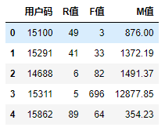

下面我们再来看怎么构建数据集的标签。

我们说过，标签，就是我们需要去预测或者判断的东西。而机器学习，就是通过已知来预测未知，通过训练数据集来寻找规律，发现特征和标签之间的联系。所以，我们下一步要做的，就是把LTV值加入到df\_user\_LTV中，这样数据集才完整。

我们先根据一整年的数据计算出每一个用户的LTV值，也就是12个月的总消费金额：

```
    df_user_1y = df_sales.groupby('用户码')['总价'].sum().reset_index() #计算每个用户整年消费总额，构建df_user_1y对象
    df_user_1y.columns = ['用户码','年度LTV'] #设定字段名
    df_user_1y.head() #显示头几行数据
    df_LTV = pd.merge(df_user_LTV, df_user_1y, on='用户码', how='left') #构建整体LTV训练数据集
    df_LTV #显示df_LTV
    

```

然后，再把得到的LTV值整合到之前构建的df\_user\_LTV中，就形成了完整的、带标签的LTV数据集。

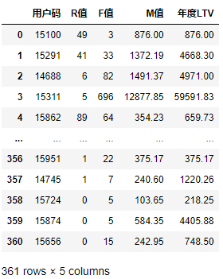

现在，在这个数据集中，R、F、M值来自于头3个月收集的数据，是模型的特征；LTV值来自于整年的数据，是模型的标签。这非常符合我们的目标：**用短期数据，来预测用户的长期价值**。

数据集形成之后，你会发现用户的数量从原来的981个减少到了361个，这是因为在头三个月出现过消费行为的用户数就只有361个。所以，我们后续基于这361个用户的数据来开展机器学习建模就可以了。

3.  **创建特征集和标签集**

刚刚我们把特征和标签整合在一起，是为了形成完整的数据集。不过，标签集和特征集要分别输入机器学习模型，所以要分别创建。

我们先来构建特征集X：

```
    X = df_LTV.drop(['用户码','年度LTV'],axis=1) #特征集
    X.head() #显示特征集
    

```

在这段代码中，我们除了移除了LTV值之外，还移除了用户码字段。因为用户码对于回归模型的训练毫无意义，而且用户码也是数字，会对模型形成干扰。如果不移除的话，机器就会把它也视作一个变量，认为15291比15100大，这显然不合逻辑。  
然后，我们再来构建标签集y。这里多说一句，在机器学习中，特征集的X大写，标签集的y小写，似乎是个惯例。这可能是因为通常情况下，X是一个向量，而y是一个数值。

```
    y = df_LTV['年度LTV'] #标签集
    y.head() #显示标签集
    

```

构建好特征集和标签集后，我们就可以把它们拆分为训练集、验证集和测试集了。

4.  **拆分训练集、验证集和测试集**

我们用scikit-learn工具包中的拆分工具train\_test\_split，进行拆分：

```
    from sklearn.model_selection import train_test_split
    # 先拆分训练集和其它集
    X_train, X_rem, y_train, y_rem = train_test_split(X,y, train_size=0.7,random_state = 36)
    # 再把其它集拆分成验证集和测试集 
    X_valid, X_test, y_valid, y_test = train_test_split(X_rem,y_rem, test_size=0.5,random_state = 36)
    

```

请你注意，这里我做了两重的拆分，至于为什么要这样做，你可以回顾下[第三讲](https://time.geekbang.org/column/article/414504)的内容。

最后，我们得到的数据集X\_train、X\_valid和X\_test的字段，与X中的字段还是一样，y\_train、y\_valid、y\_test中的字段和y的也一样，只是它们的行数发生了改变：

* X\_train是288行×4列；
* y\_train是288行×1列；
* X\_valid是73行×4列；
* y\_valid是73行×1列；
* X\_test是73行×4列；
* y\_test是73行×1列。

好，到这里，我们的数据准备工作就全部完成啦。在这个项目中，这部分工作几乎占了大头，好在我们已经攻克，下面我们一起进入选算法并创建模型的环节。

# 选择算法创建模型

因为这是一个回归问题，所以，在模型类型的选择方面，我们肯定使用的是回归算法。这是基于问题本身的性质而确定的，毋庸置疑。

不过我们说过，在机器学习中，能够解决回归问题的常见算法有不少：

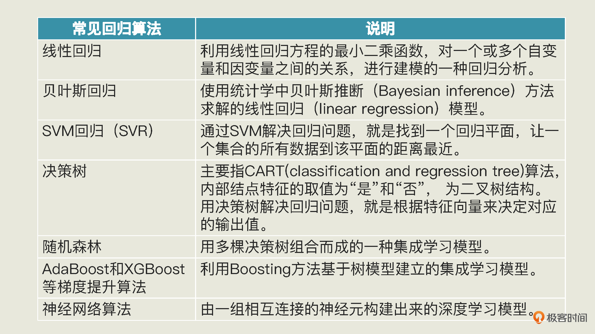

一般来说，我们在解决具体问题的时候，会选择多种算法进行建模，相互比较之后，再确定比较适合的模型。由于篇幅所限，我们不会使用上述全部算法建立模型，这里我会带你比较3种算法的效率：最基本的线性回归模型、决策树模型和随机森林模型（你可以自己试着使用其它的算法创建别的模型）。

线性回归我们已经用过了，它是通过梯度下降找到最优的权重和模型偏置的最基本的回归算法。这里，我会用它做为一个基准模型，把其它模型的结果与其相比较，来确定优劣。

而决策树算法，简单地说是从样本数据的特征属性中，通过学习简单的决策规则，也就是我们耳熟能详的IF ELSE规则，来预测目标变量的值。这个算法的核心是划分点的选择和输出值的确定。

下面，我给你画了一张图，来帮你理解决策树是怎么进行判断预测的。

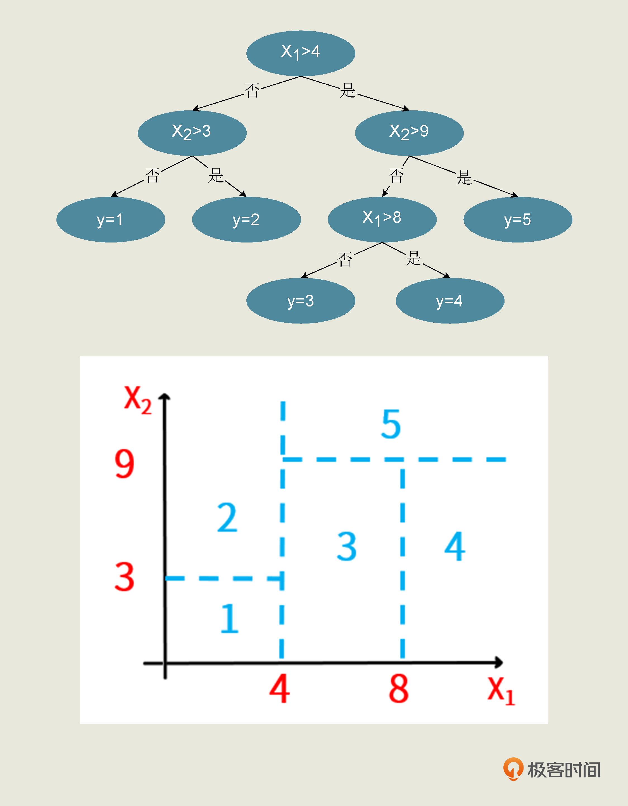

你可以看到，这种算法是根据两个特征\$x\_\{1\}\$和\$x\_\{2\}\$的值，以及标签y的取值，来对二维平面上的区域进行精准分割，以确定从特征到标签的映射规则。根据树的深度和分叉时所选择的特征的不同，我们可以训练出很多棵不一样的树来。

而随机森林呢，就是由多棵决策树构成的集成学习算法。它既能用于分类问题，也能用于回归问题。而且无论是解决哪类问题，它都是相对优秀的算法。在训练模型的过程中，随机森林会构建多个决策树，如果解决的是分类问题，那么它的输出类别是由个别树输出的类别的众数而定；如果解决的是回归问题，那么它会对多棵树的预测结果进行平均。

关于集成学习，我后面还会单独拿出来给你讲解。现在你只需要知道，随机森林纠正了决策树过度拟合其训练集的问题，在很多情况下它都能有不错的表现。这里的“过拟合”，其实就是说模型对训练集的模拟过头了，反而不太适合验证集和测试集。

下面我们导入并创建线性回归模型、决策树模型和随机森林模型。

```
    from sklearn.linear_model import LinearRegression #导入线性回归模型
    from sklearn.tree import DecisionTreeRegressor #导入决策树回归模型
    from sklearn.ensemble import RandomForestRegressor #导入随机森林回归模型
    model_lr = LinearRegression() #创建线性回归模型
    model_dtr = DecisionTreeRegressor() #创建决策树回归模型
    model_rfr = RandomForestRegressor() #创建随机森林回归模型
    

```

在代码中，有几个缩写我解释一下：

* lr是Linear Regression（线性回归）的缩写；
* dtr是Decision Tree Regresssor（决策树回归）的缩写；
* rfr是Random Forest Regressor（随机森林回归）的缩写。

对于决策树和随机森林算法来说，它们既有回归算法（Regressor），也有分类算法（Classifer）。以后，我们用到分类模型的时候，我就会把决策树分类模型命名为model\_dtc，把随机森林分类模型命名为model\_rfc，其中的“c”就代表Classifer。

创建好模型之后，我们就可以开始训练机器了。

# 训练模型

我们直接对线性回归、决策树模型和随机森林模型进行训练、拟合：

```
    model_lr.fit(X_train, y_train) #拟合线性回归模型
    model_dtr.fit(X_train, y_train) #拟合决策树模型
    model_rfr.fit(X_train, y_train) #拟合随机森林模型
    

```

你不要小看上面这几个简单的**fit语句，这是模型进行自我学习的关键过程**。我们前面说了，在线性回归算法中，机器是通过梯度下降，逐步减少数据集拟合过程中的损失，让线性函数对特征到标签的模拟越来越贴切。而在决策树模型中，算法是通过根据特征值选择划分点来确定输出值的；在随机森林算法中，机器则是生成多棵决策树，并通过Bagging的方法得到最终的预测模型。

不过，拟合之后的模型是否有效，我们还无法确定，需要进行验证集上的预测并验证预测结果。

# 评估模型

下面我们用这三种模型对验证集分别进行预测。

```
    y_valid_preds_lr = model_lr.predict(X_valid) #用线性回归模型预测验证集
    y_valid_preds_dtr = model_dtr.predict(X_valid) #用决策树模型预测验证集
    y_valid_preds_rfr = model_rfr.predict(X_valid) #用随机森林模型预测验证集
    

```

为了看看这些模型预测的LTV值是否大体上靠谱，我们先来随机选择其中一行数据，看看模型的预测结果。

```
    X_valid.iloc[2] #随便选择一个数据
    

```

这行数据的特征如下：

```
    R值       1.00
    F值     153.00
    M值    1413.83
    Name: 163, dtype: float64
    

```

然后，我们再显示一下三个模型对这一行数据所预测的LTV值，以及该用户的LTV真值。

```
    print('真值:', y_valid.iloc[2])  #真值
    print('线性回归预测值:', y_valid_preds_lr[2])  #线性回归模型预测值
    print('决策树预测值:', y_valid_preds_dtr[2])  #决策树模型预测值
    print('随机森林预测值:', y_valid_preds_rfr[2]) #随机森林模型预测值
    

```

输出：

```
    真值: 4391.9399999999905
    线性回归预测值: 7549.22894678151
    决策树预测值: 4243.209999999997
    随机森林预测值: 4704.671799999999
    

```

可以看到，相对而言，对这个数据点来说，决策树和随机森林所预测的y值更接近真值。

当然，一个数据点接近真值完全不能说明问题，我们还是要用\$R\^2\$、MSE等评估指标在验证集上做整体的评估，比较模型的优劣。

下面我们用\$R\^2\$指标，来评估模型的预测准确率：

```
    from sklearn.metrics import r2_score,   median_absolute_error #导入Sklearn评估模块
    print('验证集上的R平方分数-线性回归: %0.4f' % r2_score(y_valid, model_lr.predict(X_valid)))
    print('验证集上的R平方分数-决策树: %0.4f' % r2_score(y_valid, model_dtr.predict(X_valid)))
    print('验证集上的R平方分数-随机森林: %0.4f' % r2_score(y_valid, model_rfr.predict(X_valid)))
    

```

输出如下：

```
    验证集上的R平方分数-线性回归: 0.4333
    验证集上的R平方分数-决策树: 0.3093
    验证集上的R平方分数-随机森林: 0.4677
    

```

我们把这个结果用图表来显示一下，会更加直观：

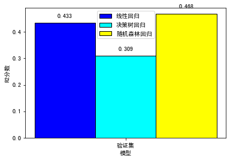

我们可以看到，在都没有经过任何参数设定的情况下，和线性回归、决策树相比，随机森林算法显示出了更好的预测能力。

最后，我们在随机森林上面运行测试集，并绘制出预测值和真值之间的散点图：

```
    y_test_preds_rfr = model_rfr.predict(X_test) #用模型预随机森林模型预测验证集
    plt.scatter(y_test, y_test_preds) #预测值和实际值的散点图
    plt.plot([0, max(y_test)], [0, max(y_test_preds)],   color='gray', lw=1, linestyle='--') #绘图
    plt.xlabel('实际值') #X轴
    plt.ylabel('预测值') #Y轴
    plt.title('实际值 vs. 预测值') #标题
    

```

输出如下：

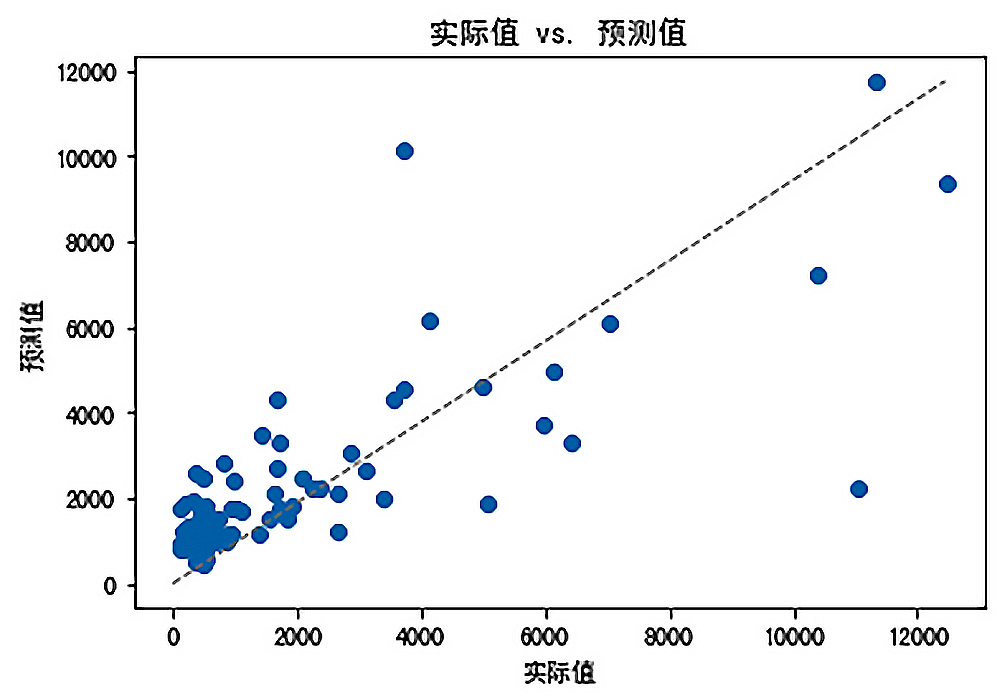

我们希望实际值和预测值基本上是相等的（预测值越接近真值，则误差越小）。举例来说，图中一个全年消费12000元的用户，所预测出来的LTV值，也在12000元左右。这样的情况越多，就表明模型越准确。

现在有了这个机器学习模型，我们再回过头看一下，在这一讲的开始，老板提出的问题：如何判断获客成本是否过高？根据模型预测结果，我们可以进一步观察处于R、F、M各个层级中的用户，看他们的LTV值大概是多少，这样就不难得知每个层级的获客成本应该控制在什么范围了。

对于高RFM价值的客户来说，我们可以适当多投入获客成本；而对于低RFM价值的客户，我们就要严格控制获客成本了。所以，根据这个模型，我们可以得出一个**获客成本的指导区间**。而且，通过该模型，我们**还可以便捷地计算出每个新用户的LTV值。**

# 总结一下

好，今天这一讲到这里就结束了，我们来回顾一下你在这节课中学到了什么。

在这一讲中，我们应用机器学习的实战5步，解决了一个回归问题。在这一过程中，最重要的部分是构建特征，也就是把原始数据，转化成R值、F值和M值，来作为新特征进行机器学习。而**这个过程本身就是一个很有意思的特征工程**。

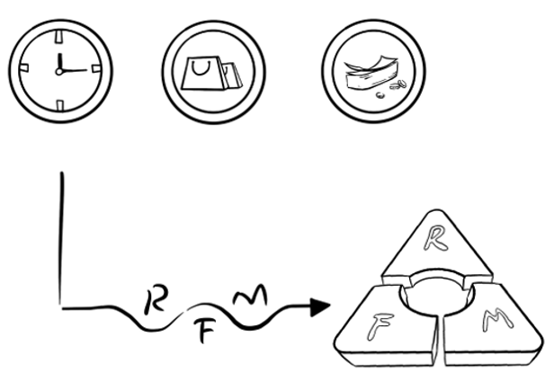

在模型选择的方面，我们使用普通的线性回归算法作为基准模型。然后，再拿其它的算法（这里我们选择的是决策树和随机森林）与之比较，从而找出更优的算法。请你注意，这里所谓的更优，仅针对于当前的场景而言，并不是说随机森林算法就一定优于线性回归算法。

当然，一般来说，随机森林简单且容易解释。如果对于任何一个特定问题，你能找到比随机森林还好的算法，那么就可以说是相当成功了。

在这次实战中，我们只是简单地调用模型，还并没有进行任何的参数优化步骤。以后，我们还会对随机森林算法做调优的工作。

# 思考题

这节课就到这里了，最后，我给你留3个思考题：

1.  在这次实战中，我们放弃了用户所在的“城市”这个信息，请你使用Pandas中的get\_dummies这个工具，来添加“城市”相关的哑变量，然后添加到特征集中，输入模型。

**提示**：

```
    city = pd.get_dummies(df_sales.城市, prefix='城市')
    df_sales = pd.concat([df_sales, city], axis=1)
    

```

2.  其实，SVM和朴素贝叶斯也可以解决回归问题，请你使用这两种算法（或其它回归算法）来尝试解决这个问题，然后比较各个算法的优劣。

**提示**：

```
    from sklearn.svm import SVR
    from sklearn.linear_model import BayesianRidge
    

```

3.  在验证时，我选择了\$R\^2\$作为回归问题的评估指标，你能否尝试使用均方误差、中值绝对误差等评估指标，来验证我们的模型呢？

**提示**：除了\$R\^2\$是越大越好之外，其它评估指标都是越小越好。

```
    from sklearn.metrics import mean_squared_error
    from sklearn.metrics import median_absolute_error
    

```

欢迎你在留言区分享你的想法和收获，我在留言区等你。如果这节课帮到了你，也欢迎你把这节课分享给自己的朋友。我们下一讲再见！

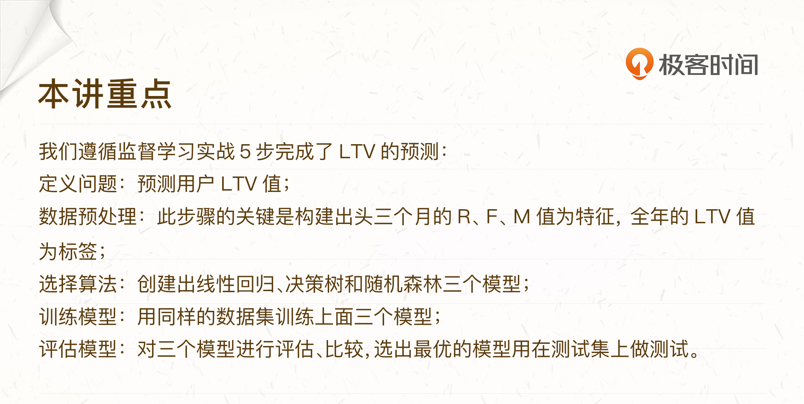