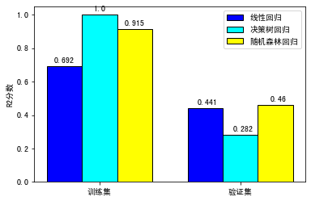
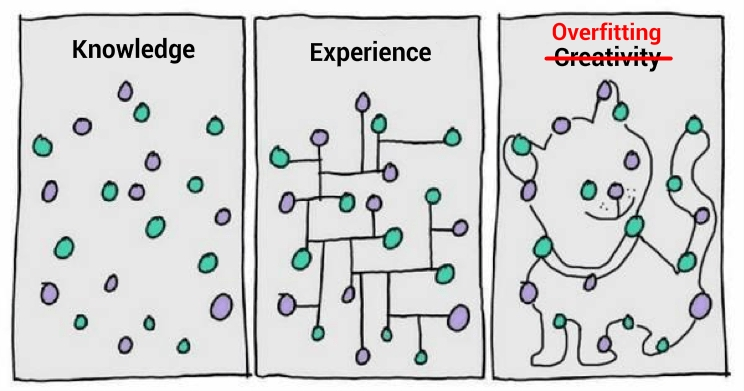
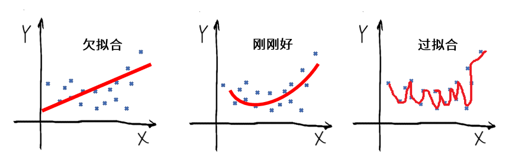
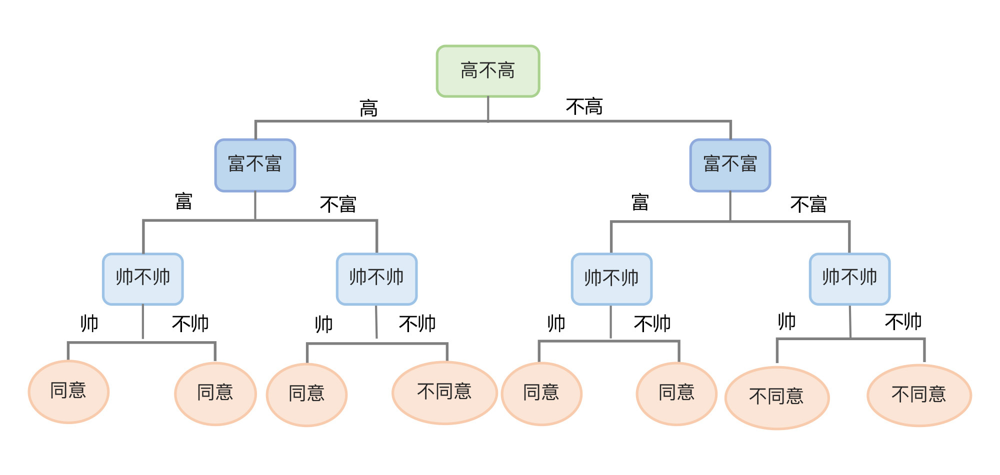
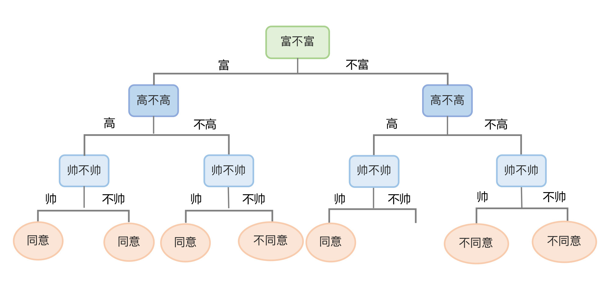
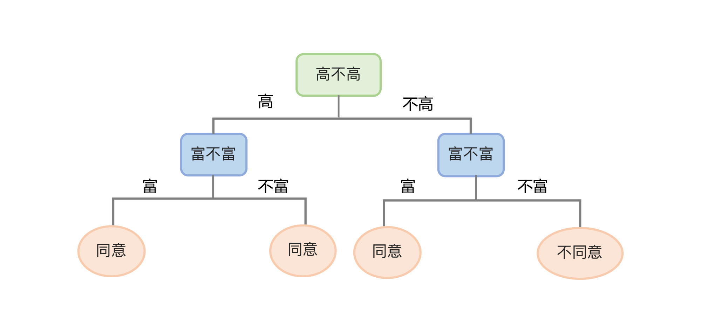
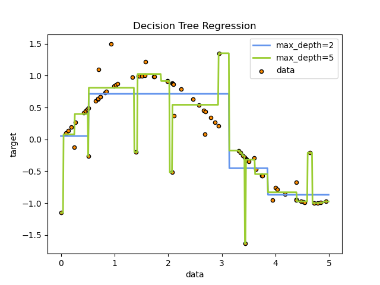
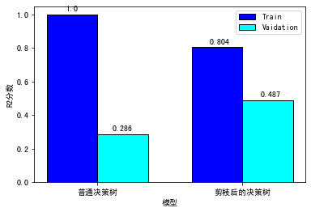
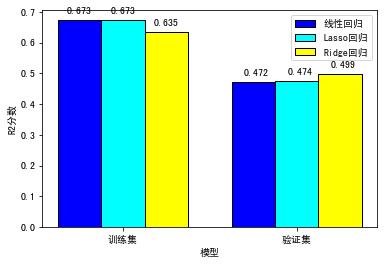

---
date: "2019-06-23"
---  
      
# 09｜模型优化（中）：防止过拟合，模型也不能太精细
你好，我是黄佳。欢迎来到零基础实战机器学习。

前几天，有个同学学完了[第7讲](https://time.geekbang.org/column/article/417479?cid=100085501)关于怎样用回归模型预测用户的LTV后，就问我说，佳哥啊，我跟着你的思路绘制出了各种回归模型在训练集和验证集上的评分，并进行了比较，有个发现吓了我一跳，你看这个决策树模型，为什么在训练集上得了满分1.0，而在验证集上的得分却如此低呢？



我一看，果然如此。

我告诉他，这就是机器学习中十分著名的“过拟合”现象。可以说，我们用机器学习建模的过程，就是和过拟合现象持续作斗争的过程。那么，什么是过拟合？我们怎么防止模型出现过拟合的问题呢？当你学完了这一讲，自然就有了答案。

## 什么是过拟合

在我们解释概念前，请你先看一下某相亲平台给出的相亲结果的数据集示意图。


现在，我们假设你的机器学习模型根据这个数据集，给了你一个非常漂亮的函数。这个函数是：**如果你不富也不帅，那么你在这个平台相亲就会失败；如果是其它任何一种情况，那你一定会成功**。

你有没有感觉到哪里不对？其实，这个模型有一个很严重的问题，就是**它过于准确了，犯了在训练集上过拟合的问题。**

下面这张图片是嘲讽过拟合现象的，很有意思。 最左边是一堆数据点，中间的模型试图在这些杂乱无章的数据点中挖掘出一些规律，而最右边的模型精准地穿越了每个数据点，最后画出了一只猫。

<!-- [[[read_end]]] -->



最右边这个模型，对于当前训练集的挖掘不可谓不精准，但是请你想一想，用这么精细的模型，去套另外一组数据，不大可能会套出另外一只猫，因此这个模型无法泛化到其它数据，它当然就是一个很失败的猫分类模型。

而且，你可别以为模型对训练集的预测达到百分之百准确，是一件多难的事。它其实并不难，只要模型足够复杂，训练集上的精度可以想多高就多高。比如我们常见的决策树模型，它对回归问题和分类问题，都能达到100\%的预测或分类准确率。因为决策树的原理就是在训练集上持续优化分割边界，直到完全正确为止。所以，就像我们开头在图中看到的那样，它在训练集上\$R\^2\$的分数能达到满分。

这对我们来说是一个非常失败的模型，因为我们不是要一个复杂的、在训练集上预测完全精准的模型，而是想要**构建一个泛化能力尽可能高的模型**。如果一个模型能够对它没见过且性质相似的数据做出准确预测，那我们就可以认为它具有不错的泛化能力，这个模型就是相对成功的。

那为什么模型会出现过拟合的状态呢？其实，这是因为机器和我们程序员一样，都有强迫症。模型在针对训练集的优化过程中不找到最小的误差点，它们是不会停的。我们说，过拟合是机器学习模型在训练数据集上，通过拟合函数形成的。在过拟合的形成过程中，一般会经历三个阶段：**欠拟合、平衡点和过拟合。**

在初期的时候，模型对训练集的拟合还未完善，能力不够强， 偏差也比较大。此时的模型就处于欠拟合的状态，把模型应用于测试集数据，效果肯定也不好，所以还需要继续训练。

随着训练次数增多，以及模型自身的调整优化，模型的拟合能力变得越来越强，就差不多可以用了。此刻，实际上已经出现了欠拟合和过拟合之间的平衡点。

然而，如果训练继续进行，模型经过充分训练后，就会完全拟合训练集数据。如果把此时的模型应用于测试集，我们并不一定能得到好的效果，很容易出现很高的误差。这就是过拟合的状态。我们开头提到的决策树模型就明显处于这种状态。

这里我说明一下，对于过拟合的讨论，我们多限于监督学习的应用范围，也就是回归和分类两大类问题。当然，也有人认为无监督学习中也存在过拟合现象，但是无监督学习中的过拟合被讨论的不多。所以，我们重点来看看回归和分类问题中的过拟合。

对于回归问题来说，你可以通过下面的图理解过拟合：



对于分类问题来说，你可以通过下面的图理解过拟合：


那么，解决过拟合问题的方法都有哪些呢？这里有三个思路：

1.  一般来说，数据点少，模型很容易就能完全描绘出从特征到标签的映射。所以，增加数据集中数据的数量可以在一定程度上防止过拟合。

2.  如果特征工程做得不好，数据集中的无用信息多，就会放大过拟合的影响，因为模型描绘出来的是无用信息和标签之间关系，当然泛化能力就受影响。所以，进行优质的特征工程，筛除无用的特征，去芜取精，去伪存真，有利于避免过拟合。

3.  我们前面提到，模型比较复杂时，它在训练集上的精度可以想多高就多高，这是因为从数学的角度，多次函数的图像远远比一次、二次函数复杂。模型越复杂，所能够覆盖的特征空间就越大。所以，如果数据集较小，或者说问题比较简单，我们尽量选择简单的模型。凡事选择简单的解决方案，这个道理人称**奥卡姆剃刀定理**。

因为数据集很难收集，特征工程又很考验机器学习工程师的水平，所以，防止过拟合的最佳策略就是要在模型的简单和复杂之间寻找一个平衡点。

不知道你还记不记得，在我们[第7讲](https://time.geekbang.org/column/article/417479?cid=100085501)中用过的3个模型：决策树、线性回归和随机森林。相对而言决策树和线性回归模型比较容易出现过拟合问题，而随机森林则本身就可以基于决策树的过拟合问题实现优化，因此，下面我会带你看看怎么把决策树模型和线性回归模型简单化，来帮你进一步理解如何防止过拟合。

## 决策树模型的构造和剪枝

决策树这个算法的原理很好理解，它就是将一大堆的if…else 语句进行连接，直到最后得到想要的结果。算法中的各个节点是根据训练数据集中的特征形成的。在对特征节点的选择不同时，就可以生成很多不一样的决策树。

下图所示是一个相亲数据集和根据该数据集而形成的决策树。此处我们随机设定一个根节点——身高，作为我们决策的起点，从该点出发，根据数据集中的特征和标签值给树分叉。




生成一个决策树有两个阶段，分别是构造和剪枝。

那么什么是构造呢？构造就是选择什么特征作为节点生成决策树的过程。在构造过程中，有三种节点：

* **根节点**：就是树的最顶端节点。在上图中，“高不高”就是根节点；
* **内部节点**：就是树中间的那些节点，比如说“富不富”、“美不美”；
* **叶节点**：就是树最底部的节点，也就是决策结果“同意”或者“不同意”。

在这些节点之间存在一种父子关系。比如根节点会有子节点，子节点还有子节点，到了叶节点就停止了，不再有子节点。在构造过程中，我们可以根据信息增益的程度来选择哪个属性作为根节点；哪些属性作为子节点；什么时候停止并得到目标状态，也就是叶节点。

那么什么是信息增益呢，就是数据集的熵和选定某个特征的条件熵之差，而熵就是对随机变量不确定性的度量，熵越大不确定性越大。我们应该选择熵比较小的特征作为根节点，来增加信息的增益。

如果我们在构造的过程中，选择不同的特征作为根节点，然后根节点下面选择不同的特征形成内部节点，就可以得到另外一棵决策树，也就是一个新的模型：



由于if…else 可以无限制地写下去，对于任何训练集，只要树的深度足够，决策树肯定能够达到100\% 的准确率。我们在前面讲过，这并不是一件好事，因为这样的模型认为其它所有数据的特点都和训练集中的数据完全一样的，所以它的泛化能力会很差。

对于这种情况，我们要在构造过程中对决策树进行剪枝，让树的深度不要太深，以免决策树太过于和精确。这样“模糊”一些的决策树，虽然在训练集上面的分数会降低，但是能够得到更强的泛化能力。

所以，针对具体数据集为模型选择适合的深度非常重要。下图所展示的就是一棵经过剪枝的决策树，剪枝之后树的深度从原来的3层变成了2层。



那上面这个数据集实际上是在用决策树解决分类问题，用的是决策树分类模型。我们再来看看下面这个决策树回归模型，对某个数据集中数据点的拟合示意图，相信你更能明白为什么我说树太深，就会对训练数据集拟合的太准，随之而来的也就会出现过拟合的现象了。



在这张图中，绿色线是当决策树深度为5是的模型拟合状态，蓝色线是决策树深度为2时的模型拟合状态。很明显，经过深度为5的模型训练集损失小，但深度为2的模型，泛化能力会更好。

其实，决策树的深度是一个可调的超参数，也就是max\_depth。这个超参数能限制树的最大深度，把超过设定深度的树枝全部剪掉，这也是最常见的剪枝策略。

那现在，我们就针对[第7讲](https://time.geekbang.org/column/article/417479?cid=100085501)中LTV预测的问题，在这里创建两棵不同决策树模型：一棵是默认的决策树，这个决策树的深度不加限定，将一直分叉直到完全的拟合所有数据点；另一棵是深度为3的决策树。我们分别拟合两棵树，来比较一下它们在训练集和测试集上的分数。示例代码可以在[这里](https://github.com/huangjia2019/geektime/tree/main/%E5%8F%98%E7%8E%B0%E5%85%B309)下载。

```
    from sklearn.tree import DecisionTreeRegressor #导入决策树回归模型
    model_dtr = DecisionTreeRegressor() #创建决策树回归模型
    model_dtr_cut = DecisionTreeRegressor(max_depth=3) #创建深度为3的决策树回归模型
    model_dtr.fit(X_train, y_train) #拟合决策树模型
    model_dtr_cut.fit(X_train, y_train) #拟合深度为3的决策树模型
    y_valid_preds_dtr = model_dtr.predict(X_valid) #用决策树模型预测验证集
    y_valid_preds_dtr_cut = model_dtr_cut.predict(X_valid) #用深度为2的决策树模型预测验证集
    from sklearn.metrics import r2_score,   median_absolute_error #导入Sklearn评估模块
    print('训练集上的R平方分数-决策树: %0.4f' % r2_score(y_train, model_dtr.predict(X_train)))
    print('训练集上的R平方分数-深度为3的决策树: %0.4f' % r2_score(y_train, model_dtr_cut.predict(X_train)))
    print('测试集上的R平方分数-决策树: %0.4f' % r2_score(y_valid, model_dtr.predict(X_valid)))
    print('测试集上的R平方分数-深度为3的决策树: %0.4f' % r2_score(y_valid, model_dtr_cut.predict(X_valid)))
    

```

经过训练，并在训练集和测试集上进行评估之后，我们得到\$R\^2\$分数输出如下：

```
    训练集上的R平方分数-决策树: 1.0000
    训练集上的R平方分数-深度为3的决策树: 0.8045
    测试集上的R平方分数-决策树: 0.2857
    测试集上的R平方分数-深度为3的决策树: 0.4870
    

```

我们做成直方图，对比更清晰：



可以看到，未经剪枝的决策树在训练集上的分数是满分，但是在验证集上的得分低得十分离谱。而设定了深度的决策树（也就是剪枝），它的训练集上的分数有所下降，可在验证集上的分数是大幅提升的，体现出了更好的泛化能力。所以，我们这次的“剪枝”相当成功！

讲完了决策树的剪枝，我们再来看看怎么防止线性回归模型的过拟合现象。

## 线性回归模型的正则化

如果你回忆一下我们在[第4讲](https://time.geekbang.org/column/article/415149)中讲过的线性回归的原理和公式，就会记起，线性回归模型，其实就是通过梯度下降确定参数的过程。如果数据集中有3个特征，公式就是：

\$\$y = w\_\{1\}x\_\{1\} + w\_\{2\}x\_\{2\} + w\_\{3\}x\_\{3\} + b\$\$

那么线性回归模型中的过拟合是如何产生的呢？如果在\$x\_\{1\}\$、\$x\_\{2\}\$、\$x\_\{3\}\$这些特征中，有某个特征的值域较大，而如果模型拟合的结果中，其权重参数 w 的值也比较大，那么这个特征就会占据“主导”地位，使模型往这些较大值的位置偏移，形成了对这些值的“过拟合”。

那么，如果我们能让这类特征项的权重参数变小，也许就可以得到更为平衡的模型，来防止过拟合现象的出现。这种在一定程度上减小这些参数的值的方法，就是机器学习中的正则化（regularization）。具体来说，在损失函数当中加入的正则项也叫惩罚项，也就是给需要训练的函数加上一些规矩、一些限制，让它们不要自我膨胀。

线性回归的损失函数的正则项有两种添加方法，分别叫做L1正则项和L2正则项。

添加L1正则项之后，一些特征的权重会变小，一些绝对值较小的系数甚至直接变为0（相当于抛弃了一些特征），来增强模型的泛化能力。这种回归也叫Lasso回归。

添加L2正则项之后，模型在不抛弃任何一个特征的情况下，会缩小回归系数，也就是某些特征的权重，让模型相对稳定，通常模型的泛化能力也更好。这种回归也叫Rigde回归。

下面，我们就使用Sklearn包中的Lasso回归和Ridge回归模型，比较一下L1和L2正则化方法的是否会给我们的LTV预测带来更好的结果。创建模型、训练模型并评估模型的代码如下：

```
    from sklearn.linear_model import LinearRegression #导入线性回归模型
    from sklearn.linear_model import Lasso
    from sklearn.linear_model import Ridge
    model_lr = LinearRegression() #创建线性回归模型
    model_lasso = Lasso() #创建Lasso回归模型
    model_ridge = Ridge() #创建Ridge回归模型
    model_lr.fit(X_train, y_train) #拟合线性回归模型
    model_lasso.fit(X_train, y_train) #拟合Lasso回归模型
    model_ridge.fit(X_train, y_train) #拟合Ridge回归模型
    from sklearn.metrics import r2_score,   median_absolute_error #导入Sklearn评估模块
    print('训练集上的R平方分数-线性回归: %0.4f' % r2_score(y_train, model_lr.predict(X_train)))
    print('训练集上的R平方分数-Lasso回归: %0.4f' % r2_score(y_train, model_lasso.predict(X_train)))
    print('训练集上的R平方分数-Ridge回归: %0.4f' % r2_score(y_train, model_ridge.predict(X_train)))
    print('测试集上的R平方分数-线性回归: %0.4f' % r2_score(y_valid, model_lr.predict(X_valid)))
    print('测试集上的R平方分数-Lasso回归: %0.4f' % r2_score(y_valid, model_lasso.predict(X_valid)))
    print('测试集上的R平方分数-Ridge回归: %0.4f' % r2_score(y_valid, model_ridge.predict(X_valid)))
    

```

分数输出如下：

```
    训练集上的R平方分数-线性回归: 0.6732
    训练集上的R平方分数-Lasso回归: 0.6731
    训练集上的R平方分数-Ridge回归: 0.6354
    测试集上的R平方分数-线性回归: 0.4719
    测试集上的R平方分数-Lasso回归: 0.4737
    测试集上的R平方分数-Ridge回归: 0.4992
    

```

还是一样，我们用表格来呈现输出结果：



你会发现，从普通线性回归到Lasso回归，再到Ridge回归，训练集分数呈现下降的趋势，这就是防止过拟合的惩罚项发挥了作用；在测试集上，分数则正好相反，从普通线性回归和Lasso回归，再到Ridge回归，反而呈现略微升高的趋势。不过，整体来说，差异似乎不是很大，说明目前这个线性回归模型的过拟合现象其实并不明显。

好啦，线性回归正则化的内容到这里就讲完了。不过，我要提醒你一点，正则化可以应用于诸多模型中，比如以后我们要用到的逻辑回归中的C值，也是一个正则化相关的参数。

其实，我们前面对决策树进行剪枝，避免过拟合，也可以称得上是一种正则化，因为剪枝过程也是对模型进行约束，不让树任意生长。如果多棵经过剪枝的决策树集合而成随机森林模型，那么这个模型其实也是一种正则化了的模型。

## 总结一下

好，今天这一讲到这里就结束了。我们学到了机器学习中非常重要的一个概念，就是“过拟合”。过拟合就是指模型过度地适应了训练集，反而影响其泛化到测试集上的能力。理解过拟合很重要，可以说，我们在机器学习性能调优的过程中，就一直在和过拟合现象做斗争。

那要防止过拟合现象，也有多种方法，包括增加数据量、特征工程以及选择更简单的模型等。不过，因为数据收集很难，特征工程又很考验机器学习工程师的水平，所以，防止过拟合的最佳策略就是要通过正则化，让模型变得尽量简单。

此外，我还给你讲了两个具体的示例，第一个例子是对决策树模型进行剪枝，我们通过剪枝可以控制决策树生成时的深度，防止出现对于训练集数据点切分过于精准，导致模型无法泛化到训练集的问题；另外，我们还对线性回归模型进行了正则化，我们选择使用了L1和L2正则项的Lasso回归和Ridge回归，这两个模型通过引入惩罚项减少某些特征的权重值，从而避免过拟合，提升模型的性能。

## 思考题

这节课就到这里了，最后，我给你留两个思考题：

1.  在决策树的剪枝过程中，除了max\_depth之外，还有min\_samples\_leaf、min\_samples\_split等超参数也可用于“剪枝”。其中，min\_samples\_leaf限定一个结点在分支后，每个子结点都必须包含至少N个训练样本，这个参数搭配max\_depth使用，在回归树中会让模型变得更加平滑。而min\_samples\_split则用来限定一个结点必须要包含至少N个训练样本。那么请你告诉我，当min\_samples\_leaf和min\_samples\_split的值设置的太小，可能会发生什么；如果值设的太大，又可能会发生什么？

提示：请你阅读sklearn中这些超参数和其它超参数的[说明文档](https://scikit-learn.org/stable/modules/generated/sklearn.tree.DecisionTreeRegressor.html#sklearn.tree.DecisionTreeRegressor)，并尝试去使用它们。

2.  你在工作中曾经有过哪些避免过拟合的经验，可否在这里分享一下？

欢迎你在留言区分享你的想法和收获，我在留言区等你。如果这节课帮到了你，也欢迎你把这节课分享给自己的朋友。我们下一讲再见！

