---
date: "2019-06-23"
---  
      
# 13｜深度学习（下）：3招提升神经网络预测准确率
你好，我是黄佳。欢迎来到零基础实战机器学习。

在前面两讲中，我们创建了CNN和RNN两个常用的深度神经网络模型。今天，我们来专门谈一谈神经网络的优化，让前两讲中所创建的网络模型拥有更好的性能。

关于性能优化，我们不是第一次讲了，在[第8讲](https://time.geekbang.org/column/article/418354)到[第10讲](https://time.geekbang.org/column/article/419746)中，我们对应普通的机器学习模型，讲了三个阶段的性能调优：

* 在数据处理阶段，我们介绍了特征工程对于模型性能的重要性；
* 在模型训练阶段，我们介绍了过拟合的危害以及如何避免过拟合；
* 在测试评估阶段，我们介绍了交叉验证以及参数调优的方法。

其实，深度学习的性能优化和其它普通的机器学习模型类似，我们也可以从数据处理、网络模型本身，以及如何对神经网络进行参数调优这三个主要方面去考虑。

## 数据方面的考量：图像数据增广

我们已经知道，要提高模型的性能，数据方面的考量就是提升数据的“质”和“量”。那么，提升“质”，就是做好特征工程。不过你知道，神经网络对特征工程的要求是比较低的，因为神经网络本身就可以完成特征提取。

那怎么增加数据的“量”呢？我们都清楚，有标签的数据搜集起来真是太困难了，尤其是带标签的图片数据。那有没有什么方法能够在只有这么多图片的情况下，来提升我们[第11讲](https://time.geekbang.org/column/article/420372)中那个鲜花图片分类网络的性能呢？

<!-- [[[read_end]]] -->

还真有。在机器学习领域，有一个专门解决这类问题的“大杀器”，叫数据增广\(data augmentation\)，也叫数据增强，它能通过已有的图片，增加数据量，从而提高卷积网络图像处理问题的性能，增强模型的泛化能力。

对原始的图像进行数据增广的方式有很多，比如水平翻转，还有一定程度的位移、颠倒、倾斜、裁剪、颜色抖动（color jittering）、平移、虚化或者增加噪声等，这些都比较常用。此外，我们还可以尝试多种操作的组合， 比如同时做旋转和随机尺度变换，还可以提升所有像素在HSV颜色空间中的饱和度和明度，以及在色调通道对每张图片的所有像素增加一个-0.1\~0.1之间的值等。

像这样一张图片，我们通过上述“变换”，可以当成七、八张，甚至十张、百张来用。

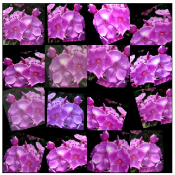

这样一来，无论是图片的数目，还是多样性，模型在训练时都能够观察到数据的更多内容，从而拥有更好的准确率和泛化能力。

在Keras中，我们可以用Image Data Generator工具来定义一个数据增广器，完整代码参见[这里](https://www.kaggle.com/tohuangjia/cnn-tuning)。

```
    # 定义一个数据增强器，并设定各种增强选项
    from tensorflow.keras.preprocessing.image import ImageDataGenerator #数据增强器
    augs_gen = ImageDataGenerator( #各种增强参数，具体说明可参见Keras文档
               featurewise_center=False,
               samplewise_center=False,         
               featurewise_std_normalization=False,          
               samplewise_std_normalization=False,  
               zca_whitening=False, 
               rotation_range=10,  
               zoom_range = 0.1, 
               width_shift_range=0.2,  
               height_shift_range=0.2,
               horizontal_flip=True,  
               vertical_flip=False) 
    augs_gen.fit(X_train) # 针对训练集拟合数据增强器
    

```

现在，我们就用这个数据增广器对[第11讲](https://time.geekbang.org/column/article/420372)中创建的卷积神经网络模型CNN进行优化，看看数据增广能给这个模型带来什么变化。CNN网络模型的结构和编译参数都和原来的模型一样，唯一的区别是在训练时，需要通过augs\_gen.flow动态生成被增强后的训练集。

```
    history = cnn.fit( # 拟合   
        augs_gen.flow(X_train,y_train,batch_size=16), # 增强后的训练集
        epochs = 30,  # 指定轮次
        verbose = 1) # 指定是否显示训练过程中的信息
    # show_history(history) # 调用这个函数
    

```

由于数据增广需要时间，这次模型训练相比[第11讲](https://time.geekbang.org/column/article/420372)中没有数据增广的训练，速度慢了很多。训练过程结束之后，我们对比一下数据增广前后的分类准确率。

增广之前：

```
    result = cnn.evaluate(X_test, y_test) #评估测试集上的准确率
    print('数据增强之前CNN的测试准确率为',"{0:.2f}%".format(result[1]*100))
    

```

输出如下：

```
    21/21 [==============================] - 0s 7ms/step - loss: 4.4355 - acc: 0.6003
    数据增强之前CNN的测试准确率为 60.03%
    

```

增广之后：

```
    result = cnn.evaluate(X_test, y_test) #评估测试集上的准确率
    print('数据增强之后CNN的测试准确率为',"{0:.2f}%".format(result[1]*100))
    

```

输出如下：

```
    21/21 [==============================] - 0s 8ms/step - loss: 0.6121 - acc: 0.7856
    数据增强之后CNN的测试准确率为 78.56%
    

```

可以看到，数据增广之后的测试结果更令人满意，测试误差大幅减小，准确率也从60\%上升至78\%以上。对于这个花朵的分类问题来说，这已经是相当不错的成绩了。

那么，数据方面的考量我们就介绍到这里，下一步，我们来看看神经网络在模型训练阶段要注意哪些问题。

## 训练时的考量：防止网络过拟合

在[第9讲](https://time.geekbang.org/column/article/419218)的模型调优部分，我们反复强调过模型过拟合的危害，过拟合的模型会严重降低模型在其它数据集上的泛化能力。那么，神经网络会不会也出现类似的问题呢？我们仔细观察一下我在训练[上一讲](https://time.geekbang.org/column/article/421029)中的神经网络模型时得到的这张损失曲线图片：

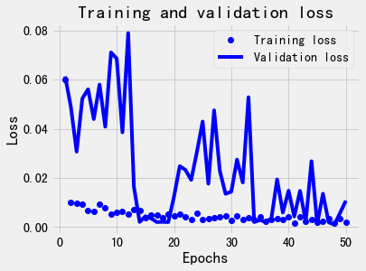

不知道你有没有发现，神经网络在训练数据集上的损失在一直变小，直到趋近于0，达到非常高的拟合准确度。然而，验证集上的损失并不是在稳定地减小，一开始是跟着训练集的损失的减小而逐渐变小，到后来，又呈现出爬升以及大小弹跳的状态。这就意味着过拟合已经出现了，这个过程就像下面这张图显示一样：

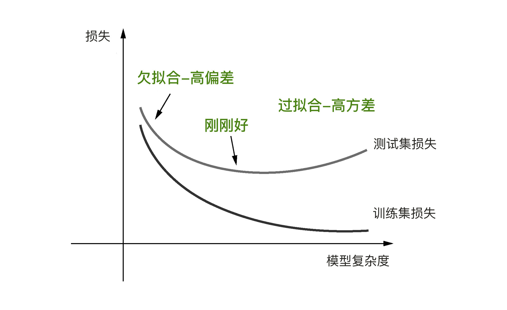

我们知道，神经网络算是一种复杂的模型，它的深度架构层次深、神经元的数量很多，参数也很多，所以神经网络才能够模拟出现实世界中各种各样的关系。

你可能会问我这样一个问题：佳哥，你说模型过于复杂，就会在训练数据集上发生过拟合，可你又说，如果神经网络模型不复杂，就解决不了复杂的问题，这不是自相矛盾了吗？

这的确是神经网络模型所面临的一个两难问题。对于小数据而言，深度神经网络由于参数数量太多，容易出现过拟合的风险。而对于神经网络这么复杂的模型来说，要避免过拟合还挺难做到的。

不过，深度学习三巨头之一的杰弗里·欣顿（Geoffrey Hinton）和他的学生发现了一种解决方式：他们把一种叫做 Dropout 的层添加到了神经网络中，将该层的一部分神经元的输出特征随机丢掉（设为0），相当于随机消灭一部分神经元：

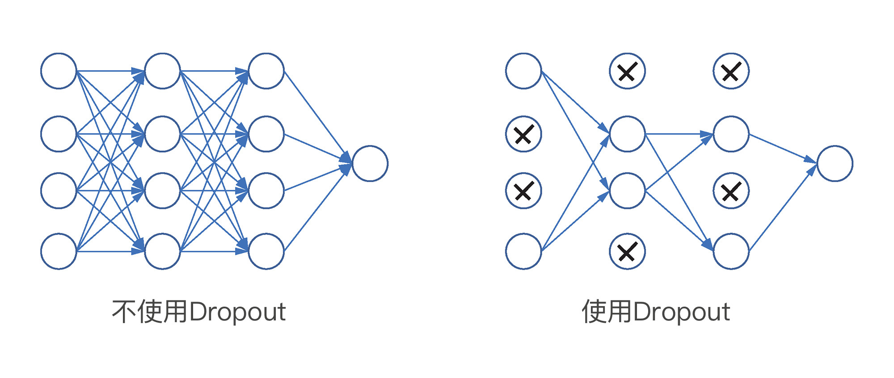

那么，为什么杀死一部分神经元就能达到避免过拟合的效果呢？其实，这就是神经网络中最常用的正则化机制，你还记得正则化的原理吧，它的目的是为了让模型粗糙一点儿，不要过分追求完美。

Hinton的这个灵感来自银行的防欺诈机制。他去银行办理业务时，发现柜员不停地换人。他就猜想，银行工作人员要想成功欺诈银行，他们之间要互相合作才行，因此一个柜员不能在同一个岗位待得过久。这让他意识到，在某些神经网络层中的各个神经元之间的参数可能也是针对训练数据集形成了某种“固定套路”，那么，随机删除一部分神经元，就有可能打破这些套路，阻止它们的“阴谋”，从而降低过拟合。

对于大型的深层神经网络来说，添加Dropout层已经是一个标准配置了。下面，我们就给[上一讲](https://time.geekbang.org/column/article/421029)中的RNN模型增加Drop层。完整代码请见[这里](https://www.kaggle.com/tohuangjia/rnn-tuning)。

```
    from tensorflow.keras.models import Sequential #导入序贯模型
    from tensorflow.keras.layers import Dense, LSTM, Dropout #导入全连接层,LSTM层和Dropout层
    from tensorflow.keras.optimizers import Adam
    # LSTM网络架构
    RNN_LSTM = Sequential() #序贯模型
    RNN_LSTM.add(LSTM(units=50, return_sequences=True, input_shape=(X_train.shape[1],1))) #输入层LSTM,return_sequences返回输出序列
    RNN_LSTM.add(Dropout(0.2)) #Dropout层减少过拟合
    RNN_LSTM.add(LSTM(units=50, return_sequences=True)) #中间层LSTM，return_sequences返回输出序列
    RNN_LSTM.add(Dropout(0.2)) #Dropout层减少过拟合
    RNN_LSTM.add(LSTM(units=50, return_sequences=True)) #中间层LSTM，return_sequences返回输出序列
    RNN_LSTM.add(Dropout(0.2)) #Dropout层减少过拟合
    RNN_LSTM.add(LSTM(units=50)) #中间层LSTM
    RNN_LSTM.add(Dropout(0.2)) #Dropout层减少过拟合
    RNN_LSTM.add(Dense(units=1)) #输出层Dense
    # 编译网络
    RNN_LSTM.compile(loss='mse', #损失函数
                 optimizer='rmsprop', #优化器
                 metrics=['mae']) #评估指标
    RNN_LSTM.summary() #输出神经网络结构信息
    

```

输出如下：

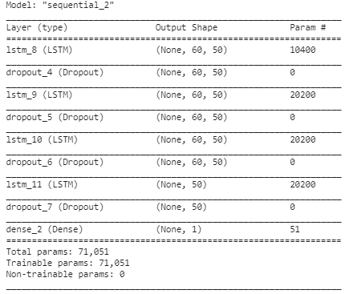

此处，Dropout\(0.2\)层中的0.2，也就是在Dropout层中会被随机丢弃掉的神经元的比例，通常设为0.2 ～ 0.5。注意，Dropout 只是对训练集起作用，在测试时没有神经元被丢掉。

接着，我们来看一下添加了Dropout层之后，RNN网络训练过程的损失曲线：

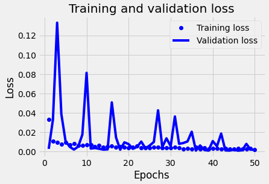

添加了Dropout层之后，损失曲线显得更平滑了，尽管仍然有震荡的现象，但是震荡的幅度呈现逐渐减小的趋势，而且验证集损失也随着轮次的增多而减小。

对测试集预测后显示预测曲线如下：

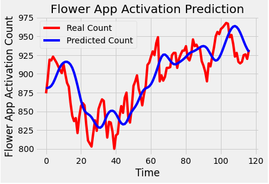

曲线中真值和预测值的走势非常接近。

我们可以计算一下调优前后的均方误差，并进行比较：

```
    print("调优前MSE损失值 {}.".format(mean_squared_error(y_test, y_pred)))
    print("添加Dropout层之后的MSE损失值 {}.".format(mean_squared_error(test, y_pred_dropout)))
    

```

此时显示模型的均方误差为：

```
    调优前MSE损失值 0.06139160691187054.
    添加Dropout层后得MSE损失值 0.034998731473164235.
    

```

比起没有添加Dropout层的均方误差，加入Dropout层后的模型均方误差从0.06减小到了0.03。可以说，我们的性能优化是成功的。

当然，增加Dropout层并不是我们唯一可以在模型创建过程中可以调节的内容，我们还可以通过增加或者减少模型的层数、通过改变层的类型（比如用GRU或者SimpleRNN来替换LSTM）来找到对于当前数据集最为适配的网络结构，从而减小误差，优化模型的性能。不过，这个过程并没有固定原则，只能反复去尝试。

介绍完模型创建过程中的正则化技巧，下面我们接着看看，神经网络在调参时有什么需要注意的地方。

## 调参时的考量：更新优化器并设置学习速率

其实，在神经网络的训练过程中，除了存在过拟合的问题之外，还有一个很严重的问题需要解决，就是卡在“局部最低点”的问题。

和线性回归函数一样，神经网络也是通过梯度下降来实现参数的最优化，不过，有一点不同的是：线性回归函数仅存在一个全局最低点，而神经网络因为函数十分复杂，会出现很多的局部最低点，在每一个局部最低点，导数的值都为0。没有求导后的正负，梯度下降也就没有任何方向感，所以这时候，神经网络的参数也不知道应该往哪里“走”，因此，神经网络模型并不能够总是得到最佳的训练结果。

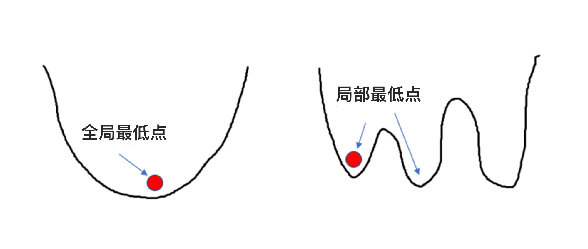

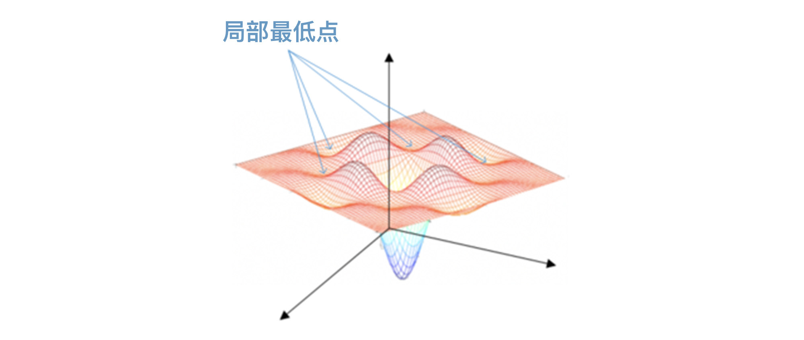

基于这个问题，人们发明了一系列的神经网络优化器，这些优化器可以在编译神经网络时作为参数传入神经网络，解决局部最低点的问题。

具体是怎么解决的呢？我们就以SGD优化器为例。SGD优化器利用了动量的原理，也就是在梯度下降时，借助惯性越过当前的局部最低点，来寻找网络中损失更小的地方。

这个思路不难理解，你可以想象一个小球从山坡上滑下来，在下坡的过程中，遇到一个局部最低点，如果小球此时的速度很慢，就会卡在这个局部最低点上。这时候，小球无论是向左移动还是向右移动，都很难越过去，对于模型来说，无论是向左还是向右，都会导致损失值增大。

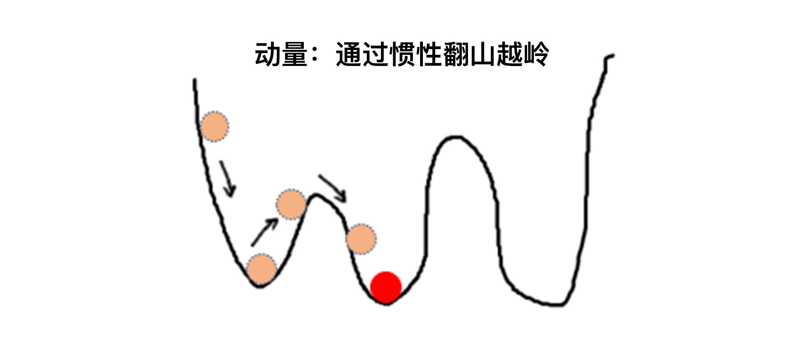

这时候，我们给这个SGD优化器传入一个叫“学习速率”的参数，来调节小球的快慢（也就是梯度下降的快慢），这里你可以把“学习速率”直观理解为“加速度”。如果SGD优化器的学习速率很小，那小球就冲不出这个局部最低点，参数就无法继续优化；如果学习速率很大，它就可能帮小球成功越过局部最低点，进入下一个下坡轨道，去寻找更优的权重参数。

除了SGD优化器之外，还有许多其他优化器，比如Adagrad，它也是一种基于梯度的优化方法，叫作自适应梯度（adaptive gradient），也就是不同的参数可以拥有不同的学习速率。

Adagrad能根据前几轮迭代时的历史梯度值来调整学习速率。对于数据集中的稀疏特征来说，Adagrad会使用较大的学习速率，此时梯度下降步幅将较大。这里的稀疏特征，意思就是指类别非常多，但是每个类别的特征数量很少，一个很典型的例子就是对文本数据的词向量编码。

对于非稀疏特征，Adagrad则使用较小的值更新学习速率。因此，这个优化算法适合处理含稀疏特征的数据集，比如，在文本处理的词向量（word embedding）训练过程中，对频繁出现的单词赋予较小的更新，对不经常出现的单词则赋予较大的更新。

还有我们之前见过的RMSprop优化器，它解决的是Adagrad 中学习速率有时会急剧下降的问题。RMSProp抑制学习速率下降的方法不同于普通的动量，它是采用窗口滑动加权平均值，来计算二阶动量。同时，它还可以保存Adagrad 中每个参数自适应不同的学习速率。

另一种常见的优化器叫Adam，它是一种基于一阶和二阶矩的自适应估计的随机梯度下降方法。这种优化器计算效率高，内存需求小，是前面各种优化器的集大成者，并且非常适合数据和参数都较大的问题。

在实际的机器学习项目中，这几种优化器都可用，目前较常用的是RMSprop和Adam，但是你也可以尝试其他的，哪个效果好就用哪个。

另外，在刚才的优化器介绍中，出现了一些新名词和数学概念，你可能不太理解，这并没有关系，我们只需要从应用的角度出发，把优化器当作是调解神经网络模型的“手柄”就可以了。当然，除了我上面介绍的优化器之外，还有很多其它类型的优化器，你可以查阅[Keras文档](https://keras.io/api/optimizers/)。

那么，问题来了，在我们构建神经网络的过程中，怎么设定这些优化器呢？答案是compile方法。当我们搭建好神经网络的架构后，需要通过这个方法进行编译。具体的代码，我们在之前CNN和RNN的实战中其实已经见过了：

```
    cnn.compile(loss='categorical_crossentropy', # 损失函数
                optimizer='RMSprop'), # 更新优化器并设定学习速率
                metrics=['acc']) # 评估指标
    

```

```
    RNN_LSTM.compile(loss='mse', #损失函数
                     optimizer='rmsprop', #优化器
                     metrics=['mae']) #评估指标
    

```

可以看到，这里有3个可以调节的参数，分别是loss、optimizer和metrics。其中，optimizer就是设置优化器，loss是用来指定损失函数的。对于多元分类问题，我们一般用categorical\_crossentropy指定损失函数；对于二元分类问题，一般是用binary\_crossentropy；如果是回归问题，你可以选择mse，也就是均方误差。

至于评估指标metrics，我们当然也不陌生。对于分类问题，我们可以使用acc，也就是分类准确率，作为评估指标；对于回归问题，则可以选择使用mae，即绝对平均绝对误差。

在这三个参数里，optimizer自然是和性能优化最相关的参数。很多时候，神经网络完全没有训练起来，就是优化器以及优化器的学习速率设定的不好。我们构建[上一讲](https://time.geekbang.org/column/article/421029)中的循环神经网络模型的时候，采用了RMSprop优化器。现在，我们就在compile方法中更换一下优化器，把RMSProp更换成Adam，并同时设定一个学习速率，来看一看网络的性能是否有所提升。

```
    from tensorflow.keras.optimizers import Adam #导入Adam优化器
    ……
    RNN_LSTM.compile(loss='mse', # 损失函数 
                 optimizer=Adam(lr=1e-4), # 更新优化器并设定学习速率 
                 metrics=['mae']) # 评估指标
    history = RNN_LSTM.fit(X_train,y_train, # 指定训练集 
                       epochs=10, # 指定轮次 
                       batch_size=256, # 指定批量大小 
                       validation_data=(X_test,y_test)) # 指定验证集
    

```

接着，我们来看一下更新了优化器之后，RNN网络训练过程的损失曲线：

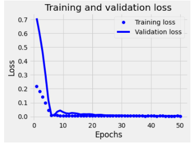

可以看到，训练集和验证集的损失曲线展现出了更多的一致性。

此时，我们显示模型两次调优前后的均方误差：

```
    print("调优前MSE损失值 {}.".format(mean_squared_error(y_test, y_pred)))
    print("添加Dropout层之后的MSE损失值 {}.".format(mean_squared_error(test, y_pred_dropout)))
    print("设置优化器后的MSE损失值 {}.".format(mean_squared_error(y_test, y_pred_optimizer)))
    

```

输出如下：

```
    调优前MSE损失值 0.06139160691187054.
    添加Dropout层后的MSE损失值 0.034998731473164235.
    设置优化器后的MSE损失值 0.006510688077187477.
    

```

结果显示，模型在测试集上的均方误差进一步减小了，这说明我们的优化方向是正确的。

你可能会想知道为什么Adam优化器在这里比RMSProp更优？这其实并不是很容易解释，深度学习比较强大，但是它又近似于“玄学”，可解释性相对较差。因此，对于每一个数据集，我们都需要反复尝试、调试各种参数，哪个好就用哪个。这是深度学习本身的特点。因此，优化器的选择和学习速率的设定也是如此，需要我们凭借经验和感觉来确定。总体上说，我们比较常用的优化器就是RMSprop和Adam这两种。

## 总结一下

好，今天这一讲到这里就结束了，我们来回顾一下你在这节课中学到了什么。

在这一讲中，我们介绍了三个深度学习神经网络性能优化的方法。第一个方法是针对图形数据做增广，也就是把有限的数据个数变多。其实不只是CNN网络，对于其他神经网络模型，乃至神经网络模型之外的模型来说，数据的数量都是多多益善。数据的量越大，模型出现过拟合的风险就越小。

第二个方法是在网络模型中增加一些Dropout层，这种类型的神经网络层，通过阻止各个神经元之间的共同作用，阻止它们形成固定的特征提取模式来提高神经网络的泛化能力。

第三个方法是尝试使用不同类型的神经网络优化器，来克服网络训练时落入局部最低点的问题。其中，最常用的神经网络优化器是Adam，但具体到每一个数据集来说，可能还有更适合自己的优化器，因此，我建议你在实际项目中最好还是多试试不同的优化器。就目前而言，RMSprop和Adam都是常用的优化器，而Adam 更是多种优化思路的集大成者，一般情况下是优化器的首选项。

如何优化深层神经网络的性能是一个很大的课题。希望这一讲的内容能带给大家一个基本的思路。

## 思考题

这节课就到这里了，最后，我给你留3个思考题：

1.  请你试着在我们创建的LSTM网络中加入更多或者更少的Dropout层，并显示损失曲线，看一看神经网络性能的变化。
2.  请你试着在我们创建的神经网络中加入更多或者很少的CNN层或者LSTM层，并显示损失曲线，看一看神经网络性能的变化。
3.  请你试着使用其它的神经网络优化器编译我们创建的神经网络，并显示损失曲线，看一看神经网络性能的变化。

欢迎你在留言区分享你的想法和收获，我在留言区等你。如果这节课帮到了你，也欢迎你把这节课分享给自己的朋友。我们下一讲再见！

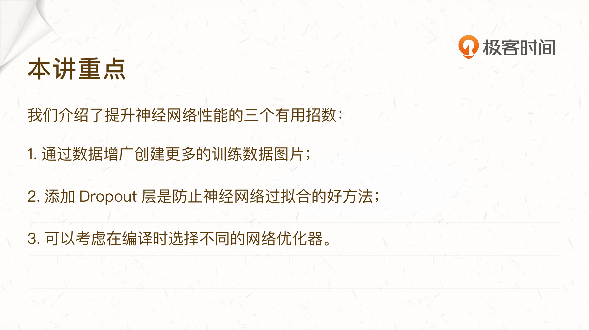