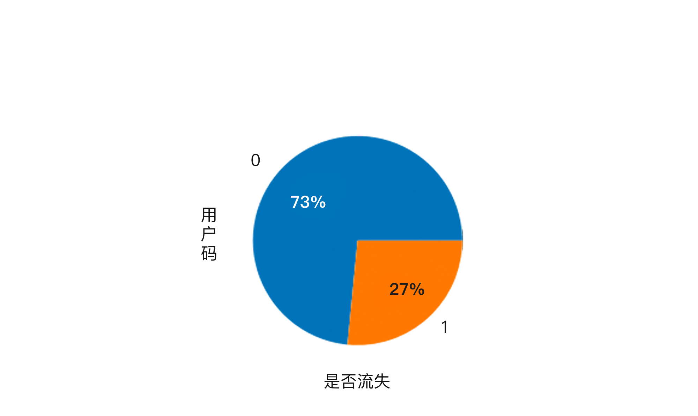
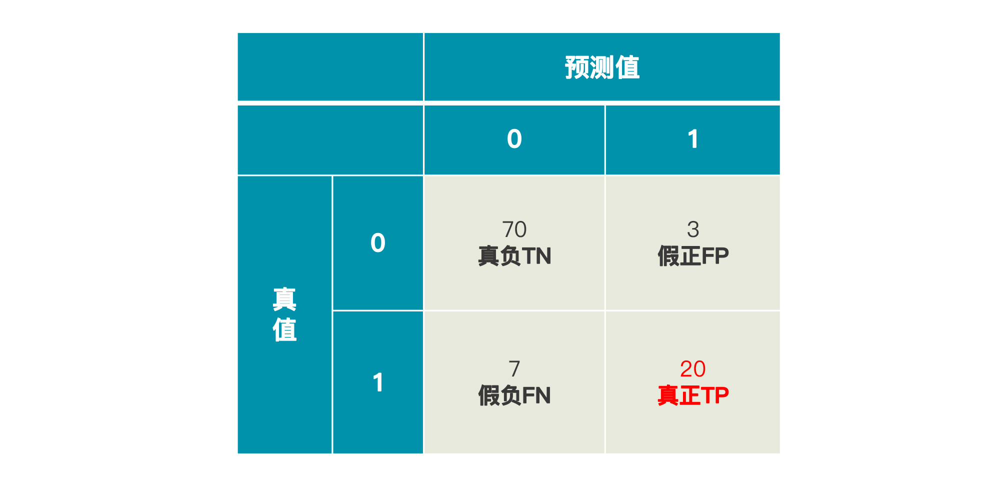
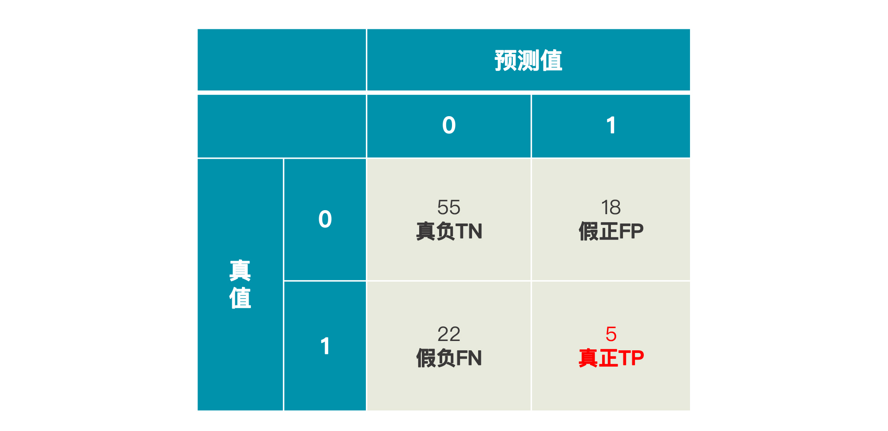
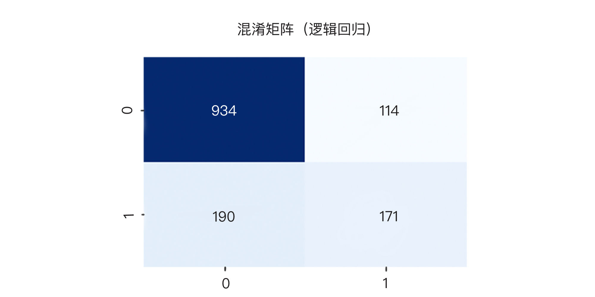
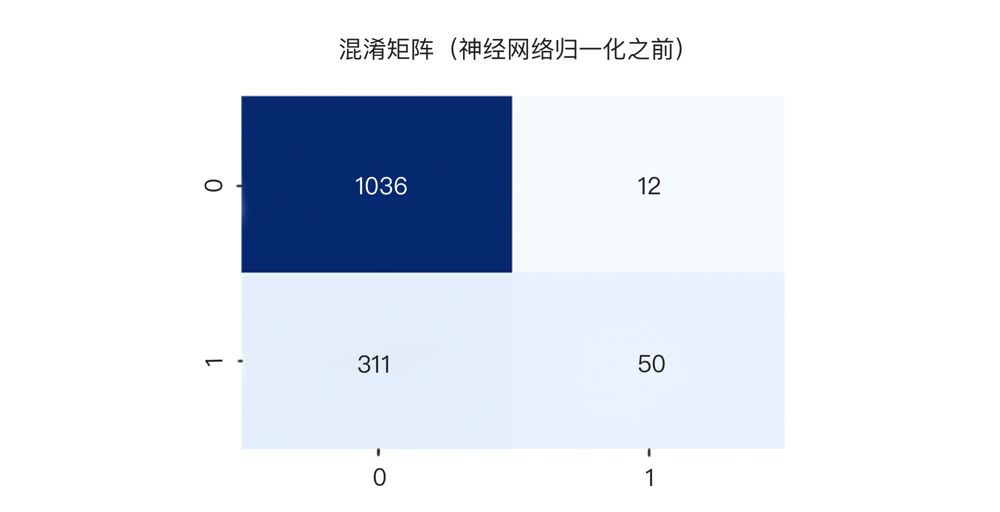
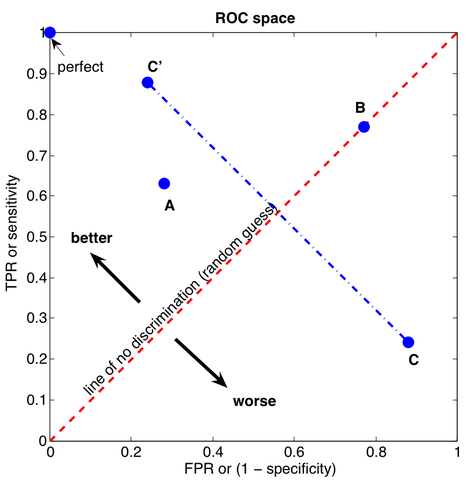
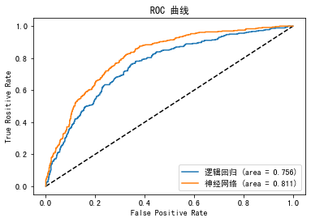
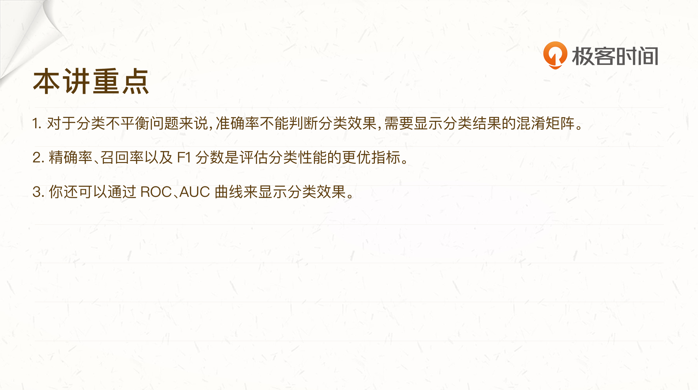

---
date: "2019-06-23"
---  
      
# 16｜性能评估：不平衡数据集应该使用何种评估指标？
你好，我是黄佳。欢迎来到零基础实战机器学习。

上一讲中，我们通过逻辑回归和深度学习神经网络两种模型，判断了会员流失的可能性，准确率大概在78\%左右。我想考一考你，这个准确率是否能够反映出模型的分类性能？

也许你会回答，看起来没什么问题啊。但是，如果我告诉你，对于这个数据集来说，即使不用任何机器学习模型，我闭着眼睛也能够达到70\%以上的预测准确率。你会不会吓一跳，说，这怎么可能呢？

其实，如果你仔细观察一下这个数据集已经流失和留存下来的会员比例，就会发现，在这个数据集中，留下的会员是73\%，而已经离开的会员占27\%。



这也就是说，如果我直接提出一个模型，**判断所有的会员都会留存，****那****我这个模型的预测准确率就是73\%**。所以说，要达到70\%以上的预测准确率，真的是没有什么难度。

我再举一个极端一点的例子，在银行客户欺诈行为的检测系统中，存在欺诈行为的客户可能不到万分之一。那么，一个模型只要预测所有的客户都没有欺诈行为，这个模型的准确率就能达99.999\%。

然而，这样的模型没有任何意义。因为**我们的目标不是判断出这9999个正常客户，而是要想法设法找出那万分之一的异常客户。**所以，对于我们这个问题来说，如何精确定位那23\%的可能流失的客户，才是关键所在。

<!-- [[[read_end]]] -->

因此，**评估分类模型要比评估回归模型的难度大很多，评估的方法也更为多样化，尤其是对于各类别中样本数量并不平衡的数据集来说，****我们****绝对不能单用准确率这一个方面作为考量的标准**。

那么，什么指标才更合适呢？这里，我给你介绍四个重要的分类评估方法。这四个分类评估方法和分类准确率一样，可以广泛适用于几乎所有的分类问题，尤其是对于样本类别不平衡的问题来说，这些方法比准确率更为客观。

# 混淆矩阵

在认识第一种评估方法“混淆矩阵”（Confusion Matrix）之前，我们先来看一个例子。假设“易速鲜花”一共有100个会员（举个例子而已），其中73个留存了下来，27个流失了。那么，我们就可以这样表示这个数据集的真值：


如果这时候有一个模型A，它的预测结果是77个留存，23个流失。那么，上面这张表就会变成这样：


要想知道这个模型A预测得准不准，我们就要看一下在这77个留存用户和23个流失用户中，有多少是预测正确的，多少是错误的。但是，在现有的表格中，我们并不能了解到。所以现在，我们不妨引入这样一个矩阵：



这是一个由预测值和真值共同组成的矩阵，四个象限从上到下，从左到右分别为：

* **真负**：真值为负、预测为负，即True Negative，缩写为TN；
* **假正**：真值为负，预测为正，即False Positive，缩写为FP；
* **假负**：真值为正，预测为负，即False Negative，缩写为FN；
* **真正**：真值为正，预测为正，即True Positive，缩写为TP。

这个矩阵就是混淆矩阵，这里的“真”“假”就代表实际值（真值）和预测值一致与否；而“正”“负”就代表预测出来的值是1还是0。所以，对于“预测用户是留存还是流失”这个问题来说：

* 真负\(TN\)，代表被模型判断为留存的留存用户数：70；
* 假正\(FP\)，代表被模型判断为流失的留存用户数：3；
* 假负\(FN\)，代表被模型判断为留存的流失用户数： 7；
* 真正\(TP\)，代表被模型判断为流失的流失用户数： 20。

这样矩阵就能反应出模型预测的真实情况了。对于模型A来说，在73个留存用户中，它预测对了70个；在27个流失用户中，它预测对了20个。所以，它整体的准确率就是：

\$\$模型A的整体准确率=\\frac\{70+20\}\{100\}=90\\\%\$\$

当然，对于我们[上一讲](https://time.geekbang.org/column/article/423893)的项目来说，**在这个矩阵中，我们最看重的应该是“真正”这个象限的数字，因为它代表了模型找出了多少个即将流失的用户。只有这个数字，才能对“易速鲜花”的运营状况产生正面促进。**

这时候，如果还有另一个模型B，它的预测结果和模型A的一样，也是77个留存用户，23个流失用户，那我想，你应该不会轻易认为模型B的准确率和模型A的一样了，因为它的混淆矩阵很可能是这样的：



在75个留存用户中，模型B预测准了55个，还算勉强可以。但是对于23个流失客户来说，模型B只预测出5个。所以，这个模型B预测的整体准确率为：

\$\$模型B的整体准确率=\\frac\{55+5\}\{100\}=60\\\%\$\$

由于我们真正的目的是找到流失客户，从这个目的来讲，模型B的准确率还不到20\%呢。

到这里，我想你应该感受到混淆矩阵的威力了。那对于[上一讲](https://time.geekbang.org/column/article/423893)里“预测哪些客户流失风险比较高”这个项目，我们就可以借助混淆矩阵，来评估三个模型（逻辑回归模型、未做归一化的DNN神经网络，以及归一化之后的DNN神经网络）的优劣了。

要计算这三个模型的混淆矩阵，我们可以用sklearn中的confusion\_matrix工具。不过，我们还需要定义一个用来显示混淆矩阵的函数，我把它命名为show\_matrix（这里我们不重复数据导入和预处理以及模型训练的代码），完整代码请在[这里](https://github.com/huangjia2019/geektime/tree/main/%E7%95%99%E5%AD%98%E5%85%B316)下载：

```
    from sklearn.metrics import confusion_matrix # 导入混淆矩阵
    import seaborn as sns #导入seaborn画图工具箱
    def show_matrix(y_test, y_pred): # 定义一个函数显示混淆矩阵
        cm = confusion_matrix(y_test,y_pred) # 调用混淆矩阵
        plt.title("混淆矩阵") # 标题
        sns.heatmap(cm,annot=True,cmap="Blues",fmt="d",cbar=False) # 热力图
        plt.show() # 显示混淆矩阵
    

```

然后，我们调用show\_matrix函数，先来显示逻辑回归模型的混淆矩阵：

```
    show_matrix(y_test, y_pred) # 逻辑回归
    

```

输出如下：



接着，我们再显示DNN神经网络做归一化之前和归一化之后的混淆矩阵。注意，**我这样做目的，是为了向你展示，两个分类准确率看起来近似的模型，它们的混淆矩阵内容可能会很不一样哦！**

此外，我还要说明一点，我们在这一讲中跑出来的预测结果，很可能和上一讲中的预测结果不完全一致。因为神经网络每次训练时是随机拆分数据集的，而且梯度下降的随机性和局部最低点也将导致每次的模型结果会有所不同。

```
    y_pred = ann.predict(X_test,batch_size=10) # 预测测试集的标签
    y_pred = np.round(y_pred) # 将分类概率值转换成0/1整数值
    show_matrix(y_test, y_pred) #神经网络
    

```

输出如下：

  


有了这几个混淆矩阵之后，我们才能够真正看出每个模型的优劣。请你注意，我们第一眼要看的是右下角的“真正”值，也就是模型到底抓出来了多少“真的可能会流失”的付费会员。

结果显示，在361个流失会员中，逻辑回归模型抓出了171人，DNN神经网络归一化之后的模型抓出了199人（这其实不错了），而未做归一化的DNN神经网络仅仅抓到了50人。哪个模型更靠谱？我想你心里已经有答案了。

到这里，你应该更加理解为什么整体准确率不足以反映出模型的真正分类情况。不过，你可能会问，混淆矩阵虽然直观，但它不是一个分数性的指标，如果我老板就是喜欢像“准确率”这样的分数型指标，怎么办？

很简单，我们可以在混淆矩阵的基础之上，引入“精确率”（也叫查准率）和“召回率”（也叫查全率）两个指标。

## 精确率和召回率

我们先说精确率。精确率也叫查准率，它的意义是：**在被分为正例的示例中，实际为正例的比例**。我们可以这样计算精确率：

\$\$精确率（Precision） = \\frac\{被模型预测为正的正样本\}\{\(被模型预测为正的正样本 + 被模型预测为正的负样本\)\}\$\$

其中，“被模型预测为正的正样本”就是混淆矩阵中的“真正”，也就是TP；“被模型预测为正的负样本”则是混淆矩阵中的“假正”，也就是FP 。所以，这个公式就是：

\$\$精确率（Precision） = \\frac\{TP\}\{\(TP + FP\)\}\$\$

现在，我们拿刚才这个DNN神经网络归一化后的混淆矩阵为例：


就流失的用户而言：

* 真负\(TN\)：被模型判断为留存的留存用户数：899;
* 假正\(FP\)：被模型判断为流失的留存用户数：149;
* 假负\(FN\)：被模型判断为留存的流失用户数： 162;
* 真正\(TP\)：被模型判断为流失的流失用户数： 199.

所以，流失会员的**精确率为：**

\$\$流失会员的精确率（Precision） = \\frac\{199\}\{\(199 + 149\)\}=57\\\%\$\$

可以看到，虽然这个归一化后的DNN神经网络模型整体上的准确率为78\%，但是它基于流失用户的精确率只有57\%，说明它仍有提升的空间。

当然，我们也可以基于留存的用户来判断这个模型的精确率：

* 真负\(TN\)：被模型判断为流失的流失用户数：199;
* 假正\(FP\)：被模型判断为留存的流失用户数： 162;
* 假负\(FN\)：被模型判断为流失的留存用户数： 149;
* 真正\(TP\)：被模型判断为留存的留存用户数： 899.

这个模型基于留存用户的精确率为：

\$\$留存会员的精确率（Precision） = \\frac\{899\}\{\(899 + 162\)\}=85\\\%\$\$

这是评判模型的另外一个视角。当然，从解决运营人员问题的角度出发，我们还是要基于流失用户来看模型的精确率，这样才能帮助运营人员进行有针对性的留客活动。

除了精确率，还有另一个标准是**召回率**，也叫**查全率**。你应该听说过“召回”这个词吧，就是劣质品蒙混过了质检这关，跑出厂了，被发现后得给召回来，销毁掉。召回率是覆盖面的度量，它度量的是被正确判为正例的正例比例，它和精确率是成对出现的概念，公式如下：

\$\$召回率（Recall） = \\frac\{TP\}\{\(TP + FN\)\}\$\$

召回率考量了“假负（FN）”的存在，也就是需要考虑被误判为“合格品”的“劣质品”，在我们这个问题中的假负就是被误判为“留存”的“要流失”的会员。

对于刚才这个例子：


就流失会员而言，归一化后的DNN神经网络模型的**召回率为：**

\$\$召回率（Recall） = \\frac\{199\}\{\(199 + 162\)\}=55\\\%\$\$

我们看到，这个算法的召回率比精确率低一些。那么，我们应该以上面57\%的精确率为准呢，还是应该以55\%的召回率为准？答案是：当我们需要更多考量被模型预测为正的负样本时（本来是忠诚会员，误判为流失），我们看精确率；当我们需要更多考量被模型预测为负的正样本时（本来要流失了，误判为忠诚会员），我们看召回率。

对于我们这个问题，如果你问我，我会更关注召回率，因为我们就是害怕会员流失嘛。但是，如果精确率不够，运营人员会做很多无用功，把力气、时间和经费白白花在本来不会流失的人身上。

那有没有一个指标可以直接解决问题，不用这么绕来绕去？接下来，我就给你介绍一个单一指标，它可以基本搞定对不平衡数据集的分类评估。

## F1分数

这个指标就是F1分数。它结合了精确率和召回率的共同特点。F1分数的公式如下：

\$\$F1 = 2 \\times \\frac\{精准率\\times召回率\}\{\(精准率 + 召回率\)\}\$\$

这个指标可以同时体现“精确率”和“召回率”的评估效果，在数学上定义为“精确率和召回率的调和均值”。只有当召回率和精确率都很高时，分类模型才能得到较高的F1分数。

F1指标特别适合于评估各类别样本分布不平衡的问题。因此，当你想用一个简单的方法来比较多种分类模型的优劣时，你选F1分数就对了。

下面，我们用代码求出[上一讲](https://time.geekbang.org/column/article/423893)中三个模型的F1分数。在sklearn中，F1分数可以通过分类报告classification\_report工具进行显示。此时，classification\_report也会把精确率、召回率和准确率一起显示出来，一举多得了。这三个指标的计算，也都会在classification\_report内部完成，所以，我们只需要把预测值和真值传进这个函数就好了。

我们先定义一个显示分类报告的函数show\_report：

```
    from sklearn.metrics import classification_report # 导入分类报告
    def show_report(X_test, y_test, y_pred): # 定义一个函数显示分类报告
        print(classification_report(y_test,y_pred,labels=[0, 1])) #打印分类报告
    

```

再调用这个函数打印出分类报告：

```
    show_report(X_test, y_test, y_pred)
    

```

下面，我们直接给出逻辑回归、归一化前后DNN神经网络模型的分类报告。

逻辑回归：

```
              precision    recall  f1-score   support
           0       0.83      0.89      0.86      1048
           1       0.60      0.47      0.53       361
    accuracy                           0.78      1409
    

```

DNN神经网络（归一化前）：

```
              precision    recall  f1-score   support
           0       0.77      0.99      0.87      1048
           1       0.81      0.14      0.24       361
    accuracy                           0.77      1409
    

```

DNN神经网络（归一化后）：

```
              precision    recall  f1-score   support
           0       0.85      0.86      0.85      1048
           1       0.57      0.55      0.56       361
    accuracy                           0.78      1409
    

```

在这个Report中，我们更关注1值，也就是相对于流失客户的精确率、召回率和F1分数，尤其是F1分数。结果显示，虽然逻辑回归和归一化后的神经网络准确率都是78\%，但是，F1分数最高的模型是归一化后的DNN神经网络。所以，对这个问题来说，归一化后的DNN神经网络性能最棒。

现在，有了F1分数这个比较优秀的分类评估指标，我们对模型的评估就靠谱得多了。不过，你可能会想：有没有什么图形化的显示方式，能更为直观地比较出多个模型的性能优劣呢？的确有。

## ROC曲线和AUC

除了精确率、召回率、F1分数之外，还有两个经常与二元分类器一起使用的工具：一个是“受试者工作特征曲线”（receiver operating characteristic curve，简称ROC）；另一个是“曲线下面积”（Area under the Curve of ROC，简称AUC）。

ROC曲线绘制的是“真正类率”和“假正类率”的信息。其中，真正类率也叫真阳性率（TPR），表示在所有实际为阳性的样本中，被正确地判断为阳性的比率。它其实就是召回率的另一个名称。

\$\$真阳性率（TPR） = \\frac\{TP\}\{\(TP + FN\)\}\$\$

假正类率也叫伪阳性率（FPR），表示在所有实际为阴性的样本中，被错误地判断为阳性的比率：

\$\$伪阳性率（FPR） = \\frac\{FP\}\{\(FP + TN\)\}\$\$

要绘制ROC曲线，我们需要先构建一个ROC空间。ROC空间其实就是把伪阳性率（FPR）定义为 X 轴，真阳性率（TPR）定义为 Y 轴，所形成的坐标系空间。构建好ROC空间后，如果给定一个二元分类模型和它所预测的分类概率，我们就能根据样本的真实值和预测值，在ROC空间中画出一个个坐标点 \(X=FPR, Y=TPR\) 了。

那怎么判断这些坐标点的好坏呢？我们从坐标点 \(0, 0\) 到 \(1,1\) 画一个对角线，将ROC空间划分为左上／右下两个区域。在这条线以上的点代表了一个好的分类结果（真阳性率比伪阳性率高），而在这条线以下的点代表了差的分类结果（真阳性率比伪阳性率低）。由此，你可能也猜出了，在ROC空间里，越靠近左上的点越好，越靠近右下越劣，而对角线上的点，真阳性率和伪阳性率值相同，这就相当于随机猜测的结果。



如果我们将同一模型所有样本的 \(FPR, TPR\) 坐标都画在ROC空间里，连成一条线，就能得到该模型的ROC曲线。这条曲线与ROC空间右边缘线和下边缘线围成的面积，就是这个模型的曲线下面积（AUC）。

我们前面说，在ROC空间里，越靠近左上的点越好，越靠近右下越劣。因此，对于AUC来讲，AUC越大，说明这个模型越趋向左上角越好。从具体的数值来看，AUC的取值范围在0.5和1之间。 AUC越接近1.0，说明模型性能越高；等于0.5时，只相当于随机一猜，说明模型无应用价值。

如果你想要比较不同的分类模型，就可以在同一个ROC空间中，把每个模型的ROC曲线都画出来，通过比较AUC的大小，就能判断出各个模型的优劣。

下面，我们就比较一下逻辑回归和DNN神经网络（归一化之后）的ROC曲线和AUC值。因为没有归一化的DNN神经网络性能很差，所以，我们在这里就不把它放在一起比较了。

首先，我们导入sklearn中绘制ROC曲线和计算AUC的工具roc\_curve和auc：

```
    from sklearn.metrics import roc_curve #导入roc_curve工具
    from sklearn.metrics import auc #导入auc工具
    

```

然后，我们在测试集上对DNN神经网络模型做一个预测，根据预测结果计算出FPR,、TPR和AUC的值。这里dnn代表神经网络。

```
    y_pred_dnn = dnn.predict(X_test).ravel() #神经网络预测概率值
    fpr_dnn, tpr_dnn, thresholds_dnn = roc_curve(y_test, y_pred_dnn) #神经网络 TPR FPR和ROC曲线
    auc_dnn = auc(fpr_dnn, tpr_dnn) #神经网络 AUC值
    

```

同样地，我们也计算出逻辑回归模型的FPR、TPR和AUC值，这里lr代表逻辑回归。

```
    y_pred_lr = lr.predict_proba(X_test)[:, 1]　＃逻辑回归预测概率值
    fpr_lr, tpr_lr, thresholds_lr = roc_curve(y_test, y_pred_lr)　#逻辑回归 TPR FPR和ROC曲线
    auc_lr = auc(fpr_lr, tpr_lr)　#逻辑回归 AUC值
    

```

最后，我们在一张图中显示这两个模型的ROC曲线和AUC值：

```
    plt.plot([0, 1], [0, 1], 'k--')　＃设定对角线
    plt.plot(fpr_dnn, tpr_dnn, label='神经网络 (area = {:.3f})'.format(auc_dnn))　#绘制神经网络ROC曲线
    plt.plot(fpr_lr, tpr_lr, label='逻辑回归 (area = {:.3f})'.format(auc_lr))　#绘制逻辑回归ROC曲线
    plt.xlabel('False positive rate')　＃X轴FPR
    plt.ylabel('True positive rate')　＃Y轴TPR
    plt.title('ROC曲线')　＃图题
    plt.legend(loc='best')　＃图例
    plt.show()　＃绘图
    

```

输出如下：



在这个曲线中，我们可以很明显地看出，DNN神经网络的ROC曲线在整体上要高于逻辑回归模型（更逼近左上角），AUC值（曲线下面积）是0.811，比逻辑回归的AUC值0.756要高。这说明，DNN神经网络模型的性能要好过逻辑回归。

## 总结一下

好，这一讲的内容就结束了。学完了这一讲，你需要铭记有一个重要的点，那就是**模型的好与不好，是基于用什么标准衡量**。对于正样本和负样本比例极度不平衡的样本集，我们需要选择正确的评估标准。

那么对于分类问题，尤其是各个类别的值很不平衡的数据集来说，哪些评估标准是更重要的呢？首先应该看混淆矩阵，混淆矩阵能够给出我们真正、假正、真负、假负的值，这个矩阵的信息量比准确率大很多。

通过混淆矩阵中的真正、假正、真负、假负的值，我们进而能求出精确率、召回率以及二者的综合指标F1分数。其中的F1指标，就是评估样本类别数量并不平衡的二分类问题的最简单方法。而要计算精确率、召回率以及F1分数，也很简单，我们用sklearn的classification\_report就能轻松实现。

此外，我们还可以通过ROC曲线和AUC值，用图表的形式来直观地比较各个模型的分类性能优劣。请你注意，ROC曲线越靠近左上角，模型越优，而AUC的值越接近1，模型越优。

## 思考题

好，这节课就到这里了，最后，我给你留两道思考题：

1.  请你从多个维度思考，如何对神经网络模型进行优化，以实现更好的分类效果，得到更优的F1分数。

提示思路：改变训练的轮次、调整激活函数，优化器，神经网络结构。

2.  在[第10讲](https://time.geekbang.org/column/article/419746)中，我们介绍了怎么用KFold工具拆分数据集，做K折验证。其实，对于非平衡数据，我们也可以用StratifiedKFold、StratifiedShuffleSplit等拆分数据集，来做分层采样。所谓分层采样，就是在每一份子集中都保持和原始数据集相同的类别比例。若数据集有2个类别，比例是8:2，则划分后的样本比例仍约是8:2。请你尝试通过这个方式，对逻辑回归模型进行K折验证。此外，train\_test\_split也有stratify参数，你也可以尝试用它来保持数据分割时的类别比例。

欢迎你在留言区和我分享你的观点，如果你认为这节课的内容有收获，也欢迎把它分享给你的朋友，我们下一讲再见！

