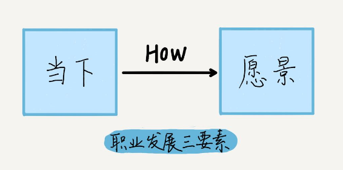
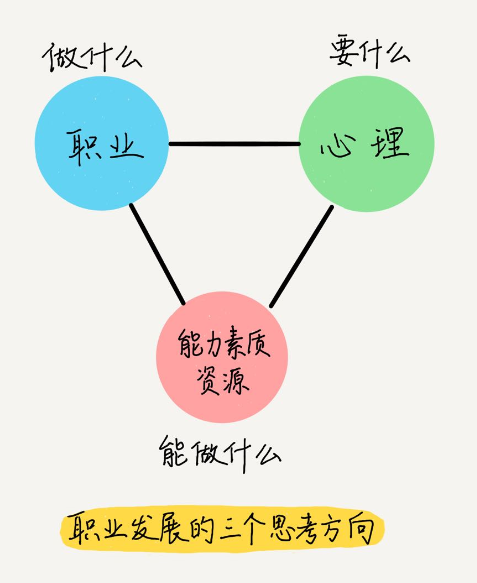
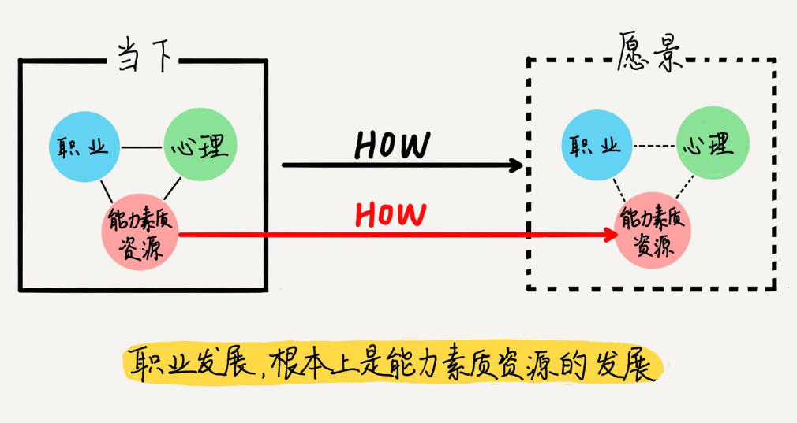
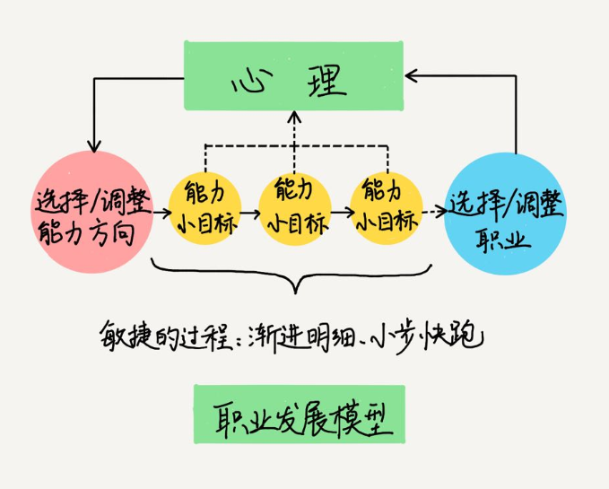

---
date: "2019-06-23"
---  
      
# 06 | 职业规划一：你真的想好要怎么发展了吗？
你好，我是白海飞。前面讨论了喜欢与擅长的关系，今天说个既实在又扎心的话题：“你真的想好要怎么发展了吗？”

这是个职业规划问题，对求职面试有什么意义呢？我们换一个场景：如果你去买火车票，却不知道目的地是哪里，行么？你只有想好职业方向朝哪里发展、怎么发展，才能明确当下该怎么做，该把简历投到哪些公司。这就是职业规划对求职面试的意义。而且，面试中有一问：“你有职业规划么？” 所以，今天我们必须得聊聊这个话题。

## 这个问题，牛人有所想，有所不想

如果你在十几年前问我这个问题，我会一脸羞愧：“这个……没想过。”后来，我也问过几个身边的牛人：

> **问：**“你刚工作的时候，是不是就有创业做CEO的目标了？”
> 
> **答：**“没有呀，后来我看到机会才动手。做着做着，就觉得该弄出点不一样的事情了。”
> 
> **问：**“你还是程序员的时候，怎么给自己定目标做技术总监的？”
> 
> **答：**“我要成天想这个，就当不上总监了。能力够了，机会自然是你的了。”
> 
> **问：**“你原来搞技术，现在是自媒体大V，这是规划好的么？”
> 
> **答：** “不，是意外，从来没想过做自媒体。”

看起来，大佬们一开始也不知道自己要发展的方向呀。等等，是不是我的问题有毛病？以上对话中，我还用下面的问法问过：

> **问：**“你刚工作的时候，做了些什么，对你后来创业有帮助呢？”
> 
> **答：**“你知道，我比较喜欢掌控个事，另外呢，我工作中注重两方面，一个是开拓视野，另一个是积累资源……”
> 
> **问：**“你觉得你是怎么一步一步从程序员，做成技术总监的？”
> 
> **答：**“这个要注意技术深度和宽度，一点一点地扩展，同时把关注点扩展到技术的应用价值上。”
> 
> **问：**“从架构师到自媒体大V，有什么联系么？”
> 
> **答：**“表面上看，完全是两件事，但是它们都用到了我的知识体系和表达能力，而且都是在帮助别人，都能带给我成就感。”

<!-- [[[read_end]]] -->

你看，换了个问法就能得到干货了，把问将来的目标，改成问当下的做法。这说明：**这几位牛人，并不是一开始都能把将来的路想明白，但是，也并不是什么都不想，只顾低头工作。**

那么问题来了，“想要怎么发展”，该想什么，不该想什么呢？

## **从当下到愿景**

职业发展问题，有三个要素：当下（AsIs）、愿景（ToBe）和过程（How）。所以，你需要思考下面三个问题：

* 我的愿景是什么样子？

* 我当下是什么样子？

* 我要做什么，才能从当下走到愿景？

当我们思考愿景的时候，都会思考哪些层面的内容呢？首先是心理愿景，其次是职业愿景，最后是能力素质资源愿景。就是下面这个图，我分别谈谈。

1.  “**心理愿景”体现你“要什么”**。我们最先想到的往往是一种工作和生活的状态，它可以反映你心理上的满足程度（图中的“心理”这个圆）。  
    有的人偏事业型，兢兢业业，为了工作和事业上有所成就；有的人偏生活型，不想被工作所累，更希望好好享受时光，和家人能幸福地生活在一起。当然，有人认为先得有事业的成就，才能有物质基础享受生活；有人则质疑幸福真的需要那么多钱么？  
    总之，每个人对事业和生活的平衡点不在同一个刻度上，也不在同一个时序上。你不能照搬别人的标准，也不要强逼别人服从你的标准。

2.  “**职业愿景”体现你“做什么”**。 接下来我们想到的是职业愿景（对应图中的“职业”这个圆）。比如事业型的将来要开创一片天地，做CEO、CTO等等，或者想造福一方百姓，从政做人民公仆等等；比如生活型的想做一个安安稳稳的职员等等。  
    职业包含四个维度：行业、公司、职位和级别。不同职业的社会地位、经济收入、劳动付出都不同，这些会影响到第一层说的心理愿景。所以你看，如果你把心理愿景先定好了，那职业的性质也就有设定了。

3.  “**能力素质资源愿景”体现你“能做什么”。**再接下来，为了达到职业愿景，你要考虑得提高哪些能力素质和资源。比如，将来要深耕技术，或者转做管理，或者主攻业务等等，你就要考虑到能力素质资源这个角度。  
    联想到第一篇[“公司到底想要什么样的人？”，](https://time.geekbang.org/column/article/79796)文章中的素质模型，你还可能要考虑到经验、技能（包括资源）、潜力如何发展上，比如提高学习能力、精益能力、领导能力等等，这些能力是做事的基础。

总体来看，以上三个层面中，心理愿景会受职业愿景的影响，你可以通过选择合适的职业来达到心理愿景；而职业愿景的达成，其实又是在拼能力素质资源（一些靠关系的咱不提哈）。因此，当你构建愿景的时候，应该留意最基本的那个方面：能力素质资源愿景，是它决定了职业愿景和心理愿景。

考虑当下的状态时，也和考虑愿景一样，涉及的也是这三个层面：心理、职业、能力素质资源。同样，能力素质资源是基础。

> **小提示：**
> 
> 发展的问题，归根到底，是能力素质资源的发展问题。

这里，我们通过一个图来一形象地看一下（请注意图中的红色箭头）：

## **职业发展模型**

回味一下开篇的那些对话，那些牛人一开始也看不清多年后要从事什么职业，只有心理愿景。他们的关键动作是，基于当下的条件，先选择能力方向，确定能力发展路线，在发展中选择时机调整职业。这个过程中，他们逐渐调整和接近心理愿景，获得满足感、成就感。

这正是职业规划的五个步骤：

1.  **构建心理愿景**：确定你想要什么。

2.  **选择或调整能力方向：** 比如具体选择哪种技术、哪种业务（行业）、什么领域的管理等等。

3.  **发展：**你怎么一步一步发展这些能力？

4.  **选择或调整职业：**有了这些能力素质资源之后，你要继续当前职业，还是要换个职业？

5.  **反馈：**工作中获得的心理满意度，和心理愿景对比，反馈到能力、发展、职业的活动中，对其调整，或者调整心理愿景本身。

下面，我详细解释下职业发展模型中的各个环节。

1.  首先，**心理愿景的构建，也就是你想成为什么样的人，过什么样的生活。**你可能会问，我应该有什么愿景呢？对不起，这个问题我帮不上忙，因为它的答案是由你的价值观、性格、环境等复杂因素决定的。你得通过观察、尝试、感受，才能逐渐明确事业和生活的平衡点。有些鸡汤类的名句，比如“你要放过你自己”“懂得取舍”，大概是说这个话题的吧。

2.  接下来，**心理愿景影响你选择的能力方向。**关于能力方向的选择和调整，内容较多，我会在下一篇讲职业规划的文章中，挑技术、业务、管理三个方向分别阐述。

3.  一旦能力方向定了，接下来，**能力的发展路径，就是实现一个一个小目标的过程。**小目标是啥？就是既定方向上的能力分解。  
    小目标怎么定？首先按能力发展方向，分解出几个适合你眼下发展的小目标。通过系统学习或工作实践，快速提高技能，达成小目标。关于学习能力、解决问题的话题，我会在专栏的第四个模块“贯通篇”详细阐述。  
    等小目标达成了，再从大目标里拆出几个明确的小目标来，继续做，周而复始地循环。这是个渐进明细、小步快跑的过程，也正是敏捷项目中“版本计划”（release planning）的应用 。  
    **你可能会质疑这种只清楚眼前的做法，觉得不整体搞清楚怎么能开始做呢？我们其实已经有了一个长期的大目标了，只是没必要现在就细化出所有内容。**因为在这个多变的世界，我们得用精益的观念来看问题：你永远只能处理当前条件相对稳定，而且已经明确了的情形，几个月甚至几年之后，当稳定被打破，新的变量加进来，谁知道状况会变成怎样呢，没必要现在操心。所以，远期能力发展路径不清晰，没有关系，我们保持关注，必要时调整即可。

4.  随着能力的发展和资源的积累，你可以**不失时机地选择和调整职业**。选择和调整职业的考量因素，我总结为16个字：**挑我所爱，选我所长，取我所利，择世所需。**  
    **挑我所爱、选我所长**，这在上一篇“喜欢或擅长的工作，你该选哪一个？”中仔细讨论过了，结论是，要发展为稳定兴趣以后，再做选择，而且更重要的是，要有能力促使兴趣和擅长的发展和转化。  
    **取我所利**，就是找收益大的职业。这里的收益，不仅包含物质上的收益，还包括非物质收益，比如个人成长、资源积累、精神满足等等。  
    **择世所需**，选社会或者团队需要的职业，能给世界带来价值的。

5.  **职业工作和生活带给你的心理感受，无时无刻都在刺激你跟心理愿景比较，从而促使你继续前行或者马上调整，进入下一个循环。**所以说，职业发展不是“早就定好”的一条清清楚楚的发展道路，而是渐进明细的、按需调整的实践过程。

纵观整个循环过程，可以看出，**职业规划，你要直接规划的不是职业变动，职业变动是结果，要直接规划的是能力素质资源的发展和提高。**

我非常欣赏IBM一位超级大牛的名言：“**要让职业发展追着你走，而不是你追着职业发展走。**” 其含义是说，你如果能力不到位，只追求职位升级是徒劳的，所以你不能追着职业发展走；你要先提高自己的能力，然后在公平开放的公司文化中，自然就会有合适的职位和机会让你升级，这就是职业发展追着你走。

## **总结**

以上我们讨论了职业规划的一些基本理念和方法：

* 职业发展是从当下的状态，经过努力发展，接近或者调整愿景的过程。

* 愿景包括心理愿景、职业愿景和能力素质资源愿景三个层面，它们分别对应“想要什么”“做什么”，以及“能做什么”。

* 职业规划，其实是针对自己的心理愿景，对能力素质资源的发展规划，从而实现职业的选择或调整，最后形成的心理感受，又反过来影响规划。

* 能力的发展，是个精益的过程：渐进明细，小步快跑。

* 选择或调整职业，有16个字的考量：挑我所爱，选我所长，取我所利，择世所需。

回到开篇的问题：“你真的想好要怎么发展了吗？” 现在你清楚职业规划包含哪些内容，该考虑什么，不应该考虑什么了吧？如果面试官这样问“你五年后想发展成什么样子”，一个合理的回答可能像下面这样：

> “哦，我还不能确定五年后能做到什么级别的职位，但是我想专注在技术上，继续深入前端开发，有机会也想提高用户交互设计的能力，因为我非常细心，而且对用户心理和行为很感兴趣，如果将来有UX设计的工作，我很乐意尝试。至于现在，我正在学习VUE框架。”

## **思考时间**

我在面试中也会让应聘者说说自己的职业规划，下面我列了几个典型的回答，一起来看一下：

1.  “走一步看一步吧，我还没有想太清楚。”

2.  “我想三年内深入学习技术，之后再看能否走管理。”

3.  “看公司需要吧，无论做哪个职位，我都会尽心去做的。”

以上回答显示了应聘者怎样的思考角度和深度？如果你是面试官，会怎样评价？如果你是应聘者，又会如何回答呢？欢迎你在留言区分享，我们一起沟通探讨。

最后，感谢你学习今天的内容，如果你的朋友也有职业发展的困惑，欢迎把这篇文章分享给他。