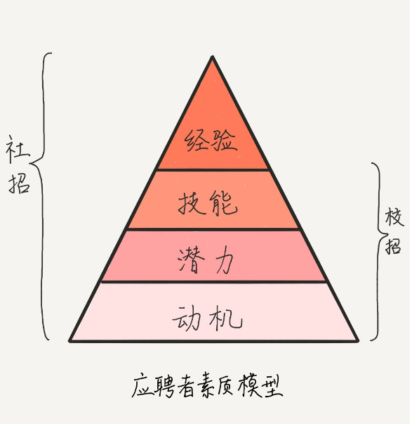
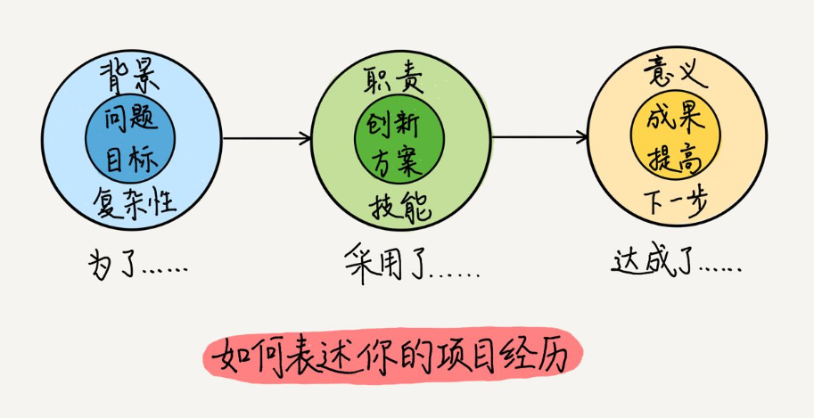

---
date: "2019-06-23"
---  
      
# 08 | 如何让你的简历更受青睐
你好，我是白海飞。今天我要分享的话题是“如何让你的简历更受青睐”。

简历是面试的敲门砖。除非你是内推，或者知名大佬，招聘人员仔细了解你，一般是从读简历开始的。

简历在以下两个场景中有关键作用：

* 筛选候选人，这时简历表征你的经验、能力；

* 面试，这时简历是面试官问问题的基础。

我们知道，从投递简历到参加面试，这期间简历可能会经过机筛、手筛、复查等一套流程：

* **机筛，**主要在简历系统中搜索简历，搜索依据就是职位描述中定义的关键技能和要求，不合要求、技能不相关的简历不会出现在结果集里。

* **手筛，**是招聘人员从众多简历中，以几十秒一份的速度做的快速筛选，筛选依据可以扩展到经验、学历、跳槽频率等细节，淘汰率也很高。

* **复查，**是由用人部门做的筛选，即相对细致地衡量应聘者是否匹配工作要求，确定疑点，用于在面试中验证。除非发现大的问题，否则这个阶段的通过率比较高。

在以上筛查过程中，你的简历要经历两类考验：一是**快速匹配**职位的关键要求，大致判断是否和职位相关；二是**细审**，判断多大程度上适合职位工作，以及锁定疑点，如果疑点过大，成为硬伤，你的简历就被放弃了。所有这些动作，都是为了验证你是否“匹配职位要求”。面试官在心里或者纸上，会准备一份针对该职位的检查清单，列出需要的能力素质要求，无论审简历还是面试的时候，都会在清单里逐项打勾（通过）、或者打叉（不通过）、或者打问号（存疑，待确认）。

<!-- [[[read_end]]] -->

**很多面试官都承认，如果看到一份中意的简历，会用“发现优点”的眼光在面试中对待这位应聘者；相反，如果看到一份差强人意的简历，会用“排除缺点”的眼光在面试中考查应聘者。简历给面试官造成的“第一印象”起着非常重要的作用。**

那么，怎样的简历更容易受到招聘人员的青睐呢？

我认为，要想通过筛选，你的简历首先要“**有价值**”“**易匹配**”和“**没硬伤**”；如果你还想让招聘人员对它刮目相看，就一定要做到“**有亮点**”。下面我们分别来讲。

## 如何让你的简历“有价值”？

对招聘人员来讲，简历“有价值”，是指他能看到要找的信息。什么信息呢？还记得第一篇说过的应聘者素质模型么？包括你的经验、技能、潜力和动机四个方面。接下来，我说说如何在这四个方面体现价值。

* **经验，包括专业经验、管理经验和行业经验等等。**经验对口的应聘者，入职后可以直接开展工作，省去了培训和学习的时间与开销，这是社招时最看重的。  
  职位描述里会清楚地列出经验要求，比如“做过3年以上Java Web开发”“负责过50人以上规模的团队管理”“有金融风控管理经验”等。你需要在自己的经历中寻找匹配的经验，总结相关成果，提炼出自己的贡献和业绩。

* **技能：包括专项技术能力、管理能力、沟通表达能力、协作能力等等，不同的职位，有不同的技能要求。**技能在职位描述里也有清晰的表述，比如“熟练操作Unix”“具有较强的业务分析能力，能够快速理解和分析复杂的业务逻辑”“流利的英语口语”等。你需要有与之对口的技能。

* **潜力，技能提升的能力**，是职位描述中可选的内容，比如“学习能力强”“有成长型思维”等。你需要通过提炼自己经历中的事例来展现这些特点和品质，并将其精炼成一句话。比如：“一个月学习Python，率先引入XX框架，提高功能测试覆盖率到70\%。”这句话，既包含技能，又包含学习和应用能力，还有工作成果，显示了你的潜力。

* **动机。**动机决定了做事的内因，招聘人员通过对动机的考查，来看其稳定性和工作意愿。也是职业描述中的可选内容，比如“愿意尝试新事物”“有工作热情”等。某些招聘文案中提及团队文化的内容，含蓄地表达了对新成员做事动机的要求。  
  虽然潜力和动机在工作中很重要，但并非所有职位描述中都包含。你可以浏览一下该公司（最好是该团队）其他相关职位的职位描述，即使是已经关闭的职位也行，也许能找到一些关于潜力和动机的信息，会有一定的借鉴作用。  
  面试官如何通过简历看动机呢？对于简历里直接表白的动机，比如“我工作积极主动，愿意为客户和公司奉献力量”，面试官一般会忽略，而通过分析简历里的职业发展趋势、跳槽频率等，初步判断其跳槽动机；好的简历，字里行间都能看出对工作的深度理解和“技术味道”，这也一定程度上显示了应聘者做事的驱动因素。

关于职位的了解渠道，你可以从公司发布的职位描述中获取，或者动用同学关系、上网搜索等尽可能打听该职位的情况。职位描述往往有个问题，就是列出的要求一般多于或高于实际工作所需，你可能搞不清那么多要求中哪些是必须的，哪些是可选的。另外，职责描述也是高度概括的，你很难准确理解具体的工作范围。所以，如果有熟悉此职位的人，给你讲讲，是非常有帮助的。缺少深入了解职位的渠道，是面试中做到“知彼”的最大障碍。

具体需要了解职位的哪些信息呢？下面我列出了一些：

* 该职位是新增，还是补缺；

* 向谁汇报；

* 这个职位是为了解决什么问题，承担什么责任；

* 这个角色的工作复杂度和挑战是什么；

* 做出什么结果才算把这个角色做好；

* 需要什么关键技能和加分技能。

这样，你才能彻底搞清楚匹配点，有针对性地挖掘自己的经历，并调整简历内容，突出匹配项，使得你的简历和准备更有价值。所以，如果你有同学朋友了解该职位，一定不要错过了解上述信息。

由此可见，**简历最好针对职位定制内容，**这样才使简历对该职位更“有价值”，会大大增加简历的筛选通过率。

## 如何让你的简历“易匹配”职位要求？

易匹配，是说不要把有价值的信息埋没在冗杂的文字里面，要尽量用通俗、通用的词汇来表达，不要“难为”招聘人员和搜索引擎去寻找、猜测、转义和理解，要让他们不费吹灰之力就可以看到你的价值点。关于这点，我从内容和形式两个角度来说。

**内容上，要恰当地结构化，详略得当，层次有序。**

简历中最重要的内容是：技能和项目经历。

**技能**，需要按照领域分类，以列表的形式呈现在简历里。同时，要标明技能等级。等级可以用“精通”“熟练”等词标识，或者用工作年数标识。把最对口、最熟练的技能往前放。那些只是了解，还没有使用过的技能，可以不列，否则面试的时候被问到也很尴尬。

**项目经历**，体现你的工作资历和能力价值。每一段项目经历，都有其独特性，都有价值点可挖。但是，很多简历这块并没有写好。我总结出下面一种写法，如下图所示，供你参考。

一段项目经历可以用下面的结构来描述：

* 为了\<某某问题、某某目标>。要突出复杂性；

* 我采用了\<某某方法、技能、流程>。要突出创新性；

* 达成了\<某某成果、意义>。要突出提高。

举个例子。**为了**吸引读书App的用户成为收费会员，我们5人小组，用两个月的时间，做出“消费对比”功能，其中最复杂的是预测模型。**我负责**模型选型，采用了组合预测模型，**解决了**预测消费的复杂性，并且优化权度，提高了准确性，使得App上线后，入会人数月均增加了60\%。

从这个例子可以看出，目标部分，要突出复杂性；方案部分，要突出创新性；成果部分，要突出提高的程度。

在撰写经历的时候，要注意详略得当。为了突出有价值的内容，简历篇幅尽量控制在2页以内，别让太多内容干扰了面试官的视线。**这就要舍得删减。**什么内容可以删减呢？

* 如果已经有了高级的技能，同类技能中低级的部分就不用写了。

* 重复技能的经历，尽量找出不同点用一句话概括。

* 职位描述中没提到的技能，可以删。即使不删，也不要喧宾夺主。**简历上的技能列表并非越长越好。**

* 如果已经有正式的工作经历，那么表现平平的实习经历可以删，除非像某位苹果实习生一样设计出了MacBook键盘。

* 如果有耀眼的成果，那么描述性的工作过程可以删。

* 千篇一律的自评可以删，前面说过，面试官不会拿你的自评太当真。

当然，实际操作中，要具体情况具体分析。对简历做恰当的减法，是件很难的事，但却非常重要。

**形式上，要简洁大方、重点突出，从视觉上，引导对方关注你最想表达的部分。**版面上的每一块空间都要恰当地体现出价值。网上有很多这方面的指导，比如字体、字号、布局等排版的注意事项，这里我就不详细展开了。

特别强调一下，简历一定要严谨认真，甚至字斟句酌。哪怕一个电话号码，用连字符把长长的数字隔开，也是为了更好的结构化，以方便读取。

> **小提示：**  
> 内容和形式调整到什么程度就算“易匹配”呢？你可以叫你的小伙伴来做个测试，让他在你的简历里找一项技能（如“AJAX”）或经验（如“风险管理”），如果平均10秒内就能定位到相关经历，那就不错了。

## 如何让你的简历“没硬伤”？

“没硬伤”是指简历没有显著的问题。这里有一些常见的毛病，可能是很多人会犯的。

**1\. 内容不真实。**为了让简历更光鲜，有的应聘者把别人的项目搬到自己的履历中，或者把项目中别人的贡献和职责写成是自己的，或者做些小夸张，比如把“熟悉”的技能标成“精通”。造假和夸张的问题在于，你抬高了面试官对你的期待。导致你要么在面试中被扒个干净，要么试用期里让同事大跌眼镜、差评走人。

> **小提示：**  
> 写简历，万不可在诚信上打折扣。

曾经我面过一些很诚实的应聘者，不会的问题就如实回答“不会”。我反倒会给他们一些机会，让他们自己选择擅长的问题领域，去表达深度的理解。这样的应聘者如果有好的学习能力，会更靠谱，更值得托付。

**2\. 内容不客观，掺杂主观臆断。**简历要尽量把事实部分写清楚，至于对能力的评价，就让面试官去做吧。所以严格来讲，“精通Java开发”是评价，“5年Java开发”才是事实。失实的臆断，会让面试官对你的简历减分。

**3\. 页面太花哨。**简历的风格要与应聘的职位属性相符，文字语言要和职位风格一致。对于工程师等技术岗位，要体现严谨求实的风格。即使是艺术性较强的UX设计类职位，表现创意的时候，也不要让形式大过内容。

**4\. 笔误。**比如把“主管设计工作”写成“主观设计工作”。别小看这些细节，从小处可以反映你对这个职位的重视程度，甚至体现你思考和做事的态度，以及专业程度。

**5\. 内容导致歧义或误解。**对于可能引起误解、产生不利影响的信息，尽量不要写到简历里。比如，个人信息不用写籍贯；除非特别自信，否则不要贴照片。这不是隐藏什么，只是在你的工作能力还未被认可之前，不要让别的因素干扰面试官对你的第一印象，尽量避免引发某些偏见或误会。

**6\. 职业发展不衔接。**这是有经验的招聘人员特别关注的，他们检查你的职业发展脉络和能力发展趋势。健康的履历是：职业保持持续发展，角色转换前后承接，能力发展迅速。

如果你的履历中，有很长的时间，只是重复之前的技能和工作范围，招聘人员会把这段时间当成浪费“切掉”，那么你原有8年的工作经验，可能就被切成了4年，资历被降格，你在新职位上的定级就会受影响。

**7\. 换工作太频繁。**每次工作变动，你都需要时间调整自己以适应新环境。工作难度越大、业务越复杂、团队文化差异越大，你的适应时间就会越长。只有跨过这段适应期，你个人的能力才能高效发挥，做出卓越的成绩。

你频繁跳槽，招聘人员会担心你的稳定性。他可能会想，是你还没有找准职业方向？还是缺乏耐性，浅尝辄止？还是个性太强，无法融入团队？还是工作绩效差？总之，他会认为这里有很大的风险。

以上这些“硬伤”会使你的简历落选。有的硬伤你需要在准备简历时避免，有的则需要你在开始职业生涯时，就慎重对待，避免走弯路。

## 如何让你的简历“有亮点”？

做到“有价值”“易匹配”和“没硬伤”，只是让你的简历合格，若要达到优秀的标准，就必须做到“有亮点”。

所谓“亮点”，就是和别人相比，让招聘人员觉得你出类拔萃、与众不同的地方。例如:

* 如果你是应届毕业生，拿到全国数学建模大赛的奖项、在知名公司的实习经历都是亮点。

* 作为Java程序员，参加过开源项目开发，得星过百，是亮点；

* 作为技术人员，拥有国家专利，发表过技术文章，也是亮点。

这些例子中的亮点，是大家公认的耀眼的成绩。如果你说“我没有那么耀眼的成绩怎么办”，也没关系，你可以尝试在项目经历、个人经历和兴趣爱好中，找出影响较大的事项，寻找“过程性”“生活化”的亮点，比如：

* 坚持每天晨跑，说明你很有毅力；

* 喜欢看电影，习惯给看过的每部影片写影评，说明你喜欢思考总结、爱分享；

* 半年成功减肥20斤，说明你肯吃苦、意志强。

> **小提示：**  
> 尽量把你的亮点总结成简练的一句话，尽量加上数字来说明它的影响和意义。例如：从学校毕业，我保持了每月至少读4本书的习惯。

另外，如果简历里中加入了可交互、可展示的内容，更能显出你的能力与众不同。例如，成果Demo的链接、个人项目的GitHub链接、技术博客链接等。

在后面“经历没有亮点可讲？你需要做份详历”的文章中，我会介绍一些从经历中发掘价值和亮点的心得，作为简历和面试的素材。

## 总结

写好简历，需要准确把握职位要求，按照应聘者素质模型的四层，来挖掘个人的经历，从而做到：有价值、易匹配、没硬伤、有亮点。

坦白地讲，一份简历能否通过筛选，能否受到青睐，还会受到很多不可控因素的影响。比如，筛选者个人的主观因素也在起作用。HR和岗位直接负责人的考查标准也可能有不同，甚至同一份简历同一个筛选者，他在早上精力充沛的时候看，和工作了一整天身心疲惫的时候看，给出的评价也会不同。

无论如何，我们承认存在这些超出应聘者把控范围的现实因素。然而，作为应聘者，你可以努力在自己的可控范围内做到更好，尽可能地打造好简历，以成功拿到面试机会。

## 思考时间

不知道今天的内容是否给了你新的启发？你可以审视一下自己的简历，想一想你在哪方面做得好，哪方面可以有些提高呢？

除了今天文章内提到的这些点，你认为还有哪些内容，会让简历脱颖而出呢？欢迎在留言区留言，与我分享和讨论。

最后，感谢你学习今天的内容，如果你觉得这篇文章对你有帮助的话，也欢迎把它分享给你的朋友。