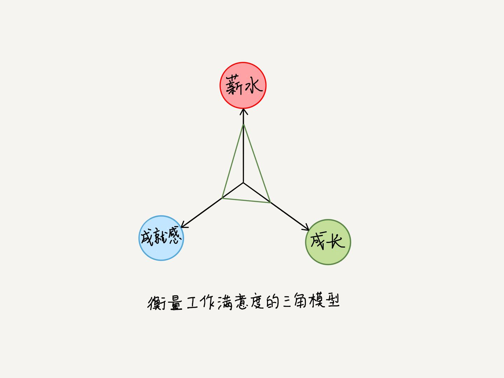
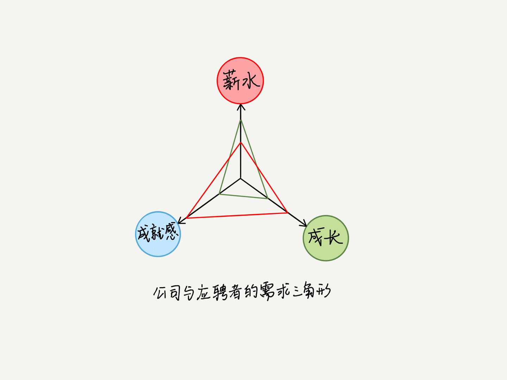

---
date: "2019-06-23"
---  
      
# 20 | 怎么谈薪水比较好？
经常有人问到如何谈薪水的问题。我们从雇用双方谈薪水的原则入手，看看谈薪水需要什么时候谈，谈些什么，怎样谈才能达到自己的期望。

## 应聘者谈薪水的原则

应聘者辛辛苦苦找工作，在面试中拼尽全力地表现，当然是为签个好Offer。但是你有没有想过，怎样才算好Offer？离家近？任务轻？工资高？一百个人心中，有一百个好Offer的定义。前面有读者回复说“现金为王”，这代表了现实中很多人的心声。

在“[04 | 现在的你，到底该不该换工作](https://time.geekbang.org/column/article/80969)”一文中，我提到了衡量工作满意度的三个因素：薪水（物质保障水平）、成就感（精神满足水平）、成长（职业发展速度）。根据对这三者的满意水平，我画了一个三角形，这个三角形就是选Offer的大局观。**签Offer，就是要追求这个三角形面积最大。**

但是对于要应聘的公司，你对入职后事业感和成长因素没有具体的认识，也不准确，而薪水却很好量化比较。所以，**好Offer的条件，就成了对于大局不错的那个职位，尽量把薪水谈高点。这是应聘者谈薪水的原则。**

## 招聘方定薪水的原则

关于薪水问题，坐你对面的雇主怎么想呢？

**雇主要在一定的预算范围内招个好员工。**他期望，给出的薪水和员工产出的价值是相称的，而员工能产出多少价值，由他在这个特定职位上所表现出的能力决定，而不是员工本身所具有的能力决定（这涉及职位环境的局限性和员工的适应性问题）。你表现出多大的能力，就给你定多少薪水，这是公司薪酬体系的内核。而HR在制定薪酬体系时，也考虑了市场因素，并不断随着市场的变化，调整薪酬基点。不同公司的薪酬体系不同，职位设置不同，导致同样的员工，薪水“定价”不同。

<!-- [[[read_end]]] -->

**公司除了付给你薪水，还在一定程度上，满足你对“成就感”和“成长”的需要。**因此，雇主会根据你的情况，估计公司和职位对你的事业感和成长的影响，在公司既定的薪酬体系下，给你合理的薪水。也就是说，如果这个职位做的工作含金量很高，对你又是个非常好的发展机会，那么即使薪水一般，雇主也会觉得对你会有吸引力。而如果公司平台价值不明显，将来发展不明朗，就只好靠高薪来吸引人才了。

**薪水，属于激励因素。**智力工作，要在适当愉悦的状态下，才能表现最佳。懈怠的平庸者和激情的优秀者的生产效率和质量差别会非常大。对于IT从业者，工作成果的质量不容易量化。当员工对薪水产生不满，员工的产出质量和价值就可能降低，而且有时这些降低还无法察觉。

所以，**理智的雇主，不会一味压低你的薪水，而是考虑公司的薪酬体系和市场水平，兼顾“成就感”“成长性”，给出符合应聘者价值（不是应聘者期待），带有激励作用的薪水。这是雇主定薪水的原则。**

（但是不可否认，也存在一些公司，违反原则地压低应聘者薪水，后文会谈到由此产生的矛盾。）

## 两个三角形

从双方的谈薪原则可以了解到，在“薪水”“成就感”“成长”空间里，雇主会给应聘者画一个三角形（请不要理解成画饼，两码事哈）。我将公司和应聘者的需要分别用一个三角形来表示，图中红色三角形代表了雇主提供的条件，而绿色三角形代表了应聘者对该职位的期望。可以看到，这两个三角形是有差异的。**谈Offer，实际上就是在谈这两个三角形，使它们尽量靠拢**。

审视这两个三角形的构成，限定到特定公司的薪酬体系里：

* 薪水和你的贡献价值成比例，你让公司觉得你对职位贡献的价值越高，可能得到的薪水也越高，从而扩大绿色三角形。

* 成就感和成长，与公司、团队、老板，以及职位做的事情、发展空间相关，公司要让你尽可能多地了解这些方面的优势，从而扩大给你的红色三角形，而不是只靠拉高薪水。

* 经过双方充分沟通，两个三角形尽可能地靠拢，你情我愿，Offer也就谈拢了。否则，即使签了Offer，双方的期待存在差异，矛盾迟早会在工作中暴露出来。

矛盾会有哪些方面呢？

* 如果应聘者谈成的薪水比其他同事高，但过了工作适应期，贡献度却比其他同事低。这种薪水倒挂现象，是一种矛盾。这要拷问公司的薪酬体系和外界相比，是否合理。要么调整薪酬水平，把其他同事的薪水慢慢调整上来，要么压低这位新员工的工资涨幅。传统IT公司，面对新兴互联网公司高薪现象的出现，薪水倒挂也是无奈之举，这也是对企业人才战略的考验。

* 如果雇主以低薪把应聘者招进来，但是其他的承诺没有兑现，导致应聘者失望，但是顾忌履历上出现频繁跳槽的问题，只好屈就一时。这样的工作心态和工作质量都不会好，公司也不会满意，其实雇主是在陪了夫人又折兵。

* 还有一种矛盾不是发生在薪水上，应聘者对薪水满意，但是工作一段时间后，发现工作不是自己期望的样子，没有成就感，能力也没有成长。但是碍于薪水还不错，只好边工作边期待转机。时间一长，就成了温水煮青蛙。几年过去，薪水比市场落后了，自己的竞争力也不在了。

所以，**谈清楚这两个三角形，双方达成期待和给予的一致，是谈Offer的重要内容，不要给以后的工作留隐患。**

## 什么时候谈薪水合适

谈薪水之前，先自我检查下面的条件是否已经具备。

首先，通过回顾面试和交流过程，分析面试官是否对你感兴趣：

* 这个职位，我可以直接上手创造价值？还是要经过一年半载的培训？面试官怎么看的呢？**（这是经验方面的评估）**

* 我的技能满足工作要求么？面试官觉得我可以胜任么？**（这是技能方面的评估）**

* 面试官觉得我将来能委以大任么？**（这是潜力方面的评估\)**

* 面试中，我表现得有激情，有动力，肯全心全意为公司效力么？**\(这是动机方面的评估\)**

面试官对你以上方面的认可度越强，就对你越感兴趣，也就越想要你。

其次，检查你自己对这个工作是否感兴趣：

* 这是对我有价值的工作么？

* 我喜欢跟这样一群人，在这样的文化下工作么？

* 这个职业的上升空间，能支持我的职业规划么？

以上问题，实际上是在检查你是不是想做这个职位。

如果你想做，公司需要知道你的工作意愿。意愿越强，他们越相信你有做好的可能。相反，如果这个工作不是你想要的，就不要谈薪水了。高薪，不是让你一直工作下去的唯一决定因素，而且这个高薪还会耽误了你将来的高薪。不如继续寻找别的机会，除非现在你急需维持生活水平。

> **小提示：**  
> 双方互相感兴趣，才有谈薪水的必要。

我建议的策略是，把三角形的详细沟通放到**面试官对你感兴趣且你对这个工作感兴趣**这两个条件形成之后做，这之前，如有不得已的Offer内容沟通，要保留弹性。

假如在以上两个条件形成之前，你就告知对方你的薪水期望，如果高出了职位预算，很可能对方就直接放弃你了，因为他还不清楚你的价值；如果过低，也不符合你的期望。所以如果对方一再追问，你可以跟他解释你期待的三角形构成，并且表达薪水期望是可以根据另外两个顶点调整的。

## 跟谁谈薪水

在“[02 | 想要成功面试，先要弄懂面试过程](https://time.geekbang.org/column/article/80150)”一文中我提到过，HR负责制定和维护公司的薪资结构；而职能经理有权决定你的职位级别，以及在该级别规定的薪水区间决定你的薪水。

职能经理最熟悉团队的薪资分布，最理解工作的价值轻重，并且负责激励和管理团队，所以对薪水有决定权。虽然HR负责整个公司的薪酬体系不被打破，但是对于特别优秀的人才，职能经理可能会给他调整到更高技能要求的职位，从而也就提高了他的薪水。

所以，定薪水的人，是你将来的经理。但是跟谁谈呢？谁找你谈，就跟谁谈。有可能是经理直接找你谈，这个很高效，因为他已经在面试中知道了你的能力和价值。也可能是HR找你谈，他可能已经跟经理达成一致，或者他会带着你的期望数字去跟经理达成一致。

## 薪水的构成

我们来了解一下基本知识，即员工薪资的基本构成及其注意事项，主要分为四部分。

1.  **月薪和年薪。**注意，不少公司的年薪大于12个月薪。

2.  **年终奖**：取决于公司的业绩和你的绩效。某些互联网公司，给杰出员工发半年工资做年终奖，但有的员工却一点都拿不到，目的就是按绩效激励或淘汰员工，显示了强烈的竞争文化。

3.  **股票、期权**。上市公司都有股票，中高级的职位，公司可能会按照你的级别相应地配股，并且员工购买公司股票会享受内部价。一些创业公司，因为没有太多的现金或者股票，为了激励员工，提出了期权的做法，一旦公司IPO，期权变现，你很可能就财务自由了，这也是创业公司最吸引人的地方，但是风险也很高。

4.  **福利，**条目比较多，各公司差异较大，包括社会保险（五险一金）、带薪年假、各种补贴（如交通费、餐补、通信补，甚至宿舍或者住房、租房补贴、买房贷款）等。注意，不要在面试中向面试官询问这些细碎的信息，可以在和HR谈Offer的时候询问。

以上部分，对于校园招聘的学生来说，基本是依靠面试结果定级，然后遵从公司统一的标准；对于社招，月薪是可以谈的；股票期权，是留给中高级职位的。

## 怎么谈薪水

相信你在投简历之前，就给自己设定了一个薪水预期。这跟市场就业环境、职位薪资水平、个人经验能力，以及你当前的薪水等因素有关。

因此，你首先可以通过一些职场社区、招聘网站、朋友同学，了解有关信息。其次在应聘过程中，你也要动态调整自己的期待，对于具体的公司职位，你要了解该它的薪资区间，评估它的平台价值和发展空间，综合权衡上文提及的三角形，来确定一个合理的期望薪水范围。

在我们内心设定了薪水期望，通过面试也产生了对彼此的兴趣，明确了谈薪水的对象之后，就可以谈薪水了。这是个互相了解对方心中三角形的过程，包括：

* 深入了解这个职位要求你必须做到什么，以及达到优秀的话，需要做到什么。

* 强调你能为公司做什么，带来什么价值。

* 了解职位的发展空间，以及对你的成长期望。

* 表达你的发展诉求，以及所需要的资源和支持。

* 了解该职位的薪酬水平，和薪水发展水平。着眼大局，而不是眼下的数字。

* 表达你的薪水期望。有些同学不好意思提自己的薪水期望值，其实是因为对自己的价值不自信，不晓得自己“值”多少。随着经验能力的积累，和对公司需求的了解，这种价值自信会越来越强。

面试官希望在以上的沟通中，双方都能真诚大方有底线，本着尊重负责的态度，看两个三角形的接近程度。注意，不是每次谈Offer都能成功的，即使谈不拢，也可以保留将来合作的机会。

## 总结

谈薪水是个敏感而且利益攸关的话题。但是，薪水并不是一个职位的全部，而且为了提薪而谈薪，效果并不一定好。所以，我们提到了由“薪水”“成就感”“成长”三方面构成的三角形，关注这个大局，就是既关注当前利益，又关注长久利益。谈薪水，就是拉近公司与应聘者双方心中两个三角形的过程。

**值得再次提醒的是，这个沟通最好在双方对彼此都产生了足够兴趣之后再进行。然后，你最好和薪水的决定者，也就是职能经理来谈薪水。**

薪水和员工产出的价值是相称的。有能力的应聘者，最有谈薪的话语权。面试的重点，还是要放到下面这些关键问题上：如何展示你的能力，让面试官相信你能解决他想解决的问题，你能为公司实现别人做不了的价值。这样一来，拿到如意的薪水，就是水到渠成的事情了。

## 思考时间

请你思考以下几个问题，相信你能轻而易举地回答上来。

* 如果HR在第一次面试时，就问你期望的薪水，你如何作答呢？

* 面试时，你该不该主动和面试官谈薪水？

* 面试官问期望薪资，你是不是要得越高越好？

欢迎在留言区分享你的想法。如果今天的内容让你有所启发，欢迎把它分享给你的朋友。