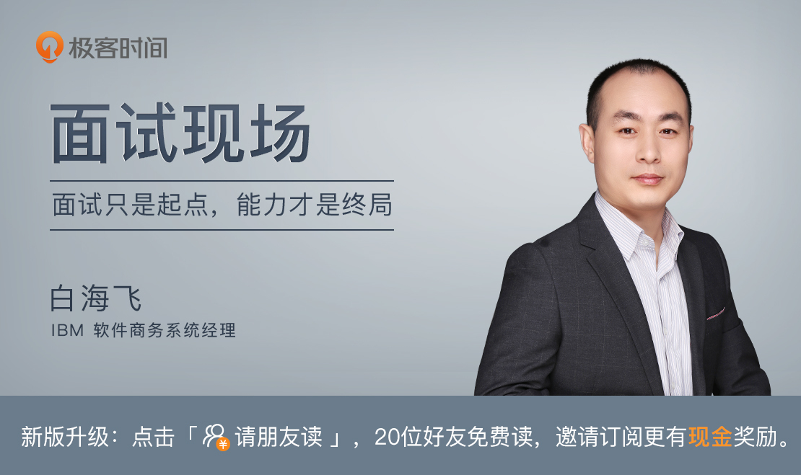

---
date: "2019-06-23"
---  
      
# 27 | 盘点面试官和应聘者的认知差异
为什么要讲这个内容呢？还记得专栏第一篇“[01 | 公司到底想要什么样的人？](https://time.geekbang.org/column/article/79796)”中开头的例子么？面试完，应聘者的自评和面试官的评价差别很大，究其原因正是双方存在认知差异。

**认知差异，使应聘者的回答方向出现偏差，更不用说回答到位或给到面试官惊喜了。**

为什么会存在认知差异？我觉得至少有下面这些原因，导致双方的沟通不容易达到一个点上。

* 首先，面试官和应聘者具有不同的角色、角度，怀着不同的期待。面试官希望对方能从公司团队角度考虑问题，而应聘者则更多是从个人角度来想如何满足职位需要，进而获得工作机会。

* 其次，两者的阅历不同，对问题的做法和看法自然有不同。

* 再次，两者对工作职位要求的了解程度不同，面试官深度了解职位要求的人员素质条件，怎样才算做好，将来这个职位可以发展到什么水平，以及自己期待这个角色在团队中的位置，而应聘者几乎不清楚。

在前面多篇文章的讨论中，我们按照应聘者素质模型，提到了面试官的很多看法和要求，今天我们就来盘点一下。

## 职业规划相关

#### 工作环境。“你要找个什么样的工作和团队？”

* **应聘者的认知：**为了拿到这个Offer，回答最好往这个公司职位上靠。

* **面试官的认知：**这是在看你的真正目标是否和公司的职位环境匹配。如果公司能提供你喜欢的工作，团队环境也如你所愿，那你工作得会更高效、更满意。如果你不说出自己的真实想法，入职后发现不是自己想要的，改变自己的目标又觉得委屈，那就痛苦了，也影响你的稳定性。

<!-- [[[read_end]]] -->

#### 职业发展。“你如何规划你的职业发展？”

* **应聘者的认知：**进了公司，还不就是老板说了算么？除非我跳槽。为了拿到这份工作，我还是顺着老板说吧。

* **面试官的认知：**职业发展是自己的，不是老板给的。老板定你的工资和职位级别，但这基本上是以你的能力和贡献为依据的。这个问题在看你的发展目标和团队发展目标是否匹配，同时面试官也在为公司将来的发展做多方面的人才储备，评估你是否有意愿、有能力灵活适应其他角色。

## 技能相关

#### 解决方案。“在解决问题的过程中如何进行技术的选择？”

* **应聘者的认知：**最理想的情况是用技术完美地解决问题，所以技术选型时，尽量用最新最全的技术，考虑将来的扩展性，天衣无缝地解决问题。

* **面试官的认知：**这些都太理想化了。实际问题会有诸多限制，完美的技术不一定能完美地解决问题。你不仅需要着重看问题中有价值要解决的部分，还要通过考虑组织、业务、管理、技术等多方面的措施，互相配合，才能尽快地给出一个尽量全面、有效的方案。

#### 业务、技术、管理的关系。“你在技术工作中有业务和管理的方面么？”

* **应聘者的认知：**业务逻辑容易变，管理内容又太琐碎，而且没什么难的，没有技术含量。稍微有一些还好，多了，耽误技术成长。

* **面试官的认知：**这是纯技术思维。对客户来讲，真正有价值的是业务，技术是为业务服务的；对于团队生产力来说，管理起关键作用，否则技术实力发挥不出来。对于资深的业务和管理人员，也有很“技术”的部分，更有很“艺术”的部分。懂得业务和管理的技术人员，才能把技术能力最大化地发挥出来。

#### 应对冲突。“能讲一个在工作中和同事发生冲突的事例么？”

* **应聘者的认知：**我要表现出和团队和谐相处的样子，不能冲突。

* **面试官的认知：**团队磨合中，冲突是必然。如果表面不发生，背后暗流涌动更可怕。团队要有多样性，不同着眼点的观点在一起碰撞，才能使方案多角度地应对复杂多元的问题。关键看如何处理冲突。

#### 协作能力。“你曾经在别人需要你帮忙的时候，说过No么？”

* **应聘者的认知：**助人为乐是美德，即使自己再忙再累。说No显得自己不够热心，还得罪人。

* **面试官的认知：**协作能力的展现，是有条件的，要在把自己的职责做好的情况下，有余力，才去帮助别人。所以，如果你自己的事情还没有做好，还在影响着全局进展，就要保证精力不被分散掉。说No之前，要了解清楚对方的真正目的；说No的时候，不一定是直接拒绝，你可以给求助者一些快速指引，或者安排到别的时间段指导，或者告诉他更合适的帮手。你需要在个人工作质量和团队影响力之间做好平衡，这不是自私和推脱。

#### “我们”还是“我”。

在讲述项目工作时，有的应聘者总是以“我们”做主语，这时面试官可能会问：“你自己做了哪些？”而如果你总是以“我”做主语，面试官会想：你的同事在哪里？所以，应聘者应该明确工作中哪些是自己的工作，哪些是团队协作完成的，给面试官一个全面的展示。

#### 发现问题，持续提高。“你觉得所在团队或项目中有什么问题？”

* **应聘者的认知：**问题是有，可是万一面试官揪住不放，说我工作没做好怎么办？还显得我事多。

* **面试官的认知：**没有完美的团队和项目。即使没有失败或者错误，也有要提高的点。看你有没有持续提高的意识，有没有发现问题的眼睛，有没有行动去影响。

#### 领导力。“你作为组长，如何展现你的领导力的？”

* **应聘者的认知：**领导力强，就是让别人听从我的指挥。如果别人反对我的意见，我的权威和能力就会受到面试官质疑了。

* **面试官的认知：**领导力的表现中权威的力量不可忽视，但不要靠中控和集权的方式。真正的领导力，在于把大家拧成一股绳，用集体的智慧优化团队和项目，朝向共同的目标，发现机会，自主发挥。听话的团队，不一定是高效团队。

#### 带人。“你怎么带人的？”

* **应聘者的认知：**我要展示我的耐心和投入，包括事无巨细的指导和示范。

* **面试官的认知：**带人是要耐心和投入，但是要看被培养对象的能力和动机强弱，依据情境领导力模型来“因材施教”。如果对方能力够了，你还在指手画脚，会适得其反。锻炼对方的自学能力也很重要，依靠学习的85\%原则，做个好教练。

## 软件工程相关

#### 变化和不确定性。“你会如何应对用户需求的变化？”

* **应聘者的认知：**要控制需求的变化，尽量避免或者减少不确定性，和客户签署需求范围变更协议，否则项目无法按时递交。

* **面试官的认知：**在2C的产品开发项目中，用户的需求变化很快，而且这些需求变化很可能是因为以前的部分没价值了，一直做没价值的功能有什么意义呢？那种要求客户签字、禁止需求变更的做法，随着敏捷实践的推行，越来越不能适应快速交付的要求了。更好的实践是用快速迭代的方法交付最小可行产品，来验证需求，拥抱变化，适应不确定性，从而交付给客户真正有价值的功能。

#### 不完备性。“有没有信息收集还不充分的情况下，就开始设计或者决策的经历呢？”

* **应聘者的认知：**为了设计和决策的尽善尽美，要尽量收集完备的信息、系统分析之后，才可以做有效决策，只有周密安排、充分设计之后，才可以开工。

* **面试官的认知：**实践是检验决策和产品的标准。市场不等人，很多时候我们必须在信息不够完备的时候做决定，设计不够充分的时候开工。我们最小化决策粒度和开发功能粒度，使其能快速显示出效果，再根据效果好坏，快速修正，这也是精益的思想。

#### 风险意识。“说说你冒险的一次决定和行动？”

* **应聘者的认知：**我应该在面试中表现出很靠谱的样子，所以不应该提冒险的事，只做十拿九稳的事，才是面试官喜欢的吧。

* **面试官的认知：**靠谱不等于不冒风险。提高能力、拓展业务，风险无法避免，关键看面对风险的意识和策略。风险可以规避、降低、转移和接受，看风险影响和可能性，以及后果的可承受能力。个人不爱担风险，会有推脱给团队的嫌疑哦，甚至可能总在舒适区做事，不爱接受挑战。

## 动机相关

#### 责任心。“能讲个体现你责任心强的事例么？”

* **应聘者的认知：**对于任何事，我都要事无巨细地安排和跟踪，直到工作完成，才能显示强的责任心。

* **面试官的认知：**对于个人的工作，要仔细认真。对于分配出去的工作，责任心体现在对结果的关注上，而不是过程中的任何细节。过细管理，是初级负责人需要重点注意的。

#### 对加班的态度。“说说你最近一次加班做的是什么？”

* **应聘者的认知：**加班能体现我的工作热情，和工作负荷。抗拒加班，会显得我态度有问题。至于加班的内容，不能说是我拖沓、错误导致的结果。

* **面试官的认知：**这点，不同的公司文化，面试官会有不同的认知。有的可能希望你加班是做额外的贡献，有的则把这些额外的事情当做项目管理的疏漏。这里说一下我的认知吧，加班是不得已才用的补救措施，而不应该成为常态。工作应该靠明确优先级、提高专注度、用聪明做法来避免加班。我能接受而且认可的加班做法有两种：一是为解决突发问题；二是用暂时的加班来减少长期的加班，也就是挤时间优化工作效率。

#### 适应性和认同感。“你怎么理解适应性和认同感？”

* **应聘者的认知：**服从。对于老板或者资深人士，他们说什么，我就听什么。流程要求什么，我就照着做好了。

* **面试官的认知：**适应性和认同感，不是无条件服从。了解为什么他们这么说，认同他们的价值和目标，才能清楚如何恰当处理和自己不一致的部分。优化你能决定的，影响你不能决定的，适应你没办法影响的。不只做个干活的人，还要尽量做个主事的人。

#### 如何对待无趣的工作。“简单重复的工作如何做好呢？”

* **应聘者的认知：**没有新意，没意思，不出成绩。

* **面试官的认知：**单纯的简单重复，不利于保持兴趣和学习技能，所以要引入变化，去除重复。深入地理解这项工作的目标，从目标出发，重新定义工作内容和步骤，提出挑战，让工作状态处于心流状态，才能工作得更高效，个人也成长更快。

## 现场问答相关

#### 负面考查。

面试官除了关注你的成果，也会问你失败或者出错的经历，例如“**请讲一个项目做失败或者出错的例子吧，说说什么原因**”。

* **应聘者的认知：**这是不是在看我做项目的能力有多糟？我最好尽量不说失败的经历，即使漏出瑕疵也不好，免得惹火烧身，让面试官质疑我的能力。

* **面试官的认知：**从成功的结果中，能看出你的能力，你应对出错的表现，更能看出你的成长型思维，以及综合能力。优秀的人，平时注意总结，给出与众不同的分析和成果，甚至能把失败或者错误转变成机会。在精益思想下，快速试错、快速纠错、快速成长，是快速适应市场需求，快速提高自我的有效方法。什么人不出错呢？做得少，做得容易，不创新的人不出错，当然也不会有出色的成绩。如果你什么都不说，要么属于这种，要么是刻意隐瞒。

## 总结

今天我总结了面试中经常碰到的应聘者和面试官的认知差异。这些差异，来源于看问题的不同角度、做项目的不同经历，以及对该职位信息的不同了解程度。以上列出的应聘者的认知，是仅仅基于我在面试中观察到的、一些典型的不足，并非所有应聘者都这样；以上列出的面试官的认知，也是基于我的个人认知，可能有些观点你会质疑，这可能是因为我表达不够充分，或者观点的确失当或者局限，还请你多多指正，我们一起提高。

列这些认知差异的目的，并不是教你面试中如何包装甚至“伪装”答案，去迎合面试官，而是希望你能意识到人和人本来就存在着认知差异，承认这些差异，才能正确认识其适用性。而且，能客观看待自己某些认知的局限性，从而加强这方面的学习和实践，得到改进和提高，最终能在问答中用自己的语言说出有细节的经验和感悟，去客观地表达真实、全面的自己，用有深度的观点、更有适用性的认知来赢得面试官的共鸣和认可。

## 思考时间

回想一下你的面试经历中，还有哪些你和面试官不同的认知呢？或者是你不清楚考查点的问题呢？欢迎在留言区分享出来，一起讨论，也欢迎将本文分享给你的朋友，一起探讨交流。

